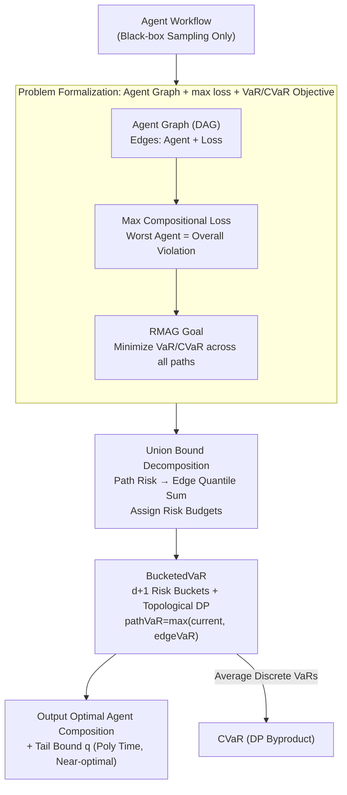

# Risk-Sensitive Agent Compositions

**Conference**: ICLR 2026  
**arXiv**: [2506.04632](https://arxiv.org/abs/2506.04632)  
**Code**: None  
**Area**: AI Safety/Agent Systems  
**Keywords**: Risk-sensitive, Agent Composition, VaR, CVaR, Dynamic Programming

## TL;DR

This work formalizes agent workflows as Directed Acyclic Graphs (Agent Graph), modeling safety/fairness/privacy requirements using a max loss function. It proposes the BucketedVaR algorithm, which utilizes union bounds and dynamic programming to find the optimal agent composition minimizing VaR/CVaR in polynomial time, proven to be asymptotically near-optimal under the independent loss assumption.

## Background & Motivation

**Popularity of Agent Compositions**: Modern agent systems decompose complex tasks into sequences of subtasks, selecting specialized AI agents (LLMs, VLMs, RL policies) for execution. Typical applications include software development automation, information retrieval, and long-horizon robot control.

**Necessity of Risk Minimization**: Real-world deployment requires not only maximizing task success rates but also minimizing violations of safety, fairness, and privacy. A key characteristic of these violations is **tail behavior**—low-probability but high-consequence events.

**max loss vs. Cumulative Loss**: When loss measures requirement violations (rather than cost), the total loss of the composition should be the **maximum** of individual agent losses (one agent's severe violation implies overall violation), rather than the **cumulative sum** used in traditional MDPs. This is a fundamental departure from existing risk-sensitive planning literature.

**Combinatorial Explosion**: The number of feasible paths in an Agent Graph can grow exponentially with the number of agents, making naive VaR estimation for every path computationally infeasible.

**Choice of Risk Measures**: VaR (Value-at-Risk) controls the tail quantile, while CVaR (Conditional Value-at-Risk) measures the expected tail loss. Both capture extreme events more effectively than expected loss.

**Black-box Agent Assumption**: The method assumes only sampling access to agents (no knowledge of internal structures), estimating risk measures via Monte Carlo sampling—making it applicable to any agent type (RL policies, LLMs, etc.).

## Method

### Overall Architecture

The method abstracts agent workflows into a Directed Acyclic Graph (DAG), where each feasible path represents an agent composition. The goal is to select the path that minimizes tail risk (VaR/CVaR). The core challenge lies in the exponential explosion of paths and the inability to estimate risk per path. Ours formalizes requirement violations as the max of individual losses and targets the tail distribution via VaR/CVaR. A union bound is used to decompose "path risk" into "the sum of edge quantiles," allowing for risk budget allocation to each agent. These budgets are then discretized into buckets to perform dynamic programming in topological order, selecting the optimal composition in polynomial time with asymptotic near-optimality guarantees.

### Key Designs

**1. Problem Formalization: Targeted Tail Risk via Agent Graph + max Loss**

Traditional compositional MDPs sum the costs of each step. However, for safety/fairness/privacy violations, the logic is "if one agent crosses the line, the whole system fails." Summation dilutes this tail signal. Thus, the workflow is modeled as a DAG $G = (V, E, X, T, F, L, s, t, \mathcal{D}_s)$: each edge $e \in E$ is bound to an agent $f_e$, a trajectory set $T_e$, and a loss function $L_e: T_e \to \mathbb{R}$. $s$ is the source with input distribution $\mathcal{D}_s$, and $t$ is the target. A path $p = v_1 \xrightarrow{e_1} \cdots \xrightarrow{e_m} v_{m+1}$ is an agent composition. The compositional loss is the maximum across steps:

$$L_p(t_1, \ldots, t_m) = \max_i \{L_{e_i}(t_i)\}$$

Given only sampling access, the objective is to minimize tail risk (the RMAG problem) at risk level $\alpha \in (0,1)$ using Monte Carlo:

$$\arg\min_{p \in \mathcal{P}} \rho[L_p(Z_p)], \quad \rho \in \{\text{VaR}_\alpha, \text{CVaR}_\alpha\}$$

Where $\text{VaR}_\alpha$ is the $(1-\alpha)$-quantile, and $\text{CVaR}_\alpha$ measures the conditional expectation of the worst $\alpha$ tail:

$$\text{VaR}_\alpha[L(Z)] = \inf\{q \in \mathbb{R}: \Pr[L(Z) \leq q] \geq 1-\alpha\}$$

$$\text{CVaR}_\alpha[L(Z)] = \frac{1}{\alpha}\int_0^\alpha \text{VaR}_ \gamma[L(Z)]\,d\gamma$$

This max definition reframes the problem as worst-case optimization, suitable for safety-critical scenarios.

**2. Union Bound Decomposition: Breaking Exponential Paths into Edge Quantiles**

Estimating VaR per path requires traversing exponential paths. We leverage the union bound for max loss: $\Pr[\max(R_1,\dots,R_m) > q] \leq \sum_i \Pr[R_i > q]$. By distributing a "risk budget" such that the sum of edge-specific violation probabilities does not exceed $\alpha$, the overall path violation probability is bounded. This reduces the problem to estimating individual edge quantiles, enabling DP.

**3. BucketedVaR: Risk Budget Buckets + Topological DP**

To perform DP on the graph, the continuous risk budget is discretized into $d+1$ buckets $B = \{0, \alpha/d, 2\alpha/d, \ldots, \alpha\}$. Topological traversal maintains the optimal partial path for each "(vertex, bucket)" pair $(v, \bar{\alpha})$. When extending an edge, the incremental budget $\bar{\alpha} - \alpha'$ is assigned to the edge, using its empirical $(1-(\bar{\alpha}-\alpha'))$-quantile. Due to the max loss structure, path VaR is updated as $\text{pathVaR} = \max(\text{VaR}[v', \alpha'], \text{edgeVaR})$. CVaR is computed for free by averaging discrete VaRs: $\text{CVaR}_\alpha \approx \frac{1}{d}\sum_{k=1}^d \text{VaR}_{k\alpha/d}$.

**4. Theoretical Guarantees: Near-Optimality in Polynomial Time**

Theorem 1 establishes the time complexity as $O(n(d+1)^2|V|^2)$ and proves that $q$ is a valid tail upper bound with probability $\geq 1-\delta$:

$$q \geq \text{quantile}(L_p(Z_p), 1-\alpha-\gamma), \quad \gamma = |V|\sqrt{\frac{1}{2n}\ln\frac{2(d+1)^2|V|^2}{\delta}}$$

Theorem 2 establishes near-optimality under the assumption of independent agent losses. As samples $n$ and buckets $d \to \infty$:

$$q \leq \text{quantile}\left(L_{p^*}(Z_{p^*}), 1-\alpha+\frac{\alpha^2}{2}\right)$$

The suboptimality introduced by the union bound is at most $\alpha^2/2$ (e.g., only $0.005$ when $\alpha=0.1$).

## Key Experimental Results

### Table 1: Approximation Accuracy of BucketedVaR vs. Optimal Baseline

| Benchmark | Risk Level $\alpha$ | VaR Quantile Error (%) | CVaR Error (%) | Optimal Path Match |
|---------|-----------------|----------------|------------|------------|
| DroneNav | 0.1 | < 2 | < 2 | ✓ |
| 16-Rooms | 0.1 | < 3 | < 2 | ✓ |
| Fetch | 0.05 | < 2 | < 2 | ✓ |
| BoxRelay | 0.1 | < 2 | < 3 | ✓ |

### Table 2: Robustness—Impact of Loss Correlation on Approximation Quality

| Correlation $\rho$ | Path Length=4 Coverage | Path Length=8 Coverage | Path Length=16 Coverage |
|----------------|-----------------|-----------------|------------------|
| 0.0 (Independent) | ~0.90 | ~0.90 | ~0.90 |
| 0.25 | ~0.91 | ~0.92 | ~0.93 |
| 0.5 | ~0.92 | ~0.94 | ~0.95 |
| 0.75 | ~0.95 | ~0.97 | ~0.98 |
| 1.0 (Fully Correlated) | ~0.99 | ~0.99 | ~0.99 |

## Key Findings

1.  **Union Bound Tightness**: BucketedVaR estimates for VaR and CVaR differ from the exhaustive optimal baseline by only a few percentage points, confirming the effectiveness of the union bound approach.
2.  **Non-Trivial Risk Budget Allocation**: The algorithm learns non-uniform allocations. In 16-Rooms, budgets for 8 agents varied (e.g., $23\bar\alpha$ vs $0\bar\alpha$), reflecting differing risk levels across subtasks.
3.  **Robustness to Correlation**: The algorithm remains reasonable for moderate correlation ($\rho \leq 0.5$), only degrading significantly at $\rho=1$.
4.  **Multi-Agent Scalability**: Accuracy is maintained when scaling from 8 to 40 agents ($8 \times 5$), validating the theoretical scalability.
5.  **Sample and Bucket Convergence**: Empirical quantiles stabilized at $\sim 0.91$ (target $0.90$) as samples increased to 10⁴ and buckets to 100.

## Highlights & Insights

-   **Innovative max loss Modeling**: Safety and fairness violations are determined by the "worst agent." Modeling this as max rather than sum is a significant shift from traditional MDPs.
-   **Utility of Union Bounds**: Simple union bounds prove asymptotically precise for quantile estimation (suboptimality $\alpha^2/2$).
-   **General Agent Graph Formalism**: Uniquely covers RL policies, LLM retrieval pipelines, etc., upgrading agent composition from trial-and-error to theory-driven graph search.
-   **CVaR as a Byproduct**: Obtained by averaging discrete VaRs without additional sampling.

## Limitations & Future Work

-   **Independence Assumption**: Guarantees depend on independent agent losses. This may be violated if agents share environmental state.
-   **Loss Function Design**: While natural for RL control, defining loss for LLM hallucination or bias relies on potentially noisy proxies like LLM-as-Judge.
-   **Experimental Scale**: Validated on RL benchmarks (up to 40 agents) but not yet on massive LLM agent systems.
-   **Static Composition**: Currently selects fixed paths rather than dynamic switching based on runtime observations.

## Related Work & Insights

| Dimension | Ours (BucketedVaR) | Traditional Risk-Sensitive MDP | Hierarchical RL |
|------|-------------------|-----------------------------|---------------------------|
| Loss Type | max (Violations) | Cumulative Sum (Cost) | Expected Reward |
| Risk Measure | VaR / CVaR | CVaR / EVaR | None (Expectation) |
| Agent Model | Black-box Sampling | MDP Internal Structure | Trainable Policies |
| Goal | Path Selection | Policy Optimization | Policy Learning |
| Scalability | Polynomial (w.r.t Agents) | Single Agent | Single Agent |

Compared to automated workflow generation (e.g., **AFlow**), this work focuses on agent selection within a given structure rather than structural design.

## Rating

-   **Novelty**: ⭐⭐⭐⭐ Formalization of max loss risk minimization in Agent Graphs fills a theoretical gap.
-   **Experimental Thoroughness**: ⭐⭐⭐ Rigorous theory but lacks large-scale LLM experiments.
-   **Writing Quality**: ⭐⭐⭐⭐ Clear formal definitions and intuitive examples.
-   **Value**: ⭐⭐⭐⭐ Solid theoretical foundation for deploying safety-critical agent systems.

<!-- RELATED:START -->

## Related Papers

- [\[ICLR 2026\] SeRI: Gradient-Free Sensitive Region Identification in Decision-Based Black-Box Attacks](seri_gradient-free_sensitive_region_identification_in_decision-based_black-box_a.md)
- [\[ICLR 2026\] Sample-Efficient Distributionally Robust Multi-Agent Reinforcement Learning via Online Interaction](sample-efficient_distributionally_robust_multi-agent_reinforcement_learning_via_.md)
- [\[ICML 2026\] Watermarking LLM Agent Trajectories (ACTHOOK)](../../ICML2026/ai_safety/watermarking_llm_agent_trajectories.md)
- [\[CVPR 2026\] Reinforcement-Guided Synthetic Data Generation for Privacy-Sensitive Identity Recognition](../../CVPR2026/ai_safety/reinforcement-guided_synthetic_data_generation_for_privacy-sensitive_identity_re.md)
- [\[ICML 2026\] Exploring Systems-Thinking Approaches to Loss of Control Risk](../../ICML2026/ai_safety/exploring_systems-thinking_approaches_to_loss_of_control_risk.md)

<!-- RELATED:END -->
