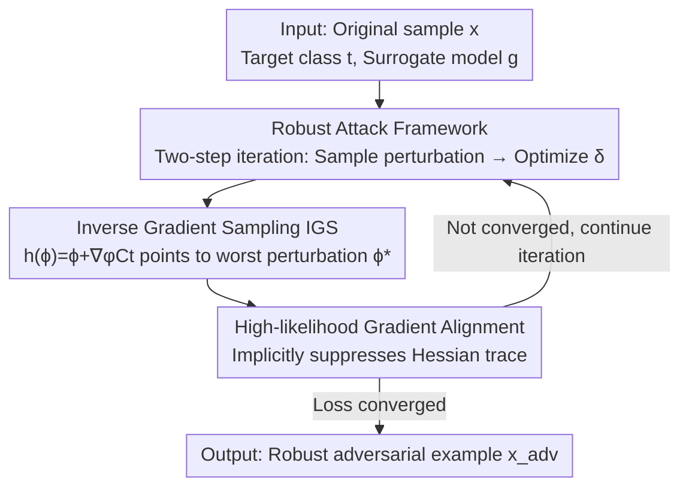

# Robust Adversarial Attacks Against Unknown Disturbances via Inverse Gradient Sample

**Conference**: ICLR 2026  
**OpenReview**: [https://openreview.net/forum?id=WhFS8mxWJh](https://openreview.net/forum?id=WhFS8mxWJh)  
**Code**: https://github.com/nimingck/IGSA  
**Area**: AI Security / Adversarial Attacks  
**Keywords**: Adversarial Examples, Robust Attack, Inverse Gradient Sampling, Transferability, Unknown Disturbances

## TL;DR
The authors propose IGSA (Inverse Gradient Sample-based Attack), which utilizes "Inverse Gradient Sampling" to actively identify the most destructive perturbation directions within the neighborhood of an adversarial example. By performing perturbation-guided optimization along these directions, the method generates robust adversarial examples that maintain high attack success rates under various **unknown disturbances** (blur, JPEG, rotation, perspective, etc.), significantly surpassing existing methods like EOT in both theory and experimentation.

## Background & Motivation

**Background**: Adversarial attacks have achieved nearly 100% attack success rates (ASR) in both white-box and black-box (transfer) scenarios. A "truly threatening" adversarial example must simultaneously satisfy three criteria: transferability (effective in black-box settings), stealthiness (evading detection), and robustness (remaining effective under various disturbances).

**Limitations of Prior Work**: Existing transfer attacks are extremely "brittle." The effectiveness of adversarial examples collapses significantly if they undergo even slight disturbances (re-acquisition, client-side preprocessing, or built-in defenses like JPEG compression, scaling, and random transformations) before reaching the target model, especially in targeted attacks. In Table 1 of the paper, classical methods such as PGD and MI-FGSM see their ASR drop to single digits or even zero under rotation and combined transformations.

**Key Challenge**: To achieve robustness, one must simulate and optimize against various disturbances during the generation of adversarial examples. The mainstream approach is EOT (Expectation over Transformation), which calculates the expected loss by **randomly sampling** perturbations from a fixed distribution. However, random sampling has three fundamental issues: (i) **Insufficient sampling coverage**, where a limited number of Monte Carlo samples poorly cover the perturbation space, leading to poor generalization to unseen disturbances; (ii) **Distribution mismatch**, where the assumed perturbation distribution during training differs from real-world distributions, causing the attack to fail; (iii) **Transferability not explicitly modeled**, requiring guarantees across models under black-box settings.

**Key Insight**: The authors reformulate "adversarial robustness" as the problem of "designing a mapping function $h(\phi, x+\delta)$ that maps a prior perturbation $\phi$ to the most destructive perturbation." The key observation is that rather than randomly scattering points in hopes of hitting a harmful perturbation, it is better to **use gradients to actively point toward the "worst-case direction"**—the perturbation within the neighborhood that maximizes the loss: $\phi^* = \arg\max_{\|\phi\|<r} C_t(x+\delta+\phi)$.

**Core Idea**: "Inverse Gradient Sampling" (moving one step along $\nabla_\phi C_t$) is used to approximate the most destructive perturbation $\phi^*$, replacing the random sampling of EOT. Theoretical proofs demonstrate that to achieve the same error, the required number of samples is approximately $10^8$ times fewer than EOT. Simultaneously, this process implicitly suppresses the trace of the Hessian of the loss surface, which both enhances data distribution likelihood (robustness) and smooths the loss surface (transferability).

## Method

### Overall Architecture

IGSA models the creation of a robust adversarial example as a **two-step iterative** process: given the original sample $x$, target class $t$, and surrogate model $g$, it repeatedly (1) samples perturbations in the neighborhood of the current adversarial example $x+\delta$ and pushes them toward the "worst case" using inverse gradients, and (2) updates $\delta$ such that the adversarial example is still classified as the target class under these worst-case perturbations. The overall optimization objective is to minimize the expected loss over the perturbation distribution: $\min_\delta \mathbb{E}_{\phi\sim B}[C_t(x+\delta+h(\phi,x+\delta))]$, where the mapping function is designed as $h(\phi,x+\delta)=\phi+\nabla_\phi C_t(x+\delta+\phi)$.

Unlike EOT, which randomly selects $\eta$ from a fixed distribution, $h$ here adapts to both the current adversarial example and the surrogate model, generating a specific "most destructive perturbation" for each sample. Theoretically, it is also proven that this update rule implicitly minimizes the trace of the Hessian of $C_t$, ensuring the adversarial example maintains high likelihood under the natural data distribution $P_D$ (more robust) and results in a smoother loss surface (more transferable).

### Key Designs

**1. Robust Attack Framework: Reformulating Robustness as Mapping Function Design**

To address the vulnerability of existing attacks to unknown disturbances, the authors first establish a general framework: the first step samples initial perturbations $\phi$ from a prior distribution $B$, which are transformed by the mapping function $h(\phi,x+\delta)$ into actual perturbations applied to the adversarial example. The second step feeds the perturbed sample $x+\delta+h(\phi,x+\delta)$ into the surrogate model $g$, measures whether it is classified as target class $t$ using cross-entropy $C_t$, and minimizes the expectation over the perturbation distribution $\min_\delta \mathbb{E}_{\phi\sim B}[C_t(\cdot)]$. Using the LOTUS theorem, $\mathbb{E}_{\phi\sim B}[C_t(x+\delta+h(\phi,x+\delta))]=\mathbb{E}_{\eta\sim P}[C_t(x+\delta+\eta)]$. Thus, "resisting various disturbances" is equivalently transformed into "designing a superior mapping function $h$."

The value of this framework lies in its **plug-and-play** nature: it can be integrated with any existing attack (experiments in the paper integrate IGSA with DIM, DTA, SMI-FGRM, and ILPD). It also clearly attributes the three challenges (sampling coverage, distribution mismatch, and transferability) to the design of $h$, paving the way for IGS.

**2. Inverse Gradient Sampling (IGS): Actively Targeting the "Worst Perturbation" to Save $10^8$ Samples**

This is the core of the paper, directly addressing insufficient sampling coverage. EOT sets $h(\phi,x+\delta)=\phi$, using randomly sampled perturbations directly; however, robustness essentially depends on whether the perturbation set used for training $\{h(\phi_i,x+\delta)\}$ can approximate the truly most destructive perturbation $\phi^*$. IGS defines the mapping as $h(\phi,x+\delta)=\phi+\nabla_\phi C_t(x+\delta+\phi)$—taking a random perturbation $\phi$ and **moving one extra step along the gradient of the loss with respect to the perturbation**. This actively pulls the sampling points toward directions of higher loss (closer to $\phi^*$). The corresponding iteration is:
$$\delta_{i+1}=\delta_i-\alpha\cdot\nabla_\delta\Big(\tfrac{1}{N}\textstyle\sum_{j=1}^N C_t(x+\delta_i+h(\phi_j,x+\delta))\Big).$$

The paper provides rigorous theory for why this is effective: Theorem 1 proves that the expected error of EOT random sampling decays with the number of samples $n$ as a power law $n^{-1/m}$ ($m$ is the input dimension). To halve the error, the number of samples must be multiplied by $2^m$, which is nearly impossible in high dimensions. Theorem 2 further derives that the error for IGS is $(1-\gamma)$ times that of EOT, resulting in a required sample ratio for equal error of $n_\text{EOT}/n_\text{IGS}=(1-\gamma)^{-m}$. On ImageNet ($m=256\times256\times3$, $\gamma\approx10^{-4}$), this ratio is approximately $3.5\times10^8$—meaning IGS can capture the worst perturbation with very few samples, fundamentally alleviating the coverage issue.

**3. High-likelihood Gradient Alignment: Suppressing Hessian Trace for Robustness and Transferability**

This design simultaneously addresses "distribution mismatch" and "transferability." The authors first define the **Robust Boundary** $K_S^\tau$ (the minimum perturbation required to change the model prediction) as a diagnostic tool. Observing that $K_S^\tau$ for clean samples is consistently larger than for adversarial samples, they hypothesize that samples with higher likelihood under the natural data distribution $P_D$ are more robust. Since $P_D(x_\text{adv})$ cannot be calculated directly, the authors instead enhance likelihood via gradient alignment. Theorem 3 proves that $\nabla_\delta \mathbb{E}[(\nabla_\delta C_t)^T\nabla_\delta P_D]=-\nabla_\delta\mathbb{E}[\text{tr}(H[C_t])]$. Thus, **minimizing the Hessian trace of $C_t$** aligns the surrogate model gradient $\nabla_\delta C_t$ with the data distribution gradient $\nabla_\delta P_D$, thereby increasing the likelihood of adversarial examples under $P_D$.

Crucially, the IGS iteration rule **naturally performs this task**: Taylor expansion in Theorem 4 shows $\nabla_\delta\mathbb{E}_\phi[C_t(x+\delta+\phi+\nabla_\phi C_t)]=\nabla_\delta C_t+\|\nabla_\delta C_t\|^2+\tfrac{\sigma^2}{2}\nabla_\delta\text{tr}(H[C_t])+O(\sigma^4)$. This indicates that IGS implicitly suppresses $\text{tr}(H[C_t])$ (increasing $P_D$ likelihood → robustness) and reduces $\|\nabla_\delta C_t\|^2$ (smoothing the loss surface) during optimization. Smoother loss surfaces were proven by Ge et al. (2023) to significantly enhance transferability—thus, one mechanism achieves two goals.

### Loss & Training

The implementation is detailed in Algorithm 1, featuring three practical techniques: (1) **Sampling Distribution** uses Gaussian $\phi\sim N(0,\sigma^2)$ for faster and more stable convergence; (2) **Efficient Gradient Estimation**—to avoid second-order derivatives, a first-order approximation is used: $\nabla_\delta\mathbb{E}_\phi[C_t(x+\delta+\phi+\nabla_\phi C_t)]\approx\mathbb{E}_{\phi\sim N(0,\sigma^2)}[C_t(\cdot)\cdot\nabla_\delta\log N(x+\delta+\phi;x+\delta,\sigma^2)]$, converting second-order calculations into first-order terms weighted by log-likelihood; (3) **Gradient Magnitude Control**—using sign-based updates $x_\text{adv}=x_\text{adv}-\alpha\cdot\text{sign}(d_\text{sum})$, and adding an $\ell_2$ constraint term $\lambda\cdot|\delta|$ to the loss to suppress perturbation magnitude. In each round, $\delta$ is clamped to $[-\epsilon,\epsilon]$ until the loss converges. Primary hyperparameters: $N=20$ sampling points, $\alpha=1.6/255$, $\epsilon$ is $16/255$ for ImageNet and $8/255$ for CIFAR-10/CelebA, $\lambda=0.1$ (ImageNet).

## Key Experimental Results

### Main Results

Targeted attacks on ImageNet against VGG19 / ResNet34 / ViT, comparing ASR under additive perturbations (Gaussian Blur GSB, JPEG) and non-additive perturbations (Rotation RT, Combined Transformation CB):

| Method | VGG19-RT | ResNet34-CB | ViT-Avg(GSB) | Avg Time (s) |
|----------|----------|-------------|--------------|-------------|
| PGD | 43.8 | 0.0 | 9.3 | 0.025 |
| MI-FGSM | 72.9 | 0.0 | 67.4 | 0.025 |
| DIM | 66.7 | 12.5 | 89.3 | 0.020 |
| BSR | 83.3 | 8.3 | 71.7 | 0.203 |
| PGD+EOT | 79.2 | 22.9 | 87.6 | 0.461 |
| **IGSA (Ours)** | **96.7** | **50.8** | **92.2** | 0.423 |

On the most difficult non-additive combined transformations (CB), other methods collapse to single digits, while IGSA maintains 50.8% on ResNet34, leading across the board.

For attacks against **defense models** (ResNet50 / ViT with ARES 2.0 adversarial training), the gap is most evident in targeted (tar) scenarios:

| Method | ResNet50-tar | ViT-untar | ViT-tar |
|----------|--------------|-----------|---------|
| TIM | 18.60 | 62.52 | 2.90 |
| BSR | 18.20 | 68.43 | 2.90 |
| GRA | 16.10 | 72.45 | 4.90 |
| **IGSA (Ours)** | **27.30** | **90.94** | **23.90** |

Other methods almost entirely fail in targeted attacks against defense models (<19%), while IGSA boosts the targeted ASR on ViT to 23.9%.

### Ablation Study

| Config / Hyperparam | Key Metric | Description |
|------------|---------|------|
| Sample points $N=5$ | ASR 94.4% | Insufficient neighborhood information |
| Sample points $N=25$ | ASR 100% | More samples provide better coverage |
| $\lambda=0.02$ | ASR 100% | Weak $\ell_2$ constraint |
| $\lambda=0.30$ | ASR 5.56% | Overly strong constraint crushes attack |
| $\alpha=1.6/255$ | ASR 99% | Peak within optimal step size range |
| IGS vs EOT (SNR=10) | IGS 5 samples >80% / EOT 50 samples only ~60% | IGS wins in both efficiency and effect |

### Key Findings
- **IGS is the primary contributor**: Under strong disturbances (SNR=10), IGS achieves over 80% ASR with only 5 samples, whereas EOT requires 50 samples to reach ~60%. This directly validates that "active searching for the worst perturbation" via inverse gradients is far superior to random sampling.
- **Hyperparameter Sensitivity**: For iterations > 50, ASR stabilizes > 90%; increasing $N$ from 5 to 25 pushes ASR from 94.4% to 100%; $\lambda$ is a double-edged sword—if too large (0.3), it suppresses perturbations so much the attack fails (ASR 5.56%); $\mu$ has the least impact (96%~98.7%).
- **Plug-and-play Gains**: Integrating IGSA with DIM/DTA/SMI-FGRM/ILPD results in ASR gains on black-box ResNet34 of +13.0% / +16.3% / +20.9% / +3.0%, and +19.0% / +12.4% / +22.9% / +3.0% on ViT, showing the framework can be stacked on existing transfer attacks.

## Highlights & Insights
- **"Inverse Gradient Sampling" converts random scattering into a directed blast**: Using a single step of $\nabla_\phi C_t$ to pull sampling points toward the worst perturbation is a clever way to exchange gradient information for sample count, providing a theoretical efficiency gain of $10^8$.
- **One mechanism tackles both robustness and transferability**: By bridging these goals through the Hessian trace, the method ensures that "increasing data distribution likelihood (robustness)" and "smoothing the loss surface (transferability)" are unified under IGS's implicit regularization, avoiding conflicts between separate loss terms.
- **Portability of the diagnostic metric $K_S^\tau$ (Robust Boundary)**: Quantifying robustness by the minimum perturbation required to change a prediction and hypothesizing "high likelihood = high robustness" provides a valuable perspective that could be applied to other defense/detection research.

## Limitations & Future Work
- The theoretical guarantees (Theorems 1-4) are built on assumptions of convexity, Lipschitz continuity, and unique regional extrema. While extensions for non-convex cases are provided in the appendix, the robustness of these estimations (like $\gamma\approx10^{-4}$) on the complex loss surfaces of real deep networks warrants further verification.
- The $10^8$ efficiency gain is a theoretical upper bound. Practically, the wall-clock time for IGSA (0.423s) is similar to PGD+EOT (0.461s); the theoretical gain primarily manifests as "better coverage for the same number of samples."
- As a stronger attack, it is a double-edged sword: while it can penetrate adversarial training defenses, it signals that defenders need to redesign strategies against "worst-case perturbation directions," a topic not explored deeply in the paper.

## Related Work & Insights
- **vs EOT (Athalye et al. 2018)**: EOT calculates expected loss by randomly sampling perturbations from a fixed distribution. IGSA replaces this with inverse gradients to actively approximate the worst perturbation $\phi^*$. The difference is "passive coverage vs active targeting," with IGSA leading in efficiency and robustness against unknown disturbances.
- **vs PGN / Smoothing-based Transfer Attacks (Ge et al. 2023)**: PGN and others explicitly seek flat loss regions to enhance transferability. IGSA proves its iteration implicitly reduces $\|\nabla_\delta C_t\|^2$ and smooths the surface automatically while simultaneously considering robustness.
- **vs DIM / DTA / SMI-FGRM Input Transformations**: These are heuristic enhancements sensitive to perturbation types. IGSA is a universal framework with theoretical guarantees that can be **layered** on top of these methods for further performance gains.

## Rating
- Novelty: ⭐⭐⭐⭐⭐ Replacing random sampling with inverse gradient sampling and unifying robustness and transferability via the Hessian trace is highly innovative.
- Experimental Thoroughness: ⭐⭐⭐⭐ Coverage of classification and face recognition, white-box/black-box/defense models, and various disturbances. The gap between wall-clock time and theoretical gain could be further explained.
- Writing Quality: ⭐⭐⭐⭐ Clear logical flow from four challenges to four theorems and finally the algorithm, though theoretical sections are dense.
- Value: ⭐⭐⭐⭐⭐ Provides a plug-and-play, theoretically grounded robust attack framework of significant value to both attackers and defenders in AI safety.

<!-- RELATED:START -->

## Related Papers

- [\[ICLR 2026\] Robust Spiking Neural Networks Against Adversarial Attacks](robust_spiking_neural_networks_against_adversarial_attacks.md)
- [\[ICLR 2026\] Reliable Poisoned Sample Detection against Backdoor Attacks Enhanced by Sharpness-Aware Minimization](reliable_poisoned_sample_detection_against_backdoor_attacks_enhanced_by_sharpnes.md)
- [\[ICLR 2026\] Sample-Efficient Distributionally Robust Multi-Agent Reinforcement Learning via Online Interaction](sample-efficient_distributionally_robust_multi-agent_reinforcement_learning_via_.md)
- [\[ICLR 2026\] Defending against Backdoor Attacks via Module Switching](defending_against_backdoor_attacks_via_module_switching.md)
- [\[ICLR 2026\] Protection against Source Inference Attacks in Federated Learning](protection_against_source_inference_attacks_in_federated_learning.md)

<!-- RELATED:END -->
