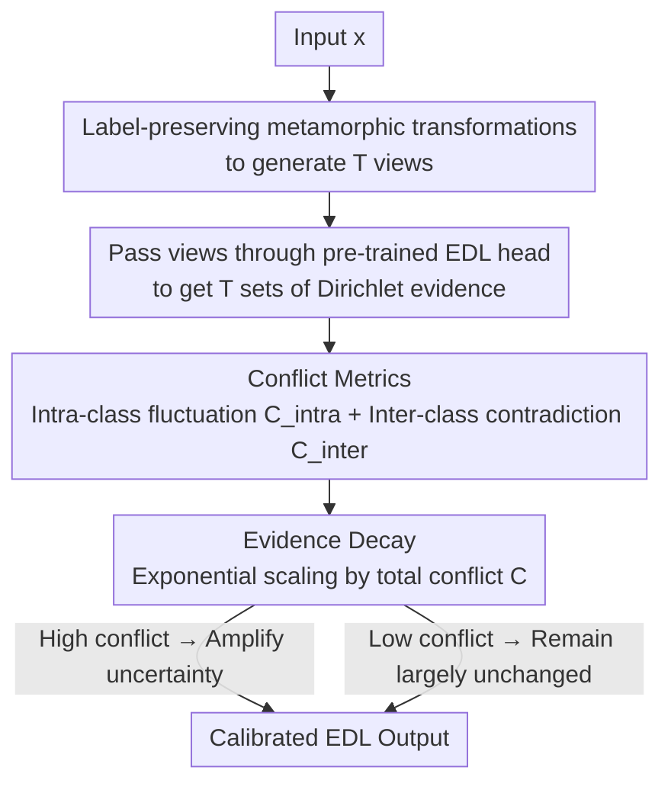

# Robust Adversarial Quantification via Conflict-Aware Evidential Deep Learning

**Conference**: ICLR 2026  
**OpenReview**: [https://openreview.net/forum?id=27oJibuygA](https://openreview.net/forum?id=27oJibuygA)  
**Code**: https://github.com/team-daniel/cedl  
**Area**: AI Safety / Uncertainty Quantification / Adversarial Robustness  
**Keywords**: Evidential Deep Learning, Uncertainty Quantification, Conflict-Aware, OOD Detection, Adversarial Robustness

## TL;DR
Addressing the issue where Evidential Deep Learning (EDL) makes "confident mistakes" under adversarial perturbations, this paper proposes C-EDL, a post-hoc method requiring no retraining. C-EDL generates multiple label-preserving transformed views for each input, quantifies the "conflict" between these views in the evidence space, and decays the evidence accordingly to amplify uncertainty. This reduces OOD data coverage by up to $\approx 55\%$ and adversarial data coverage by up to $\approx 90\%$, with almost no loss in ID accuracy or inference efficiency.

## Background & Motivation

**Background**: In high-risk scenarios such as healthcare or autonomous driving, models must "know when they are untrustworthy," making uncertainty quantification (UQ) a core requirement. While Bayesian Neural Networks, Variational Inference, Deep Ensembles, and MC Dropout are mainstream approaches, they are often computationally expensive or require multiple forward passes, making them difficult to deploy on edge devices. Evidential Deep Learning (EDL) models class probabilities using a Dirichlet distribution, providing both epistemic and aleatoric uncertainty in a single forward pass. This makes it lightweight, efficient, and particularly suitable for OOD detection in real-time or resource-constrained scenarios.

**Limitations of Prior Work**: The Achilles' heel of EDL is precisely its "deterministic single forward pass." Faced with adversarial perturbations, gradient attacks can push an OOD sample into the "in-distribution" (ID) region from the model's perspective, leading to inflated evidence strength and underestimated uncertainty—the model thus **confidently treats adversarial samples as normal**. Once an overconfident error is made, a single-pass EDL has no "second opinion" to correct it. Subsequent EDL improvements (I-EDL, H-EDL, R-EDL, DA-EDL, etc.) have focused on improving OOD detection but fail to address the root cause of the "single deterministic forward pass," leaving adversarial robustness fragile. A few adversarial-focused methods like Smoothed EDL provide only local regularization and remain overconfident under strong attacks.

**Key Challenge**: The efficiency of EDL stems from "looking only once," whereas adversarial robustness requires "looking multiple times to check evidence stability." How can "multi-view verification" be injected into EDL without sacrificing single-pass efficiency and without retraining the model?

**Goal**: Design a post-hoc module that can be attached to any pre-trained EDL model to: (1) significantly increase uncertainty for OOD and adversarial inputs; (2) avoid harming ID accuracy and ID coverage; (3) maintain negligible inference overhead.

**Key Insight**: The authors borrow a simple principle from Dempster-Shafer Theory (DST): **aggregating multiple sources of evidence yields more reliable beliefs**. Since a single view is unreliable, one can actively create multiple "semantically equivalent but pixel-distinct" views for each input and check if the evidence provided by the model across these views is consistent. Consistency indicates solid knowledge, while conflict indicates fragile knowledge, signaling that uncertainty should be increased.

**Core Idea**: Replace the single forward pass with "label-preserving transformations + evidence conflict quantification + evidence decay based on conflict," converting disagreements between views into uncertainty signals.

## Method

### Overall Architecture
C-EDL is a purely inference-phase module attached to a pre-trained EDL model, requiring no modification or retraining of the original model. For each new input, it performs three steps: first, it uses a set of label-preserving metamorphic transformations to generate $T$ semantically equivalent views, passing each through the same EDL head to obtain $T$ sets of Dirichlet evidence; second, it calculates a total conflict score $C$ using two complementary metrics (intra-class fluctuation and inter-class contradiction); finally, it applies exponential decay to the aggregated evidence based on $C$. High conflict leads to significant evidence attenuation (amplifying uncertainty), while low conflict leaves it largely unchanged. Final beliefs, uncertainty mass, and expected probabilities are recalculated based on the decayed evidence. For ID inputs, evidence across views is consistent ($C \approx 0$), resulting in outputs nearly identical to the original EDL; for OOD/adversarial inputs, conflicting evidence across views increases $C$, amplifying uncertainty and allowing for rejection via thresholds.

### Key Designs

**1. Generating Evidence Sets via Label-Preserving Metamorphic Transformations: Replacing Single Forward Pass with "Semantically Equivalent Multi-Views"**

The vulnerability of EDL lies in taking only one look at the input and having no second opinion. C-EDL applies a set of metamorphic transformations $\{\tau_1, \dots, \tau_T\}$ to input $x$, where each transformation satisfies the label-preserving constraint $f^*(\tau_t(x)) = f^*(x)$, meaning the changes are only at the pixel level and do not alter the true class. Each $\tau_t(x)$ independently passes through the same pre-trained EDL head, yielding a set of Dirichlet vectors $\alpha^{(t)} = (\alpha^{(t)}_1, \dots, \alpha^{(t)}_K)$, which form the evidence set $A = \{\alpha^{(1)}, \dots, \alpha^{(T)}\}$.

The elegance of this step is that while transformations are small perturbations in the input space, the network's sensitivity to local structures can trigger large differences in internal features. A model that has learned truly robust decision features should provide **consistent** evidence for these semantically equivalent views. Conversely, if evidence fluctuates wildly across views, it exposes the fragility of the model's knowledge (epistemic uncertainty). The transformation strength is kept intentionally small (see Table 11 in the original paper), ensuring the introduced randomness acts as a "stability probe" rather than changing the semantics.

**2. Dual Conflict Metrics: Intra-class Fluctuation + Inter-class Contradiction to Precisely Characterize "Clashing Evidence"**

Once the evidence set is obtained, the "disagreement" must be quantified. C-EDL uses two complementary perspectives:

Intra-class fluctuation $C_{\text{intra}}$ measures how much the evidence for a single class varies across transformations, using the coefficient of variation (standard deviation/mean) for each class's Dirichlet parameter, averaged across classes:

$$C_{\text{intra}} = \frac{1}{K}\sum_{k=1}^{K} \frac{\sigma(\{\alpha^{(t)}_k\}_{t=1}^T)}{\mu(\{\alpha^{(t)}_k\}_{t=1}^T) + \epsilon}$$

Where $\epsilon$ is a small positive number to prevent division by zero. If the model gives highly inconsistent beliefs for the same class across different views, $C_{\text{intra}}$ increases.

Inter-class contradiction $C_{\text{inter}}$ captures instances where "multiple classes are simultaneously supported by high evidence" (model oscillation between classes), calculating the degree of competition between class pairs for each view:

$$C_{\text{inter}} = \frac{1}{T}\sum_{t=1}^{T}\left(1 - \exp\left(-\beta \sum_{k=1}^{K}\sum_{j=k+1}^{K}\left(\frac{\min(\alpha^{(t)}_k,\alpha^{(t)}_j)}{\max(\alpha^{(t)}_k,\alpha^{(t)}_j)} \times \frac{\min(\alpha^{(t)}_k,\alpha^{(t)}_j)}{\sum_{k=1}^{K}\alpha^{(t)}_k}\times 2\right)^2\right)\right)$$

$\beta > 0$ adjusts the sharpness of the penalty. $C_{\text{inter}}$ is symmetric, bounded, and only increases when two classes are **both closely matched and supported by non-trivial evidence**. The design prevents false conflicts in cases of universal low evidence while remaining analytically tractable for Theorem 1.

**3. Conflict-Aware Evidence Decay: Scaling Evidence by Conflict Score to Amplify Uncertainty as Needed**

The two metrics are merged into a single total conflict score $C$ via the inclusion-exclusion principle:

$$C = C_{\text{inter}} + C_{\text{intra}} - C_{\text{inter}}C_{\text{intra}} - \lambda(C_{\text{inter}} - C_{\text{intra}})^2$$

Where $\lambda \in [0, 1]$ controls the penalty for asymmetric disagreement. This ensures $C \in (0, 1]$, where $C \to 0$ only if all transformations yield identical Dirichlet parameters concentrated on a single class. Theorem 1 in the original paper provides guarantees for the boundedness and monotonicity of $C$ when $\lambda \in [0, \frac{1}{2}]$.

After obtaining $C$, the Dirichlet parameters for each view are averaged $\bar\alpha_k = \frac{1}{T}\sum_{t=1}^T \alpha^{(t)}_k$, and exponential decay is applied:

$$\tilde\alpha_k = \bar\alpha_k \times \exp(-\delta C)$$

Where $\delta > 0$ is a hyperparameter controlling adjustment sensitivity. The precision of this decay is that it **only scales the magnitude of evidence without changing the distribution shape**—preserving the model's most likely prediction while proportionally weakening the "confidence." All EDL metrics are then recalculated using the decayed parameters:

$$\tilde S = \sum_{k=1}^K \tilde\alpha_k,\quad \tilde u = \frac{K}{\tilde S},\quad \mathbb{E}[\tilde p_k] = \frac{\tilde\alpha_k}{\tilde S}$$

When conflict is high, the total Dirichlet strength $\tilde S$ is suppressed, and uncertainty mass $\tilde u = K/\tilde S$ is amplified. This mechanism allows C-EDL to remain "silent" for ID data while "sounding the alarm" for OOD/adversarial samples.

### Loss & Training
C-EDL is a purely post-hoc method that **does not introduce any training loss and does not require retraining the original model**. All computations occur during inference. It directly reuses the output of the pre-trained EDL head, with overhead coming primarily from the $T$ forward passes of transformed views. Main hyperparameters include the number of transformations $T$, decay sensitivity $\delta$, penalty sharpness $\beta$, and inclusion-exclusion penalty $\lambda$.

## Key Experimental Results

### Main Results
The method was tested across multiple datasets (MNIST, FashionMNIST, KMNIST, EMNIST, CIFAR10/100, SVHN, etc.) in near/far OOD scenarios and under gradient/non-gradient attacks. Comparisons were made against Posterior Network, EDL, I-EDL, S-EDL, H-EDL, R-EDL, and DA-EDL. Core metrics include coverage (the proportion of accepted samples at a fixed threshold, where lower is better for OOD/Adv) and AUROC. ID accuracy for all methods remained at 95-99%, showing that UQ improvements did not sacrifice classification performance.

| Dataset Pair | Metric | EDL | C-EDL (Meta) | Improvement |
|--------|------|------|----------|------|
| MNIST $\rightarrow$ FashionMNIST | Adv Coverage ↓ | 52.21% | 15.51% | Massive Reduction |
| MNIST $\rightarrow$ KMNIST | Adv Coverage ↓ | 20.88% | 3.01% | ~7x |
| MNIST $\rightarrow$ EMNIST* | Adv Coverage ↓ | 7.81% | 1.41% | ~5x |
| CIFAR10 $\rightarrow$ SVHN | Adv Coverage ↓ | 20.00% | 1.25% | ~16x |
| CIFAR10 $\rightarrow$ CIFAR100* | Adv Coverage ↓ | 14.02% | 3.17% | ~4x |
| CIFAR10 $\rightarrow$ SVHN | OOD Coverage ↓ | 10.91% | 4.69% | Significant |

(* denotes near OOD; adversarial attack is L2PGD) C-EDL shows only marginal drops in ID coverage while providing multi-fold reductions in OOD/Adv coverage, outperforming all baselines in the trade-off.

### Ablation Study
The authors designed EDL++ (transformation aggregation only, without conflict adjustment) and an MC version (using MC Dropout instead of metamorphic transformations) to decompose component contributions:

| Configuration | CIFAR10→SVHN OOD Cov ↓ | CIFAR10→SVHN Adv Cov ↓ | Description |
|------|------|------|------|
| EDL (Baseline) | 10.91% | 20.00% | Single forward |
| EDL++ (Meta) | 6.59% | 2.35% | View averaging only, no conflict adjustment |
| C-EDL (MC) | 6.66% | 9.39% | Conflict adjustment + MC Dropout views |
| C-EDL (Meta) | 4.69% | 1.25% | Full model |

### Key Findings
- **Conflict adjustment itself is critical, not just "view diversity"**: EDL++ (averaging only) already reduces coverage, but C-EDL with conflict-aware decay significantly further reduces it, proving the independent contribution of "quantifying disagreement and scaling evidence."
- **Metamorphic transformations outperform MC Dropout**: C-EDL (Meta) consistently outperforms C-EDL (MC), suggesting that semantically controlled structural perturbations are better for probing epistemic uncertainty than random dropout.
- **Post-hoc is superior to modified training**: Post-hoc routes (S-EDL, C-EDL) generally outperform methods that modify the training process (DA-EDL, H-EDL, R-EDL), supporting the philosophy of decoupling prediction from uncertainty estimation.
- **Generalization across attack types**: Across L2PGD, FGSM, and Salt-and-Pepper noise with different perturbation strengths $\epsilon$, C-EDL (Meta) maintains the lowest adversarial coverage.
- **Robustness to decision thresholds**: C-EDL performs significantly better across differential entropy, total evidence, and mutual information thresholds, showing that performance is not dependent on threshold selection.

## Highlights & Insights
- **"Amplify uncertainty as needed" via magnitude scaling**: $\tilde\alpha_k = \bar\alpha_k \exp(-\delta C)$ preserves the most likely class while scaling down the confidence intensity. This is the root of the excellent trade-off and serves as a portable "gentle calibration" trick.
- **Inconsistency across semantically equivalent inputs as an epistemic signal**: This is a clean and provable perspective—if evidence changes for views that should not change classes, it is clear evidence of model fragility.
- **Purely post-hoc + zero retraining**: C-EDL can be attached to any pre-trained EDL model, offering a very low deployment barrier for edge AI.
- **Thoughtful engineering of dual conflict metrics**: $C_{\text{inter}}$ uses intensity normalization to suppress false conflicts from universally low evidence, avoiding edge-case failures while remaining theoretically sound.

## Limitations & Future Work
- The authors acknowledge the need to extend the method from classification to detection tasks and to further reduce reliance on the number of transformations $T$.
- The method is strictly limited to classification and relies on the existence of a set of label-preserving transformations, which might be difficult to construct for other modalities or tasks.
- Multiple hyperparameters ($T, \delta, \beta, \lambda$) are introduced. While results suggest robustness, the cost of tuning these across datasets requires more systematic study.
- Inference requires $T$ forward passes. While the "overhead is negligible" for many, in extreme real-time scenarios, this $T$-fold increase relative to single-pass EDL warrants a more detailed trade-off analysis.

## Related Work & Insights
- **vs EDL (Sensoy et al., 2018)**: EDL's single forward pass cannot correct for overconfidence under attack; C-EDL adds multi-view conflict checking to provide robustness while retaining efficiency.
- **vs Smoothed EDL (Kopetzki et al., 2021)**: S-EDL is also post-hoc and uses local perturbations, but still suffers from overconfidence under strong attacks; C-EDL's explicit conflict quantification suppresses adversarial coverage further.
- **vs I-EDL / H-EDL / R-EDL / DA-EDL**: These primarily improve OOD detection without addressing the "single deterministic forward" vulnerability and often require specialized training.
- **vs MC Dropout / Deep Ensembles**: These require multiple stochastic passes or multiple models (high cost); C-EDL uses semantically controlled transformations which are more lightweight and targeted.
- **vs ECML (Multi-view Evidential Learning)**: ECML assumes multi-modal input and trains independent models per view; C-EDL is uni-modal, induces views at test time, and is purely post-hoc.

## Rating
- Novelty: ⭐⭐⭐⭐ Grounding DST's multi-source reliability principle into a post-hoc metamorphic transformation + conflict decay framework is clear and theoretically supported.
- Experimental Thoroughness: ⭐⭐⭐⭐⭐ 11 datasets, extensive OOD/Adv categories, 3 types of attacks, multiple thresholds, and full ablation study.
- Writing Quality: ⭐⭐⭐⭐ The Motivation-Mechanism-Validation chain is logical, and formulas are well-integrated with diagrams.
- Value: ⭐⭐⭐⭐⭐ Zero retraining, negligible overhead, and plug-and-play capability make it highly practical for safety-critical edge AI deployment.

<!-- RELATED:START -->

## Related Papers

- [\[AAAI 2026\] Credal Ensemble Distillation for Uncertainty Quantification](../../AAAI2026/ai_safety/credal_ensemble_distillation_for_uncertainty_quantification.md)
- [\[ICLR 2026\] On Optimal Hyperparameters for Differentially Private Deep Transfer Learning](on_optimal_hyperparameters_for_differentially_private_deep_transfer_learning.md)
- [\[ICLR 2026\] PE-SGD: Differentially Private Deep Learning via Evolution of Gradient Subspace for Text](pe-sgd_differentially_private_deep_learning_via_evolution_of_gradient_subspace_f.md)
- [\[ICLR 2026\] Robust Spiking Neural Networks Against Adversarial Attacks](robust_spiking_neural_networks_against_adversarial_attacks.md)
- [\[ICLR 2026\] Identifying Robust Neural Pathways: Few-Shot Adversarial Mask Tuning for Vision-Language Models](identifying_robust_neural_pathways_few-shot_adversarial_mask_tuning_for_vision-l.md)

<!-- RELATED:END -->
