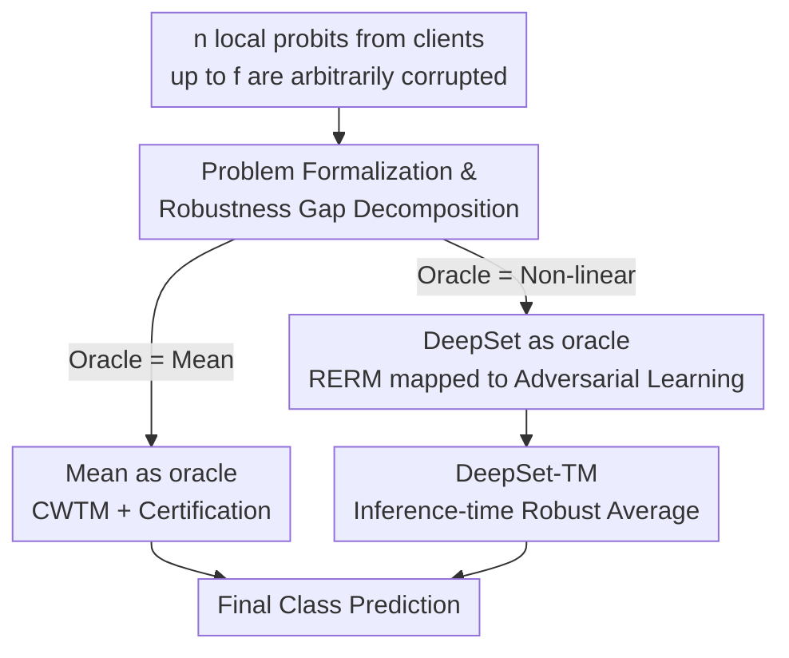

# Robust Federated Inference

**Conference**: ICLR 2026  
**OpenReview**: [https://openreview.net/forum?id=47eKYCaBIV](https://openreview.net/forum?id=47eKYCaBIV)  
**Code**: https://github.com/sacs-epfl/robust-federated-inference  
**Area**: AI Security / Robustness / Federated Learning  
**Keywords**: Federated Inference, Byzantine Robustness, Adversarial Training, DeepSet, Robust Aggregation  

## TL;DR
Ours first formalizes the "Robust Federated Inference" problem—where predictions from multiple local models are aggregated at the server, but outputs from up to $f < n/2$ clients may be arbitrarily tampered with. It provides the first robustness analysis: deriving provable certifications for mean-based aggregators and transforming the problem into adversarial learning for non-linear neural network aggregators. By combining DeepSet, adversarial training, and inference-time robust averaging (DeepSet-TM), the worst-case accuracy is improved by 4.7–22.2 percentage points over existing robust aggregation methods.

## Background & Motivation

**Background**: Aggregating predictions from multiple local client models at a central server has been repeatedly reinvented under names like one-shot federated learning, edge ensembles, and federated ensembles, recently gaining traction with the emergence of LLM ensembles. Ours collectively terms these as "federated inference": clients maintain private local models, the server performs black-box queries to obtain predictions, and an aggregator $\psi$ merges $n$ local probability vectors into a final class. Aggregation is either mean-based (averaging probits followed by argmax) or via a server-side trained aggregation network.

**Limitations of Prior Work**: While federated inference is gaining popularity, its robustness remains largely unexplored. In reality, client failures, model corruption, and output poisoning are nearly inevitable. Robust statistics and Byzantine-robust machine learning have long proven that models without defense collapse even under simple attacks. In other words, a system intended to provide the technical advantage of "integrating multiple models" could become a significant security vulnerability without proper defense.

**Key Challenge**: Intuitively, replacing simple averaging with "robust averaging" (e.g., Coordinate-Wise Trimmed Mean, CWTM) should defend against corruption, as it ensures the output is close to the true mean of honest clients in the $\ell_2$ norm. However, Ours points out this is insufficient: because final decisions are made via an $\arg\max$, which is discontinuous, an aggregated output can be arbitrarily close to the true mean in Euclidean distance but still yield a completely different class by crossing a decision boundary. There is a gap between robust "mean estimation" and robust "decision preservation."

**Goal**: (1) Formalize robust federated inference and quantify what determines the "robustness gap"; (2) provide provable certifications for mean-based aggregators; (3) design a truly attack-resistant aggregation scheme for stronger non-linear aggregators.

**Key Insight**: The authors use an "oracular aggregator" (the optimal aggregator assuming access to uncorrupted probits) as a reference to decompose the robust inference risk into "clean risk + robustness gap." This decomposition makes the problem analyzable. For non-linear aggregators, Ours further equates robust inference to an adversarial example defense problem—a version more favorable than image-domain adversarial attacks since the input is naturally constrained within the probability simplex.

**Core Idea**: Transform "poisoning-resistant robust inference" into "adversarial training in probit space," utilize the permutation-invariant DeepSet architecture to reduce the combinatorial complexity of adversaries, and finally layer robust averaging at inference time for fallback protection.

## Method

### Overall Architecture

The system consists of $n$ clients, where each client $i$ holds a local classifier $h_i$ mapping inputs to a $K$-class probability simplex $\Delta_K$. The server designs an aggregator $\psi: (\Delta_K)^n \to [K]$ to maintain classification accuracy over the global distribution despite up to $f < n/2$ clients (identities unknown and potentially changing per query) returning arbitrary corrupted vectors. Formally, the robust federated inference risk is defined as:

$$R_{\mathrm{adv}}(\psi) := \mathbb{E}_{(x,y)\sim D}\Big[\max_{z\in\Gamma_f(x)} \mathbf{1}\{\psi(z)\neq y\}\Big],$$

where $\Gamma_f(x)$ is the set of all possible inputs after replacing at most $f$ client probits with arbitrary simplex vectors.

The analytical framework introduces an "oracular aggregator" $\psi_o$, bounding the robust risk as $R_{\mathrm{adv}}(\psi_{\mathrm{rob}}) \le R(\psi_o) + \mathbb{E}[\ell^{\mathrm{adv}}_{\psi_{\mathrm{rob}}}(x, \hat y_o)]$. The latter term is the "robustness gap"—the probability that the robust aggregator disagrees with the oracle in the worst case. The method focuses on two oracles: when the oracle is the **mean**, robust averaging is used with certification; when the oracle is a **non-linear DeepSet**, the problem is solved via adversarial training combined with inference-time robust averaging (DeepSet-TM).

### Key Designs

**1. Formalization and "Robustness Gap" Decomposition: Breaking down poisoning resistance**

Optimizing the worst-case risk $R_{\mathrm{adv}}$ directly is difficult due to the $\max$ over the corruption set $\Gamma_f(x)$. The key observation is introducing an "oracular aggregator" $\psi_o$ as a reference and proving (Lemma 1) that for any robust aggregator $\psi_{\mathrm{rob}}$:

$$R_{\mathrm{adv}}(\psi_{\mathrm{rob}})\le R(\psi_o)+\mathbb{E}_{(x,y)\sim D}\big[\ell^{\mathrm{adv}}_{\psi_{\mathrm{rob}}}(x,\hat y_o)\big],\quad \hat y_o=\psi_o(h(x)).$$

The first term is the inherent learning error without corruption, while the second is the **robustness gap**: the probability that $\psi_{\mathrm{rob}}$ deviates from the oracle under attack. This shifts the design goal to creating aggregators that minimize disagreement with the oracle under corruption.

**2. Mean as Oracle: Robust average substitution and provable certification**

When the oracle is a simple mean, a natural robustification is replacing the mean with a ROBAVG (e.g., CWTM) satisfying $(f, \kappa)$-robustness. However, the authors demonstrate with a counterexample that even if the estimate $\hat v$ is arbitrarily close to the true mean $\bar h(x)$ in $\ell_2$ distance, the $\arg\max$ can still flip classes because it is discontinuous. 

Theorem 1 provides certification for CWTM: the robustness gap is bounded by the probability that the aggregated probit **margin** $\mathrm{MARGIN}(z)$ is smaller than a threshold proportional to the **pointwise model dissimilarity** $\sigma_x^2$. Essentially—**the more consistent the honest clients (low $\sigma_x$), the larger the winner's lead (high margin), and the fewer the attackers, the safer the mean-based aggregation.**

**3. DeepSet as Oracle: Transforming robust inference into adversarial training**

Non-linear aggregators outperform means in clean scenarios. Ours minimizes Robust Empirical Risk (RERM), which is equivalent to adversarial defense where the input is a $K \times n$ matrix and perturbations are restricted to $f$ columns. 

To solve the combinatorial explosion of "which $f$ clients are adversaries," Ours utilizes the **DeepSet** architecture $\phi_\theta(z)=\mu_{\theta_2}\big(\frac1n\sum_i\rho_{\theta_1}(z_i)\big)$, which is permutation-invariant. This reduces the search space from permutations $\binom{n}{f} \times f!$ to combinations $\binom{n}{f}$. In practice, Algorithm 1 samples $N \ll \binom{n}{f}$ adversary sets, uses multi-step FGSM to generate perturbations in probit space, and updates parameters to remain robust.

**4. DeepSet-TM: Combining DeepSet with inference-time robust averaging**

To further mitigate sensitivity, Ours introduces **DeepSet-TM**, which replaces the internal "mean pooling" of DeepSet with a robust average (CWTM) **only during inference**:

$$\psi_{\mathrm{rob}}(z)=\arg\max_k\Big[\mu_{\theta_2^*}\big(\mathrm{ROBAVG}(\rho_{\theta_1^*}(z_1),\dots,\rho_{\theta_1^*}(z_n))\big)\Big]_k.$$

This design avoids the computational overhead of calculating ROBAVG during training. Theorem 2 suggests this combination bounds the gap relative to the margin and dissimilarity while potentially eliminating the original DeepSet's dependency on the exact corruption level.

### Loss & Training

The indicator loss in RERM is replaced with cross-entropy $\ell(\phi_\theta(z),y)$. The inner $\max$ is approximated by sampling $N$ adversary groups and performing multi-step FGSM (Algorithm 1). Both $\mu$ and $\rho$ are two-layer MLPs with ReLU activations.

## Key Experimental Results

Datasets include CIFAR-10 (ResNet-8), CIFAR-100 (ViT-B/32), and AG-News (DistilBERT). Default settings: $n=17, f=4$, with Dirichlet distribution $\mathrm{Dir}_n(\alpha)$ for data heterogeneity. Six attacks were tested, including the proposed **SIA (Strongest Inverted Attack)**, where adversaries target the second-most probable non-ground-truth class to flip the $\arg\max$ decision.

### Main Results

Worst-case accuracy (lowest accuracy across all 6 attacks) for CIFAR-10 ($\alpha=0.5, n=17, f=4$):

| Aggregator | SIA | PGD-cw | Worst case |
|----------|-----|--------|------------|
| Mean | 42.7 | 24.6 | 24.6 |
| CWMed | 49.3 | 27.8 | 27.8 |
| GM | 45.3 | 25.4 | 25.4 |
| CWTM | 44.8 | 27.2 | 27.2 |
| **DeepSet-TM** | **51.4** | **48.2** | **48.2** |

DeepSet-TM outperforms the strongest baseline in worst-case accuracy by **+4.7 to +22.2 percentage points**. It achieved the highest accuracy in 14 out of 18 "dataset × attack" combinations.

### Ablation Study

Component breakdown ($n=17, f=4$, worst-case accuracy %):

| DeepSet | CWTM | Adv. Training | CIFAR-10 | CIFAR-100 | AG-News |
|:---:|:---:|:---:|:---:|:---:|:---:|
| ✓ | ✗ | ✗ | 46.0 | 47.4 | 76.4 |
| ✓ | ✓ | ✗ | 47.0 | 67.0 | 76.7 |
| ✓ | ✗ | ✓ | 48.6 | 65.1 | 76.7 |
| ✓ | ✓ | ✓ | **51.4** | **68.0** | **77.5** |

### Key Findings

- **Synergy of Components**: Adding CWTM or adversarial training alone provides gains, but using both is optimal, proving they defend against different attack facets.
- **CWTM is vital for CIFAR-100**: In scenarios with many classes (naturally smaller margins), robust averaging at inference time significantly suppresses class-flipping attacks (+19.6 points).
- **Probit space leads to "adversarial saturation"**: Unlike the image domain, increasing PGD iterations at test time beyond those used in training does not further degrade performance due to the simplex constraint.
- **Scalability**: DeepSet-TM maintains a clear lead as $n$ varies from 10 to 25.

## Highlights & Insights

- **The "Estimation vs. Decision" insight**: The counterexample effectively explains why robust estimation ($\ell_2$ proximity) fails to guarantee robust classification due to the discontinuity of $\arg\max$, shifting the focus to "Margin vs. Dissimilarity."
- **Complexity Reduction**: Using permutation invariance to reduce the adversarial search space from $\binom nf f!$ to $\binom nf$ is a mathematically elegant solution.
- **Decoupled Robustification**: Applying robust averaging only at inference time keeps the training cost low while theoretically improving robustness guarantees.

## Limitations & Future Work

- **Restricted Threat Model**: The method relies on the benign structure of the probit simplex; its efficacy in regression, generative tasks, or raw logit spaces (e.g., for LLMs) requires further verification.
- **Requirement for Validation Data**: DeepSet-TM requires a small portion of labeled data (10%) at the server to train the aggregator, which might not be available in strictly private scenarios.
- **Byzantine Constraint**: The $f < n/2$ constraint is strict, and performance in massive cross-device federated settings remains to be explored.

## Related Work & Insights

- **vs. COPUR (Liu et al., 2022)**: While COPUR uses autoencoders to "purify" logits, it is vulnerable to stronger attacks. Ours builds robustness directly into the aggregator.
- **vs. Byzantine Distributed Learning**: While Byzantine FL focuses on the training phase, Ours applies these concepts to the inference phase with dynamic adversary identities.
- **vs. ExpGuard/FedMDR**: These methods often require tracking client behavior over rounds, which is not assumed in Our's single-query robust inference setting.

## Rating
- Novelty: ⭐⭐⭐⭐⭐ First formalization and analysis of robust federated inference; creative use of DeepSet for complexity reduction.
- Experimental Thoroughness: ⭐⭐⭐⭐ Extensive datasets and attacks, though scale is primarily cross-silo ($n \le 25$).
- Writing Quality: ⭐⭐⭐⭐ Clear motivation with strong theoretical-empirical alignment.
- Value: ⭐⭐⭐⭐⭐ Establishes a benchmark for a neglected security gap in federated/edge deployment.

<!-- RELATED:START -->

## Related Papers

- [\[ICLR 2026\] Protection against Source Inference Attacks in Federated Learning](protection_against_source_inference_attacks_in_federated_learning.md)
- [\[ICLR 2026\] Federated Learning of Quantile Inference under Local Differential Privacy](federated_learning_of_quantile_inference_under_local_differential_privacy.md)
- [\[ICLR 2026\] Robust Fine-Tuning from Non-Robust Pretrained Models: Mitigating Suboptimal Transfer with Epsilon-Scheduling](robust_fine-tuning_from_non-robust_pretrained_models_mitigating_suboptimal_trans.md)
- [\[AAAI 2026\] Diversifying Counterattacks: Orthogonal Exploration for Robust CLIP Inference](../../AAAI2026/ai_safety/diversifying_counterattacks_orthogonal_exploration_for_robust_clip_inference.md)
- [\[ICLR 2026\] Get RICH or Die Scaling: Profitably Trading Inference Compute for Robustness](get_rich_or_die_scaling_profitably_trading_inference_compute_for_robustness.md)

<!-- RELATED:END -->
