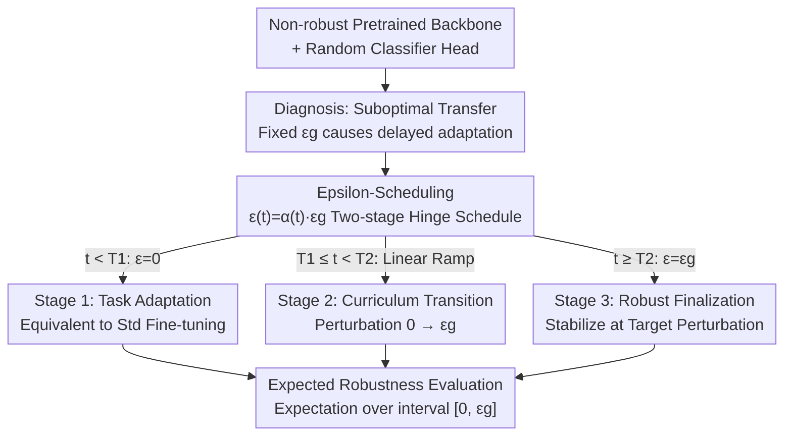

# Robust Fine-Tuning from Non-Robust Pretrained Models: Mitigating Suboptimal Transfer with Epsilon-Scheduling

**Conference**: ICLR 2026  
**OpenReview**: [https://openreview.net/forum?id=aIBFTh2ThF](https://openreview.net/forum?id=aIBFTh2ThF)  
**Code**: https://github.com/ngnawejonas/EpsilonScheduling  
**Area**: Adversarial Robustness / Robust Fine-Tuning / Transfer Learning  
**Keywords**: Robust Fine-Tuning, Adversarial Training, Suboptimal Transfer, Perturbation Scheduling, Expected Robustness

## TL;DR
This paper identifies that Robust Fine-Tuning (RFT) from **non-robust pretrained models** suffers from "suboptimal transfer"—where clean accuracy drops drastically below standard fine-tuning or even nears random levels, even with small adversarial perturbations. The authors attribute the root cause to "delayed task adaptation" and propose **Epsilon-Scheduling** (a two-stage hinge schedule that starts at 0 and linearly ramps up to the target $\varepsilon_g$) to allow the model to adapt to the task before imposing robustness constraints. They also propose an **Expected Robustness** metric for a more comprehensive characterization of the accuracy-robustness trade-off, demonstrating consistent improvements across 6 backbones and 5 datasets.

## Background & Motivation
**Background**: Fine-tuning pretrained backbones is the standard paradigm in machine learning. In safety-critical scenarios, models must also be resistant to adversarial examples, leading to the integration of adversarial training (AT, Madry et al. 2018) into fine-tuning, known as Robust Fine-Tuning (RFT). RFT aims to achieve two goals simultaneously: adapting to the downstream task and acquiring robustness.

**Limitations of Prior Work**: Almost all RFT works (TWINS, AutoLoRA, RoLi) **assume the availability of a robust pretrained backbone**. However, the vast majority of open-source pretrained models are **non-robust**, as robust pretraining is computationally expensive and rare. Furthermore, prior studies (Liu et al. 2023; Hua et al. 2024) have asserted that "robust pretraining is a necessary prerequisite for downstream robustness"—implying that starting from a non-robust backbone is a dead end.

**Key Challenge**: This paper systematically verifies that RFT from non-robust backbones triggers a phenomenon named "**suboptimal transfer**": when performing adversarial training with a fixed target perturbation $\varepsilon_g$, clean accuracy drops by up to 14% compared to standard fine-tuning even when $\varepsilon_g$ is small (e.g., $1/255$). At the common $4/255$ level, the drop is at least 10%, and for difficult tasks (e.g., Aircraft), accuracy can fall below 5%, signifying transfer failure. The issue is not that the "robust objective is inherently flawed," but rather the **training dynamics**: the robust objective distorts task-relevant features in the early stages, effectively pushing task adaptation to the later stages and reducing the number of effective epochs for adaptation, ultimately leading to task underfitting.

**Goal**: To enable successful RFT from non-robust backbones—achieving target robustness without sacrificing task adaptation.

**Key Insight**: The authors observed a critical phenomenon—while validation accuracy in standard fine-tuning starts rising in the first epoch, task adaptation in RFT is delayed significantly (e.g., until epoch 30+ on Aircraft). Furthermore, the **duration of this delay correlates >90% with the severity of suboptimal transfer**. Since the delay is the root cause, the model should not be forced to withstand strong perturbations from the start.

**Core Idea**: Implement the training perturbation intensity as a **curriculum schedule**—starting with 0 perturbation to allow the model to adapt to the task rapidly, then linearly ramping up to the target $\varepsilon_g$. This replaces "withstanding the target perturbation throughout" with "learning the task first, then becoming robust."

## Method

### Overall Architecture
The work consists of a diagnostic analysis, a method, and a metric. The diagnostic section uses extensive experiments to link "suboptimal transfer" to "delayed task adaptation." The method introduces Epsilon-Scheduling, replacing the fixed perturbation $\varepsilon_g$ with an epoch-dependent $\varepsilon(t)=\alpha(t)\,\varepsilon_g$. Finally, the evaluation introduces Expected Robustness, expanding from a single point evaluation at the target threshold to an expectation over the entire interval $[0, \varepsilon_g]$.

The training process follows a clear three-stage curriculum: standard fine-tuning warmup → linear perturbation ramp → stable finalization at the target perturbation.

### Key Designs

**1. Suboptimal Transfer Diagnosis: Attributing RFT Degradation to Delayed Adaptation**

This section investigates why RFT fails when starting from non-robust backbones. The baseline RFT-fix uses a fixed perturbation $\varepsilon_g$ throughout to minimize adversarial risk:

$$R_{\varepsilon_g}(f) = \mathbb{E}_{(x,y)\sim D}\Big[\max_{\|\delta\|_p<\varepsilon_g} L_{CE}(f(x+\delta),y)\Big]$$

By scanning $\varepsilon_g\in[1/255,9/255]$ across two non-robust backbones (SWIN, ViT) and five datasets, the authors found that clean accuracy declines monotonically as $\varepsilon_g$ increases, with the severity highly dependent on the "backbone × task" interaction (task being the dominant factor). The key insight lies in the training curves: standard fine-tuning ($\varepsilon_g=0$) shows validation accuracy takeoff in the first epoch, whereas RFT-fix delays the "task adaptation starting point" (the first epoch where validation accuracy exceeds 5%) significantly—to ~epoch 10 for Caltech, ~epoch 25 for Cars, and 30+ for Aircraft under $4/255$. Stronger perturbations lead to longer delays and more severe suboptimal transfer (correlation >90%). This "delay" mechanism, previously unreported, serves as the foundation for the proposed method.

**2. Epsilon-Scheduling: Two-stage Hinge Linear Schedule**

To address the delayed adaptation caused by early strong perturbations, the perturbation intensity is increased **gradually**. The perturbation follows a ratio curve $\varepsilon(t)=\alpha(t)\,\varepsilon_g$ based on epoch $t$:

$$\alpha(t)=\begin{cases}0 & t<T_1\\[2pt]\dfrac{t-T_1}{T_2-T_1} & T_1\le t<T_2\\[4pt]1 & t\ge T_2\end{cases}$$

The first $T_1$ epochs perform pure standard fine-tuning (zero perturbation) to let the model learn the task. Between $[T_1, T_2]$, the perturbation ramps linearly from 0 to $\varepsilon_g$, and from $T_2$ onwards, it stabilizes at the target. This generalizes **prior linear warmup** (where $T_1=0$) and RFT-fix (where $T_1=T_2=0$). From a transfer learning perspective, this is curriculum learning: feeding "easy samples" (weak perturbation) before "hard samples" (strong perturbation). $T_1$ and $T_2$ do not require per-task tuning; the authors fixed $T_1=12$ (~25% of total epochs) and $T_2=37$ (~75%) based on the most severe case (SWIN-Aircraft), which proved effective across all 6×5 configurations.

**3. Expected Robustness: Interval Integration instead of Single-Point Accuracy**

Standard evaluation only measures robust accuracy at the target threshold $\varepsilon_g$, which hides performance at intermediate intensities and fails to characterize the shape of the "accuracy-robustness trade-off." This paper proposes Expected Robustness, which is the expectation of accuracy over a uniform distribution of perturbations on $[0, \varepsilon_g]$:

$$\mathrm{Acc}_{[0,\varepsilon_g]}(f) := \mathbb{E}_{\varepsilon\sim U[0,\varepsilon_g]}\big[\mathrm{Acc}_\varepsilon(f)\big] = \frac{1}{\varepsilon_g}\int_0^{\varepsilon_g}\mathrm{Acc}_\varepsilon(f)\,d\varepsilon = \frac{1}{\varepsilon_g}\mathrm{AUC}_{\varepsilon_g}(f)$$

This is the Area Under the Curve (AUC) for the accuracy-perturbation plot divided by $\varepsilon_g$, calculated via trapezoidal numerical integration. It represents a more realistic threat model where inputs may or may not be perturbed, with the magnitude varying randomly within $[0, \varepsilon_g]$. Clean accuracy and worst-case robust accuracy are extreme cases of this metric.

### Loss & Training
Models are trained for 50 epochs. Adversarial examples are generated using APGD (7 steps for training, 10 steps for evaluation) with cross-entropy loss. Evaluation is conducted under $\ell_\infty$ norm at $\varepsilon_g=4/255$ (medium) and $8/255$ (high intensity). Reported metrics include Clean accuracy, APGD Robust accuracy (adv.), and Interval Expected Robustness (E. adv.). Since robust accuracy overfitting was negligible, the model at the end of training was used.

## Key Experimental Results

### Main Results
Six non-robust backbones (SWIN/ViT/ConvNext/ResNet-50/CLIP-ViT/CLIP-ConvNext) across five fine-grained datasets. The following table summarizes fix vs. scheduler at $\varepsilon_g=4/255$ (Clean / Adv. / E. adv. in %):

| Config | Setting | Clean | Adv. | E. adv. |
|------|------|-------|------|---------|
| ViT-Cars | fix | 12.70 | 4.90 | 8.20 |
| ViT-Cars | **sched** | **73.40** | **19.10** | **46.71** |
| ViT-Aircraft | fix | 6.40 | 2.80 | 4.48 |
| ViT-Aircraft | **sched** | **58.60** | **13.20** | **34.95** |
| ClipViT-Cars | fix | 4.90 | 3.00 | 3.74 |
| ClipViT-Cars | **sched** | **86.70** | **58.60** | **75.01** |
| SWIN-Cars | fix | 60.20 | 29.70 | 44.74 |
| SWIN-Cars | **sched** | **84.70** | **43.20** | **66.41** |

Under medium perturbation, the scheduler achieves order-of-magnitude improvements in clean accuracy and simultaneous gains in adv. and E. adv. metrics.

### High-Intensity Perturbation ($\varepsilon_g=8/255$)

| Config | Setting | Clean | Adv. | E. adv. |
|------|------|-------|------|---------|
| SWIN-Aircraft | fix | 4.20 | 2.70 | 3.47 |
| SWIN-Aircraft | **sched** | **69.20** | **22.40** | **45.12** |
| CNX-Cub | fix | 5.02 | 2.28 | 3.56 |
| CNX-Cub | **sched** | **80.69** | **24.28** | **53.07** |
| R50-Cars | fix | 1.50 | 1.20 | 1.34 |
| R50-Cars | **sched** | **57.10** | **8.50** | **29.56** |

At $8/255$, RFT-fix fails entirely (single-digit clean accuracy) on most difficult tasks, while the scheduler restores performance to 50%-80%.

### Key Findings
- **Task difficulty is the dominant factor over backbone type**: Easy tasks (Caltech) show minor drops, while difficult tasks (Aircraft, with high inter-class similarity) show severe drops.
- **Delay correlation >90%**: The later the task adaptation starts, the more severe the suboptimal transfer.
- **Scheduler wins even when worst-case robustness is comparable**: On R50-Caltech ($\varepsilon_g=4/255$), although fix has slightly higher adv. (40.0% vs. 34.7%), the scheduler outperforms in clean accuracy (76.6% vs. 67.5%) and Expected Robustness (55.7% vs. 53.7%).
- **Hyperparameters are transferable**: $T_1$ and $T_2$ calibrated on a single case remained effective across all 30 configurations.

## Highlights & Insights
- **Transformation of RFT Failure from Static to Dynamic**: Unlike prior work that simply concluded non-robust backbones were unsuitable, this paper identifies "delayed adaptation" as the mechanism, turning an "impossible" problem into a solvable one.
- **Simplicity with Theoretical Grounding**: The two-stage linear hinge is simple but generalizes both linear warmup and RFT-fix, unifying these into an interpretable curriculum framework.
- **Expected Robustness as a Reusable Tool**: Replacing "single-point accuracy" with "interval AUC expectation" provides a better metric for any study on the accuracy-robustness trade-off and reflects more realistic threat models.

## Limitations & Future Work
- The schedule shape is fixed as a two-stage linear hinge. While $T_1$ and $T_2$ are robust, they might not be optimal for all threat models or data scales; adaptive or sample-level scheduling could yield higher gains.
- Expected Robustness assumes a uniform distribution of perturbations; the authors acknowledge that real-world threat distributions might be non-uniform.
- Experiments focused on $\ell_\infty$ norm, fine-grained classification, and 50-epoch full fine-tuning. Verification on $\ell_2$, detection/segmentation, and parameter-efficient fine-tuning (e.g., LoRA) is needed.

## Related Work & Insights
- **vs. TWINS / AutoLoRA / RoLi**: These rely on robust pretrained features. This paper is the **first to target RFT from non-robust backbones**, challenging the consensus that robust pretraining is necessary.
- **vs. Linear Warmup / PGDLS**: Previous methods mostly targeted training from scratch or showed limited gains on ResNet. This work focuses on transfer learning and demonstrates consistent gains across tasks and architectures.
- **vs. Standard Adversarial Evaluation**: Single-point evaluation masks behavior at intermediate intensities; Expected Robustness formalizes the trade-off as an integral expectation over $[0, \varepsilon_g]$.

## Rating
- Novelty: ⭐⭐⭐⭐⭐ First systematic characterization of suboptimal transfer in RFT from non-robust backbones.
- Experimental Thoroughness: ⭐⭐⭐⭐⭐ Comprehensive coverage across 6 backbones, 5 datasets, and 2 perturbation levels.
- Writing Quality: ⭐⭐⭐⭐ Clear logic (diagnosis-method-metric), though the method itself is simple.
- Value: ⭐⭐⭐⭐⭐ Challenges established beliefs, provides a plug-and-play method, and introduces a valuable metric.

<!-- RELATED:START -->

## Related Papers

- [\[ICLR 2026\] Robust Optimization for Mitigating Reward Hacking with Correlated Proxies](robust_optimization_for_mitigating_reward_hacking_with_correlated_proxies.md)
- [\[ICLR 2026\] Robust Federated Inference](robust_federated_inference.md)
- [\[ICLR 2026\] Identifying Robust Neural Pathways: Few-Shot Adversarial Mask Tuning for Vision-Language Models](identifying_robust_neural_pathways_few-shot_adversarial_mask_tuning_for_vision-l.md)
- [\[ICLR 2026\] Eliciting Harmful Capabilities by Fine-Tuning on Safeguarded Outputs](eliciting_harmful_capabilities_by_fine-tuning_on_safeguarded_outputs.md)
- [\[ICLR 2026\] Reducing Information Dependency Does Not Cause Training Data Privacy. Adversarially Non-Robust Features Do.](reducing_information_dependency_does_not_cause_training_data_privacy_adversarial.md)

<!-- RELATED:END -->
