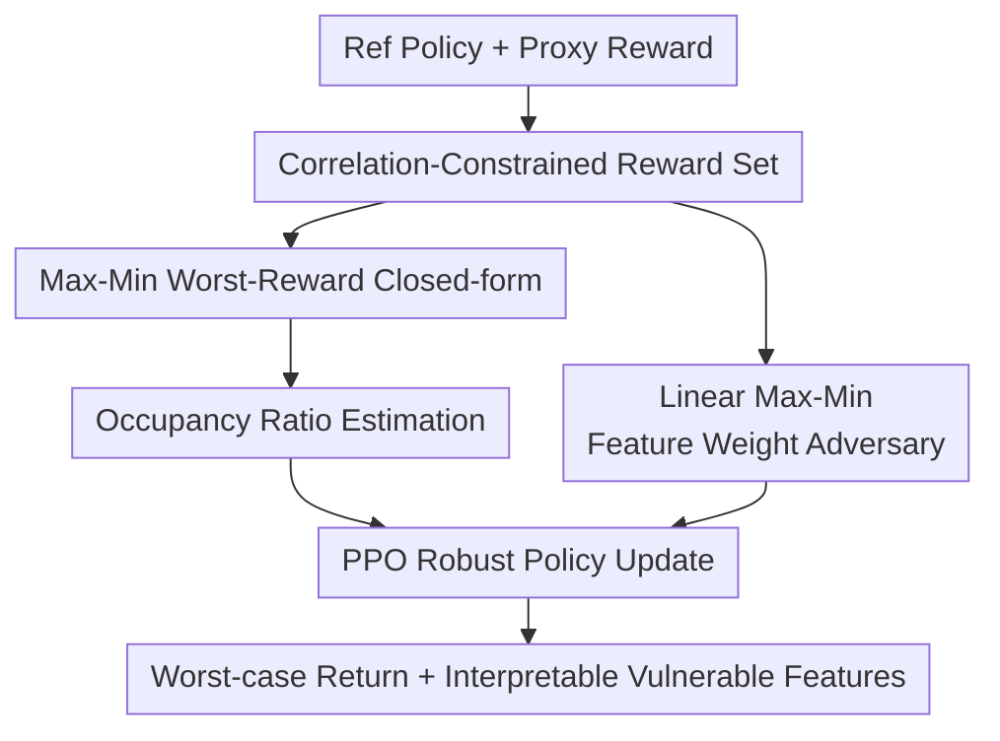

# Robust Optimization for Mitigating Reward Hacking with Correlated Proxies

**Conference**: ICLR 2026  
**OpenReview**: [https://openreview.net/forum?id=O3shkBWM2s](https://openreview.net/forum?id=O3shkBWM2s)  
**Code**: https://github.com/ZixuanLiu4869/reward_hacking  
**Area**: AI Safety / Robust Reinforcement Learning  
**Keywords**: Reward Hacking, Correlated Proxy Rewards, Robust Optimization, Distribution Shift, Interpretable Rewards

## TL;DR

This paper models reward hacking as a max-min robust policy optimization problem that "performs well against the worst-case among all possible true rewards maintaining a correlation $r$ with the proxy reward." It proposes two algorithms, a universal Max-Min and a feature-based Linear Max-Min, significantly improving worst-case returns and stability across environments including Traffic, Pandemic, Glucose, Tomato, and RLHF.

## Background & Motivation

**Background**: In real-world deployments, Reinforcement Learning (RL) systems rarely have access to perfectly accurate objective functions. Instead, they rely on proxy rewards formed by manual design, preference models, rule-based metrics, or heuristics. Training often optimizes an indicator that is correlated with, but not equivalent to, the true intent. The "correlated proxies" framework formalizes this: proxy and true rewards have a correlation coefficient $r$ under the state-action distribution of a reference policy $\pi_{ref}$, but can diverge significantly in regions rarely visited by that reference policy.

**Limitations of Prior Work**: Measures like occupancy-regularized policy optimization (ORPO) use penalties like $\chi^2(\mu_\pi \| \mu_{\pi_{ref}})$ to discourage the policy from deviating from the reference distribution, reducing the risk of over-exploiting the proxy. However, they still regularize around a single fixed proxy, ensuring the policy is "not too far from the reference" rather than being "safe against all potential true rewards satisfying correlation constraints." If the proxy originates from noisy data or a small model, the risk stems from a set of possible rewards, not just one.

**Key Challenge**: The root of reward hacking is the misalignment between "correlation visible during training" and the "distribution explored by the policy during deployment." The $r$-correlation only constrains state-action pairs covered by the reference policy; once a new policy pushes occupancy into uncovered or low-coverage regions, the relationship between proxy and true rewards may collapse. Standard policy optimization actively seeks high-proxy regions, which are often where correlation constraints are weakest.

**Goal**: This work aims to train policies directly around an uncertainty set: given a reference policy, a proxy reward, and a correlation level $r$, to learn a policy that achieves a conservative lower bound across all candidate true rewards satisfying the correlation constraint. Additionally, it seeks to make the "worst-case rewards" interpretable to help humans identify which reward features are most vulnerable to exploitation.

**Key Insight**: The paper frames reward hacking in the language of Distributionally Robust Optimization (DRO). Instead of asking "what is the score under this proxy," it asks "what return is guaranteed if an adversary picks the most unfavorable true reward within correlation constraints." Thus, the optimization naturally becomes a max-min problem: maximize the policy while the adversary minimizes the reward.

**Core Idea**: Define a reward uncertainty set $\mathcal{R}_{corr}$ using correlation constraints and transform reward hacking mitigation into $\max_\pi \min_{R\in\mathcal{R}_{corr}} J(\pi,R)$. The inner minimization is solved via closed-form expressions or linear feature weights to train policies robust to proxy misspecification.

## Method

### Overall Architecture

The method takes a reference policy $\pi_{ref}$, a proxy reward $R_{proxy}$, and a correlation parameter $r$ as input. It outputs a policy $\pi$ that remains conservative and effective under the worst-case correlated reward. The workflow first normalizes the proxy reward using the reference policy and constrains candidate true rewards to a set satisfying mean, variance, and correlation requirements. It then estimates the occupancy ratio $L(s,a)=\mu_\pi(s,a)/\mu_{\pi_{ref}}(s,a)$ for any candidate policy, solves for the worst-case reward chosen by the adversary, and updates the policy using PPO.

For general reward spaces, the paper derives a closed-form solution for the inner minimization, resulting in a direct regularization objective. For tasks with known reward features, the paper models $R(s,a)=\theta^\top\phi(s,a)$ to find the worst-case non-negative weights $\theta$ in the feature space, which not only narrows the uncertainty set but also reveals which features induce reward hacking.

### Key Designs

**1. Correlation-Constrained Reward Set: Explicitly Modeling Uncertainty**

Following the correlated proxies setting, the true reward is latent, and the proxy reward only correlates with the true reward with coefficient $r$ under the reference distribution $\mu_{\pi_{ref}}$. Instead of training on one proxy, the authors define a set $\mathcal{R}_{corr}$ of rewards $R$ that, after normalization, satisfy:

$$
\mathbb{E}_{\mu_{\pi_{ref}}}\left[\frac{R-M}{V}\cdot R_{proxy}\right]=r.
$$

This assumes that while the proxy is imperfect, it maintains some underlying correlation with the goal. A smaller $r$ creates a larger uncertainty set (more conservative), while a larger $r$ implies higher trust in the proxy.

**2. Max-Min Closed-form Objective: Replacing Fixed Proxies**

Solving $\max_\pi \min_{R\in\mathcal{R}_{corr}} \mathbb{E}_{\mu_\pi}[R]$ is difficult because the objective is evaluated under the current policy distribution $\mu_\pi$, while constraints are defined under $\mu_{\pi_{ref}}$. Using a change-of-measure, the return is rewritten as $\mathbb{E}_{\mu_{\pi_{ref}}}[L\cdot R]$, where $L(s,a)=\mu_\pi(s,a)/\mu_{\pi_{ref}}(s,a)$.

Using Lagrangian multipliers, the worst-case objective is derived as:

$$
\max_\pi\; rV\mathbb{E}_{\mu_\pi}[R_{proxy}]
- V\sqrt{1-r^2}\sqrt{\chi^2(\mu_\pi\|\mu_{\pi_{ref}})-\mathbb{E}_{\mu_\pi}^2[R_{proxy}]} + M.
$$

This objective resembles ORPO but includes a specific penalty term derived from the $\chi^2$ divergence and the proxy mean. It serves as a conservative lower bound on the true improvement $J(\pi,R_{true})-J(\pi_{ref},R_{true})$.

**3. Linear Max-Min: Interpretable Feature Weights**

To prevent the adversary from constructing pathological rewards, the linear version assumes $R(s,a)=\theta^\top\phi(s,a)$. The uncertainty is reduced to the set of feature weights $\theta$. The resulting adversarial weights $\theta$ highlight which features are exploited. For example, in Traffic, "headway" often receives high adversarial weight, indicating its vulnerability in the reward design.

**4. Occupancy Ratio Estimation: The Distribution Shift Bottleneck**

Both Max-Min and ORPO rely on estimating $L(s,a)$ or $\chi^2$ divergence. This is implemented via a discriminator $d_\phi(s,a)$ trained on reference and current trajectories, where $\tilde L_\phi(s,a)=\exp d_\phi(s,a)$. The authors observe that poor discriminator training in standard ORPO leads to inaccurate ratio estimation, allowing policies to drift into low-coverage regions. By increasing discriminator training epochs (ORPO*), worst-case performance improves, highlighting that distribution shift estimation is a critical engineering factor in defense.

### Loss & Training

The universal Max-Min training utilizes a "PPO shell + robust pseudo-reward." In each iteration, current trajectories are sampled to estimate the first and second moments of the normalized proxy and the $\chi^2$ divergence. The robust objective is then treated as the utility function for PPO updates. Linear Max-Min requires estimating the feature covariance matrix $Q=\sum_{s,a}\mu_{\pi_{ref}}(s,a)\phi(s,a)\phi(s,a)^\top$ for whitening. Despite the dual variables and matrix operations, the complexity remains comparable to ORPO.

## Key Experimental Results

### Main Results

Evaluations were conducted in Traffic, Pandemic, Glucose, Tomato Watering, and RLHF (using Pythia-70M as proxy and Llama 3 Tulu V2 8B as true reward).

| Env | Metric | ORPO | ORPO* | Max-Min | Linear Max-Min / Ensemble |
|------|------|------|-------|---------|----------------------------|
| Traffic | Worst (Higher is Better) | $-1.96e{+}04$ | $-1.35e{+}04$ | $-268.31$ | Linear Max-Min: $-1.19e{+}04$ |
| Pandemic | Worst (Higher is Better) | $-5.31e{+}06$ | $-4.46e{+}06$ | $-63.29$ | Linear Max-Min: $-6.82e{+}05$ |
| Glucose | Worst (Higher is Better) | $-27.54$ | $-8.79$ | $-1.71$ | N/A |
| RLHF | Worst (Higher is Better) | $-1.84$ | N/A | $-0.10$ | Ensemble: $-1.70$ |
| Traffic | True Reward | $16.91$ | $10.26$ | $12.70$ | Linear Max-Min: $16.46$ |
| Pandemic | True Reward | $-1.04$ | $1.18$ | $1.25$ | Linear Max-Min: $3.65$ |

Max-Min significantly outperforms ORPO in worst-case scenarios, recovering from extreme negative values. Linear Max-Min performs best on true reward when feature assumptions hold.

### Ablation Study

| Configuration | Key Metric | Insight |
|---------------|------------|---------|
| ORPO vs ORPO* | Traffic Occ: $\downarrow$ | Strengthening discriminator training alone reduces unseen occupancy, improving baseline stability. |
| ORPO* vs Max-Min | Pandemic Worst: $\uparrow$ | A better discriminator isn't enough; the robust objective is necessary to optimize the lower bound. |
| Linear Weights | Headway weight in Traffic | Adversarial weights serve as a diagnostic tool for reward design vulnerabilities. |
| $r$ Sensitivity | Moderate $r$ is best | $r$ too small is over-conservative; $r$ too large trusts the proxy too much. Values around $0.3$-$0.4$ performed best. |

### Key Findings

- Max-Min excels at worst-case rewards, often sacrificing some optimistic proxy gain to ensure stability against proxy misspecification.
- Accurate discriminator training is a prerequisite for any occupancy-based regularization; if distribution shift estimation fails, safety guarantees collapse.
- Linear Max-Min provides a practical auditing tool by outputting adversarial feature weights.
- In RLHF, simple reward ensembles mitigate over-optimization but are less robust than the Max-Min approach under the correlation-constrained set.

## Highlights & Insights

- Shifts the perspective from "defining reward hacking" to "optimizing the worst-case" within a plausible set.
- Derives a principled objective where terms clearly map to proxy alignment, occupancy shift, and uncertainty.
- Interpretable linear version allows safety auditing in high-stakes domains (e.g., healthcare, traffic) by revealing which physical or social features the policy is hedging against.
- Identifies that the practical bottleneck of reward hacking defense is often the quality of the occupancy ratio estimator.

## Limitations & Future Work

- The correlation parameter $r$ requires manual selection or grid search; estimating it from minimal true reward data remains an open task.
- The universal uncertainty set might be overly broad, leading to policies that are too cautious against "impossible" adversaries.
- Linear Max-Min is limited by the coverage of predefined features; it may fail if the true reward depends on latent features not in $\phi$.
- It primarily addresses robust optimization; future work could integrate active learning to query human preferences when the uncertainty set is too large.

## Related Work & Insights

- **vs ORPO**: While ORPO regularizes against the reference distribution, Ours accounts for the entire set of $r$-correlated rewards. Our objective includes a coupling of proxy mean and $\chi^2$ divergence that specifically targets "over-optimization" risk.
- **vs Reward Ensembles**: Ensembles reduce variance; Ours handles systematic correlation uncertainty. The two are complementary.
- **vs Robust MDP**: Traditional robust MDPs use rectangular uncertainty sets on transitions or rewards; Ours uses a global correlation constraint that couples state-action evaluations.

## Rating

- Novelty: ⭐⭐⭐⭐⭐ Formulating reward hacking as a solvable Max-Min DRO problem is a significant step forward.
- Experimental Thoroughness: ⭐⭐⭐⭐ Strong across diverse domains, though lacks large-scale LLM testing beyond 70M/8B models.
- Writing Quality: ⭐⭐⭐⭐ Clear theory and structure, though math-heavy sections require careful reading.
- Value: ⭐⭐⭐⭐⭐ Highly relevant for AI safety and RLHF, providing both optimization objectives and auditing tools.

<!-- RELATED:START -->

## Related Papers

- [\[ICLR 2026\] From Curiosity to Caution: Mitigating Reward Hacking for Best-of-$N$ with Pessimism](from_curiosity_to_caution_mitigating_reward_hacking_for_best-of-n_with_pessimism.md)
- [\[ICLR 2026\] Generative Adversarial Post-Training Mitigates Reward Hacking in Live Human-AI Music Interaction](generative_adversarial_post-training_mitigates_reward_hacking_in_live_human-ai_m.md)
- [\[ICLR 2026\] Robust Fine-Tuning from Non-Robust Pretrained Models: Mitigating Suboptimal Transfer with Epsilon-Scheduling](robust_fine-tuning_from_non-robust_pretrained_models_mitigating_suboptimal_trans.md)
- [\[ICLR 2026\] Beware Untrusted Simulators -- Reward-Free Backdoor Attacks in Reinforcement Learning](beware_untrusted_simulators_--_reward-free_backdoor_attacks_in_reinforcement_lea.md)
- [\[ICLR 2026\] Mitigating Privacy Risk via Forget Set-Free Unlearning](mitigating_privacy_risk_via_forget_set-free_unlearning.md)

<!-- RELATED:END -->
