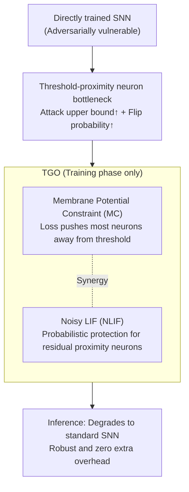

# Robust Spiking Neural Networks Against Adversarial Attacks

**Conference**: ICLR2026  
**arXiv**: [2602.20548](https://arxiv.org/abs/2602.20548)  
**Code**: To be confirmed  
**Area**: AI Security  
**Keywords**: Spiking Neural Networks, Adversarial Robustness, Membrane Potential Optimization, Threshold-proximity Neurons, Noisy LIF Model

## TL;DR
This paper theoretically proves that threshold-proximity spiking neurons are the key bottleneck for the adversarial robustness of directly trained SNNs (they simultaneously set the theoretical upper bound of attack intensity and are most prone to state flipping). It proposes the Threshold Guarding Optimization (TGO) method—a dual approach using membrane potential constraints and noisy LIF neurons—which achieves SOTA robustness across various adversarial scenarios with zero additional inference overhead.

## Background & Motivation

**Background**: Spiking Neural Networks (SNNs) have become an important paradigm for energy-efficient neuromorphic computing due to their event-driven mechanisms and biologically plausible spike transmission. Direct training methods based on surrogate gradients (such as STBP/BPTT) have enabled SNNs to approach ANN performance in classification tasks.

**Limitations of Prior Work**: Directly trained SNNs inherit the adversarial vulnerability of ANNs—carefully designed infinitesimal perturbations can lead to classification errors. Existing defense methods like Adversarial Training (AT) and Regularized Adversarial Training (RAT) introduce significant training overhead and have limited portability.

**Key Challenge**: Existing robustness optimizations for SNNs (e.g., gradient Sparsity Regularization (SR), evolutionary leakage factors like FEEL-SNN) only show significant effects when combined with AT/RAT and lack a unified theoretical analysis of the SNN robustness bottleneck.

**Goal**: To identify the fundamental cause of adversarial vulnerability in directly trained SNNs and design a defense method without additional inference overhead.

**Key Insight**: Starting from the membrane potential dynamics of spiking neurons, it was discovered that threshold-proximity neurons amplify both the upper bound of the gradient attack path and the probability of state flipping.

**Core Idea**: Push membrane potentials away from the threshold + Introduce a noisy spiking mechanism $\to$ Lower the theoretical upper bound of adversarial attacks + Reduce the state flipping probability.

## Method

### Overall Architecture

The paper first provides a theoretical deconstruction: attributing the adversarial vulnerability of directly trained SNNs to "threshold-proximity neurons"—a group of neurons whose membrane potentials reside near the firing threshold. It is proven that they both expand the attack intensity bound and are the most susceptible to perturbation-induced flipping. Following this conclusion, the authors propose Threshold Guarding Optimization (TGO), targeting both the training loss and the neuron model. Membrane Potential Constraint (MC) pushes most neurons away from the threshold, while the Noisy LIF (NLIF) model provides a probabilistic layer of protection for neurons remaining near the threshold. Both act only during training; at inference, the model reverts to a standard SNN, incurring zero extra overhead.

### Key Designs

**1. Dual Vulnerability of Threshold-proximity Neurons: Locating the SNN Robustness Bottleneck**

The authors identify neurons with membrane potentials near the threshold as the bottleneck and prove this from two perspectives. First, the attack intensity upper bound: the maximum potential intensity of an adversarial attack $\mathcal{R}_{\text{adv}}(f,x,\epsilon)$ is positively correlated with the $\ell_2$ norm of the model's Jacobian. Since surrogate gradients peak near the threshold, more threshold-proximity neurons lead to a larger $\|J_f(x)\|_2^2$, raising the theoretical upper bound of adversarial perturbation intensity. Second, state flipping: Theorem 1 proves that when Gaussian noise $\eta[t]\sim\mathcal{N}(0,\sigma^2)$ acts on the membrane potential, the flip probability $P_{\text{flip}}$ increases monotonically as the potential approaches the threshold. Theorem 2 further nodes that the more threshold-proximity neurons there are, the larger the number of reachable activation regions $K$ within the perturbation ball $B_\epsilon(x)$, loosening the robustness upper bound. These conclusions suggest that pushing membrane potentials away from the threshold can simultaneously lower the attack bound and flip probability.

**2. Membrane Potential Constraint (MC): Pushing Potentials Away via Loss**

To address the root cause of "too many threshold-proximity neurons," MC adds a hinge-like penalty to the loss of each spiking neuron layer. Any membrane potential falling within a $\delta$-neighborhood of the threshold $V_{\text{th}}$ incurs a cost:

$$\mathcal{C}(V(t)_l) = \frac{1}{TN}\sum_{i=1}^{n}\max\bigl(0,\ \delta - |V(t)_i - V_{\text{th}}|\bigr)$$

This does not change the network structure but "squeezes" the membrane potential distribution toward either side during training, reducing the number of threshold-proximity neurons and directly weakening the causes of vulnerability. Tests show TGO reduces threshold-proximity neurons by approximately 40%, aligning with theoretical assumptions.

**3. Noisy LIF Neurons (NLIF): Probabilistic Protection for Residual Proximity Neurons**

MC cannot push all neurons away—some critical neurons must remain near the threshold for training. For these, NLIF injects Gaussian white noise $\xi[t]$ into the membrane potential, converting deterministic firing into probabilistic firing. While adding noise might seem counterintuitive for stability, theoretical derivation yields a result: when the potential is near the threshold ($z^2<1$), the flip probability decreases monotonically with respect to the noise standard deviation $\sigma$. Thus, appropriate noise can actually reduce the flip sensitivity of these neurons. MC handles "clearing the field" while NLIF provides "residual defense," together suppressing the flip probability.

### Loss & Training

The total loss combines the classification loss and layer-wise membrane potential constraints in a Lagrangian form: $\mathcal{L}(\mathbf{x},\lambda) = \mathcal{L}_{\text{oss}}(\mathbf{x}) + \lambda \sum_l \mathcal{C}(V(t)_l)$. The weight $\lambda$ is not fixed but adjusted from small to large using cosine annealing—low values in the early stages allow for exploration to avoid poor convergence, while high values in later stages enforce the constraint to push neurons away from the threshold. Its upper limit $\lambda_{\max}$ is the primary knob for the robustness-accuracy trade-off. The neighborhood width $\delta$ controls the penalty range, and the noise standard deviation $\sigma$ in NLIF balances robustness and training stability. All SNNs are consistently simulated using $T=4$ time steps.

## Key Experimental Results

### Main Results: CIFAR-10 WRN-16 Multi-Attack Comparison

| Training Strategy | Method | Clean | FGSM | RFGSM | PGD10 | PGD20 | PGD40 |
|---------|------|-------|------|-------|-------|-------|-------|
| BPTT | Vanilla | 93.32 | 14.05 | 31.21 | 0.00 | 0.00 | 0.00 |
| BPTT | **TGO** | 88.79 | **51.40** | **71.38** | **6.14** | 1.52 | 0.45 |
| AT | AT | 91.32 | 39.14 | 74.31 | 17.45 | 14.41 | 12.93 |
| AT | **TGO** | 88.16 | **63.03** | **79.69** | **35.01** | **24.76** | **20.11** |
| RAT | RAT | 91.44 | 42.02 | 75.89 | 19.81 | 16.24 | 14.18 |
| RAT | **TGO** | 87.33 | **69.16** | **79.28** | **47.69** | **38.07** | **33.13** |

### Ablation Study: CIFAR-100 VGG-11 Component Contributions

| MC | NLIF | Clean (BPTT) | FGSM (BPTT) | Clean (RAT) | FGSM (RAT) | PGD40 (RAT) |
|----|------|-------------|-------------|-------------|-------------|-------------|
| ✗ | ✗ | 71.4 | 5.9 | 67.8 | 20.9 | 6.9 |
| ✓ | ✗ | 64.3 | 17.1 (+11.2) | 61.4 | 26.2 (+5.3) | 6.2 |
| ✗ | ✓ | 70.6 | 8.1 (+2.1) | 68.1 | 25.2 (+4.3) | 9.1 (+2.2) |
| ✓ | ✓ | 66.9 | **21.5 (+15.5)** | 63.3 | **33.8 (+13.0)** | **9.3 (+2.4)** |

### Key Findings
- TGO reduces the number of threshold-proximity neurons by approximately 40%, validating the theoretical hypothesis.
- Loss landscape analysis shows that SNNs optimized with TGO have smoother gradient trajectories, effectively avoiding local optima traps.

## Highlights & Insights
- **Theory-driven Design**: Instead of blindly applying ANN defense methods, it identifies robustness bottlenecks from SNN spiking mechanisms and designs targeted defensive components.
- **Zero Inference Overhead**: MC only affects the training loss, and NLIF noise can be removed during inference (as the probabilistic training already makes the weights robust). The inference stage remains identical to a standard SNN.
- **High Compatibility**: TGO can be combined with BPTT, AT, or RAT, providing significant improvements in all combinations.
- **40% Reduction in Proximity Neurons**: Visualizations intuitively verify the correctness of the theoretical analysis.

## Limitations & Future Work
- **Clean Accuracy Drop (3-5%)**: The constraint to push potentials away from the threshold inevitably sacrifices some normal classification performance, representing a robustness-accuracy trade-off.
- **Validation Limited to Image Classification**: Generalization to downstream tasks like object detection or semantic segmentation has not been verified.
- **Selection of Noise Standard Deviation $\sigma$**: The paper does not fully discuss how to automatically determine the optimal $\sigma$ for different architectures and datasets.
- **Limited Adaptive Attack Evaluation**: While APGD and EoT were tested, a more complete adaptive attack suite like AutoAttack was not employed.
- **Future Directions**: Explore layer-wise adaptive $\delta$ and $\sigma$, or combine with knowledge distillation to mitigate clean accuracy loss.

## Related Work & Insights
- **vs SR (Sparsity Regularization)**: SR directly constrains gradient sparsity; TGO starts from the root (membrane potential distribution), indirectly achieving stronger gradient sparsity. Experimentally, TGO outperforms SR in all attack scenarios.
- **vs FEEL-SNN (Evolutionary Leakage Factor)**: FEEL-SNN enhances robustness through stochastic membrane potential decay but is only effective when paired with AT. TGO significantly improves FGSM robustness even under the BPTT strategy (+37%).
- **vs ANN Adversarial Training**: AT/RAT are migrated from ANNs without considering SNN spiking characteristics. TGO leverages the specific nature of the spiking mechanism to design defenses that complement AT/RAT.

## Rating
- Novelty: ⭐⭐⭐⭐ Unique perspective by establishing SNN robustness bottleneck theory through threshold-proximity neurons.
- Experimental Thoroughness: ⭐⭐⭐⭐ Comprehensive across multiple architectures, attacks, and training strategies, with full ablation, though lacking AutoAttack.
- Writing Quality: ⭐⭐⭐⭐ Rigorous theoretical derivation, clear motivation, and intuitive illustrations.
- Value: ⭐⭐⭐⭐ Provides a theoretical foundation and practical tools for secure SNN deployment; zero inference overhead is a major advantage.

<!-- RELATED:START -->

## Related Papers

- [\[CVPR 2026\] Towards Reliable Evaluation of Adversarial Robustness for Spiking Neural Networks](../../CVPR2026/ai_safety/towards_reliable_evaluation_of_adversarial_robustness_for_spiking_neural_network.md)
- [\[ICLR 2026\] Robustify Spiking Neural Networks via Dominant Singular Deflation under Heterogeneous Training Vulnerability](robustify_spiking_neural_networks_via_dominant_singular_deflation_under_heteroge.md)
- [\[AAAI 2026\] MPD-SGR: Robust Spiking Neural Networks with Membrane Potential Distribution-Driven Surrogate Gradient Regularization](../../AAAI2026/ai_safety/mpd-sgr_robust_spiking_neural_networks_with_membrane_potential_distribution-driv.md)
- [\[ICLR 2026\] Time Is All It Takes: Spike-Retiming Attacks on Event-Driven Spiking Neural Networks](time_is_all_it_takes_spike-retiming_attacks_on_event-driven_spiking_neural_netwo.md)
- [\[ICLR 2026\] Robust Adversarial Attacks Against Unknown Disturbances via Inverse Gradient Sample](robust_adversarial_attacks_against_unknown_disturbance_via_inverse_gradient_samp.md)

<!-- RELATED:END -->
