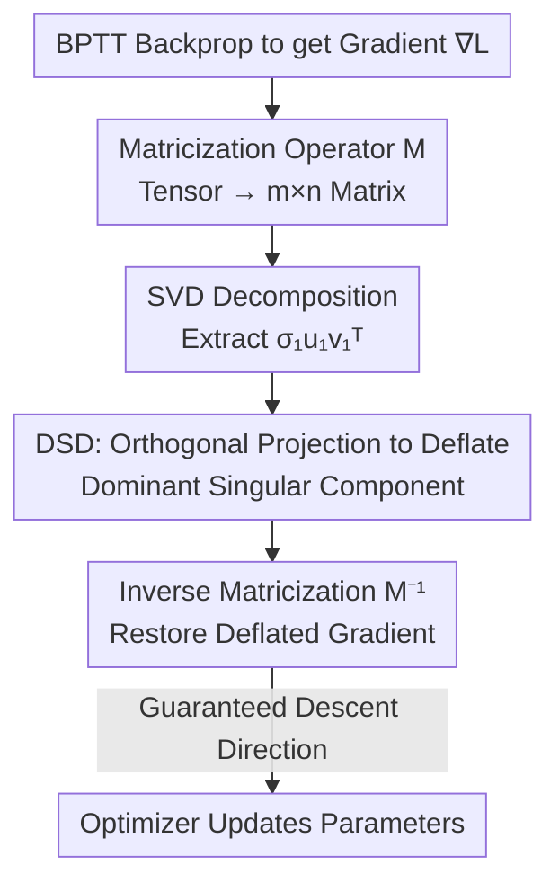

# Robustify Spiking Neural Networks via Dominant Singular Deflation under Heterogeneous Training Vulnerability

**Conference**: ICLR 2026  
**OpenReview**: [https://openreview.net/forum?id=EIYltBaUzL](https://openreview.net/forum?id=EIYltBaUzL)  
**Code**: https://github.com/Apple26419/SNN_DSD  
**Area**: AI Security / Adversarial Robustness / Spiking Neural Networks  
**Keywords**: Spiking Neural Networks, Adversarial Robustness, Heterogeneous Training, Hessian Spectral Radius, Gradient Contraction

## TL;DR
The authors identify a **heterogeneous training vulnerability** in Spiking Neural Networks (SNNs) under the mainstream "direct coding + BPTT" paradigm—where a single batch with a slightly different distribution can cause complete network collapse. The root cause is theoretically attributed to the linear growth of the Hessian spectral radius over time steps. Accordingly, a parameter-free **Dominant Singular Deflation (DSD)** method is proposed to orthogonally remove the dominant singular component of gradients during backpropagation to suppress the spectral radius, significantly improving SNN adversarial robustness in both homogeneous and heterogeneous training scenarios.

## Background & Motivation

**Background**: SNNs utilize discrete spikes for event-driven computation, bypassing dense matrix multiplications in ANNs and achieving ultra-low energy consumption. They are widely applied in safety-critical scenarios like autonomous driving and edge computing. Currently, enhancing SNN robustness primarily relies on **homogeneous training**: either vanilla training with clean samples or adversarial training (AT) where all inputs are perturbed with equal intensity.

**Limitations of Prior Work**: Homogeneous training assumes data comes from a single, uniform distribution, which is unrealistic. Real-world deployments involve naturally unpredictable and heterogeneous data, and attackers may use poisoning strategies to break distribution uniformity. The authors define this more realistic setting as **heterogeneous training** and observe a striking phenomenon (Observation 1): in SNN training, **even a single backpropagation with one slightly different distribution batch is sufficient to trigger a catastrophic collapse**—accuracy plunges, loss degenerates, and subsequent training oscillates violently. Homogeneous trajectories (all-clean or all-perturbed) remain stable, but inserting one heterogeneous batch leads to collapse.

**Key Challenge**: Through controlled experiments (training paradigm $\times$ coding method $\times$ architecture), the authors locate the collapse as **independent of network structure or training stage, but strongly dependent on the training paradigm (BPTT) and coding method (direct coding)**. BPTT collapses significantly worse than SLTT, and direct coding collapses worse than rate coding, while ANNs only show mild degradation without collapsing. This indicates the "BPTT + direct coding" combination intermittently pushes parameters into extremely sharp local minima where the loss Hessian spectral radius is abnormally large.

**Goal**: (1) Explain why SNNs collapse under heterogeneous training; (2) design a method to mitigate collapse and enhance robustness **without relying on input data manipulation**.

**Key Insight**: Since collapse stems from sharp minima (large spectral radius), curvature growth should be suppressed at the optimization level. The authors theoretically characterize how the spectral radius grows with time steps $T$ and find it is dominated by a **rank-one dominant singular component** in the gradient. This provides a clean intervention point: deflating this dominant term.

**Core Idea**: Replace temporal step tuning or regularization with "orthogonal deflation of the dominant singular component of gradients" to suppress the Hessian spectral radius without hyperparameters, preventing SNNs from falling into sharp minima.

## Method

### Overall Architecture

The strategy of DSD follows two steps: **diagnosis and treatment**. The diagnosis quantifies heterogeneous training collapse through two theorems showing the Hessian spectral radius grows linearly with time steps and is dominated by a rank-one direction. The treatment is a plug-and-play gradient correction: after backpropagation but before the optimizer update, the gradient is matricized, processed via SVD to orthogonally project out the rank-one component corresponding to the largest singular value, and then restored for the parameter update. The process is parameter-free, requires no structural changes or auxiliary models, and incurs zero inference overhead.

Why does removing the dominant component stop the collapse? Theoretical analysis reveals that under direct coding, inputs remain steady across time steps, making the recursive Jacobian in BPTT approximately time-invariant. Repeated application produces a "power iteration effect," aligning gradients of all time steps toward a common rank-one direction. The spectral radius is dominated by the square of the largest singular value $\sigma_1$ of this direction. Deflating it reduces the maximum singular value to the second largest $\sigma_2$, strictly decreasing the spectral radius and preventing parameters from being pushed toward sharp minima.

### Key Designs

**1. Theoretical Cause of Heterogeneous Vulnerability: Spectral Radius $\Theta(T)$ Growth**

This design answers "why SNNs collapse." The authors characterize the spectral behavior of Gauss–Newton (GN) Hessian blocks $H(W^l)\approx\sum_{t=1}^{T}(J^W_t)^\top H_t J^W_t$. **Theorem 1** proves that under the contractive dynamics of LIF neurons, the BPTT gradient contribution $\|g_t\|=\|G_t J^W_t\|\le C_G C_J$ at each time step is $O(1)$ bounded, so the spectral radius grows at most linearly: $\lambda_{\max}(H(W^l))\le C_B^2 C_z C_J^2 \cdot T$. **Theorem 2** further points out that **direct coding tightens this bound**: stagnant inputs make the recursive operator nearly time-invariant, creating a power iteration effect that concentrates $J^W_t$ along a common rank-one direction $J^W_t=\alpha_t ab^\top + R_t$ (where $\sum_t\|R_t\|^2=o(T)$). Thus, the lower bound also grows linearly, resulting in $\lambda_{\max}(H(W^l))=\Theta(T)$. This explains that as the spectral radius inflates linearly with $T$, even minor distribution deviations in heterogeneous training accumulate disproportionately along these amplified sharp directions, triggering collapse.

**2. Dominant Singular Deflation: Orthogonal Gradient Deflation**

This is the core operation targeting the "rank-one dominant component." For a parameter set $\theta$, the gradient tensor $\nabla_\theta L(\theta)\in\mathbb{R}^{d_1\times\cdots\times d_k}$ is flattened into a matrix using a deterministic operator $\mathcal{M}$ and decomposed via SVD: $\mathcal{M}(\nabla_\theta L)=U\Sigma V^\top=\sum_{i=1}^r \sigma_i u_i v_i^\top$. The dominant component $\sigma_1 u_1 v_1^\top$ is removed using an orthogonal projection:

$$D(A)=\frac{\langle A, u_1 v_1^\top\rangle_F}{\|u_1 v_1^\top\|_F^2}\,u_1 v_1^\top,\qquad \widetilde{\nabla_\theta L}=\mathcal{M}^{-1}\!\big(\mathcal{M}(\nabla_\theta L)-D(\mathcal{M}(\nabla_\theta L))\big)$$

After deflation, the maximum singular value of the Jacobian drops from $\sigma_1$ to $\sigma_2$, ensuring $\lambda_{\max}\big(H(W^l;\widetilde{\nabla_\theta L})\big)<\lambda_{\max}\big(H(W^l;\nabla_\theta L)\big)$. Unlike existing defenses (StoG, DLIF, HoSNN, FEEL), DSD deterministically removes the curvature-dominating term in the gradient space without hyperparameters or auxiliary models.

**3. Descent Property: Preserving Optimization Convergence**

Modifying gradients raises concerns about convergence. This design provides a formal guarantee. The directional derivative along the update direction $d=-\widetilde{\nabla_\theta L}$ is $\mathcal{D}L(\theta)[d]=\langle\nabla_\theta L, d\rangle$. Using the self-adjoint and idempotent properties of the orthogonal projection $D$ ($\langle A, D(A)\rangle_F=\|D(A)\|_F^2$), it simplifies to:

$$\mathcal{D}L(\theta)[d]=-\big\|\mathcal{M}(\widetilde{\nabla_\theta L})\big\|_F^2\le 0$$

The inequality holds strictly as long as the deflated gradient is non-zero. Thus, DSD updates are always in a **non-increasing (descent) direction**. This conclusion depends only on the properties of orthogonal projections in Hilbert space and is independent of specific SNN or BPTT structures, ensuring universal convergence.

### Loss & Training
DSD does not modify the loss function but acts as a gradient post-processing step in standard SNN training (Direct Coding + BPTT). It is deterministic and parameter-free, introducing a single SVD overhead during training per backprop and zero overhead during inference. Experiments enable DSD across vanilla training, adversarial training (AT, FGSM $\epsilon=2/255$), and various heterogeneous poisoning settings.

## Key Experimental Results

Datasets include static images (CIFAR-10/100, TinyImageNet, ImageNet) and Neuromorphic (DVS) datasets (DVS-CIFAR10, DVS-Gesture). Attacks include FGSM, PGD, APGD (CE/DLR), and black-box transfer attacks.

### Main Results: White-box Robustness in Homogeneous Training (Table 1, Accuracy %)

| Setting | Dataset | Attack | Ours (DSD) | Prev. SOTA | Gain |
| :--- | :--- | :--- | :--- | :--- | :--- |
| Vanilla | CIFAR-100 | FGSM | 23.81 | 13.48 (HoSNN) | ▲10.33 |
| Vanilla | CIFAR-100 | PGD | 8.09 | 2.04 (FEEL) | ▲6.05 |
| Vanilla | TinyImageNet | FGSM | 19.50 | 9.59 (FEEL) | ▲9.91 |
| AT | CIFAR-10 | FGSM | 74.43 | 63.98 (HoSNN) | ▲10.45 |
| AT | TinyImageNet | FGSM | 30.87 | 8.19 (SNN) | ▲22.68 |
| AT | TinyImageNet | PGD | 18.21 | 2.97 (SNN) | ▲15.24 |
| AT | ImageNet | FGSM | 26.83 | 15.74 (SNN) | ▲10.09 |

DSD achieves the highest robustness accuracy across almost all datasets and attacks, with improvements often exceeding 10%. Clean accuracy decreases slightly (typically ▼1~5%), a common trade-off in robustness research. APGD results (Table 2) show DSD leading in most cases, except for CIFAR-100 AT where it is slightly below DLIF. On DVS datasets (Table 3), it outperforms SR, e.g., improving DVS-Gesture FGSM from 39.24% to 90.28%.

### Heterogeneous Training and Hessian Analysis (Table 4)

| Inference | Dataset | Metric | SNN | DSD | Change |
| :--- | :--- | :--- | :--- | :--- | :--- |
| Clean | CIFAR-10 | $\lambda_{\max}(H)$ | 261.94 | 209.90 | ▼52.04 |
| Clean | CIFAR-10 | $\Pr(H)$ | 0.98 | 0.35 | ▼0.63 |
| PGD | TinyImageNet | $\lambda_{\max}(H)$ | 2072.77 | 1793.12 | ▼279.65 |
| FGSM | ImageNet | $\lambda_{\max}(H)$ | 162.57 | 111.77 | ▼50.80 |

In heterogeneous training (Fig. 5/6), DSD exhibits the smallest performance variance and maintains higher accuracy than RAT/DLIF/FEEL under injection. Even with high-intensity poisoning, CIFAR-10 under FGSM maintains ~30% accuracy with no cases of total collapse. Hessian evaluation confirms that DSD consistently reduces both $\lambda_{\max}(H)$ and its proportion in the top-5 eigenvalues $\Pr(H)$, flattening the loss landscape.

### Key Findings
- **The "Switch" for Collapse is the BPTT + Direct Coding pair**, not the architecture. ResNet-18 and VGG-11 exhibit similar collapse, while SLTT and rate coding mitigate it significantly.
- **Spectral radius correlates positively with time steps $T$**: Larger $T$ worsens heterogeneous degradation, but reducing $T$ sacrifices homogeneous performance. DSD provides an "active curvature suppression" alternative.
- **DSD is not gradient obfuscation**: It passes all 5 tests of the Athalye checklist—iterative PGD is stronger than single-step FGSM, white-box is stronger than black-box, and increasing perturbation consistently reduces accuracy.

## Highlights & Insights
- **Mechanism Mapping**: Translating "training collapse" to "$\Theta(T)$ spectral radius growth" and then to a "rank-one dominant singular component" creates a very clean logical chain leading to a direct operational target.
- **Parameter-free & Zero Inference Overhead**: Unlike SAM or generative defenses, DSD requires no tuning and no auxiliary models. The descent guarantee is universal.
- **Transferable Trick**: The concept of "deflating dominant singular components in gradient space to suppress Hessian spectral radius" is a lightweight alternative to sharpness-aware optimization and could potentially be used in any task requiring avoidance of sharp minima.

## Limitations & Future Work
- **Clean Accuracy Trade-off**: DSD intentionally deviates the gradient from the ideal direction, leading to a slight drop in clean accuracy (▼1~5%). This remains a common issue for SOTA defenses.
- **Theoretical Scoping**: The guarantees (linear spectral growth, rank-one alignment) are tied to the steady-state assumptions of "Direct Coding + LIF + BPTT." Its effectiveness under rate coding or other neuron dynamics requires further exploration.
- **Optimization**: Performing SVD at every step and layer may be a bottleneck for large models. Future work could explore power iteration or randomized SVD to approximate $\sigma_1 u_1 v_1$ more efficiently.

## Related Work & Insights
- **vs StoG / DLIF / HoSNN / FEEL**: While these provide empirical robustness through gating or modified dynamics, they do not address the underlying mechanism of "direct coding + BPTT" induced vulnerability. DSD provides a mechanistic fix in the gradient space.
- **vs SAM / Generative Defenses**: SAM uses double-forward passes to find sharpness, and generative defenses project samples back to manifolds. Both add significant overhead. DSD achieves "sharpness avoidance" via gradient contraction with lower training and zero inference cost.

## Rating
- **Novelty**: ⭐⭐⭐⭐⭐ First to identify SNN heterogeneous training vulnerability and provide the $\Theta(T)$ theoretical characterization.
- **Experimental Thoroughness**: ⭐⭐⭐⭐ Comprehensive coverage of datasets and attacks, including Hessian diagnostics. Some ImageNet baselines are missing.
- **Writing Quality**: ⭐⭐⭐⭐ Logic from diagnosis to method is clear, though formulas are dense.
- **Value**: ⭐⭐⭐⭐⭐ Practical for SNN deployment due to its parameter-free, zero inference cost, and guaranteed convergence properties.

<!-- RELATED:START -->

## Related Papers

- [\[ICLR 2026\] Robust Spiking Neural Networks Against Adversarial Attacks](robust_spiking_neural_networks_against_adversarial_attacks.md)
- [\[ICLR 2026\] Time Is All It Takes: Spike-Retiming Attacks on Event-Driven Spiking Neural Networks](time_is_all_it_takes_spike-retiming_attacks_on_event-driven_spiking_neural_netwo.md)
- [\[ICML 2026\] Singular Bayesian Neural Networks](../../ICML2026/ai_safety/singular_bayesian_neural_networks.md)
- [\[CVPR 2026\] Towards Reliable Evaluation of Adversarial Robustness for Spiking Neural Networks](../../CVPR2026/ai_safety/towards_reliable_evaluation_of_adversarial_robustness_for_spiking_neural_network.md)
- [\[AAAI 2026\] MPD-SGR: Robust Spiking Neural Networks with Membrane Potential Distribution-Driven Surrogate Gradient Regularization](../../AAAI2026/ai_safety/mpd-sgr_robust_spiking_neural_networks_with_membrane_potential_distribution-driv.md)

<!-- RELATED:END -->
