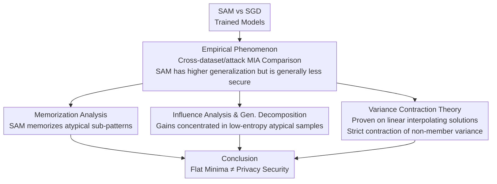

# Membership Privacy Risks of Sharpness Aware Minimization

**Conference**: ICLR 2026  
**arXiv**: [2310.00488](https://arxiv.org/abs/2310.00488)  
**Code**: None  
**Area**: AI Security/Privacy  
**Keywords**: Sharpness-Aware Minimization, Membership Inference Attacks, Privacy Leakage, Memorization, Variance Contraction

## TL;DR

This paper systematically reveals for the first time that models trained with Sharpness-Aware Minimization (SAM), despite having better generalization performance, are more vulnerable to Membership Inference Attacks (MIA) than those trained with SGD. Theoretical and experimental explanations are provided through the lenses of memorization behavior and variance contraction.

## Background & Motivation

**Background**: SAM improves the generalization performance of deep learning models by seeking flatter loss minima and has become a widely used optimization technique. Intuitively, models with better generalization should rely less on memorizing training data, thus leading to lower privacy risks.

**Limitations of Prior Work**: Yeom et al. formally proved that the upper bound of MIA advantage is given by the generalization error, implying better generalization should reduce MIA risk. However, in practice, the relationship between generalization and privacy is far more complex than this bound suggests, with precedents of utility-privacy tradeoffs.

**Key Challenge**: SAM improves generalization by better capturing atypical subclass patterns. However, this "structured memorization" simultaneously leaves stronger traces of training samples in the model output, thereby increasing privacy leakage.

**Goal**: (1) Systematically verify if SAM indeed increases MIA risk; (2) explain the root causes via memorization and influence scores; (3) theoretically prove how SAM's variance contraction effect amplifies MIA advantage.

**Key Insight**: The authors observe that the output confidence variance of SAM models is smaller—SGD has more extremely confident predictions (including for non-members), and these non-members exceeding the threshold cause the attacker to make "mistakes." SAM compresses this variance, making member and non-member confidence distributions easier to distinguish.

**Core Idea**: Flat minima $\neq$ privacy security. SAM’s sharpness penalty suppresses the over-amplification of primary features, forcing the model to distribute reliance across diverse sub-class features. While this improves generalization, it reduces output variance, thereby amplifying membership inference signals.

## Method

### Overall Architecture

This paper does not propose a new method but aims to answer a counter-intuitive question: why SAM models with better generalization are more susceptible to Membership Inference Attack (MIA). The analysis first confirms the phenomenon experimentally—systematically comparing the MIA vulnerability of SAM vs. SGD across multiple datasets and attacks, confirming that SAM is generally less secure despite higher generalization. Subsequently, it approaches the root cause through three leads: using **memorization analysis** to examine what SAM actually remembers, using **influence analysis and generalization decomposition** to see which samples benefit from SAM’s generalization gains, and using **variance contraction theory** to provide geometric necessity on linear models. Finally, it arrives at the conclusion "Flat minima $\neq$ privacy security." The first two are empirical characterizations, and the third proves the phenomenon as an intrinsic property of SAM geometry.

### Key Designs

Around the question "Why is SAM less secure?", the authors approach the root cause through three layers: memorization, influence, and variance. The first two empirically characterize SAM’s memorization patterns, while the third provides geometric necessity on linear models.

**1. Memorization Analysis: What exactly does SAM memorize?**

Intuitively, "better generalization = less memorization = safer," but verification requires quantifying which samples each optimizer remembers. The authors use a Leave-One-Out (LOO) based memorization score $mem(\mathcal{A},\mathcal{D},i)$—the change in prediction confidence for the $i$-th training sample when it is excluded—to compare SAM and SGD. Results show that SAM's memorization scores are not lower but are more concentrated in the middle range (approx. 0.6–0.85) rather than at the high end. This indicates SAM does not memorize pure noise but rather "atypical but generalizable" sub-patterns. This structured memorization selectively focuses on underrepresented sub-groups; hence, high memorization here is not equivalent to overfitting noise but is a source of generalization—and it is precisely this memorization that embeds training sample traces more firmly into the output.

**2. Influence Analysis and Generalization Decomposition: Where do SAM's gains come from?**

To explain where generalization improvements occur, the authors introduce a measure $\mathcal{I}_{ent}$ based on the entropy of influence scores, partitioning the test set into 5 buckets. Test points in low-entropy buckets rely heavily on a few high-memorization training samples (atypical samples), while high-entropy buckets contain typical samples relying on broad features. Comparison shows that SAM’s gains over SGD are almost entirely concentrated in low-entropy buckets, with both performing similarly in high-entropy buckets. This clarifies that SAM's generalization improvement specifically addresses those "atypical samples requiring memorization"—the same samples that make training members more identifiable in model output. Thus, generalization gain and privacy risk are co-derived from the same source.

**3. Variance Contraction Theory: Proving SAM is inevitably more dangerous on linear models**

While the first two are empirical observations, this provides a rigorous proof. Under the perfect interpolation setting of linear models, the authors express different optimizers as minimum $G$-norm interpolating solutions: SGD corresponds to metric $G_0 = I_d$, and SAM corresponds to $G_\eta = I + \eta\Sigma$ (where $\Sigma$ is data curvature and $\eta$ is sharpness penalty strength), meaning SAM imposes additional penalties along high-curvature directions. Within this framework, it can be proven that non-member output variance strictly contracts:

$$\sigma_{G_\eta}^2 < \sigma_{G_0}^2$$

Since training sample confidence is fixed under interpolation, the member distribution remains largely unchanged, while non-member variance is suppressed. This reduces distribution overlap and makes them easier to separate with a threshold—matching the experimental observation that SGD has more extremely confident non-member predictions, while SAM flattens the variance. Thus, variance contraction is proven as an intrinsic property of SAM geometry, providing the root cause for amplified MIA advantage.

### Loss & Training

This is an analytical work and does not involve new training strategies. The analysis uses the standard SAM objective: $\min_w \max_{\epsilon \in B(\rho)} L_S(w+\epsilon)$.

## Key Experimental Results

### Main Results

| Dataset | Attack Method | SGD Attack Acc | SAM Attack Acc | SGD Test Acc | SAM Test Acc |
|--------|----------|---------------|---------------|---------------|---------------|
| CIFAR-100 | Confidence | 77.19% | 79.10% | 80.30% | 81.60% |
| CIFAR-10 | M-entropy | 59.51% | 61.70% | 96.00% | 96.72% |
| EyePacs | Confidence | 73.40% | 77.07% | 73.67% | 75.41% |
| CIFAR-100 | RMIA (AUC) | 90.4% | 91.6% | 67.7% | 69.1% |
| CIFAR-10 | LiRA (TPR@0.1) | 8.8% | 12.5% | 92.3% | 93.1% |

### Ablation Study

| Analysis Dimension | Key Finding |
|---------|---------|
| Memorization Density | SAM has lower density at the low end and a more uniform distribution in the middle range |
| Gen. Decomposition (Bucket 1 vs 5) | SAM shows max gain in the atypical bucket (Bucket 1), minimal difference in typical bucket (Bucket 5) |
| Other Sharpness-Aware Optimizers | GSAM, LookSAM, etc., exhibit similar patterns of increased privacy risk |
| Different Architectures | Phenomenon consistently reproduced on ResNet and VGG |

### Key Findings

- SAM is more vulnerable to MIA than SGD across all 5 datasets and all attack methods, despite consistently higher test accuracy.
- SAM’s memorization gains are concentrated in the "medium memorization" range (0.6-0.85) rather than the high end (noise memorization), confirming the structured memorization hypothesis.
- On CIFAR-10, SAM’s LiRA TPR@0.1%FPR jumps from 8.8% to 12.5%, a 42% increase—this is particularly dangerous under strict low false-positive rate requirements.

## Highlights & Insights

- **Systematic verification of an anti-intuitive discovery**: It breaks the naive assumption that "flat minima = good privacy," using comprehensive experiments across multiple datasets, attacks, and architectures. This discovery provides an important warning for the actual deployment of SAM.
- **Extremely concise theoretical explanation of variance contraction**: It attributes the problem to the geometric differences in minimum $G$-norm interpolating solutions, with a clear chain of proof: sharpness penalty $\to$ high-curvature direction suppression $\to$ non-member variance contraction $\to$ increased MIA advantage.
- **The concept of structured memorization** can be transferred to other analyses: Memorization in different optimizers/regularizers is not homogeneous; a framework distinguishing "beneficial memorization" from "noise memorization" is valuable for other privacy research.

## Limitations & Future Work

- Theoretical analysis is limited to the perfect interpolation setting of linear models; generalization to non-linear deep networks remains to be verified.
- No specific schemes for mitigating SAM privacy risks were proposed (e.g., combined strategies of Differential Privacy + SAM).
- Computing memorization and influence scores relies on extensive LOO training, which is computationally expensive and limits validation on larger-scale models.
- Whether SAM variants (e.g., adaptive SAM, mSAM) can mitigate this issue was not explored.

## Related Work & Insights

- **vs Yeom et al. (2018)**: They proved MIA advantage $\leq$ generalization error; this paper empirically breaks this intuitive upper bound.
- **vs Feldman (2020)**: This work builds on Feldman’s memorization framework but is the first to compare differences in memorization patterns between optimizers.
- **vs Tan et al. (2022)**: They analyzed the impact of parameter scale and ridge regression on privacy; this work introduces a curvature-aligned geometric model to characterize SAM.

## Rating

- Novelty: ⭐⭐⭐⭐⭐ First to reveal the privacy risk paradox of SAM; the findings are significant and counter-intuitive.
- Experimental Thoroughness: ⭐⭐⭐⭐⭐ Five datasets, various attacks, multi-architecture ablations, plus theoretical verification.
- Writing Quality: ⭐⭐⭐⭐ Clear progression from experiment to analysis to theory, though some parts have heavy notation.
- Value: ⭐⭐⭐⭐ Directly provides a warning for real-world systems deploying SAM, though the lack of mitigation schemes is a minor drawback.

<!-- RELATED:START -->

## Related Papers

- [\[ICLR 2026\] Reliable Poisoned Sample Detection against Backdoor Attacks Enhanced by Sharpness-Aware Minimization](reliable_poisoned_sample_detection_against_backdoor_attacks_enhanced_by_sharpnes.md)
- [\[AAAI 2026\] Transferable Backdoor Attacks for Code Models via Sharpness-Aware Adversarial Perturbation](../../AAAI2026/ai_safety/transferable_backdoor_attacks_for_code_models_via_sharpness-aware_adversarial_pe.md)
- [\[ICML 2026\] Where Rectified Flows Leak: Characterising Membership Signals Along the Interpolation Path](../../ICML2026/ai_safety/where_rectified_flows_leak_characterising_membership_signals_along_the_interpola.md)
- [\[ICLR 2026\] Beyond Membership: Limitations of Add/Remove Adjacency in Differential Privacy](beyond_membership_limitations_of_addremove_adjacency_in_differential_privacy.md)
- [\[ICLR 2026\] RESFL: An Uncertainty-Aware Framework for Responsible Federated Learning by Balancing Privacy, Fairness and Utility](resfl_an_uncertainty-aware_framework_for_responsible_federated_learning_by_balan.md)

<!-- RELATED:END -->
