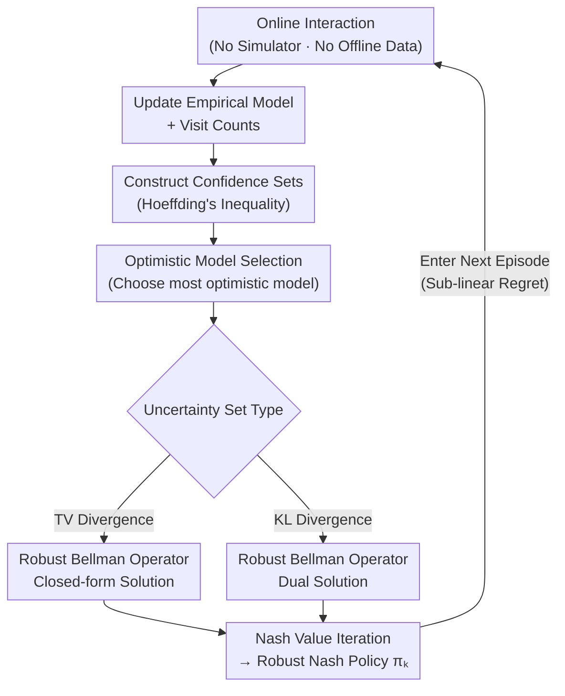

# Sample-Efficient Distributionally Robust Multi-Agent Reinforcement Learning via Online Interaction

**Conference**: ICLR 2026  
**arXiv**: [2508.02948](https://arxiv.org/abs/2508.02948)  
**Code**: None  
**Area**: AI Safety / Multi-Agent RL  
**Keywords**: Distributionally Robust, Multi-Agent RL, Markov Games, online learning, Regret Bounds

## TL;DR

This paper conducts the first study on the online learning problem of Distributionally Robust Markov Games (DRMGs). It proposes the MORNAVI algorithm, which efficiently learns optimal robust policies through online interaction without simulators or offline data, providing the first provable regret bounds under TV and KL divergence uncertainty sets.

## Background & Motivation

Multi-agent systems face a fundamental challenge in practical deployments: **model mismatch between training and deployment environments**. This mismatch may stem from environmental noise, transition uncertainty, or even adversarial attacks. Multi-agent policies that perform excellently during training may fail catastrophically when facing these uncertainties.

Distributionally Robust Markov Games (DRMGs) enhance system robustness by optimizing **worst-case performance**—finding policies that achieve an optimal robust Nash equilibrium across a defined set of environmental uncertainties.

However, existing research methods for DRMGs have severe limitations:

**Dependence on Simulators**: Many methods assume the ability to repeatedly query the environment model (i.e., having a generative simulator), which is often unavailable in real systems.

**Dependence on Offline Datasets**: Other methods require large-scale pre-collected offline experience data, which may not exist in new environments.

**Lack of Online Learning Guarantees**: No methods provide theoretical guarantees for scenarios where "agents interact directly with the environment and learn robust policies in real-time."

In summary, online learning for DRMGs—where agents learn robust policies through direct interaction with the environment without any prior data—is a entirely unexplored problem.

## Method

### Overall Architecture

MORNAVI (Multiplayer Optimistic Robust Nash Value Iteration) is designed for online DRMGs, allowing agents to learn robust policies while interacting without simulators or offline data. Its backbone is Nash Value Iteration, with two components added at each step: "optimistic exploration" using confidence sets to account for under-explored state-action pairs, and "robust evaluation" within uncertainty sets to obtain worst-case values, simultaneously minimizing regret and maintaining a worst-case lower bound. The algorithm runs in a loop of episodes: in each episode, it interacts with the real environment to collect transitions and rewards, updates the empirical model and visit counts to construct confidence sets; then, it selects the most optimistic model within the confidence set to drive exploration, calculates the worst-case robust Bellman value for that model within the uncertainty set (TV or KL divergence ball), and finally performs Nash Value Iteration to obtain the robust policy for the current episode, gradually pushing the cumulative regret toward sub-linearity.

### Key Designs

**1. Formalization of Online DRMGs: Transforming "learning while doing" into an optimizable regret objective**

Prior DRMG research assumed either generative simulators or pre-collected offline data, neither of which exists in a new environment where agents must "learn while doing." This paper formalizes the problem as an online interaction framework: agents interact directly with the real environment in each episode, observe transitions, and collect rewards. The objective is to minimize cumulative regret $\text{Regret}(K) = \sum_{k=1}^{K} [V^* - V^{\pi_k}]$, where $V^*$ is the optimal robust Nash equilibrium value and $V^{\pi_k}$ is the value of the policy in episode $k$. This metric quantifies the distance between the online policy and the optimal robust policy as a curve for which sub-linear bounds can be proven.

**2. Optimistic Robust Value Iteration: Using optimism for exploration and worst-case for robustness without conflict**

The core conflict in online learning is the exploration-exploitation trade-off, while robust optimization is naturally pessimistic; combining them directly can be counterproductive. MORNAVI handles this by assigning them to different dimensions. It maintains empirical estimates of transition probabilities and builds confidence sets based on visit counts and Hoeffding-type inequalities to quantify estimation uncertainty. For exploration, it selects the **most optimistic** model within the confidence set to drive the agent toward under-explored state-action pairs. For robustness, it calculates the **worst-case** value function for each candidate model within the uncertainty set (TV or KL divergence ball). Crucially, optimism addresses "model estimation error" while robustness addresses "model shift at deployment," ensuring efficient exploration and worst-case protection without contradiction.

**3. Unified Treatment of TV and KL Uncertainty Sets: Two inner optimizations within one framework for tractability and flexibility**

Different applications suit different uncertainty measures: TV divergence measures the maximum probability difference between distributions and is suitable for bounded model shifts, making it easier to optimize but potentially conservative. KL divergence measures distributional distance in an information-theoretic sense and is suitable for multiplicative noise, offering more flexibility but requiring finer analysis. Since their robust Bellman operators have different structures, MORNAVI designs specific inner optimizations: a closed-form solution for TV uncertainty sets and a dual method for KL uncertainty sets to transform the constrained optimization into an efficient dual form. Providing both choices allows the framework to balance between "analytical ease" and "general modeling" as needed, with regret bounds holding for both common measures.

## Key Experimental Results

### Theoretical Results

The primary contribution of this work is the theoretical guarantee rather than empirical experiments.

| Uncertainty Set | Regret Bound | Description |
|-----------|--------|------|
| TV Divergence | $\tilde{O}(\text{poly}(S,A,H) \cdot \sqrt{K})$ | First regret bound for multi-agent robust online learning |
| KL Divergence | $\tilde{O}(\text{poly}(S,A,H) \cdot \sqrt{K})$ | First result under KL uncertainty sets |

Where $S$ is the size of the state space, $A$ is the size of the action space, $H$ is the episode length, and $K$ is the total number of episodes. A regret growth rate of $\sqrt{K}$ implies that the average regret approaches zero, meaning the algorithm eventually converges to the optimal robust policy.

### Core Theoretical Contributions

| Result | Value |
|------|------|
| First provable regret bound for online DRMGs | Opens a new research direction |
| Efficient algorithm under TV divergence | Closed-form solution for TV robust Bellman operator |
| Efficient algorithm under KL divergence | Handles general uncertainty sets via dualization |
| Robust equilibrium for multiplayer games | Not limited to two-player zero-sum; applies to general-sum games |

### Key Findings

1. **Online robust learning is feasible**: Optimal robust policies can be learned with sub-linear regret through online interaction alone, without simulators or offline data.
2. **The Principle of Optimism works for robust optimization**: Despite appearing contradictory (optimism vs. robust/pessimism), optimism applies to the exploration dimension while robustness applies to the model uncertainty dimension, allowing them to coexist.
3. **Distinct properties of TV and KL uncertainty sets**: TV divergence offers better problem structure (closed-form), while KL divergence requires more sophisticated analysis but provides more flexible modeling.

## Highlights & Insights

- **Pioneering Problem Definition**: Formally defines the online learning problem for DRMGs and provides solutions, filling a theoretical gap.
- **Theoretical Rigor**: Provides complete proofs for regret bounds, including upper bound analysis and key lemmas.
- **Practical Relevance**: Real-world multi-agent deployments (drone swarms, autonomous vehicle fleets, robotic collaboration) are inherently online learning scenarios; this method provides the theoretical foundation.
- **Unified Framework**: Handles both TV and KL uncertainty measures, enhancing generalizability.

## Limitations & Future Work

1. **Tabular Method**: MORNAVI is based on tabular MDPs (finite state-action spaces); extending this to continuous or high-dimensional spaces (function approximation) is a significant future direction.
2. **Computational Complexity**: Each step requires solving an inner robust optimization over the uncertainty set, which needs optimization for large-scale problems.
3. **Tightness of Regret Bounds**: The current $\tilde{O}(\sqrt{K})$ bound might not be minimax optimal regarding polynomial factors; establishing a lower bound remains an open problem.
4. **Finite Player Assumption**: Theoretical analysis assumes a finite number of symmetric or asymmetric players; ultra-large scale scenarios (e.g., mean-field games) require additional consideration.
5. **Hyperparameter Selection**: The radii of the TV and KL divergence balls (i.e., the level of uncertainty) are pre-specified; adaptive selection lacks theoretical guidance.
6. **Lack of Empirical Validation**: As a theoretical work, it lacks experimental evaluation. Numerical validation even in tabular environments would strengthen the findings.

## Related Work & Insights

- **Relation to Single-Agent Robust RL**: Online learning for Robust MDPs has seen preliminary studies (e.g., robust UCRL); MORNAVI generalizes this to multi-agent games, significantly increasing complexity due to policy coupling and robustness requirements.
- **Relation to Non-Robust MARL Online Learning**: Standard Markov Games have established online learning theories (e.g., Nash-VI); this work introduces a distributionally robust layer, creating a "bi-level optimization" structure.
- **Relation to Distributionally Robust Optimization (DRO)**: DRO is widely studied in supervised learning; combining it with multi-agent online learning is a natural yet novel intersection.
- **Insights for Safety-Critical Applications**: In safety-critical multi-agent systems (e.g., equilibrium between autonomous vehicles), robustness is a hard requirement. This theoretical framework provides the basis for designing deployable, safe MARL algorithms.

## Rating
- Novelty: ⭐⭐⭐⭐⭐
- Experimental Thoroughness: ⭐⭐⭐
- Writing Quality: ⭐⭐⭐⭐
- Value: ⭐⭐⭐⭐

<!-- RELATED:START -->

## Related Papers

- [\[CVPR 2026\] SEBA: Sample-Efficient Black-Box Attacks on Visual Reinforcement Learning](../../CVPR2026/ai_safety/seba_sample-efficient_black-box_attacks_on_visual_reinforcement_learning.md)
- [\[ICML 2025\] Convex Markov Games: A New Frontier for Multi-Agent Reinforcement Learning](../../ICML2025/ai_safety/convex_markov_games_a_new_frontier_for_multi-agent_reinforcement_learning.md)
- [\[ICLR 2026\] MUSE: Model-Agnostic Tabular Watermarking via Multi-Sample Selection](muse_model-agnostic_tabular_watermarking_via_multi-sample_selection.md)
- [\[ICLR 2026\] Fair Reinforcement Learning for Just AI](fair_reinforcement_learning_for_just_ai.md)
- [\[ICLR 2026\] Robust Adversarial Attacks Against Unknown Disturbances via Inverse Gradient Sample](robust_adversarial_attacks_against_unknown_disturbance_via_inverse_gradient_samp.md)

<!-- RELATED:END -->
