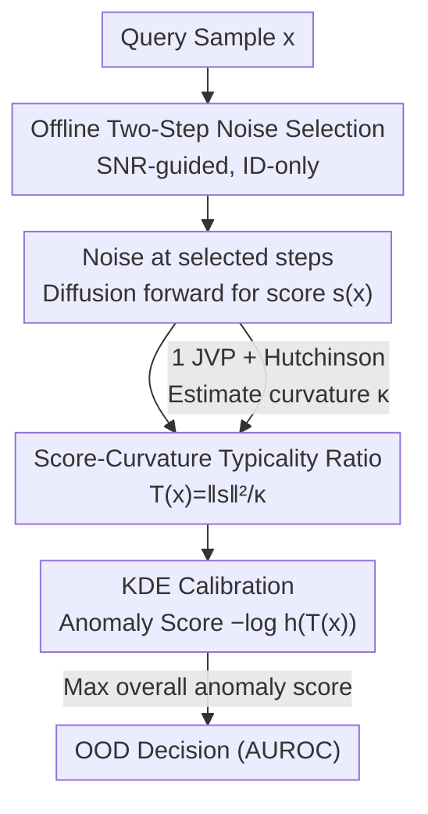

# SCOPED: Score–Curvature Out-of-Distribution Proximity Evaluator for Diffusion

**Conference**: ICLR 2026  
**OpenReview**: [https://openreview.net/forum?id=TMLiG9Rk2J](https://openreview.net/forum?id=TMLiG9Rk2J)  
**Code**: https://github.com/CLeARoboticsLab/SCOPED  
**Area**: AI Safety / OOD Detection / Diffusion Models  
**Keywords**: OOD Detection, Diffusion Models, Score Function, Curvature, Typical Set, Information Geometry

## TL;DR
SCOPED combines the "squared norm / Jacobian trace (curvature)" of the diffusion model score function into a single statistic $T(x)$ to determine whether a sample is in-distribution. By utilizing the Hutchinson estimator to compress curvature into a single JVP, it approximates the accuracy of the strongest diffusion-based OOD methods with only 1–2 forward evaluations, requiring an order of magnitude fewer model evaluations than methods relying on complete denoising trajectories.

## Background & Motivation
**Background**: Out-of-Distribution (OOD) detection is a prerequisite for the safe deployment of machine learning systems in real-world scenarios such as vision, robotics, and reinforcement learning. Models often provide high-confidence predictions for anomalous or irrelevant inputs, posing safety risks. Unsupervised methods are highly favored as they only require in-distribution data, and generative models—specifically diffusion models—are naturally suited for characterizing data distributions, making them mainstream tools for OOD detection.

**Limitations of Prior Work**: Likelihood-based methods suffer from well-known pathological phenomena where they assign higher likelihoods to OOD datasets than to the training set. Reconstruction-based autoencoders or diffusion reconstruction methods rely heavily on carefully tuned information bottlenecks, making them fragile in practice. Newer diffusion methods based on trajectory geometry (e.g., DiffPath) require repeated model evaluations along the entire denoising path, which is computationally expensive. These methods generally require 10–1000 model calls, which is a significant drawback for real-time or resource-constrained applications.

**Key Challenge**: There is a trade-off between accuracy and computational cost. Trajectory-based methods are expensive because they perform sequential integration of the probability flow ODE; each step depends on the previous one, meaning the number of steps cannot be easily reduced or parallelized. Consequently, the cost grows linearly with trajectory length.

**Goal**: To design a diffusion-based OOD detector that is both accurate and fast, reducing the number of model evaluations by an order of magnitude while ensuring that the evaluations are mutually independent and fully parallelizable.

**Key Insight**: The authors leverage a fundamental intuition from information geometry: near the "typical set" of a distribution (i.e., in-distribution samples), the local curvature of the log-probability density is correlated with the norm of the score function. Since diffusion models directly learn the score $s_\theta(x_t,t)\approx\nabla_x\log p_t(x_t)$, curvature information can be efficiently obtained via a single Jacobian-Vector Product (JVP).

**Core Idea**: Use the "score norm² / curvature" ratio $T(x)$ as a measure of typicality. This ratio is identity on the typical set ($T(x) \approx 1$) and deviates significantly otherwise. This transforms the abstract information-theoretic concept of a "typical set" into a practical OOD criterion that can be computed by a diffusion model in a single pass.

## Method

### Overall Architecture
The goal of SCOPED is to output an anomaly score representing "how OOD" an arbitrary query sample $x$ is, given a diffusion model pre-trained on diverse data. The pipeline consists of offline and online stages. Offline stage: Use in-distribution (ID) data to estimate the Signal-to-Noise Ratio (SNR) of the forward diffusion to select noise steps for detection (visual tasks use $t=1$ and $t=300$). For these steps, fit a Kernel Density Estimation (KDE) to the $T(x)$ values of the ID data. Online stage: Add noise to the test sample at the selected steps, pass it through the diffusion model to obtain the score $s$, and perform one JVP to obtain the curvature $\kappa$. Compute the statistic $T(x)$ and use the negative log-likelihood $-\log h(T(x))$ from the KDE as the anomaly score. The final criterion is the maximum of the anomaly scores from the two steps.

The key to the process is that the typicality ratio $T(x)$ provides the raw signal, but since it is not comparable across different datasets, noise steps, or models, KDE is used to "calibrate" it into a comparable anomaly score. The flow from input to anomaly score is shown below.

### Key Designs

**1. Score–Curvature Typicality Ratio: Encoding Typical Set Inclusion as a Scalar**

The fundamental difficulty of OOD detection is that "in-distribution" lacks a clear definition. The authors anchor this using the typical set from information theory: high-dimensional probability mass is not concentrated at the mode (highest density) but on a thin shell satisfied by $-\log p(x)=H(p)$ (the Gaussian Annulus Theorem). This explains why likelihood-based methods fail (high-density points may fall outside the shell and thus be atypical). Defining the score $s(x):=-\nabla_x\log p(x)$ and local curvature $\kappa(x):=\mathrm{Tr}(\nabla_x s(x))=-\mathrm{Tr}(\nabla_x^2\log p(x))$, the classical Fisher Information identity $\mathbb{E}_p[\mathrm{Tr}(\nabla_x s(x))]=\mathbb{E}_p[\lVert s(x)\rVert^2]$ holds for in-distribution samples. Thus, the expected score norm matches the expected curvature. The statistic is constructed as:

$$T(x)=\frac{\lVert s(x)\rVert^2}{\kappa(x)}.$$

The intuition is that nearly all mass of a high-dimensional distribution falls on typical samples where $-\log p(x)\approx H(p)$, resulting in $T(x)\approx 1$. Taking an isotropic Gaussian $x\sim\mathcal{N}(0,\sigma^2 I_d)$ as an example, $s(x)=x/\sigma^2$ and $\kappa(x)=d/\sigma^2$, thus $T(x)=\lVert x\rVert^2/(d\sigma^2)$. Since $\lVert x\rVert^2$ is sharply concentrated around $d\sigma^2$ in high dimensions, $T(x)$ stays close to 1 on the typical set, while samples far from the shell deviate significantly. A subtlety: the squared norm in the numerator loses the sign, while the Jacobian trace in the denominator preserves it, leading to a global sign ambiguity. The authors correct this with a global sign factor (Appendix D) and verify its necessity for stable visual OOD performance.

**2. Single JVP + Hutchinson Estimator: Curvature at the Cost of "One Extra Forward" pass**

Naively calculating the Jacobian trace $\mathrm{Tr}(\nabla_x s(x))$ is prohibitively expensive in high dimensions as it requires explicit construction of the Jacobian matrix. The authors use the Hutchinson stochastic trace estimator $\mathrm{Tr}(\nabla_x s)\approx\mathbb{E}_v[v^\top(\nabla_x s)v]$: using random projections $v$ to form an unbiased estimate, the cost scales linearly with dimension. Each probe requires only one JVP (Jacobian-Vector Product) on the score network, avoiding explicit Jacobian construction. In practice, a single probe is often sufficient, and averaging multiple probes further reduces variance. Since a JVP costs roughly as much as one forward pass ($1J\approx 1F$), computing SCOPED at a given noise step costs $1F+1J$. This is the core advantage over path-based methods like DiffPath, which require sequential integration with strong step dependencies; SCOPED probes independently at any noise step, avoiding full reconstruction of the denoising path, thus reducing evaluations by an order of magnitude and allowing full parallelism across samples and time steps.

**3. KDE Calibration: Mapping Raw $T(x)$ to Comparable Anomaly Scores**

While $T(x)$ measures typicality, its absolute value is not universal across datasets or noise steps—a fixed threshold is unreliable. Since ID samples are available during training, the authors compute $T(x)$ values for ID data and use Kernel Density Estimation (KDE) with Gaussian kernels to fit the ID statistic distribution $h$ without assuming a parametric form. The final anomaly score is defined as:

$$\text{score}(x)=-\log h\big(T(x)\big),$$

which is the negative log-likelihood of the test sample's $T(x)$ under the ID density. This step transforms "typicality" into a calibrated anomaly score with nearly zero extra online overhead.

**4. SNR-guided Offline Two-Step Noise Selection: ID-only and No OOD Tuning**

Selecting the right noise steps is crucial for balancing signal preservation against noise injection. The authors emphasize that step selection uses only ID data and avoids sweeping hyperparameters on OOD benchmarks (a key distinction from methods like DiffPath, which may suffer from evaluation leakage). For proprioceptive D4RL/DMC tasks, a single step at approximately 3/4 of the noise schedule makes $T(x)$ trivially separable. For visual tasks, the SNR of $p_t(x_t)$ is estimated offline (ID only). SNR decays monotonically with $t$; early steps preserve details, while late steps are noise-dominated. Two points are chosen: an early step ($t=1$) to maximize detail and a mid-step ($t=300$) where ~95% of the signal is preserved and SNR enters a near-linear decline, retaining coarse structure. The final score is the maximum of the anomaly scores from both.

### Loss & Training
SCOPED does not introduce new training losses; it reuses standard pre-trained diffusion models (the visual experiments use the same CelebA unconditional DDPM as the strongest baselines; RL experiments use EDM denoisers fitted for each task). All "learning" occurs during offline SNR estimation, noise step selection, and KDE fitting, all of which rely solely on ID data.

## Key Experimental Results

### Main Results (Vision AUROC, higher is better)
Cross-dataset evaluation on CIFAR-10, SVHN, CelebA, and CIFAR-100 benchmarks using an unconditional DDPM trained on CelebA. Computational cost is denoted as #F+#J (F = Forward, J = JVP).

| Method | Avg AUROC | Computation Cost | Note |
|------|-----------|----------|------|
| MSMA | 0.928 | 10F + 0J | Strong diffusion baseline |
| DiffPath | 0.918 | 10F + 0J | Path geometry, non-parallelizable |
| LMD | 0.868 | 104F + 0J | Diffusion reconstruction |
| DDPM-OOD | 0.742 | 350F + 0J | |
| NLL (Diffusion Likelihood) | 0.652 | 1000F + 0J | Likelihood pathologies |
| **SCOPED** | **0.892** | **2F + 2J** | Default two-step variant, parallelizable |
| SCOPED (Single) | 0.884 | 1F + 1J | Fixed single step $t=300$ |
| SCOPED (Oracle) | 0.944 | 1F + 1J | Upper bound with optimal step known |

SCOPED achieves an average AUROC close to MSMA/DiffPath (which require 10F–1000F) at the cost of only 2F+2J (or even 1F+1J). Because evaluations are independent, SCOPED is fully parallelizable, making its wall-clock time significantly lower than path-based methods.

### Ablation Study

| Configuration | Phenomenon | Note |
|------|------|------|
| Two-step vs. Single-step | Two-step is more robust | Max of early+mid steps is more stable across datasets; single step halves cost but loses robustness. |
| Early-Mid Step Pair Scan (Appx I) | Stable AUROC | AUROC remains high across various early-mid combinations, showing low sensitivity to specific step choices. |
| Mid-step Selection Scan (Appx H) | Low sensitivity | Performance remains stable as the mid-step value changes. |
| Sign Correction (Appx D/J) | Essential | Removing global sign correction degrades stable OOD performance in visual tasks. |

### Key Findings
- **More diverse training data is not always better**: On D4RL, detectors trained on the most diverse "medium-replay" buffers performed worst on Hopper/Walker. This is because termination conditions constrain random/partially-trained agents to narrow state spaces, while the buffer mixes noisy trajectories, making ID/OOD boundaries more entangled. Conversely, expert policies generate "broad yet coherent" coverage, sharpening the ID/OOD boundary. Visual intuitions about "broader is better" do not directly transfer to RL.
- **SCOPED is sensitive to subtle distribution differences**: In DMC, even task pairs with the same dynamics but different reward structures (e.g., reacher vs. finger-turn) are perfectly separated, indicating the statistic captures more than just reward differences.
- **Efficiency and robustness can coexist**: The authors demonstrate that the trade-off between accuracy and cost is not inevitable; geometric statistics themselves provide a strong signal.

## Highlights & Insights
- **Operationalizing the "Typical Set" via JVP**: The most elegant aspect is using the Fisher Information identity to transform abstract information-theoretic typicality into a scalar $T(x)\approx 1$ computable via one forward pass and one JVP.
- **Independent Probes = Parallelism**: Unlike the sequential integration of path methods, SCOPED is independent across both samples and time steps, maximizing modern accelerator utilization.
- **Honest "No OOD Tuning" Setup**: Noise steps are chosen entirely via ID data and SNR monotonicity, avoiding evaluation leakage seen in previous works that sweep on OOD benchmarks.
- **Cross-domain Transferability**: The same method works for both visual OOD and for identifying drifts in reward functions or training regimes in robotic control, making it one of the few diffusion-based OOD methods validated on RL benchmarks (D4RL, DMC).

## Limitations & Future Work
- **Dependency on Training Distribution**: The calibration effect depends heavily on the dataset used to train the diffusion model (which need not be the ID data). Separability in vision and some proprioceptive tasks is affected by the diversity and coverage of the training distribution.
- **JVP Doubles Nominal Cost**: Each evaluation is $1F+1J$ (~2 forwards), doubling the nominal cost per step compared to pure forward methods. The benefit relies heavily on parallelizability; performance gains might diminish in non-parallelizable deployment environments.
- **Weaker Performance on Specific Pairs**: In Table 1, SCOPED lags significantly behind the Oracle on pairs like C10 vs. SVHN (0.814) or C10 vs. C100 (0.477), suggesting that a fixed set of steps is not optimal for all OOD scenarios.
- **Future Directions**: Potential improvements include advanced noise step selection, integration with RL exploration strategies, or extension to autoregressive models and multimodal domains.

## Related Work & Insights
- **vs. DiffPath (Heng et al. 2024)**: Both use diffusion geometry for OOD, but DiffPath follows a full denoising trajectory via ODE integration (sequential). SCOPED probes noise steps independently, reducing evaluations by an order of magnitude and enabling full parallelism.
- **vs. Likelihood-based Methods (WAIC / Typicality / Likelihood Ratio)**: These suffer from likelihood pathologies (OOD having higher likelihood). SCOPED bypasses absolute likelihood values by using the ratio of score norm to curvature.
- **vs. Reconstruction-based (DDPM-OOD / LMD / Autoencoders)**: Reconstruction methods depend on fragile information bottlenecks and are expensive (hundreds to thousands of forwards). SCOPED uses local geometry instead of reconstruction.

## Rating
- Novelty: ⭐⭐⭐⭐⭐ Uses information geometry to anchor the score-curvature ratio to typicality, providing a concise and theoretically sound new statistic for diffusion-based OOD.
- Experimental Thoroughness: ⭐⭐⭐⭐ Validated across four vision benchmarks and RL (DMC/D4RL). Ablations cover noise steps and sign correction, though some dataset pairs show weaker results.
- Writing Quality: ⭐⭐⭐⭐⭐ Clear derivation from information-theoretic intuition to computable criteria; analysis of efficiency and settings is thorough.
- Value: ⭐⭐⭐⭐⭐ Approximates state-of-the-art accuracy with just $1F+1J$, making it highly practical for real-time and resource-constrained safety deployments.

<!-- RELATED:START -->

## Related Papers

- [\[ICLR 2026\] AP-OOD: Attention Pooling for Out-of-Distribution Detection](ap-ood_attention_pooling_for_out-of-distribution_detection.md)
- [\[ICLR 2026\] Optimal Transport-Induced Samples against Out-of-Distribution Overconfidence](optimal_transport-induced_samples_against_out-of-distribution_overconfidence.md)
- [\[ICLR 2026\] Dataless Weight Disentanglement in Task Arithmetic via Kronecker-Factored Approximate Curvature](dataless_weight_disentanglement_in_task_arithmetic_via_kronecker-factored_approx.md)
- [\[ICLR 2026\] GradPCA: Leveraging NTK Alignment for Reliable Out-of-Distribution Detection](gradpca_leveraging_ntk_alignment_for_reliable_out-of-distribution_detection.md)
- [\[CVPR 2026\] RankOOD: Class Ranking-based Out-of-Distribution Detection](../../CVPR2026/ai_safety/rankood_-_class_ranking-based_out-of-distribution_detection.md)

<!-- RELATED:END -->
