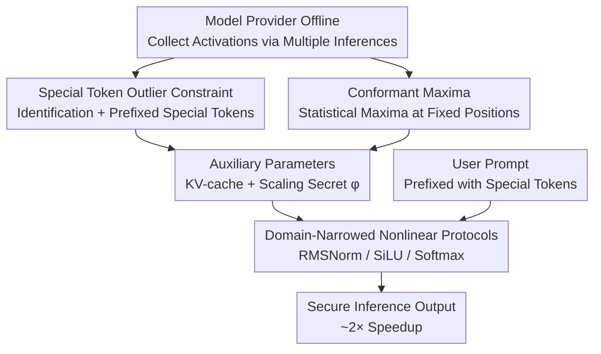

# Secure Outlier-Aware Large Language Model Inference

**Conference**: ICLR 2026  
**OpenReview**: [https://openreview.net/forum?id=Tmrjxq4d7w](https://openreview.net/forum?id=Tmrjxq4d7w)  
**Area**: AI Safety / Privacy-Preserving Inference / LLM Efficiency  
**Keywords**: Secure Multi-Party Computation, MPC, LLM Inference, Outliers, Nonlinear Protocols  

## TL;DR
This paper proposes the SOAL framework, identifying that "outlier activations" are prevalent in the nonlinear layers (Normalization, Activation, Softmax) of LLMs. By prefixing special tokens to the input to "confine" outliers to fixed positions and redesigning MPC nonlinear protocols for the narrowed input domains, the framework accelerates RMSNorm by ~2×, SiLU by ~2×, and Softmax by over 3×, achieving a nearly 2× overall speedup without model fine-tuning.

## Background & Motivation
**Background**: Secure Multi-Party Computation (MPC) allows users to perform LLM inference without exposing inputs and without the model provider exposing weights, serving as a core solution for cloud-based privacy-preserving inference. However, Transformer inference under MPC is extremely slow—running Llama2-7B with a 64-token input takes 169.76 seconds using CrypTen, and 512 tokens soar to 428.95 seconds, compared to less than 1 second in plaintext.

**Limitations of Prior Work**: The root cause of the slowness lies in the nonlinear layers (Softmax, SiLU/GeLU activations, LayerNorm/RMSNorm). The complexity of these protocols stems from the need to "ensure accuracy over a wide input domain": LLM activation values can span several orders of magnitude from $10^{-5}$ to $10^3$. Directly using Lookup Table (LUT) protocols requires a 32-bit width, with $O(2^n)$ complexity, which is prohibitively expensive; using iterative methods like Goldschmidt requires many iterations.

**Key Challenge**: Neither existing approach is ideal. One modifies cryptographic primitives (FSS, VOLE, etc.), which Addresses symptoms rather than causes; the other (MPCFormer, SecFormer) replaces nonlinear operators with MPC-friendly low-degree polynomials and retrains using knowledge distillation—this modifies model weights, introduces training overhead, and raises concerns about the reliability of the new model.

**Goal**: Can efficient nonlinear protocols for MPC LLM inference be designed directly without modifying the model or fine-tuning?

**Key Insight**: The authors draw inspiration from a key insight in quantization—Dettmers et al. found that LLM activations/weights exhibit a strong "skewed distribution": most values are crowded into a narrow range, with only a few "outliers" being significantly larger. Separately handling these outliers allows for replacing FP32 with FP8. This paper extends this observation from linear layers to **nonlinear layers**, discovering similar outlier phenomena in the inputs to normalization, activation, and Softmax, which are precisely what stretch the input domains that MPC protocols must cover.

**Core Idea**: If outliers can be "managed," the remaining skewed distribution of activations can be leveraged to narrow the input domain, enabling the design of faster protocols for nonlinear operators.

## Method

### Overall Architecture
SOAL targets standard two-party computation (2PC, with one trusted dealer): $P_0$ is the user with the input prompt, and $P_1$ is the model provider with the weights. The two must compute the output without leaking any intermediate information. The framework consists of two phases: The **Preparation Phase** is performed offline by the model provider, using outlier observations of nonlinear layers to extract "model-related auxiliary parameters"; the **Inference Phase** involves the user and the model provider running the redesigned MPC nonlinear protocols online, benefiting from the speedup brought by the narrowed input domains.

The core logic follows the chain of "Outlier → Domain Narrowing → Acceleration": the preparation phase first uses prefixed special tokens to constrain normalization/activation outliers to fixed positions (stored in KV-cache), then identifies statistical patterns of fixed positions for Softmax input maxima (Conformant Maxima). Both actions significantly narrow the input domain faced by each nonlinear operator in the online phase, allowing RMSNorm, SiLU, and Softmax to be computed with new protocols utilizing "fewer iterations + smaller LUTs."

### Key Designs

**1. Special Token Outlier Constraint: "Driving" Normalization/Activation Outliers to Prefixed Positions**

The pain point is the long tail of activation in normalization layers—a few outliers spanning several orders of magnitude force reciprocal square root protocols to cover a wide domain. The authors observe that these outliers are highly tied to "special tokens": in Llama2-7B, outliers align with tokens like `.` (period), `\n` (newline), and `<s>` (BOS). Identification is done by calculating the per-token maximum activation $M\in\mathbb{R}^T$ ($T$ is vocabulary size). If the ratio of a token's maximum to the median of all other tokens' maxima exceeds a threshold $\eta$ (set $M_i/\text{median}(M)>\eta$, with $\eta=8$), it is marked as a special token.

Once identified, these special tokens are **prefixed** to the user prompt. Due to the autoregressive nature of LLMs, outliers only appear at these prefixed positions and no longer pollute the activations of the user's actual tokens. Violin plots show that after prefixing, the long tails disappear across layers, and activations concentrate tightly. Furthermore, the computation of these prefix tokens can be saved as KV-cache for offline reuse; the entire identification process takes only minutes for the model provider, costing much less than fine-tuning the whole model for different tasks.

**2. Conformant Maxima: Replacing Exact Softmax Max with Local Maxima at Fixed Positions**

Softmax faces three obstacles in MPC—computing max, exp, and reciprocal—where **finding the maximum** is the most troublesome because its communication cost grows as $O(n\log n)$ with the actual input length $n$. The authors find that the positions of Softmax input maxima also follow patterns: heatmaps of $L\times L$ attention logits show that after prefixing special tokens, maxima concentrate at `<bos>`, the first token of each row, and the last two tokens—consistent with the "attention sink" phenomenon noted by StreamLLM.

From this, **Conformant Maxima** is defined: activations are collected only from these predefined positions (BOS, first, last two) and the local maximum is used as the "pseudo-maximum" $\tau$ subtracted in Softmax. Statistics show over 90% of architectural maxima fall within these positions; even when mismatched, the error is minimal. Since the subtracted max can mathematically be replaced by any value $\tau$, using Conformant Maxima eliminates the $O(n\log n)$ exact max computation, allowing the Softmax protocol to maintain **fixed communication costs and rounds** regardless of input length.

**3. Narrowly-Defined Nonlinear Protocols: Computing RMSNorm, SiLU, and Softmax via Fewer Iterations/Smaller LUTs**

Once outliers are managed, the three types of nonlinear operators can be rewritten into cheaper protocols. **RMSNorm**: After activations concentrate, a per-layer secret scaling value $\varphi$ further narrows the input domain (scaling factors cancel out in the division), rewriting $\text{RMSNorm}(x)$ as $\gamma\cdot\frac{\varphi_i\cdot x}{\sqrt{\frac{1}{F}\sum_j(\varphi_i x_j)^2+\epsilon}}+\beta$. With the narrowed domain, the reciprocal square root only needs a cubic polynomial centered at $x=1$ (coefficients fitted via BFGS+MSE: $a=0.913389,b=-0.860195,c=1.028723,d=-0.359165$) as an initial value, followed by **two** Newton-Raphson iterations—compared to 11 iterations for CrypTen to maintain precision.

**SiLU**: Rewrites sigmoid to base-2 as $\sigma(x)=\frac{2^{-x_i\cdot(1-\xi)}}{2^{-x_i(1-\xi)}+2^{x_f}\cdot 2^{x_i\xi}}$ (where $x_i,x_f$ are integer/fractional parts, $\xi=\mathbb{1}\{x<0\}$). The integer part uses a small LUT, and the denominator, falling within a narrow $(1,2.5)$ range, uses a quadratic polynomial for the initial reciprocal value, requiring only one NR iteration. **Softmax**: Coupled with Design 2's Conformant Maxima, it uses a new exponential protocol to handle positive/negative inputs (local truncation for integer/fractional parts, parties locally compute $2^{x_f}$ via product-of-powers, and $s$ extra bits let the small LUT cover a wider range) and narrows the reciprocal to a small domain using the denominator's most significant bit, solved with two NR iterations. These protocols are decoupled from specific cryptography and are compatible with both ASS and FSS.

### Loss & Training
SOAL **requires no fine-tuning or retraining**. It only adds a few special tokens before the user input and has the model provider prepare auxiliary parameters offline (special token list, KV-cache, scaling secret $\varphi$) without changing model weights. Polynomial coefficients (e.g., $a,b,c,d$ for reciprocal square root) are determined one-time offline via BFGS fitting with MSE loss.

## Key Experimental Results

### Main Results
Secure inference time and communication cost for a 512-token prompt (average of 5 runs), SOAL vs. CrypTen:

| Model | Method | Softmax Time (s) | Norm Time (s) | Activation Time (s) | Total Time (s) | Total Comm (GB) |
|------|------|------|------|------|------|------|
| GPT-2 | CrypTen | 30.79 | 3.07 | 10.89 | 48.86 | 76.79 |
| GPT-2 | **Ours (SOAL)** | **6.80** | 2.99 | 9.17 | **23.30** | **24.64** |
| Llama2-7B | CrypTen | 199.99 | 27.86 | 87.30 | 428.95 | 702.44 |
| Llama2-7B | **Ours (SOAL)** | **26.62** | **14.87** | **37.13** | **193.59** | **261.15** |
| Mixtral 8x7B | CrypTen | 242.98 | 65.86 | 264.52 | 1104.46 | 1611.20 |
| Mixtral 8x7B | **Ours (SOAL)** | **39.66** | **31.25** | **104.44** | **668.23** | **984.50** |

Softmax shows the most significant improvement (GPT-2 from 30.79→6.80s, over 4×), with an overall speedup of nearly 2×, being equally effective on the MoE-structured Mixtral. Under the FSS scheme (GPT-2, vs. Sigma):

| Tokens | Sigma Time (s) | SOAL Time (s) | Sigma KeySize (GB) | SOAL KeySize (GB) |
|--------|------|------|------|------|
| 512 | 10.048 | **7.577** | 86.686 | **61.830** |
| 1024 | 25.136 | **18.486** | 256.449 | **165.093** |

Under FSS, SOAL significantly compresses the key size transmitted per inference (1024-token from 256→165 GB) with shorter online times.

### Ablation Study
Accuracy evaluation (Llama2-7B, SOAL vs. Original model), verifying "no degradation":

| Metric | Origin | SOAL | Description |
|------|--------|------|------|
| Arc Challenge ↑ | 0.4334 | 0.4343 | Comparable |
| Arc Easy ↑ | 0.7635 | 0.7618 | Comparable |
| HellaSwag ↑ | 0.5713 | 0.5730 | Slight Increase |
| PIQA ↑ | 0.7807 | 0.7769 | Comparable |
| Winograde ↑ | 0.6938 | 0.6993 | Slight Increase |
| PPL (WikiText) ↓ | 5.55 | 5.58 | Almost Unchanged |

In cross-model perplexity (WikiText-2 / C4), the PPL for GPT-2, Llama2-7B, and Mixtral differs from the original models only by 0.02~1.25, indicating that prefix tokens hardly sacrifice quality.

### Key Findings
- **Softmax provides the greatest gain and scales with length**: Conformant Maxima reduces $O(n\log n)$ max computation to a fixed cost; longer sequences yield higher savings (Figure 7), which is the primary source of overall acceleration.
- **Zero degradation without fine-tuning**: By modifying only user input rather than model weights, scores on 5 downstream benchmarks and PPL remain comparable, avoiding the 1-2% degradation seen in MPCFormer/SecFormer.
- **RMSNorm speedup from "Domain Narrowing for Iteration Reduction"**: After the input domain is narrowed by special tokens + scaling secret $\varphi$, reciprocal square root iterations drop from 11 NR steps to 2.

## Highlights & Insights
- **Transferring Quantization Outlier Insights to MPC**: While LLM.int8/SmoothQuant used outliers for quantization, this paper is the first to systematically show that nonlinear layers also have outliers and that these are tied to special tokens, using this for "input domain reduction"—a natural yet previously unexplored cross-domain transfer.
- **"Prefix Special Tokens" as a Lightweight Lever**: Without changing weights, fine-tuning, and being compatible with KV-cache reuse, this simple method simultaneously addresses normalization/activation outliers and Softmax max computation issues, offering high cost-effectiveness.
- **Conformant Maxima turns Probabilistic Approximation into Deterministic Optimization**: By leveraging attention sinks to turn the data-dependent "find max" operation into a fixed-position lookup, the method maintains constant cost for any length, an idea transferable to other protocols requiring secure reduce/argmax operations.

## Limitations & Future Work
- The method depends on the empirical phenomenon of "outliers being strongly tied to special tokens," validated primarily on decoder-only Transformers (GPT-2/Llama2/Mixtral); the authors explicitly state that encoder-decoders like BERT do not exhibit this, making the method inapplicable.
- Thresholds ($\eta=8$) and polynomial coefficients are empirically fitted; switching to a new model requires the model provider to re-run offline statistics, which, while quick, remains a model-specific cost.
- Conformant Maxima only covers >90% of exact maximum positions; while the error from mismatches is small, whether it remains safe/accurate under extreme attention distributions lacks a worst-case analysis.
- Evaluations focus on efficiency, PPL, and common-sense benchmarks, lacking stress tests on longer generation and more complex tasks for the privacy-efficiency-quality trade-off.

## Related Work & Insights
- **vs. MPCFormer / SecFormer**: These replace nonlinearities with low-degree polynomials and knowledge distillation retraining, modifying weights and introducing training overhead/quality concerns. SOAL keeps weights unchanged, avoids fine-tuning, and only narrows input domains for redesigned protocols with zero accuracy loss.
- **vs. CrypTen / Sigma (Cryptographic Primitives)**: These works optimize underlying primitives or truncation protocols but still design nonlinear operators for the widest input domain. SOAL is orthogonal, starting from "narrowing the input domain first," and can be stacked atop different schemes like ASS (CrypTen) and FSS (Sigma).
- **vs. LLM.int8 / SmoothQuant (Outliers in Quantization)**: Both utilize the relationship between outliers and special tokens, but the goal shifts from "low-bit quantization" to "accelerating MPC nonlinear protocols."

## Rating
- Novelty: ⭐⭐⭐⭐⭐ First to connect nonlinear layer outlier phenomena with MPC protocol design; prefix tokens + Conformant Maxima are innovative.
- Experimental Thoroughness: ⭐⭐⭐⭐ Covers three models and two cryptographic schemes with both efficiency and accuracy evaluations, though lacks worst-case analysis and long generation stress tests.
- Writing Quality: ⭐⭐⭐⭐ Clear motivation chain and complete algorithms, though a few symbols (e.g., $v_1$ reuse) are slightly confusing.
- Value: ⭐⭐⭐⭐⭐ Achieving nearly 2× acceleration with zero degradation without fine-tuning is highly practical for the deployment of privacy-preserving LLMs.

<!-- RELATED:START -->

## Related Papers

- [\[ICML 2026\] Differentially Private Preference Data Synthesis for Large Language Model Alignment](../../ICML2026/ai_safety/differentially_private_preference_data_synthesis_for_large_language_model_alignm.md)
- [\[AAAI 2026\] SecMoE: Communication-Efficient Secure MoE Inference via Select-Then-Compute](../../AAAI2026/ai_safety/secmoe_communication-efficient_secure_moe_inference_via_select-then-compute.md)
- [\[ACL 2026\] On the (In-)Security of the Shuffling Defense in the Transformer Secure Inference](../../ACL2026/ai_safety/on_the_in-security_of_the_shuffling_defense_in_the_transformer_secure_inference.md)
- [\[ICML 2026\] Forget to Know, Remember to Use: Context-Aware Unlearning for Large Language Models](../../ICML2026/ai_safety/forget_to_know_remember_to_use_context-aware_unlearning_for_large_language_model.md)
- [\[ICML 2025\] SecEmb: Sparsity-Aware Secure Federated Learning of On-Device Recommender System with Large Embedding](../../ICML2025/ai_safety/secemb_sparsity-aware_secure_federated_learning_of_on-device_recommender_system_.md)

<!-- RELATED:END -->
