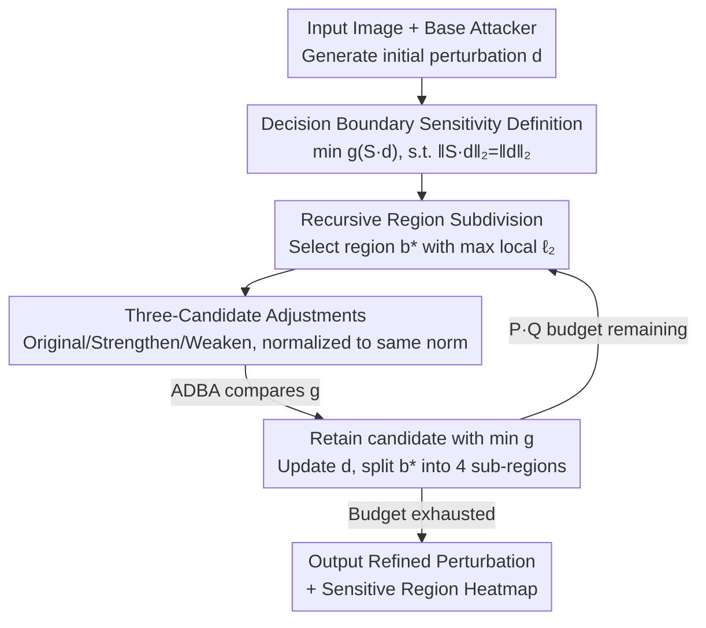

# SeRI: Gradient-Free Sensitive Region Identification in Decision-Based Black-Box Attacks

**Conference**: ICLR 2026  
**OpenReview**: [https://openreview.net/forum?id=OQOmOIIX9F](https://openreview.net/forum?id=OQOmOIIX9F)  
**Code**: https://github.com/BUPTAIOC/SeRI  
**Area**: AI Security / Adversarial Attacks / Decision-Based Black-Box Attacks  
**Keywords**: Decision-based black-box attacks, sensitive regions, continuous sensitivity, decision boundary, perturbation optimization

## TL;DR
In decision-based black-box attack scenarios where only top-1 labels are available under tight query budgets, SeRI proposes a continuous pixel sensitivity definition based on the "decision boundary." By utilizing recursive region subdivision and local perturbation adjustment to estimate sensitivity weights for each pixel, it serves as a plug-and-play perturbation optimizer. It further reduces $\ell_2$ perturbations of mainstream attacks such as HSJA, CGBA, RayS, and ADBA by approximately 15%~30% under identical query constraints.

## Background & Motivation

**Background**: Decision-based attacks represent the most stringent setting in adversarial robustness—attackers lack gradients, confidence scores, and proxy models. They only observe top-1 predicted labels, and query budgets are strictly limited. Under these constraints, the goal of mainstream methods (HSJA, CGBA, RayS, ADBA, etc.) is to minimize the $\ell_2$ (or $\ell_\infty$) norm of the perturbation while ensuring successful misclassification.

**Limitations of Prior Work**: Numerous studies indicate that concentrating perturbations on "sensitive regions" of an image (e.g., the head of an eagle) is far more efficient than uniform noise. However, identifying these regions under a decision-based setting is difficult. Current approaches follow two main paths: ① **Proxy Model/Transfer Route** (SGA, AoA, SRA): These use white-box explainability on proxy models to generate heatmaps, but ViT and ResNet often focus on different regions, causing proxy heatmaps to mismatch the target model's critical areas. ② **Decision-Based Estimation Route** (represented by PAR): This method deletes perturbations block-by-block and queries the model to label regions **binarily** as "sensitive/insensitive" based on hard labels.

**Key Challenge**: PAR’s binary keep/remove decision is too coarse. In reality, the response of different pixels to perturbations is **continuous** and varies in intensity. Perturbations should be weighted proportionally to sensitivity rather than being "either fully kept or fully removed." Furthermore, existing continuous sensitivity definitions (Occlusion, SRA, or PAR’s compression ratio $S_{\text{PAR}}$) only describe the local relationship between "local perturbation change → model output change." They fail to clarify **how local adjustments affect the global effectiveness of the total perturbation**, making them unsuitable as continuous scaling factors for smooth iterative refinement.

**Goal**: To provide a truly usable continuous, fine-grained sensitivity definition for decision-based settings and design a query-efficient method for pixel-wise adaptive perturbation optimization.

**Key Insight**: Since the ultimate goal of an attack is to reduce the decision boundary $g(d)$, sensitivity should be **directly defined by its impact on the decision boundary** rather than indirect metrics like confidence drop or compression ratios.

**Core Idea**: Define a pixel-level sensitivity tensor $S$ such that the transformed perturbation $S \cdot d$ minimizes the decision boundary $g(S \cdot d)$ while maintaining constant total energy. This high-dimensional optimization is then decomposed into a sequence of low-cost iterations: "select region → increase/decrease perturbation → compare decision boundaries" via recursive region subdivision.

## Method

### Overall Architecture

SeRI is not an independent attack but a **plug-and-play perturbation optimizer** applied after base attackers (HSJA, CGBA, RayS, or ADBA). The total query budget $Q$ is split by ratio $P$; $(1-P)\cdot Q$ is allocated to the base attacker to generate an initial successful perturbation $d$, while the remaining $P\cdot Q$ (set to $20\%$ in the paper) is used by SeRI to refine $d$.

The core of SeRI is a **recursive region subdivision loop**. Starting with the entire image as the initial region $b_0$, each round: selects the region $b^*$ with the largest local $\ell_2$ norm; constructs "strengthened" and "weakened" perturbation candidates for that region; utilizes a low-cost decision boundary approximation (ADBA) to determine which candidate minimizes $g$; and finally splits $b^*$ into four sub-regions for the next fine-grained iteration. This process pushes perturbations toward their optimal per-pixel sensitivity while keeping global $\ell_2$ energy constant. No gradients, confidence scores, or proxy models are required.

### Key Designs

**1. Decision Boundary-Based Continuous Sensitivity**

This is the foundation of the work, addressing the limitation that existing definitions do not link local changes to global effectiveness. Given an initial successful perturbation $d$ (i.e., $I(x+d)=1$), SeRI defines sensitivity as a tensor $S \in \mathbb{R}^{C\times W\times H}$ where each element $s_{c,w,h}\ge 0$ is a sensitivity weight. The optimization goal is to find $S\cdot d$ that minimizes the decision boundary while **maintaining total energy**:

$$\arg\min_{S}\; g(S\cdot d),\quad \text{s.t.}\; \|S\cdot d\|_2 = \|d\|_2.$$

The decision boundary is defined as $g(d) = \min\{r>0 : I(x + r\cdot \frac{d}{\|d\|_2}) = 1\}$, the minimum radius required for a successful attack along direction $d$. This definition directly measures **pixel importance via its impact on the decision boundary**—allocating more energy to pixels that effectively lower $g$ while reclaiming energy from background pixels.

**2. Recursive Region Subdivision + Local $\ell_2$ Heuristic Selection**

Optimizing $S$ directly in $\mathbb{R}^{C\times W\times H}$ is a high-dimensional continuous problem. SeRI manages complexity via **iterative region splitting**. It maintains a set of non-overlapping blocks $B_i$. Each round, it adjusts perturbations within a **single block** and kemudian splits it into four sub-regions, allowing the control granularity to become increasingly fine.

Selection heuristic: Choose the block with the largest local $\ell_2$ norm $b^* = \arg\max_{b\in B_i}\|d^i_{[b]}\|_2$. The intuition is that regions with larger perturbations have higher potential for "reclaiming" energy to be redistributed elsewhere.

**3. Three-Candidate Adjustments + ADBA Comparison**

To determine whether a region $b^*$ should have its perturbation increased or decreased, SeRI constructs three candidates: original $d^i_0=d^i$, weakened $d^i_1$ (per-region factor $\check k < 1$), and strengthened $d^i_2$ (factor $\hat k > 1$). All are re-normalized to the original $\ell_2$ norm:

$$d^i_1 = \frac{\|d^i\|_2}{\|d^i+(\check k-1)d^i\odot M_{b^*}\|_2}\big(d^i+(\check k-1)d^i\odot M_{b^*}\big).$$

The paper uses $\check k=0.2$ and $\hat k=1.8$. It then picks $j^\star=\arg\min_{j\in\{0,1,2\}} g(d^i_j)$. Using ADBA allows comparing decision boundaries with extremely few queries (approx. 4 queries per iteration). The paper proves this strategy ensures the decision boundary distance **monotonically decreases**.

## Key Experimental Results

### Main Results

Evaluated on ImageNet (VGG19, ViT) and CIFAR-100 (Adversarially Trained WideResNet). 1,000 images per model. Median $\ell_2$ perturbation norm is reported (lower is better).

**ImageNet + VGG19 (Partial)**:

| Configuration | Untargeted@2k | Untargeted@10k | Targeted@2k | Targeted@10k |
|---------------|---------------|----------------|-------------|--------------|
| HSJA          | 8.18 (5.29)   | 3.39 (1.91)    | 72.3 (66.5) | 33.7 (20.8)  |
| HSJA+PAR      | 6.65 (3.61)   | 3.08 (1.82)    | 53.0 (50.1) | 20.4 (14.0)  |
| HSJA+SeRI     | 6.47 (3.55)   | 2.85 (1.51)    | **48.3 (46.5)** | **18.5 (12.3)** |
| CGBA          | 3.91 (2.02)   | 1.19 (0.75)    | 77.4 (74.9) | 40.2 (33.1)  |
| CGBA+PAR      | 2.81 (1.55)   | 1.03 (0.64)    | 58.3 (55.1) | 23.1 (15.6)  |
| CGBA+SeRI     | 2.92 (1.39)   | **0.96 (0.54)**| **53.0 (50.0)** | **21.1 (13.3)** |

### Ablation Study (CIFAR-100 WRN, Adversarially Trained)

| Configuration (Untargeted) | @2k | @5k | @10k |
|------|------|------|------|
| HSJA | 3.26 (2.22) | 1.75 (1.15) | 1.26 (0.88) |
| HSJA+PAR | 2.59 (1.74) | 1.52 (0.79) | 1.18 (0.83) |
| HSJA+SeRI | 2.08 (1.41) | 1.40 (0.70) | 1.13 (0.63) |
| RayS | 3.17 (2.22) | 2.68 (1.84) | 2.49 (1.69) |
| RayS+SeRI | **1.79 (1.28)** | **1.55 (1.08)** | **1.44 (1.01)** |

### Key Findings
- **Superiority of "Attacker + SeRI"**: In almost all settings, adding SeRI outperforms standalone attackers and the "+PAR" versions.
- **Higher Gains on Adversarially Trained Models**: On CIFAR-100 WRN, "+SeRI" reduces $\ell_2$ by ~30% compared to "+PAR" (vs. ~15% on standard models). Stronger defenses require more precise perturbation distribution, where SeRI's fine-grained search excels.
- **Interpretable Heatmaps**: Across iterations, high-intensity regions converge on salient objects (e.g., eagle head), while background regions are suppressed, aligning with human visual perception.

## Highlights & Insights
- **Anchoring Sensitivity to Attack Goal**: Most explainability metrics explain "why the model predicts a label," but attacks care about "which pixels reduce the decision boundary." Using $g(S \cdot d)$ as the target aligns the sensitivity definition with the attack objective.
- **Energy Conservation Comparison**: Re-normalizing candidates to the same $\ell_2$ norm ensures a "fair energy" comparison. It asks "where should energy be moved" rather than just increasing perturbation, ensuring true redistribution.
- **Efficiency**: The recursive 4-split + local $\ell_2$ heuristic transforms a high-dimensional continuous optimization into a search requiring only ~4 queries per round, with guaranteed monotonic descent.

## Limitations & Future Work
- **Dependency on Stable Label Outputs**: Inherits the deterministic assumption of ADBA, meaning it is not directly applicable to randomized defenses (e.g., randomized smoothing).
- **Limited Gains on Weak Saliency Layouts**: In cluttered or texture-dominated scenes, region-based sensitivity information is sparse, leading to smaller improvements.
- **Extension beyond Classification**: While currently for classification, the principle could be extended to detection/segmentation by modifying the boundary comparison logic.

## Related Work & Insights
- **vs. PAR**: Both are decision-based region optimizers. However, PAR uses binary keep/remove logic, which is coarse and lacks continuous weighting. SeRI's continuous pixel-level sensitivity consistently wins, especially on robust models.
- **vs. Proxy/Transfer Routes**: SGA/AoA rely on white-box proxies or shared datasets. SeRI works entirely on hard labels without external models.
- **vs. HardBeat**: HardBeat searches for a single fragile patch; SeRI optimizes the whole image via recursive subdivision, providing a more global solution.

## Rating
- Novelty: ⭐⭐⭐⭐⭐ 
- Experimental Thoroughness: ⭐⭐⭐⭐ 
- Writing Quality: ⭐⭐⭐⭐ 
- Value: ⭐⭐⭐⭐ 

<!-- RELATED:START -->

## Related Papers

- [\[ICLR 2026\] A General Framework for Black-Box Attacks Under Cost Asymmetry](a_general_framework_for_black-box_attacks_under_cost_asymmetry.md)
- [\[ICLR 2026\] Traceable Black-box Watermarks for Federated Learning](traceable_black-box_watermarks_for_federated_learning.md)
- [\[ICLR 2026\] Black-Box Privacy Attacks on Shared Representations in Multitask Learning](black-box_privacy_attacks_on_shared_representations_in_multitask_learning.md)
- [\[AAAI 2026\] Robust Watermarking on Gradient Boosting Decision Trees](../../AAAI2026/ai_safety/robust_watermarking_on_gradient_boosting_decision_trees.md)
- [\[CVPR 2026\] SEBA: Sample-Efficient Black-Box Attacks on Visual Reinforcement Learning](../../CVPR2026/ai_safety/seba_sample-efficient_black-box_attacks_on_visual_reinforcement_learning.md)

<!-- RELATED:END -->
## Related Papers

- [\[ICLR 2026\] A General Framework for Black-Box Attacks Under Cost Asymmetry](a_general_framework_for_black-box_attacks_under_cost_asymmetry.md)
- [\[ICLR 2026\] Black-Box Privacy Attacks on Shared Representations in Multitask Learning](black-box_privacy_attacks_on_shared_representations_in_multitask_learning.md)
- [\[ICLR 2026\] Traceable Black-box Watermarks for Federated Learning](traceable_black-box_watermarks_for_federated_learning.md)
- [\[AAAI 2026\] Robust Watermarking on Gradient Boosting Decision Trees](../../AAAI2026/ai_safety/robust_watermarking_on_gradient_boosting_decision_trees.md)
- [\[CVPR 2026\] SEBA: Sample-Efficient Black-Box Attacks on Visual Reinforcement Learning](../../CVPR2026/ai_safety/seba_sample-efficient_black-box_attacks_on_visual_reinforcement_learning.md)

<!-- RELATED:END -->
