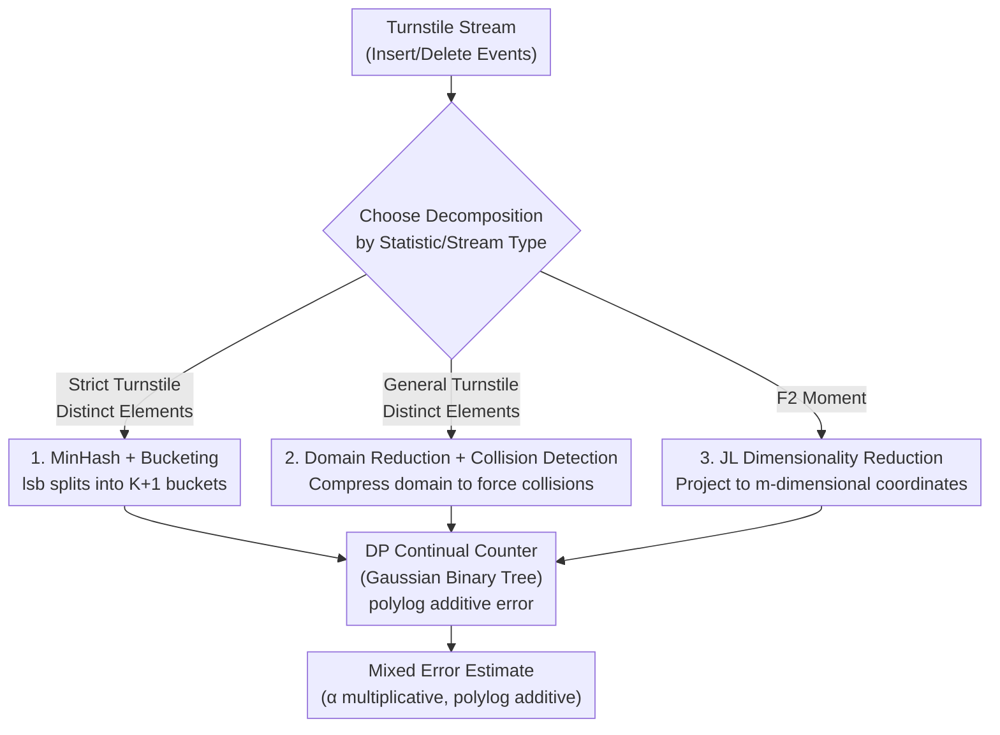

# Skirting Additive Error Barriers for Private Turnstile Streams

**Conference**: ICLR 2026  
**arXiv**: [2602.10360](https://arxiv.org/abs/2602.10360)  
**Code**: None  
**Area**: Differential Privacy / Streaming Algorithms  
**Keywords**: differential privacy, continual release, turnstile stream, distinct elements, F2 moment

## TL;DR

Proves that polynomial pure additive error lower bounds in differentially private turnstile streams (Distinct Elements $\Omega(T^{1/4})$, $F_2$ moment $\Omega(T)$) can be bypassed by introducing multiplicative error—achieving $(\text{polylog}(T), \text{polylog}(T))$ mixed error for Distinct Elements and $(1+\eta, \text{polylog}(T))$ mixed error for $F_2$ moment, both with polylogarithmic space.

## Background & Motivation

**Background**: Differential privacy (DP) continual release is a core model for private data processing—data arrives sequentially in a stream, and the algorithm must privately release the underlying statistics at each time step. The turnstile model, which allows both insertions and deletions, is significantly more challenging than insertion-only streams. Two fundamental streaming statistics—distinct element counting and $F_2$ moment estimation—are classic core problems in the field of streaming algorithms.

**Limitations of Prior Work**: In the private continual release setting for turnstile streams, even without space constraints, a polynomial gap exists between known upper and lower bounds for these problems. The best pure additive error upper bound for distinct elements is $\tilde{O}(T^{1/3})$, while the lower bound is $\Omega(T^{1/4})$; closing this gap remains a difficult open problem. The situation for the $F_2$ moment is worse—based on sensitivity alone, any pure additive error algorithm must suffer $\Omega(T)$ error. These polynomial-scale unavoidable errors severely limit practical applications.

**Key Challenge**: While these lower bounds appear insurmountable, a careful analysis of the lower bound construction instances reveals that when the lower bound holds, the true value of the statistic is much larger than the additive error. Specifically, the $\Omega(T^{1/4})$ bound occurs in scenarios where the number of distinct elements far exceeds $T^{1/4}$, meaning the bound does not obstruct obtaining a constant multiplicative approximation.

**Key Insight**: Introduce an $(\alpha, \beta)$ mixed error model—allowing for both a multiplicative error $\alpha$ and an additive error $\beta$. When the true value $Y_t \gg \beta$, the output is essentially an $\alpha$-approximate multiplicative approximation; when $Y_t$ is small (below the noise floor), a larger relative error is accepted. This relaxation is natural in non-private sublinear space streaming algorithms (where multiplicative error is already unavoidable) and is thus equally meaningful in private settings.

**Core Idea**: Polynomial pure additive error can be replaced by polylogarithmic additive error at the cost of introducing some multiplicative error.

## Method

### Overall Architecture

The paper addresses the same engineering challenge across two classic statistics: privately and continually estimating distinct elements and $F_2$ moments on turnstile streams (allowing insertions and deletions) without being trapped by polynomial pure additive error lower bounds. The unified approach treats **DP continual counting** as a reliable building block—which incurs only $O(\log^{1.5}(T))$ polylogarithmic additive error—and uses three classic streaming techniques (MinHash, domain reduction, and Johnson-Lindenstrauss projection) to carefully decompose "hard statistics" into several "easy counting" sub-problems. As long as each sub-problem can be handled by a continual counter, the overall system inherits the counter's small additive error, naturally bypassing polynomial error at the cost of multiplicative error introduced during decomposition.

The privacy mechanism supporting this building block is the Gaussian Binary Tree Mechanism under zero-concentrated differential privacy (zCDP). Continual counters use binary tree structures to aggregate prefix sums and inject Gaussian noise. Applying zCDP-to-DP conversion ensures $(\varepsilon, \delta)$-DP (where $\rho = O(\varepsilon^2/\log(1/\delta))$), offering tighter composition than standard DP, which is a prerequisite for these three algorithms to reduce layers without exhausting the privacy budget. The three designs below correspond to the three decomposition methods: MinHash bucketing for distinct elements in strict turnstile streams, domain reduction for distinct elements in general turnstile streams, and JL dimension reduction for the $F_2$ moment.

### Key Designs

**1. MinHash + Bucketing: Replacing high-sensitivity "min-hash values" with low-sensitivity counters (Theorem 3.1, Strict Turnstile Streams)**

Classic MinHash estimators use $1/(\min h)$ to estimate distinct elements, but this fails in private settings because the minimum hash value can jump frequently with a single insertion/deletion, leading to high sensitivity that destroys the estimate after noise injection. This approach bypasses the "minimum" operation: select a hash function $h: [n] \to [n]$ and distribute elements into $K+1$ buckets according to their least significant non-zero bit $\texttt{lsb}(h(a))$. The probability of $\texttt{lsb}=k$ is $2^{-(k+1)}$, so the expected number of distinct elements in bucket $k$ decreases geometrically with $2^{-(k+1)} \cdot D_t$. Each bucket is assigned a DP continual counter $C[k]$, yielding an estimate $\hat{f}_t[k]$ with additive error $\tau = O(\log^{1.5}(T)/\sqrt{\rho})$. While the non-private version reports $\hat{D}=2^\ell$ for the largest non-empty bucket $\ell$, the private version finds the largest bucket where the count exceeds the noise threshold $\tau$. The crucial multiplicative error arises here: when a bucket's count is high, it is impossible to distinguish between "having $\tau$ elements with frequency 1" and "having a single high-frequency element." This ambiguity introduces an $O(\tau)$ multiplicative error. The final error is $(O(\log^2(T)/\sqrt{\rho}), O(\log^2(T)/\sqrt{\rho}))$ with $O(\log n \cdot \log^2(T))$ space. The trade-off is that it only applies to strict turnstile streams (where frequencies remain non-negative).

**2. Domain Reduction + Collision Detection: Extending to general turnstile streams and enabling reduction to constant multiplicative factors (Theorem 4.1 / 4.2, General Turnstile Streams)**

MinHash's lsb bucketing depends on non-negative frequencies and fails if negative frequencies are allowed. Domain reduction provides an alternative structure: use hashing to compress the domain $[n]$ into a sufficiently small space, forcing many elements to collide. A continual counter is then assigned to each bucket in the reduced domain, and the number of distinct elements is inferred from the occupancy in the reduced domain. This works for general turnstile streams (allowing negative frequencies) but has lower accuracy—errors are $(O(\log^{10}(T)/\rho^2), O(\log^{10}(T)/\rho^2))$. Its true value lies in the accompanying reduction in Theorem 4.2: any algorithm capable of achieving sublinear pure additive error $n^{0.99}$ on a domain of size $n$ can be transformed into a $(1+\eta)$ multiplicative, $\text{polylog}(T)$ additive error algorithm. This converts the goal of "improving multiplicative factors to constant levels" into the specific problem of "finding an $n^{0.99}$ pure additive error algorithm," which can be used to improve upper bounds or as a tool to prove $\Omega(n)$ pure additive lower bounds.

**3. JL Projection: Compressing $F_2$ with $\Omega(T)$ sensitivity into low-dimensional low-sensitivity counters (Theorem 5.1)**

The issue with the $F_2$ moment is that sensitivity itself is $\Omega(T)$: a single event can change the squared $\ell_2$ norm of the frequency vector by $T$, so any pure additive error algorithm must face $\Omega(T)$. This method uses Johnson-Lindenstrauss (JL) dimensionality reduction to project the $n$-dimensional frequency vector $x_t \in \mathbb{R}^n$ into $m$ dimensions ($m = O(\log(T)/\eta^2)$). The JL norm-preservation property ensures $(1-\eta)\|x_t\|_2^2 \leq \|Ax_t\|_2^2 \leq (1+\eta)\|x_t\|_2^2$. Continuous counters are then attached to each projected coordinate, and the sum of squares is used as the $F_2$ estimate. Selecting a Rademacher random matrix (elements $\pm 1/\sqrt{m}$) is effective because each stream update affects only one domain element $a_i$, making the increment to each coordinate exactly $\pm s_i/\sqrt{m}$, which can be fed directly to a counter. Here, dimensionality reduction serves a dual purpose: it preserves the $\ell_2$ norm (ensuring $(1+\eta)$ multiplicative approximation) and reduces the sensitivity of each coordinate from $\Omega(T)$ to $O(1/\sqrt{m})$, making polylog additive error counters viable again. The total error is $(1+\eta, O(\text{polylog}(T)/(\varepsilon^2\eta^3)))$ with $O(\text{polylog}(T)/\eta^2)$ space, improving the $\tilde{O}(\log^7(T))$ additive error of Epasto et al. for insertion-only streams to $O(\log^4(T))$ and generalizing it to turnstile streams.

## Key Experimental Results

### Comparison of Theoretical Results for Distinct Elements

| Source | Error $(\alpha, \beta)$ | Space | Privacy Level | Remarks |
|------|----------------------|------|---------|------|
| Jain et al. '23 Upper | $(1, \tilde{O}(T^{1/3}))$ | $O(T)$ | Item-level | Based on re-computation |
| Jain et al. '23 Lower | $(1, \Omega(T^{1/4}))$ | — | Event-level | Pure additive lower bound |
| Epasto et al. '23 | $(1+\eta, O_\eta(\log^2 T))$ | polylog$(T)$ | Event-level | **Insertion-only** |
| **MinHash (Thm 3.1)** | $(O(\log^2 T), O(\log^2 T))$ | $O(\log^3 T)$ | Event-level | **Strict Turnstile** |
| **Domain Red. (Thm 4.1)** | $(O(\log^{10} T), O(\log^{10} T))$ | poly$(T)$ | Event-level | **General Turnstile** |

Core Conclusion: Reduces pure additive error from $\Omega(T^{1/4})$ (polynomial) to $\text{polylog}(T)$ (polylogarithmic) at the cost of introducing $\text{polylog}(T)$ multiplicative error. When the true number of distinct elements exceeds $\tilde{O}(T^{1/3})$, these results strictly outperform prior upper bounds.

### Comparison of Theoretical Results for $F_2$ Moment

| Source | Error $(\alpha, \beta)$ | Space | Remarks |
|------|----------------------|------|------|
| Sensitivity Bound | $(1, \Omega(T))$ | — | Pure additive error unavoidable |
| Epasto et al. '23 | $(1+\eta, \tilde{O}_\eta(\log^7 T))$ | $O_\eta(\log^2 T)$ | **Insertion-only** |
| **Theorem 5.1** | $(1+\eta, \tilde{O}_\eta(\log^4 T))$ | $O_\eta(\log^2 T)$ | **General Turnstile** |

Reduces additive error from $\Omega(T)$ to $\text{polylog}(T)$ for a cost of only a $(1+\eta)$ multiplicative factor. Compared to Epasto et al., additive error improved from $\log^7(T)$ to $\log^4(T)$ and generalized from insertion-only to turnstile streams.

### Key Findings

- **"Blind Spot" of Lower Bound Construction**: In the instances constructing the $\Omega(T^{1/4})$ additive lower bound, the true number of distinct elements is much larger than $T^{1/4}$, which is why it does not block multiplicative approximation—the core observation of the paper.
- **Identified Source of MinHash Multiplicative Error**: The $O(\tau)$ multiplicative error stems from the inability to distinguish between "multiple low-frequency elements" and "a single high-frequency element" falling into the same bucket. This identifies the technical bottleneck for improving the multiplicative factor to a constant level.
- **Significance of Theorem 4.2 Reduction**: Proves that algorithms with $n^{0.99}$ pure additive error can be converted to $(1+\eta)$ multiplicative + polylog additive error algorithms—usable both for improving upper bounds and for proving $\Omega(n)$ pure additive error lower bounds.

## Highlights & Insights

- **Paradigm shift of "Bypassing" vs. "Breaking" Lower Bounds**: Instead of trying to improve additive error within the lower bound framework, the approach switches to a mixed error model where the lower bound no longer applies—a strategy becoming increasingly common in DP (Aamand et al., Ghazi et al.), which this paper systematically demonstrates for streaming.
- **Continual Counting as a Universal Primitive**: All three algorithms reduce complex streaming statistics to multiple continual counting instances, leveraging the $O(\log^{1.5}(T))$ additive error of the Binary Tree Mechanism. This pattern of "reducing to counting first, then utilizing small counter error" may apply to more private streaming problems.
- **Elegant Application of JL Projection in Private Streams**: The $\Omega(T)$ sensitivity of the $F_2$ moment is unavoidable in the original space, but JL projection reduces the sensitivity of each coordinate to $O(1/\sqrt{m})$, enabling continual counters to function effectively—dimensionality reduction essentially doubles as sensitivity reduction.

## Limitations & Future Work

- **Multiplicative Factor Not Constant**: MinHash's multiplicative error is $O(\log^2 T)$, which is still significantly higher than the $(1+\eta)$ constant factor needed for practical applications. The paper identifies the bottleneck as bucket ambiguity caused by high-frequency elements; solving this is a major open problem.
- **Limited to event-level privacy**: Concurrent work (Aryanfard et al.) proves that under item-level privacy, the product of multiplicative and additive error $\alpha\beta$ must be of the order $T^{1/3}$—thus these results cannot extend to the stronger item-level setting.
- **Non-optimal Space for Domain Reduction**: Theorem 4.1 uses poly$(T)$ space, which is much worse than MinHash's polylog space, and the error exponent ($\log^{10}$) is considerably higher.
- **Lack of Experimental Validation**: As a purely theoretical work, there is no verification of the algorithms' actual performance on real-world data streams.

## Related Work & Insights

- **vs. Jain et al. (NeurIPS '23)**: Proved the $\Omega(T^{1/4})$ pure additive lower bound. This paper's core contribution is showing this bound can be bypassed via mixed error rather than improved within the pure additive framework.
- **vs. Epasto et al. (2023)**: Achieved $(1+\eta, O(\log^2 T))$ error on insertion-only streams. This paper generalizes similar results to the much harder turnstile stream and improves $F_2$ from $\log^7$ to $\log^4$.
- **vs. Cummings et al. (2025)**: Used multiplicative error for polylog space, but additive error remained polynomial $T^{1/3}$. This paper is the first to achieve polylog for both additive and multiplicative error simultaneously.
- **Concurrent Work (Aryanfard et al., Andersson et al., Epasto et al.)**: Studies graph problem extensions of mixed error, constant factor improvements, and space lower bounds, respectively, complementing rather than overlapping with this work.

## Rating

- Novelty: ⭐⭐⭐⭐ The "bypassing" strategy is insightful; the combination of MinHash and JL projection in private streams is clever.
- Experimental Thoroughness: ⭐⭐ Purely theoretical without experiments, though theoretical results cover both DE and $F_2$ comprehensively.
- Writing Quality: ⭐⭐⭐⭐ Clear motivation, well-organized comparison tables, and localized discussion of open problems.
- Value: ⭐⭐⭐⭐ Advances the theoretical boundaries of private streaming; the mixed error framework is inspiring for other problems.

<!-- RELATED:START -->

## Related Papers

- [\[ICML 2025\] Breaking the n^{1.5} Additive Error Barrier for Private and Efficient Graph Sparsification](../../ICML2025/ai_safety/breaking_the_n15_additive_error_barrier_for_private_and_efficient_graph_sparsifi.md)
- [\[ICLR 2026\] Back to Square Roots: An Optimal Bound on the Matrix Factorization Error for Multi-Epoch Differentially Private SGD](back_to_square_roots_an_optimal_bound_on_the_matrix_factorization_error_for_mult.md)
- [\[ICML 2026\] LAPRAS: Learning-Augmented PRivate Answering for Linear Query Streams](../../ICML2026/ai_safety/lapras_learning-augmented_private_answering_for_linear_query_streams.md)
- [\[NeurIPS 2025\] Private Continual Counting of Unbounded Streams](../../NeurIPS2025/ai_safety/private_continual_counting_of_unbounded_streams.md)
- [\[ICLR 2026\] Private Rate-Constrained Optimization with Applications to Fair Learning](private_rate-constrained_optimization_with_applications_to_fair_learning.md)

<!-- RELATED:END -->
