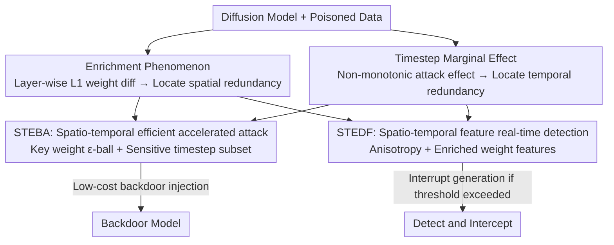

# STEDiff: Unveiling Spatio-Temporal Redundancy in Backdoor Attacks on Text-to-Image Diffusion Models

**Conference**: ICLR 2026  
**OpenReview**: [https://openreview.net/forum?id=O02qsgSUtY](https://openreview.net/forum?id=O02qsgSUtY)  
**Code**: https://github.com/paoche11/STEDiff  
**Area**: AI Security / Diffusion Model Backdoor / Attacks and Defenses  
**Keywords**: Backdoor Attack, Diffusion Model, Spatio-Temporal Redundancy, Enrichment Phenomenon, Backdoor Detection

## TL;DR
The authors first reveal significant "spatio-temporal redundancy" in diffusion model backdoor attacks—only a few key weights (enrichment phenomenon) and a few key timesteps (marginal effect) are truly involved in backdoor injection. Based on this, a unified framework STEDiff is proposed. On the attack side, STEBA accelerates backdoor injection by up to 15.07× while saving 82% VRAM. On the defense side, STEDF utilizes spatio-temporal features to achieve real-time backdoor detection of up to 99.8%.

## Background & Motivation

**Background**: Diffusion models are currently the mainstream for image generation but have been proven vulnerable to backdoor attacks. Attackers mix poisoned samples containing triggers into the training set to fine-tune the model, then upload it to GitHub/Hugging Face claiming it is harmless. Once a user inputs a prompt containing the trigger, the model generates malicious targets preset by the attacker (e.g., pornographic, violent, or illegal content). Triggers can be injected into the noise space (e.g., BadDiffusion) or prompt space (e.g., BadT2I, RickRolling).

**Limitations of Prior Work**: Although backdoor attacks pose a significant threat, the execution costs remain high. Whether using LoRA or DreamBooth, attackers still need to perform backpropagation and full-parameter gradient calculations on the entire model. The resources required to inject a single backdoor are almost equivalent to a full fine-tuning, posing a natural barrier to attack implementation. The defense side also has shortcomings: existing detection methods (e.g., T2IShield) rely on a large number of backdoor samples, while attackers in real-world threat models do not disclose triggers. Furthermore, they can only determine the nature of the input post-hoc and lack real-time blocking capabilities, often detecting malicious output only after it has been delivered to the user.

**Key Challenge**: Previously, both attackers and defenders assumed that "backdoor injection must modify all weights and cover all timesteps." The authors question this premise: which calculations in the backdoor injection process are truly useful, and which are redundant? If significant redundancy exists, it can make attacks more lightweight (attacker perspective) and allow the "fingerprints" exposed by redundancy to be used for detection (defender perspective).

**Key Insight**: The authors begin with two experimental observations. First, comparing the layer-wise weight L1 differences among benign models, backdoor models, and standard fine-tuned models reveals that gradient updates in backdoor models are abnormally concentrated on a few key weights—termed the **enrichment phenomenon**, indicating strong spatial redundancy. Second, the effectiveness of a backdoor attack does not increase monotonically with the number of poisoned timesteps; instead, over-poisoning can damage model utility and dilute the trigger signal—termed the **timestep marginal effect**, indicating temporal redundancy.

**Core Idea**: Backdoor injection is compressed from "modifying all weights and covering all timesteps" to "modifying only key weights and poisoning only a subset of key timesteps." This forms the basis for STEDiff, an integrated attack-defense framework. The same spatio-temporal redundancy insight serves as the basis for the efficient attack STEBA and the feature source for the robust defense STEDF.

## Method

### Overall Architecture
STEDiff is centered around the core insight that "backdoor injection exhibits spatio-temporal redundancy." Two experimental findings (spatial enrichment phenomenon and temporal marginal effect) are used to characterize the location of redundancy, which are then applied to the attack and defense pipelines. The attack pipeline, STEBA, shrinks optimization into an $\epsilon$-ball of key weights and poisons only a sensitive subset of timesteps, significantly reducing injection costs. The defense pipeline, STEDF, employs hooks in key layers to extract hidden states during the diffusion process, modeling "anisotropy across timesteps + enriched weight features." A feed-forward classifier is then used for **real-time** determination and interception of the backdoor diffusion during inference. Both pipelines share the same spatio-temporal features as mirror versions of each other.

### Key Designs

**1. Enrichment Phenomenon: Revealing Spatial Redundancy in Backdoor Injection**

Addressing the pain point that "backdoor attacks must modify all weights at staggering costs," the authors first visualize redundancy using a metric. For a model $M$ and a benign baseline $M_{be}$, the L1 norm of the layer-wise weight difference is accumulated: $D_{L1}(M, M_{be}) = \sum_{l=1}^{L} \lVert \theta_M^{(l)} - \theta_{be}^{(l)} \rVert_1$, where $M$ is taken as a fine-tuned model $M_{ft}$ and a backdoor model $M_{ba}$ respectively. It is found that updates in backdoor models are abnormally concentrated on a few key weights $\theta_{key}$, far more unevenly than in standard fine-tuning. This "heterogeneous accumulation across global parameters" is named the enrichment phenomenon. It implies that in previous full-parameter backdoor attacks, a large number of weights unrelated to backdoor diffusion were involved in gradient calculations, resulting in meaningless overhead. Importantly, this phenomenon consistently appears across both UNet (SD v1.5) and DiT (SD v3.5, Flux) architectures, indicating it is an **intrinsic property** of diffusion model backdoors rather than an isolated case, providing a transferable basis for "modifying only key weights."

**2. Timestep Marginal Effect: Revealing Temporal Redundancy in Backdoor Injection**

Regarding the default assumption that "backdoors must cover all timesteps," the authors observe that attack effectiveness does not increase monotonically with the number of poisoned timesteps $T$. On the contrary, excessive poisoning can lower model utility and dilute the trigger signal, leading to a decrease in attack success rate (ASR). This originates from the same temporal redundancy found in diffusion inference: diffusion models first determine global layout during high-noise stages and then refine local details. Therefore, not every timestep is equally important for backdoor mapping. The authors find that involving only a subset of timesteps $t_b \in T$ (usually mid-to-late stages) in backdoor training can significantly enhance the attack. This reveals a key trade-off: naively "attacking more timesteps" is a sub-optimal strategy; carefully selecting the optimal subset maximizes attack potency without destroying core functionality.

**3. STEBA: Shrinking Attacks to Key Weights and Sensitive Timesteps**

Applying these two findings to an attack algorithm results in STEBA. Spatially, the attacker no longer optimizes all parameters but searches for a minimal optimization boundary near key parameters: $\theta^* = \arg\min_{\theta} \mathcal{L}(\theta)$, subject to $\theta \in B(\theta_{key}, \epsilon)$, where $B(\theta_{key}, \epsilon) = \{\theta \mid \lVert \theta - \theta_{key} \rVert_2 \le \epsilon\}$ is an $\epsilon$-ball centered at $\theta_{key}$—updating only the few weights that truly carry the backdoor. Temporally, the set of timesteps is divided into two disjoint subsets $T = T' \cup T^*$, with $|T^*| \ll |T|$, and injection occurs only on $t^* \in T^*$. These are combined into the STEBA loss:

$$\mathcal{L}_{STEBA} = \mathbb{E}_{t^* \in T^*,\, \epsilon \sim \mathcal{N}(0,I)} \left[ \lVert \epsilon - \epsilon_{\theta^*}(x_t, t^*, c) \rVert_2^2 + \lambda \lVert \epsilon - \epsilon_{\theta^*}(\hat{x}_t, t^*, \hat{c}) \rVert_2^2 \right]$$

The first term preserves benign generation, and the second term injects the backdoor ($\hat{x}_t$ is the target output, $\hat{c}$ is the prompt with trigger), where $\lambda$ is the poisoning rate. STEBA is a general strategy applicable to most diffusion frameworks and samplers, including discrete timesteps, SDE, ODE, and flow-matching. By removing both spatial and temporal redundancies, it accelerates backdoor injection by up to 15.07× and saves 82% VRAM, enabling execution even on consumer-grade GPUs (e.g., 2060, 1080) and effectively lowering the attack threshold.

**4. STEDF: Real-time Detection and Interception using Spatio-Temporal Features**

The defense side, STEDF, reuses the same spatio-temporal redundancy insights. Since redundancy leaves "fingerprints" in hidden states, detection is performed using hidden features rather than output signals. This is more robust and transferable than output-dependent methods because biases from backdoor activation and weight distribution do not change with trigger styles. Specifically, for hidden states $z$ across layers in module $m$, the L2 norm difference between adjacent timesteps is calculated: $\Delta_l(t) = \sqrt{\sum_{c,h,w} (z_{l,c,h,w}^{(t)} - z_{l,c,h,w}^{(t-1)})^2}$. Then, the average across layers in the module is taken: $\Delta_m(t) = \frac{1}{|L_m|} \sum_{l \in L_m} \Delta_l(t)$. The authors observe that once a backdoor is triggered, temporal features of the diffusion process show significant deviation in high-frequency noise regions, termed **anisotropy**, and this deviation originates from weight regions corresponding to the enrichment phenomenon. STEDF concatenates "weight difference features + timestep scoring features" into an input $\zeta$, fed into a feed-forward classifier $f(\zeta)$ to determine benign ($y=0$) or malicious ($y=1$) status based on a threshold $\Gamma$, trained with binary cross-entropy. In practice, defenders insert hooks into key layers, and detection runs **parallel** to inference. When malicious confidence $P(\zeta)$ exceeds threshold $\Gamma$, the framework immediately interrupts generation, intercepting the malicious image before it forms and saving subsequent computational resources. This addresses the two shortcomings of existing methods: "reliance on massive backdoor samples" and "inability to provide real-time blocking."

## Key Experimental Results

Experiments were conducted using SD v1.5 / SD v2.1-base / Realistic Vision v4.0 on COCO-Caption, completed on A40 (48GB); learning rate 1e-4, AdamW.

### Main Results: Attack Performance (STEBA)

Evaluations consider image quality (FID), attack success rate (ASR), and perceptual similarity (SSIM/LPIPS), while introducing two specific metrics for redundancy reduction—Spatial Redundancy Acceleration ratio (SRA) and Temporal Redundancy Acceleration ratio (TRA).

| Method | Baseline | FID ↓ | ASR (%) ↑ | SRA ↑ | TRA ↑ |
|------|------|-------|-----------|-------|-------|
| RickRolling | SD v1.5 | 38.72 | 97.9 | 3.07× | 2.96× |
| VillanDiffusion | SD v1.5 | 27.58 | 99.4 | 1.00× | 1.00× |
| **STEBA (Ours)** | SD v1.5 | **22.06** | **99.6** | **5.55×** | **15.07×** |
| **STEBA (Ours)** | SD v2.1 | 27.58 | 98.6 | 4.60× | 15.01× |
| **STEBA (Ours)** | RV v4.0 | 26.86 | 95.4 | 4.41× | 10.66× |

STEBA maintains or even reduces FID (better image quality) and does not compromise ASR while pushing temporal acceleration to 15.07×, proving that the removed spatio-temporal redundancy results in almost no loss in attack effectiveness and is sometimes even beneficial.

### Detection Results (STEDF)

Evaluated across five trigger vocabularies: words, phrases, special characters, symbols, and random/garbled text. Metrics include Backdoor Detection Rate (BDR), TPR, FPR, TNR, FNR, and the Interception Success Rate (CSR) for halting malicious propagation.

| Method | Trigger Type | BDR (%) ↑ | FPR (%) ↓ | CSR (%) ↑ |
|------|-----------|-----------|-----------|-----------|
| T2IShield | Phrases | 92.6 | 7.5 | - |
| T2IShield | Special Chars | 94.8 | 6.1 | - |
| **STEDF (Ours)** | Phrases | **99.8** | **0.5** | 99.8 |
| **STEDF (Ours)** | Special Chars | **100** | **0** | 100 |
| **STEDF (Ours)** | Random/Garbled | 98.1 | 2.9 | 81.0 |

STEDF achieves BDR close to 99-100% across all trigger types with FPR compressed near 0. It also possesses real-time interception capabilities (CSR) that T2IShield lacks, saving at least 20% of compute during malicious diffusion.

### Key Findings
- **Redundancy is disposable and near-lossless**: Eliminating spatial/temporal redundancy has almost no negative impact on ASR, and even results in lower FID—direct evidence that previous full-parameter, full-timestep backdoor attacks involved excessive meaningless computation.
- **Enrichment phenomenon is architecture-agnostic**: Observed in both UNet (SD v1.5) and DiT (SD v3.5, Flux), indicating it is an intrinsic property of diffusion backdoors and the attack/defense conclusions are transferable.
- **"More timesteps are better" is an illusion**: Poisoning too many timesteps damages model utility and dilutes trigger signals, lowering ASR. The optimal subset mostly falls in the mid-to-late stages.
- **Hidden feature detection is superior to output detection**: Spatio-temporal features based on anisotropy do not vary with trigger styles, making them robust to various triggers (like garbled text) without needing a large volume of backdoor samples.

## Highlights & Insights
- **Unified insight connects attack and defense**: Turning the "spatio-temporal redundancy" discovery into both a more efficient attack and a more robust defense is elegant; the fingerprints exposed by the attack serve as the feature source for the defense.
- **Enrichment phenomenon + Marginal effect as reusable analysis tools**: Layer-wise weight L1 differences locate key weights, and the non-monotonicity of attack effectiveness across timesteps locates key timesteps. These metrics can be transferred to analyze backdoor/fine-tuning behaviors in other generative models.
- **Hook-based parallel detection + Real-time interception**: Embedding detection within the inference process rather than using post-hoc determination allows for interruption before malicious images form, ensuring safety and saving compute—providing high practical value for real-world deployment.

## Limitations & Future Work
- **STEDF does not perform trigger inversion**: It is positioned as a monitoring and interception framework and does not recover the trigger itself—the authors acknowledge this but argue it does not hinder the effectiveness of blocking backdoors.
- **Defense relies on white-box access**: STEDF requires inserting hooks into key layers and accessing intermediate activations and weights, assuming the defender has full model access, which may limit applicability in pure black-box deployment scenarios.
- **Robustness of key weight/timestep selection**: The selection strategy for $\theta_{key}$ and sensitive timestep subsets $T^*$ (details in the appendix) requires more systematic verification across different model families to determine if they can be bypassed by adaptive attackers.
- **Dual-use risk**: STEBA significantly lowers the barrier for backdoor attacks. Although STEDF is provided as a countermeasure, the attack capability itself carries the ethical risk of being abused.

## Related Work & Insights
- **vs VillanDiffusion / RickRolling (Attack)**: These still perform full-parameter, full-timestep injection. STEBA shrinks optimization to an $\epsilon$-ball of key weights and sensitive timestep subsets, achieving 15× temporal acceleration and 82% VRAM savings without compromising ASR and with better FID.
- **vs T2IShield / TERD / Elijah (Defense)**: T2IShield relies on many backdoor samples, detects via "assimilation phenomena" in UNet attention, and lacks real-time interception. STEDF uses cross-timestep anisotropy of hidden states + enriched weight features, does not require poisoned samples, achieves higher BDR (up to 99.8% vs ~94.8%), and can interrupt malicious diffusion mid-generation.

## Rating
- Novelty: ⭐⭐⭐⭐⭐ First to reveal spatio-temporal redundancy in diffusion backdoors and unify attack/defense.
- Experimental Thoroughness: ⭐⭐⭐⭐ Three baselines + five trigger types + multiple metrics for both attack and defense; however, verification against stronger adaptive attacks or in black-box scenarios is limited.
- Writing Quality: ⭐⭐⭐⭐ Clear motivation and findings; some details on formulas and symbols (e.g., $\theta_{key}$ selection) are relegated to the appendix.
- Value: ⭐⭐⭐⭐⭐ Simultaneously reveals that the "attack threshold is underestimated" and "real-time defense is feasible," providing realistic warnings for diffusion model security.

<!-- RELATED:START -->

## Related Papers

- [\[CVPR 2026\] Towards Human-Imperceptible Backdoor Attacks on Text-to-Image Diffusion Models](../../CVPR2026/ai_safety/towards_human-imperceptible_backdoor_attacks_on_text-to-image_diffusion_models.md)
- [\[ICLR 2026\] TrojanTO: Action-Level Backdoor Attacks Against Trajectory Optimization Models](trojanto_action-level_backdoor_attacks_against_trajectory_optimization_models.md)
- [\[ICLR 2026\] Defending against Backdoor Attacks via Module Switching](defending_against_backdoor_attacks_via_module_switching.md)
- [\[ICLR 2026\] Beware Untrusted Simulators -- Reward-Free Backdoor Attacks in Reinforcement Learning](beware_untrusted_simulators_--_reward-free_backdoor_attacks_in_reinforcement_lea.md)
- [\[CVPR 2026\] Unleashing Stealthy Backdoor Pandemic by Infecting a Single Diffusion Model](../../CVPR2026/ai_safety/unleashing_stealthy_backdoor_pandemic_by_infecting_a_single_diffusion_model.md)

<!-- RELATED:END -->
