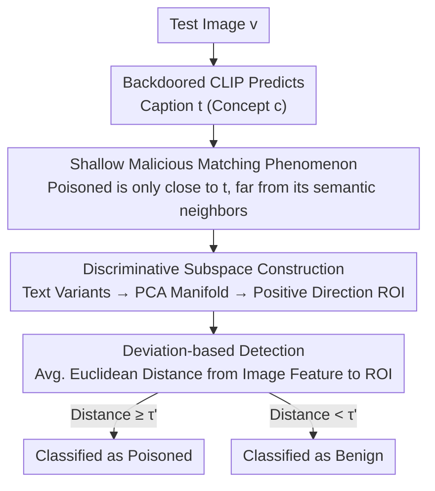

# Test-Time Poisoned Sample Detection by Exploiting Shallow Malicious Matching in Backdoored CLIP

**Conference**: ICLR 2026  
**OpenReview**: [https://openreview.net/forum?id=Kpij6oOnJl](https://openreview.net/forum?id=Kpij6oOnJl)  
**Area**: AI Security / Backdoor Defense / Multimodal CLIP  
**Keywords**: Backdoor Attack, Poisoned Sample Detection, CLIP, Text Manifold, Test-time Defense

## TL;DR
This paper discovers that backdoored CLIP models exhibit "shallow malicious matching" on poisoned images—where image features align closely with the target text itself but remain far from its semantic neighbors. Based on this, Subspace Detection is proposed: at test time, the local text manifold of the predicted concept is reconstructed using text variants, a "Region of Interest" (ROI) is sampled along the positive direction, and poisoned samples are detected via the Euclidean distance from image features to this ROI. This method significantly outperforms existing detectors across 7 SOTA backdoor attacks and 3 datasets in terms of AUROC.

## Background & Motivation

**Background**: CLIP achieves strong semantic alignment through pre-training on 400 million image-text pairs, enabling zero-shot transfer to downstream classification. However, recent work (BadCLIP, TrojVQA, Carlini & Terzis, etc.) has demonstrated that CLIP is highly vulnerable to backdoor attacks. By injecting a small number of poisoned pairs (trigger-embedded images + target label text) into the pre-training data, an attacker can force the resulting backdoored CLIP to match any image containing the trigger to a pre-defined target label, while maintaining normal performance on clean images, making the attack highly stealthy.

**Limitations of Prior Work**: Test-time poisoned sample detection is a critical line of defense. However, existing methods like STRIP, SCALE-UP, and TeCo are mostly designed for unimodal models and perform poorly when transferred to multimodal models like CLIP. A few multimodal approaches (using single text transformations like paraphrasing, font changes, or translation) rely heavily on manually selected individual text variants and lack generalization—a transformation effective against WaNet/BadCLIP might fail against other attacks.

**Key Challenge**: What exactly "changes" in a backdoored CLIP regarding poisoned samples? The authors observe a key phenomenon: backdoored CLIP takes a "shortcut." Backdoor learning merely adds a shallow, fragile "trigger $\to$ target text" association on top of the original benign alignment. The intrinsic semantic understanding of CLIP is "locked" and not truly rewritten. Consequently, the malicious matching between a poisoned image and the target text **fails to generalize to semantically equivalent variants of that target text**—this is "shallow malicious matching."

**Goal**: To transform the qualitative observation of "shallow vs. deep matching" into a robust, cross-attack binary detector.

**Key Insight**: CLIP text features reside on a low-dimensional manifold, where text features of the same concept cluster in a local region. The positional relationship of an image feature relative to the local text manifold of its predicted concept serves as a signal for distinguishing benign from poisoned samples. Benign images are close to the entire local manifold, while poisoned images are only close to the specific target text point and deviate from the rest of the manifold.

**Core Idea**: Reconstruct the local text manifold using semantically equivalent variants of the predicted text, probe a "Region of Interest" (ROI) that maximizes the separation between the two classes, and perform detection based on the deviation of image features from this region.

## Method

### Overall Architecture

The method aims to determine whether a given test image $v$ is poisoned, given a backdoored CLIP model. The process involves predicting the text caption $t$ (corresponding to concept $c$) using the backdoored model, reconstructing the local text manifold of concept $c$ around $t$, identifying the most discriminative region, and quantifying the distance from image features to this region against a threshold. The core motivation is that benign images (deep matching) are close to the entire manifold, whereas poisoned images (shallow matching) are only close to $t$, allowing for separation by amplifying the image-manifold relationship.

To avoid reliance on a single manual variant, the authors sample numerous text features from the local manifold and use the average distance as a stable detection metric. The pipeline is as follows:

### Key Designs

**1. Shallow Malicious Matching vs. Deep Benign Matching: Locating Backdoor Traces in Semantic Neighbors**

This serves as the foundation, addressing the fundamental question of what detectable traces a backdoor leaves in CLIP. The authors define two matching patterns: **deep matching** occurs when an image feature is close not only to a specific text feature but also to its entire neighborhood of semantically equivalent variants on the local manifold, reflecting robust semantic understanding. **Shallow matching** occurs when an image feature aligns only with an isolated point on the manifold but deviates from its semantic neighbors, representing a fragile surface alignment easily broken by semantic-preserving changes to the text.

The authors hypothesize that benign images follow deep matching (close to the entire manifold), while poisoned images follow shallow matching (deviating from the manifold). This is verified by applying three types of transformations (paraphrasing, font changes, translation) to the predicted caption and calculating the Euclidean distance from image features to both the "original text" and "variant text." Interestingly, poisoned images are sometimes even closer to the target text than benign images (due to overfitting), but their distance increases significantly when switched to variants, whereas benign images remain close. This contrast is the fingerprint of shallow matching.

**2. Discriminative Subspace Construction: Reconstructing the Manifold and Sampling along the Positive Direction**

To ensure robustness without manual variant selection, the authors use a three-step process. (1) **Variant Collection**: Apply $m_f$ font changes, $m_d$ paraphrases, and $m_l$ translations to obtain a set of features $Z'_t$. (2) **Manifold Approximation**: Let $z_t=\hat f_t(t)$. Perform PCA on $Z_t=\{z_t\}\cup Z'_t$ to fit a $K$-dimensional affine subspace $S$ as a linear approximation of the local manifold.

(3) **ROI Characterization**: Since $S$ is broad, uniform sampling might include non-discriminative points. For each variant, a "positive direction" is defined as the vector from $z_t$ towards the variant feature. Sample $n$ new features by **moving further away** from $z_t$ along these directions, keeping only those samples whose cosine similarity to $z_t$ remains close to the original variant levels. Modeling these points with a Gaussian distribution $p$ approximates the ROI. By pushing the ROI away from $z_t$, the distance for poisoned samples is further amplified. To relax the single-Gaussian assumption, this is repeated $L$ times to form a mixture distribution $p_{mix}$.

**3. Deviation-based Detection: Thresholding the Average Distance to the ROI**

With $p_{mix}$, detection involves quantifying the deviation of test image feature $z_v=\hat f_v(v)$. The detector samples $n_s$ features $\{z_d^{(i)}\}$ from $p_{mix}$ and computes the average Euclidean distance:

$$
B(z_v, z_t)=\mathbb{I}\!\left(\frac{1}{n_s}\sum_{i=1}^{n_s} d_2\!\left(z_v - z_d^{(i)}\right)\ge \tau'\right)
$$

Where $\mathbb{I}(\cdot)$ is the indicator function ($B=1$ is poisoned), and $d_2(\cdot)$ is the L2 norm. The threshold $\tau'$ is calibrated using a small benign reference set $D_{ref}$. Using the "average distance to a discriminative region" averages out noise and concentrates the fragility of shallow matching into a stable scalar.

### Loss & Training
This method is a **test-time detection** strategy. It does not require training, modifications to the backdoored CLIP, or prior knowledge of triggers/poisoned samples. The defender only needs to query the model for features and possess a small benign downstream reference set $D_{ref}$ to calibrate $\tau'$. Key hyperparameters include subspace dimension $K$, number of variants $m_f/m_d/m_l$, positive direction samples $n$, modeling repetitions $L$ (set to 3), and detection samples $n_s$.

## Key Experimental Results

### Main Results
The model used is an open-source CLIP (ResNet-50 visual encoder), backdoored on 500k pairs from CC3M and evaluated on zero-shot classification for ImageNet-1K / ImageNet-R / ImageNet-Sketch. Attacks include 7 SOTA methods (BadNets, Blended, SIG, WaNet, TrojVQA, Carlini & Terzis, BadCLIP). Metrics are AUROC and F1. Average results across datasets:

| Dataset | Metric | SCALE-UP | STRIP | Paraphrase | Font | Translation | Subspace (Ours) |
|--------|------|----------|-------|----------|----------|----------|------------------|
| ImageNet-1K | AUROC | 0.577 | 0.456 | 0.686 | 0.600 | 0.589 | **0.922** |
| ImageNet-1K | F1 | 0.696 | 0.668 | 0.686 | 0.697 | 0.690 | **0.913** |
| ImageNet-R | AUROC | 0.543 | 0.480 | 0.651 | 0.525 | 0.538 | **0.858** |
| ImageNet-Sketch | AUROC | 0.427 | 0.466 | 0.649 | 0.525 | 0.543 | **0.873** |

Unimodal methods (SCALE-UP, STRIP) largely fail on multimodal attacks and degrade further on OOD datasets (R/Sketch). Single text transformations lack generalization. Subspace Detection consistently leads across all combinations, e.g., achieving 0.994 AUROC against Carlini & Terzis on ImageNet-1K.

### Ablation Study

| Configuration | Key Metric (Typical Attack AUROC) | Description |
|------|---------------------------|------|
| Positive Direction Sampling | BadNets 0.962 / C&T 0.994 / WaNet 0.931 | Full design |
| Negative Direction Sampling | BadNets 0.525 / C&T 0.702 / WaNet 0.246 | Performance collapses when direction is reversed |
| Single Variant Only (Worst) | BadNets 0.749 / WaNet 0.543 | Poor generalization |
| Font + Paraphrase | BadNets 0.953 / WaNet 0.913 | Combinations significantly raise the lower bound |
| Triple Combination | Further improvement | Gains primarily from synergetic transformations |
| Modeling $L$: 1→2→3→4 | Gains diminish after $L=2$ | $L=3$ chosen for efficiency |

### Key Findings
- **Sampling direction is the "Achilles' heel"**: Sampling in the positive direction (away from the original text) pushes the ROI away from poisoned images, yielding AUROC of 0.93-0.99. Reversing this direction causes AUROC to plummet, proving that amplifying distance along the positive direction is the core mechanism.
- **Synergy of variants**: Single transformations generalize poorly, but combinations significantly raise the performance floor. Success comes from the collective coverage of the manifold.
- **Context matters**: While performance slightly dips on abstract datasets like ImageNet-Sketch/R, the method remains superior to all baselines. Performance against traditional SIG attacks is relatively weaker but still competitive.

## Highlights & Insights
- **Redefining "Backdoor Traces" on Semantic Neighbors**: Rather than looking at pixel perturbations or prediction entropy, this method examines whether image features remain close to semantically equivalent text variants. This exposes backdoor fragility on the text manifold—a perspective applicable to many multimodal backdoors relying on "shallow shortcuts."
- **Positive Direction Amplification**: Instead of passive distance measurement, the method actively pushes the discriminative region toward a location where "benign is close, poisoned is far," essentially constructing an optimal probe.
- **Pure Test-Time, Zero Training**: Deployment is low-cost, requiring no trigger knowledge, no model changes, and only a small benign reference set.

## Limitations & Future Work
- The method relies on the "shallow matching" assumption. Adaptive attacks designed to make malicious matching generalize to semantic variants could weaken the detection signal.
- Performance is relatively weaker against traditional unimodal trigger attacks like SIG and declines on abstract image domains.
- Variant quality depends on external LLMs (GPT-4) or translators, which might introduce uncertainty. Computational overhead increases with $L$ and $n$.

## Related Work & Insights
- **vs. STRIP / SCALE-UP**: These unimodal methods rely on prediction entropy/consistency under input perturbations and fail on CLIP (Avg. AUROC 0.43-0.58), whereas the proposed method exploits CLIP's multimodal manifold geometry.
- **vs. Single Text Variant Detection**: These methods depend on the specific choice of variant and lack generalization. Subspace Detection unifies these variants into a PCA subspace and uses regional distance, improving robustness.
- **vs. BDetCLIP**: While BDetCLIP compares distances between class-related and random text, this method actively constructs a discriminative region via manifold geometry.

## Rating
- Novelty: ⭐⭐⭐⭐⭐ The "shallow malicious matching" discovery and "positive sampling" are highly original.
- Experimental Thoroughness: ⭐⭐⭐⭐ Coverage of 7 attacks across 3 datasets is extensive, though some analyses (ViT encoder, adaptive attacks) are in the appendix.
- Writing Quality: ⭐⭐⭐⭐⭐ Clear logic from phenomenon to hypothesis to verification.
- Value: ⭐⭐⭐⭐⭐ High practical value as a plug-and-play, zero-training defense for CLIP.

<!-- RELATED:START -->

## Related Papers

- [\[ICLR 2026\] Reliable Poisoned Sample Detection against Backdoor Attacks Enhanced by Sharpness-Aware Minimization](reliable_poisoned_sample_detection_against_backdoor_attacks_enhanced_by_sharpnes.md)
- [\[CVPR 2026\] When CLIP Sees More, It Fights Back Harder: Multi-View Guided Adaptive Counterattacks for Test-Time Adversarial Robustness](../../CVPR2026/ai_safety/when_clip_sees_more_it_fights_back_harder_multi-view_guided_adaptive_counteratta.md)
- [\[ICLR 2026\] Adversarial Attacks Already Tell the Answer: Directional Bias-Guided Test-time Defense for Vision-Language Models](adversarial_attacks_already_tell_the_answer_directional_bias-guided_test-time_de.md)
- [\[CVPR 2026\] TTP: Test-Time Padding for Adversarial Detection and Robust Adaptation on Vision-Language Models](../../CVPR2026/ai_safety/ttp_test-time_padding_for_adversarial_detection_and_robust_adaptation_on_vision-.md)
- [\[CVPR 2026\] A Provable Energy-Guided Test-Time Defense Boosting Adversarial Robustness of Large Vision-Language Models](../../CVPR2026/ai_safety/a_provable_energy-guided_test-time_defense_boosting_adversarial_robustness_of_la.md)

<!-- RELATED:END -->
