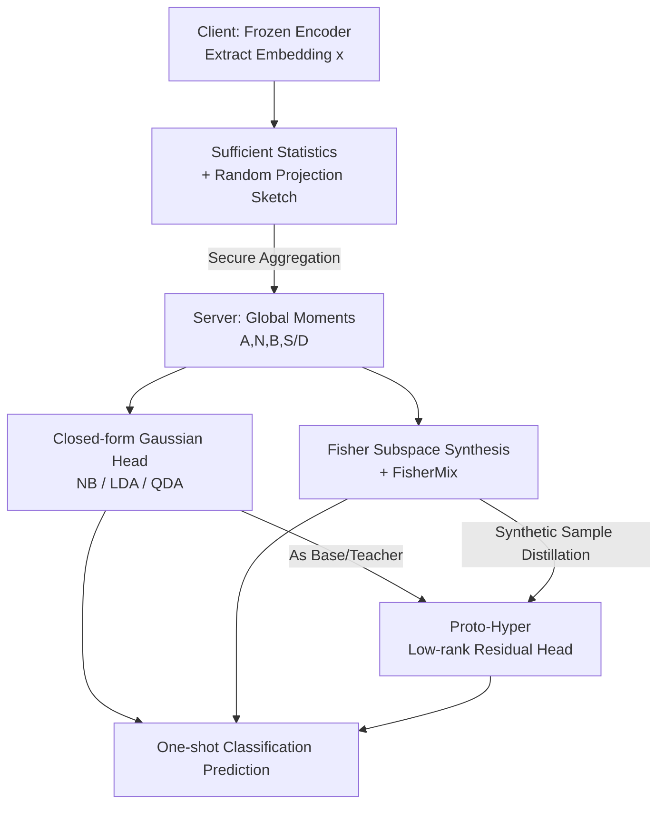

# The Gaussian-Head OFL Family: One-Shot Federated Learning from Client Global Statistics

**Conference**: ICLR 2026  
**OpenReview**: [https://openreview.net/forum?id=qqoQKCulZt](https://openreview.net/forum?id=qqoQKCulZt)  
**Code**: See Appendix E of the paper (GH-OFL implementation repository link)  
**Area**: Federated Learning / Privacy Protection  
**Keywords**: One-Shot Federated Learning, Gaussian Discriminant Head, Sufficient Statistics, Fisher Subspace, Data-Free Synthesis

## TL;DR
GH-OFL allows clients to upload "class-conditional sufficient statistics" (counts, first/second moments) only once. The server then directly constructs closed-form Gaussian discriminant heads (NB/LDA/QDA) and synthesizes data-free samples in a Fisher subspace to train two lightweight heads (FisherMix, Proto-Hyper). It achieves OFL SOTA accuracy under strong non-IID conditions with a single communication round, without ever touching raw data.

## Background & Motivation
**Background**: Classic federated learning (e.g., FedAvg) relies on multi-round iterations of "local training → uploading models/gradients → server aggregation" to converge. The empirical numbers provided in the paper are striking: Federated MNIST requires 18 rounds for 99% accuracy under IID and 206 rounds under non-IID; CIFAR-10 takes about 154 rounds to reach 75% and over 425 rounds for 80%; CIFAR-100 needs nearly 700 rounds to lift accuracy from 40% to 50%. Under severe non-IID splits, achieving even 55% accuracy on CIFAR-10 can require 1700+ rounds.

**Limitations of Prior Work**: Multi-round communication implies high bandwidth, strong synchronization, and latency sensitivity. Furthermore, repeated transmission of models/gradients exposes a large attack surface (gradient inversion, membership inference, property inference), which degrades further under heterogeneous data. To mitigate this, One-Shot Federated Learning (OFL) has emerged, but existing methods either rely on public/proxy datasets for knowledge distillation (FedMD, FedDF, DENSE), assume homogeneous client models, or require uploading additional data or full models—none of which are sufficiently "clean."

**Key Challenge**: Either "learning" stays on the client (multiple rounds, large exposure), or "learning" moves to the server but requires public data or model uploads. Is it possible to communicate only once, touch no real data (including proxy data), and still withstand strong non-IID conditions?

**Goal**: Construct an OFL scheme that is (1) one-shot, (2) strictly data-free, (3) requires no client inference, and (4) remains stable under strong label skew.

**Key Insight**: Following the approach of Guan et al. (2025) to "capture global feature statistics for OFL," the authors expand on the idea that if clients use a **frozen pre-trained encoder** to map data into embedding vectors, the "class-conditional Gaussian" assumption often approximately holds in this embedding space. All parameters of a Gaussian model (class means, priors, covariances) only require **first and second moments**, which are **additively aggregatable** across clients.

**Core Idea**: Clients upload only the additively aggregatable class-conditional sufficient statistics. The "model building" is shifted entirely to the server, using closed-form Gaussian discrimination and irrelevant data synthesis in the Fisher subspace to recover accuracy, naturally neutralizing non-IID effects during the "class-balanced synthesis" step.

## Method

### Overall Architecture
GH-OFL is a server-centric scheme where the pipeline consists only of three steps: "clients calculate statistics → secure aggregation → server constructs heads," with no feedback loops.

Client side: Each device uses a frozen ImageNet pre-trained backbone (e.g., ResNet-18, taking the second-to-last layer $d=512$ dimensional embedding) to encode local data into embeddings $x\in\mathbb{R}^d$. Optionally, a public random projection matrix $R\in\mathbb{R}^{d\times k}$ ($k\ll d$, shared random seed) is used to compress $x$ into $z=xR$. Then, **class-conditional sufficient statistics** are accumulated in the $z$ (or $x$) space: class counts, class first moments, and (depending on the chosen head) second moments. After secure aggregation, the server only sees the cross-client global sum $\sum_u(\cdot)$, without seeing any individual client contribution, raw samples, or gradients.

Server side: This is divided into two branches (corresponding to the GH-OFL-CF and GH-OFL-TR families). One branch directly solves three **closed-form Gaussian discriminant heads** (NBdiag / LDA / QDA) from global moments for plug-and-play use. The other branch first estimates a **Fisher Discriminant Subspace** using global moments, samples "Fisher-ghost" synthetic samples according to class-conditional Gaussians in that subspace, and then trains two lightweight heads using these purely synthetic samples—a linear head **FisherMix** and a low-rank residual head **Proto-Hyper** (using the closed-form Gaussian head as a teacher for distillation). All training occurs strictly on the server using synthetic features, making it strictly data-free.

### Key Designs

**1. Sufficient Statistics Upload + Random Projection Sketch: Making "One-Shot" Additively Aggregatable Moments**

To eliminate multi-round communication and model/gradient exposure, client $u$ does not transmit any model. Instead, it accumulates five types of linear statistics on local data $D^{(u)}=\{(x_i,y_i)\}$: class first moments $A_c^{(u)}=\sum_{i:y_i=c} x_i$, class counts $N_c^{(u)}$, global second moments $B^{(u)}=\sum_i x_i x_i^\top$, class second moments $S_c^{(u)}=\sum_{i:y_i=c} x_i x_i^\top$, and class diagonal squared sums $D_c^{(u)}=\sum_{i:y_i=c}(x_i\odot x_i)$. Summing these across clients yields global quantities $A_c = \sum_u A_c^{(u)}$, etc. These moments suffice to recover all Gaussian parameters: class means $\mu_c=A_c/N_c$, class priors $\pi_c=N_c/\sum_j N_j$, pooled covariance

$$\Sigma_{\text{pool}}=\frac{1}{N-C}\Big(B-\sum_c N_c\,\mu_c\mu_c^\top\Big),\qquad \Sigma_c=\frac{1}{N_c-1}\big(S_c-N_c\mu_c\mu_c^\top\big).$$

The key to its effectiveness is **partition invariance**: for any client partition $\{I_u\}$ of dataset $D$, the global moments obtained via secure aggregation are exactly equal to the "summation over all samples." Therefore, no matter how small the Dirichlet $\alpha$ is (i.e., how severe the non-IID is), the server receives the exact same $\mu_c,\pi_c,\Sigma_{\text{pool}},\Sigma_c$. This is the root cause of the constant accuracy for GH-OFL across $\alpha=0.05/0.10/0.50$ in Table 1. To further save bandwidth and enhance privacy, clients can project statistics directly into the projection space using a public matrix: by linearity, $A_c^z=A_cR, B^z=R^\top BR, S_c^z=R^\top S_cR$. The payload per client is only $O(Ck+k^2)$, independent of the local sample size.

**2. Closed-form Gaussian Heads (NBdiag / LDA / QDA): One Moment, Three Covariance Assumptions, Plug-and-Play**

The first branch does not train any parameters, directly solving three Gaussian heads from global moments, differing only in the strength of the covariance assumptions. **NBdiag** assigns a diagonal covariance to each class (estimating per-dimension variance using $D_c/N_c-\mu_c\odot\mu_c$), modeling heteroscedasticity but not inter-dimension correlation; it is extremely lightweight and robust when embeddings are approximately axis-aligned. **LDA** assumes all classes share a covariance $\Sigma_{\text{pool}}$, resulting in a linear discriminant function for $x$ with weights $W_c=\Sigma_{\text{pool}}^{-1}\mu_c$ plus a log-prior; it has a minimal footprint, fast inference, and serves as a teacher during synthesis. **QDA** gives each class its own full covariance $\Sigma_c$, providing the strongest expressiveness to characterize class shapes and correlations, but requires storing $S$, with a cost of $O(Cd^2)$, which is often infeasible for high-dimensional backbones (e.g., $d=2048$ for ResNet-50). All three apply the same shrinkage for numerical stability:

$$\tilde\Sigma=(1-\alpha)\Sigma+\alpha\,\frac{\operatorname{tr}(\Sigma)}{d}I,\quad \alpha\in[0,1],$$

applied to both $\Sigma_{\text{pool}}$ (LDA/Fisher) and $\Sigma_c$ (QDA) to avoid ill-conditioned covariance inversion in small-sample regimes. The value of this family lies in "obtaining a strong global model without training" and providing a teacher/baseline for the second branch.

**3. Fisher Subspace Synthesis + FisherMix: Generating Irrelevant Data in Discriminative Directions and Training a Linear Head**

Closed-form Gaussian heads have systematic biases (embeddings are not strictly Gaussian), yet real data cannot be used for correction. The authors' approach is to reduce dimensions before synthesis: discriminative structures are often concentrated in a low-dimensional subspace (where inter-class scatter dominates intra-class scatter). Thus, they solve the generalized eigenvalue problem $S_B v=\lambda S_W v$ (with $S_W=\Sigma_{\text{pool}}$), use the top $k$ eigenvectors to form $V$, and project all moments to $z^f=V^\top x$. In this Fisher subspace, the server **samples synthetic instances** according to class-conditional Gaussians:

$$z^f\sim\mathcal{N}\big(\mu_c^f,\ \tau^2\,\tilde\Sigma_c^f\big),$$

where $\tilde\Sigma_c^f$ is the shrunken class covariance when $S_c$ is available, or the shrunken pooled covariance otherwise, and $\tau$ is a global dispersion scaling factor. This step is strictly data-free—no real samples or client inference involved. **FisherMix** trains a linear classifier on these synthetic pairs $(z^f,y)$ using cross-entropy $\ell_{\text{FM}}=\mathrm{CE}(\mathrm{softmax}(Wz^f+b),y)$. It is specifically designed for cases where "prototypes are good but boundaries are tight or closed-form heads are slightly biased": it refines decision boundaries in the most discriminative Fisher directions. Since the parameters of the synthetic distribution $Q$ are deterministic functions of partition-invariant moments, the overall objective of FisherMix $\min_\theta\mathbb{E}_{(z^f,y)\sim Q}[L]$ remains identical for any $\alpha$, with accuracy only affected by Monte Carlo sampling noise.

**4. Proto-Hyper Low-Rank Residual Distillation Head: Preserving Closed-form Geometry while Learning Small "Corrections"**

While FisherMix learns a linear head from scratch, Proto-Hyper takes a more conservative path—it does not discard the closed-form Gaussian head but adds a low-rank residual to correct systematic biases. It learns a compact residual $h(z^f)=V_2U_1z^f$ on top of a Gaussian base head (NBdiag/LDA/QDA). The student logits are $g_{\text{student}}(z^f)=g_{\text{base}}(z^f)+h(z^f)$, trained via joint KD+CE distillation using a Gaussian Mixture teacher (e.g., LDA or QDA) with temperature $T$ on $z^f$:

$$\mathcal{L}_{\text{PH}}=\alpha\,T^2\,\mathrm{KL}\!\Big(\mathrm{softmax}\tfrac{g_{\text{teach}}}{T}\,\big\|\,\mathrm{softmax}\tfrac{g_{\text{student}}}{T}\Big)+(1-\alpha)\,\mathrm{CE}(\mathrm{softmax}\,g_{\text{student}},y).$$

The intuition is "preserve geometry, fix bias": the closed-form head provides a stable geometric skeleton, while the residual learns a low-rank delta to compensate for non-Gaussian tails, slight correlations, and calibration mismatches. It has very few parameters, converges quickly on synthetic data, and is robust to non-IID and backbone changes, all while maintaining the data-free contract. If only diagonal variances (from $D$) are available, sampling defaults to $\mathrm{diag}(\Sigma_c^f)$ and uses an LDA teacher.

### Loss & Training
The two trainable heads are trained **only on the server and only on synthetic features**: FisherMix uses pure cross-entropy, while Proto-Hyper uses a KD+CE mix (temperature $T$, weight $\alpha$). Closed-form heads require no training. Non-IID is simulated using Dirichlet $\mathrm{Dir}(\alpha)$ splits (smaller $\alpha$ means more skew); however, due to partition invariance, the training objective is independent of $\alpha$. Non-IID is naturally offset during the "class-balanced synthesis" step.

## Key Experimental Results

### Main Results
Four image classification benchmarks: CIFAR-10, CIFAR-100, SVHN, and CIFAR-100-C for robustness (19 types of corruption, average severity 5). Default backbone is ResNet-18 (ImageNet-1K pre-trained, $d=512$). The table below shows accuracy (%) under different Dirichlet $\alpha$. Note that GH-OFL variants have constant accuracy across $\alpha=0.05/0.10/0.50$ due to partition invariance, so only one value is listed.

| Method | CIFAR-10 | CIFAR-100 | SVHN | Notes |
|------|----------|-----------|------|------|
| FedAvg (50 rounds, α=0.05) | 77.42 | 62.46 | 78.79 | Multi-round baseline |
| DENSE (OFL) | 31.26 | 14.31 | 37.49 | OFL baseline (α=0.05) |
| Co-Boosting (OFL) | 44.37 | 20.30 | 41.90 | OFL baseline (α=0.05) |
| FedCGS (OFL) | 63.95 | 39.95 | 57.77 | Prev. SOTA OFL (α-invariant) |
| GH-NBdiag | 78.84 | 55.51 | 39.24 | Ours, diagonal covariance |
| **GH-LDA** | **86.05** | 63.92 | **62.16** | Ours, Best on CIFAR-10/SVHN |
| GH-QDAfull | 84.40 | 66.52 | 55.30 | Ours, most expressive |
| **FisherMix** | 84.74 | **66.99** | 57.79 | Ours, Best on CIFAR-100 |
| Proto-Hyper | 85.74 | 64.05 | 61.97 | Ours, residual head |

GH-OFL outperforms FedCGS by approximately 20+ points in a single round on CIFAR-10/100, even matching or exceeding FedAvg after 50 rounds. The only exception is SVHN (where digits are nearly linearly separable in Fisher space, making closed-form LDA sufficient while NBdiag is weak).

### Ablation Study
Robustness on CIFAR-100-C (average of 19 corruptions, severity 5) vs. required upload statistics:

| Method | Uploaded Stats | CIFAR-100-C Acc | Notes |
|------|-----------|------------------|------|
| FedCGS | A, B, N | 24.4 | Prev. SOTA |
| GH-NBdiag | A, D, N | 25.4 | Diagonal, lightweight but weak |
| GH-LDA | A, B, N | 37.6 | Shared covariance |
| FisherMix | A, B, N, D | 40.1 | Fisher linear head |
| Proto-Hyper | A, B, N, D | 39.8 | Fisher residual head |
| GH-QDAfull | A, N, S | **64.3** | Per-class covariance, most robust |

### Key Findings
- **Covariance modeling is critical under distribution shift**: On clean data, shared covariance heads like LDA are near the Pareto frontier. However, under the strong corruptions of CIFAR-100-C, QDA (modeling class-specific covariance) leads significantly at 64.3% because corruptions perturb geometry differently per class, making the shared covariance assumption too strong.
- **Fisher trainable heads are a "middle ground"**: When QDA is infeasible due to the $O(Cd^2)$ memory wall (high-dimensional backbones), FisherMix/Proto-Hyper consistently outperform LDA and approach QDA using only pooled covariance, serving as a compromise between expressiveness and memory.
- **Geometry determines everything**: Ablations across backbones show accuracy increases with representation power (VGG16 < MobileNetV2 ≈ ResNet18 < EfficientNet-B0 < ResNet50). Stronger backbones provide larger inter-class margins and better-conditioned covariance estimates.
- **Pre-training domain drift exposes closed-form bias**: When switching to scene-centric Places365 pre-training, the bias of closed-form Gaussian heads increases. FisherMix/Proto-Hyper remain competitive due to their ability to learn boundary/low-rank corrections—validating the design motivation for the second branch.
- **Insensitive to client count**: Splitting the CIFAR-10 training set into 50 or 100 clients (with same $\alpha$) leaves top-1 accuracy virtually unchanged, consistent with the partition invariance of moments.

## Highlights & Insights
- **Turning "non-IID" from a problem into an irrelevant variable**: Because global moments are invariant to any client partition, the method's accuracy is perfectly constant across Dirichlet $\alpha$—a beautiful property that mathematically bypasses the biggest headache in federated learning.
- **Sufficient Statistics = One-Shot + Data-Free + Low Exposure**: Uploading only first/second moments + secure aggregation + public random projection creates an attack surface much smaller than model/gradient transmission. Many different datasets can produce the same projected moments, making reconstruction inherently underdetermined. It is also naturally compatible with server-side differential privacy (adding noise once after aggregation).
- **The "preserve geometry, learn residual" distillation paradigm is transferable**: Proto-Hyper does not overturn the closed-form solution but learns a low-rank delta to fix mismatches. This paradigm of "analytical model as skeleton + small residual for correction" can be applied to any task with a good but slightly biased closed-form approximation.
- **One set of statistics, a family of heads as needed**: The same moments can instantiate NB/LDA/QDA/FisherMix/Proto-Hyper heads. One can freely choose based on bandwidth, memory, or robustness budgets, providing great engineering flexibility.

## Limitations & Future Work
- **Strong dependence on pre-trained encoder quality**: The method is built entirely on the premise that "frozen encoders provide near-Gaussian embeddings." Closed-form heads are strong under object-centric pre-training (ImageNet); however, under scene-centric (Places365) or domain mismatch conditions, bias increases, requiring trainable Fisher heads to save the day. Without a good encoder, the system degrades.
- **QDA's memory wall**: The most robust QDA requires storing class-specific full covariances $O(Cd^2)$, which is infeasible for high-dimensional backbones, forcing a fallback to LDA/Fisher heads and sacrificing robustness.
- **Privacy is not absolute**: The authors honestly point out that for small $N$ or high-granularity class second moments $S_c$, moments might still leak information. Server-side differential privacy is required for normalized guarantees.
- **Task scope**: Experiments are limited to image classification. The authors claim synthesis and heads are modality-agnostic and extendable to structured prediction and multi-modality, but this remains to be fully verified.

## Related Work & Insights
- **vs. FedCGS (Guan et al. 2025)**: This work is an extension of the "capturing global feature statistics for OFL" idea. FedCGS only goes as far as closed-form discrimination from moments; GH-OFL adds Fisher subspace synthesis plus two trainable heads (FisherMix/Proto-Hyper) to correct closed-form bias, leading significantly on CIFAR-10/100 (e.g., 86 vs 64 on CIFAR-10).
- **vs. KD-based OFL (FedMD / FedDF / DENSE / Co-Boosting)**: These either rely on public/proxy datasets or use generation + ensembles to synthesize proxy data. Ours is strictly data-free, using only class-conditional moment-driven Gaussian sampling without external datasets, and communicates only moments.
- **vs. Parameter/Meta-learning OFL (One-Shot FL, MA-Echo, FedISCA)**: These usually require uploading full model parameters or performing server-side aggregation training. Ours only uploads low-order statistics and keeps training entirely on server-side synthetic features, resulting in a smaller exposure surface.
- **vs. Bayesian OFL (FedLPA's layer-wise posterior aggregation)**: Both belong to the data-free probabilistic school, but GH-OFL directly instantiates Gaussian heads from moments and supplements them with lightweight trainable heads, offering a more "statistical + discriminant" approach.

## Rating
- Novelty: ⭐⭐⭐⭐ Using "sufficient statistic partition invariance" as the core OFL mechanism, paired with Fisher synthesis for correction, is an ingenious combination.
- Experimental Thoroughness: ⭐⭐⭐⭐ Covers four datasets + corruption robustness + five backbones + pre-training drift + client scale expansion; however, only limited to image classification.
- Writing Quality: ⭐⭐⭐⭐ Formulas and statistics are clearly explained; trade-offs between the five heads are well-articulated; privacy discussion is slightly long.
- Value: ⭐⭐⭐⭐ One-shot, data-free, and non-IID constant properties are highly practical for edge/privacy-sensitive deployments.

<!-- RELATED:START -->

## Related Papers

- [\[ICLR 2026\] Towards Privacy-Guaranteed Label Unlearning in Vertical Federated Learning: Few-Shot Forgetting without Disclosure](towards_privacy-guaranteed_label_unlearning_in_vertical_federated_learning_few-s.md)
- [\[CVPR 2026\] Federated Active Learning Under Extreme Non-IID and Global Class Imbalance](../../CVPR2026/ai_safety/federated_active_learning_extreme_noniid.md)
- [\[CVPR 2025\] FedAWA: Adaptive Optimization of Aggregation Weights in Federated Learning Using Client Vectors](../../CVPR2025/ai_safety/fedawa_adaptive_optimization_of_aggregation_weights_in_federated_learning_using_.md)
- [\[ICCV 2025\] Client2Vec: Improving Federated Learning by Distribution Shifts Aware Client Indexing](../../ICCV2025/ai_safety/client2vec_improving_federated_learning_by_distribution_shifts_aware_client_inde.md)
- [\[CVPR 2025\] Geometric Knowledge-Guided Localized Global Distribution Alignment for Federated Learning](../../CVPR2025/ai_safety/geometric_knowledge-guided_localized_global_distribution_alignment_for_federated.md)

<!-- RELATED:END -->
