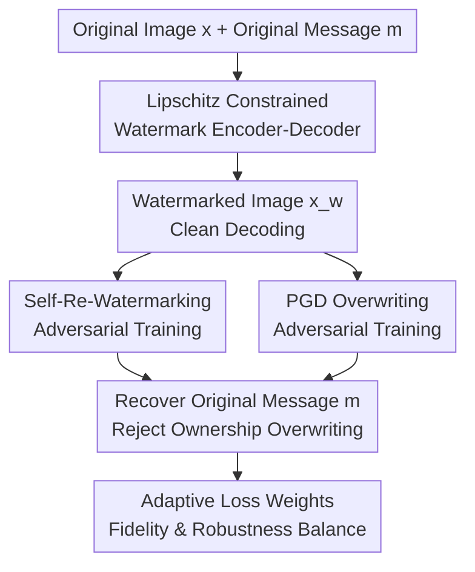

# The Self-Re-Watermarking Trap: From Exploit to Resilience

**Conference**: ICLR 2026  
**OpenReview**: [https://openreview.net/forum?id=st1hrLTP14](https://openreview.net/forum?id=st1hrLTP14)  
**Code**: https://github.com/SVithurabiman/SRW  
**Area**: AI Security / Image Watermarking Robustness  
**Keywords**: Self-Re-Watermarking, Image Watermarking security, White-box attack, Lipschitz constraint, Adversarial training  

## TL;DR
This paper demonstrates that deep image watermarking systems can be easily overwritten by "re-writing a new watermark using the same encoder," thereby compromising original ownership. It proposes a self-aware watermarking framework with Lipschitz constraints and re-watermarking adversarial training, enabling stable recovery of the original watermark even after self-re-watermarking and PGD overwriting attacks.

## Background & Motivation
**Background**: Deep learning-based image watermarking usually adopts an encoder-decoder architecture: the encoder embeds a bitstream message into an image, and the decoder recovers the message from the watermarked image. Compared to traditional methods like DWT/DCT/SVD, these models achieve better empirical performance in balancing visual quality and robustness to distortions like JPEG, cropping, and blurring, making them technical foundations for digital content copyright protection and provenance verification.

**Limitations of Prior Work**: Most methods assume the watermark is "written only once." During training, they focus on whether the first embedding is imperceptible and recoverable after common image processing, but fail to address scenarios where a "previously watermarked image is rewritten by the same encoder." If an attacker acquires the model, they can use the original encoder to embed their own message $m'$ into the watermarked image $x_w$. Many systems then bias the decoder toward the new message, causing the original message $m$ to degrade to near-random guessing.

**Key Challenge**: Self-re-watermarking is more dangerous than cross-model re-watermarking because the attack does not introduce a significantly different embedding pattern. In cross-model scenarios, inconsistencies between embedding traces and decoders often expose anomalies; in self-re-watermarking, the system's own embedding function is used to overwrite its own old message. This maintains visual naturalness while transferring ownership from the original author to the attacker.

**Goal**: The authors first formalize this white-box threat model to prove it is a systemic vulnerability in current deep watermarking designs rather than an isolated flaw. Subsequently, they design a watermarking system that maintains high fidelity and standard robustness during the first embedding while prioritizing the recovery of the original message under scenarios like same-encoder rewriting, PGD target message attacks, and similar-model overwriting.

**Key Insight**: The paper observes that successful rewriting depends on the model being overly sensitive to input changes. A watermarked image only needs to be slightly shifted by the encoder or gradient perturbations to push the decoder logits across the decision boundary. Instead of detecting every attack post-hoc, it is better to limit the sensitivity of the encoder-decoder through architecture and training objectives, ensuring that perturbations from rewriting are insufficient to flip the original bits.

**Core Idea**: Use Lipschitz constraints to reduce the sensitivity of the watermarking model to input perturbations, and employ self-re-watermarking and PGD overwriting samples for adversarial training. This ensures that "re-writing a new watermark" either fails to change the decoding result or results in significant image degradation, thus destroying the attacker's gain from ownership hijacking.

## Method

### Overall Architecture
The paper formalizes the self-re-watermarking attack as a white-box overwriting process: the original image $x$ and message $m$ pass through the encoder to produce $x_w=E(x,m)$. The attacker then uses the same encoder to write a target message $m'$, resulting in $x'_w=E(x_w,m')$. On the defense side, a self-aware watermarking system is trained so that the decoder $D$ recovers the original message $m$ when presented with $x_w$, standard distorted versions, PGD-perturbed versions, and $x'_w$, resisting the pull of the target message.

The framework consists of four contributing components: applying spectral normalization to the architecture to control sensitivity; explicitly simulating self-re-watermarking attacks during training; incorporating PGD target message overwriting attacks; and using adaptive loss weights to balance training between visual quality, clean decoding, and attack robustness.

The encoder uses a U-Net with ResNet-50 auxiliary features. The message is expanded into a spatial map via a spectrally normalized linear layer and concatenated with the RGB image as a 4-channel input; the encoder outputs a residual image added to the original. The decoder is a convolutional network where each block uses spectral normalization, GroupNorm, and ReLU, finally outputting $L$ message logits. Differentiable or approximate differentiable noises such as JPEG, Gaussian blur, dropout, cropout, crop, flip, scaling, and rotation are randomly added during training to prevent the model from losing robustness to common image processing while defending against self-re-watermarking.

### Key Designs
**1. Self-re-watermarking threat model: Transforming intuition into a measurable attack**

The paper defines the attacker as a white-box adversary with access to the encoder $E$, decoder $D$, training pipeline, and the ability to reproduce similar models. The core attack is Encoder-Based Self-Re-Watermarking: the attacker embeds a target message $m'$ into an already watermarked $x_w$ using the same encoder, producing $x'_w=E(x_w,m')$. If the decoder reads $m'$ or fails to recover $m$, the proof of copyright is overwritten.

The importance of this definition lies in isolating the question: "Can old watermarks still be trusted after a model leak?" Many papers only test JPEG, cropping, and noise, but ignore the abuse of the watermarking tool itself. After testing methods like HiDDeN, MBRS, SSL, ARWGAN, WFormer, and VINE, the authors found that the original message accuracy (ACCorig) typically falls to roughly 50% after self-re-watermarking, equivalent to random guessing, while the PSNR remains above 30dB, meaning the attack is not visually obvious.

**2. Lipschitz constrained watermarking model: Protecting decoding boundaries with bounded sensitivity**

The theoretical core of the defense is controlling the response magnitude of the decoder to image changes. The paper assumes the decoder satisfies $\|D(x_1)-D(x_2)\|_\infty \le K_D\|x_1-x_2\|_\infty$ and defines the margin of the $i$-th bit on a clean watermark as $\Delta_i(x,m)=m_iD_i(E(x,m))$. If the image perturbation caused by self-re-watermarking is $\delta_\infty=\|x'_w-x_w\|_\infty$, the $i$-th bit will not flip as long as $K_D\delta_\infty < \Delta_i$.

Therefore, the paper does not simply ask the network to memorize what "overwritten samples look like," but uses spectral normalization to constrain the operator norm of convolutional and linear layers, keeping logit changes controlled. The corresponding upper bound for bit error rate is $BER(x,m,m') \le \frac{1}{L}\sum_i \mathbf{1}(\Delta_i(x,m)\le K_D\delta_\infty)+\epsilon_{rec}$. This provides an intuitive security condition: if the clean decoding margin is large enough and model sensitivity is low enough, overwriting perturbations cannot easily cross the decision boundary.

**3. Self-re-watermarking and PGD overwriting adversarial training: Facing the attacker during training**

Lipschitz constraints alone are insufficient, as excessive constraints sacrifice embedding capacity, visual quality, and standard robustness. The authors explicitly construct two types of attack samples during training: self-re-watermarking samples ($x'_w$) and PGD target attacks. The latter finds a perturbation $\psi$ within an $\ell_\infty$ radius $\epsilon$ such that $D(x_w+\psi)$ approaches the attacker's target message $m_g$.

The training objective is not for the decoder to follow the attack target, but to recover the original message $m$ after these attacks. This internalizes the "attacker's overwriting strategy" into the training distribution, forcing the decoder to learn features insensitive to overwriting traces and stable for the original message. PGD training uses a curriculum: the perturbation budget starts near 0 and gradually increases to $\epsilon=0.05$ with a step size $\alpha=0.009$ over 50 iterations to prevent the model from collapsing under strong attacks early on.

**4. Adaptive loss weights: Preventing security from crushing usability**

The loss function includes goals for fidelity, clean recovery, and robust recovery. Fidelity loss is $L_{fid}=MSE(x,x_w)+\lambda_{lpips}LPIPS(x,x_w)$, clean recovery uses $L_{rec}=BCE(D(x_w),\phi(m))$, and the robustness term focuses on recovering $m$ after self-re-watermarking and PGD attacks. Fixed weights are fragile: high fidelity weights cause unstable decoding; high robustness weights degrade image quality and standard distortion performance.

The authors dynamically adjust $\lambda_{lpips}$, $\lambda_{rec}$, and $\lambda_{rob}$ based on the clean BER and post-overwriting BER during training. Intuitively, when the model cannot accurately read the clean watermark, training emphasizes recovery; as clean recovery and robustness stabilize, the weights shift toward visual quality and overall balance. Appendix experiments show $\lambda_{lpips}=0.5$ is a stable trade-off: PSNR reaches 34.03dB, SSIM is 0.97, and ACCorig for JPEG, blur, dropout, and crop remains high.

### Loss & Training
The overall optimization objective can be summarized as $\min_{\theta_E,\theta_D}\mathbb{E}_{x,m,m'}[\lambda_{fid}L_{fid}+\lambda_{rec}L_{rec}+\lambda_{rob}L_{rob}]$. Here, $L_{fid}$ maintains visual consistency between $x_w$ and $x$, $L_{rec}$ ensures the clean watermark is readable, and $L_{rob}$ requires original message recovery from self-re-watermarking and PGD-perturbed samples. Training uses a COCO subset (20,000 training, 1,000 validation, 3,000 testing images), resized to $128\times128$ with message length $L=30$.

Implementation-wise, spectral normalization is applied to all layers for Lipschitz control. The noise model randomly samples from common image perturbations in each iteration. A post-processing module with Gaussian blur and low-amplitude suppression can be used during inference to improve visual quality. A version without post-processing was also tested, showing slightly lower PSNR but higher recovery rates in high-security scenarios.

## Key Experimental Results

### Main Results
The method was validated from three perspectives: susceptibility of SOTA methods to self-re-watermarking; effectiveness of the proposed method in preserving the original message; and performance on standard image processing and visual quality. ACCorig represents the bit accuracy for recovering the original message.

| Method | PSNR(dB) | SSIM | JPEG(50) | Gaussian Blur(2.0) | Self Re-embed | PGD Moderate | PGD Strong |
|------|----------|------|----------|---------------------|---------------|--------------|------------|
| HiDDeN | 33.55 | 0.92 | 63.00 | 96.00 | 51.29 | 52.03 | 51.45 |
| MBRS | 35.84 | 0.89 | 91.97 | 100.00 | 50.34 | 63.51 | 51.26 |
| ARWGAN | 35.87 | 0.96 | 93.98 | 99.99 | 51.94 | 50.68 | 50.73 |
| WFormer | 33.50 | 0.91 | 99.14 | 100.00 | 50.02 | 88.64 | 80.15 |
| VINE | 37.07 | 0.99 | 99.97 | 99.84 | 51.20 | 82.00 | 79.41 |
| **Ours** | 34.03 | 0.97 | 95.06 | 99.66 | 100.00 | 99.95 | 99.37 |

These results indicate that self-re-watermarking is not an attack that "standard robustness automatically solves." While VINE and WFormer excel in JPEG and blur, they fall to random guessing after same-encoder rewriting. The proposed method maintains nearly perfect recovery across all attack categories without being the highest PSNR method.

Generalization results across MIRFLICKR, CelebA, and ImageNet show PSNR around 33-35dB, SSIM around 0.96-0.97, and ACCorig for self-re-watermarking near 100%, demonstrating the method is not overfitted to COCO.

### Ablation Study
| Config | PSNR | SSIM | ACCclean | After Self OW ACCorig | After PGD Moderate ACCorig | After PGD Strong ACCorig | Description |
|------|------|------|----------|--------------------|--------------------------|------------------------|------|
| **Ours** | 34.03 | 0.97 | 100.00 | 100.00 | 99.95 | 99.37 | Full method, best balance |
| w/o Post Processing | 31.82 | 0.96 | 100.00 | 100.00 | 100.00 | 99.99 | Secure bias, slightly lower quality |
| w/o Spectral Norm | 30.40 | 0.94 | 99.90 | 76.33 | 99.57 | 98.90 | Self OW drops significantly |

| Training Setup | PSNR | SSIM | JPEG(50) | Gaussian Blur(2.0) | Dropout(30%) | Cropout(30%) | Crop(3.5%) | Conclusion |
|----------|------|------|----------|---------------------|--------------|--------------|------------|------|
| $\lambda_{LPIPS}=0.3$ | 32.39 | 0.97 | 99.63 | 99.90 | 99.93 | 99.88 | 99.61 | Strong robustness, lower quality |
| $\lambda_{LPIPS}=0.5$ | 34.03 | 0.97 | 95.06 | 99.66 | 98.90 | 98.14 | 99.85 | Used in main results, good trade-off |
| $\lambda_{LPIPS}=0.7$ | 39.51 | 0.99 | 88.08 | 99.15 | 99.48 | 99.53 | 92.06 | High quality, but JPEG/crop drop |

### Key Findings
- Self-re-watermarking is a common weakness: Current SOTA models fall to ~50% ACCorig, showing they do not systematically protect the original watermark against encoder reuse.
- Spectral normalization is critical. Without it, the model performs well under PGD but ACCorig drops from 100.00 to 76.33 after self-overwrite, supporting the claim that limiting sensitivity is essential for preventing same-encoder overwriting.
- PGD attacks are not entirely invalidated, but the available budget is constrained by visual quality. PSNR thresholds around 30dB limit $\epsilon$; beyond this, original recovery drops, but image quality falls below commercially acceptable levels.
- Repeated or multi-stage attacks have boundaries. While using tools like CtrlRegen+ to remove and then re-embed can succeed, it results in poor quality (PSNR 20.50-23.27, SSIM 0.59-0.72), making the attack visible.

## Highlights & Insights
- The identification of a realistic yet overlooked threat: Once a model is leaked, the simplest attack is using its own encoder for overwriting. This threat model is highly grounded as model leaks and API abuse are practical concerns.
- Theoretical analysis provides clear defensive direction. The condition $K_D\delta_\infty < \Delta_{min}$ explains spectral normalization's role: it prevents logit shifts from crossing the decision boundary by ensuring the clean watermark has a sufficient margin and the model has low sensitivity.
- Defensive strategy forces a trade-off for the attacker. If rewriting doesn't change the message, the attack fails; if repeated rewriting creates artifacts, the attack cannot masquerade as legitimate copyright.
- Adaptive loss weight optimization is a valuable engineering insight for balancing the inherent conflict between security constraints, fidelity, and recovery.

## Limitations & Future Work
- The focus is on direct self-re-watermarking and norm-bounded PGD. Multi-stage "remove-then-rewrite-then-restore" attacks are only preliminary explored, and stronger generative restoration might require more systematic defenses.
- Current experiments are limited to $128\times128$ and $256\times256$ resolutions. Real-world deployment involves more complex pipelines like high-res social media compression and screenshotting.
- Training cost is higher due to spectral normalization and adversarial loops. While inference is relatively fast, the parameter count (37.09M) might still be heavy for some edge deployments.
- Pure image-level robustness does not solve broader ownership governance if an attacker can manipulate the decoder, verification protocols, or blockchain registries.

## Related Work & Insights
- **vs HiDDeN / MBRS / WFormer**: These focus on robustness to distortions like JPEG, cropping, and noise. This work advances from "distortion resistance" to "encoder abuse resistance."
- **vs VINE**: VINE is strong against large-scale image editing and generative removal, but this work shows that even with VINE, same-encoder rewriting can render the original watermark recovery near-random.
- **vs dual watermarking / high-frequency overwriting**: While some methods handle specific overwriting cases under narrower assumptions, this work provides a unified defense logic through Lipschitz constraints and margin analysis.
- **Insights**: Any copyright protection system with publicly accessible models should test for security against model reuse and cloning. This concept is transferable to audio/video watermarking and generative content provenance.

## Rating
- Novelty: ⭐⭐⭐⭐⭐ Defining self-re-watermarking as an independent threat and proving it as a systemic vulnerability is highly significant.
- Experimental Thoroughness: ⭐⭐⭐⭐☆ Solid coverage of SOTA, PGD, and multi-dataset ablation; multi-stage generative attacks could be explored deeper.
- Writing Quality: ⭐⭐⭐⭐☆ Clear narrative flow and supporting evidence; minor symbol notation details require careful reading of the pipeline.
- Value: ⭐⭐⭐⭐⭐ Direct implications for deployment: watermarking systems cannot rely solely on the secrecy of the encoder and must include self-rewriting in their benchmarks.

<!-- RELATED:START -->

## Related Papers

- [\[CVPR 2026\] The Coherence Trap: When MLLM-Crafted Narratives Exploit Manipulated Visual Contexts](../../CVPR2026/ai_safety/the_coherence_trap_when_mllm-crafted_narratives_exploit_manipulated_visual_conte.md)
- [\[ICLR 2026\] MUSE: Model-Agnostic Tabular Watermarking via Multi-Sample Selection](muse_model-agnostic_tabular_watermarking_via_multi-sample_selection.md)
- [\[AAAI 2026\] Robust Watermarking on Gradient Boosting Decision Trees](../../AAAI2026/ai_safety/robust_watermarking_on_gradient_boosting_decision_trees.md)
- [\[ECCV 2024\] Resilience of Entropy Model in Distributed Neural Networks](../../ECCV2024/ai_safety/resilience_of_entropy_model_in_distributed_neural_networks.md)
- [\[CVPR 2026\] AdvMark: Decoupling Defense Strategies for Robust Image Watermarking](../../CVPR2026/ai_safety/decoupling_defense_strategies_for_robust_image_watermarking.md)

<!-- RELATED:END -->
