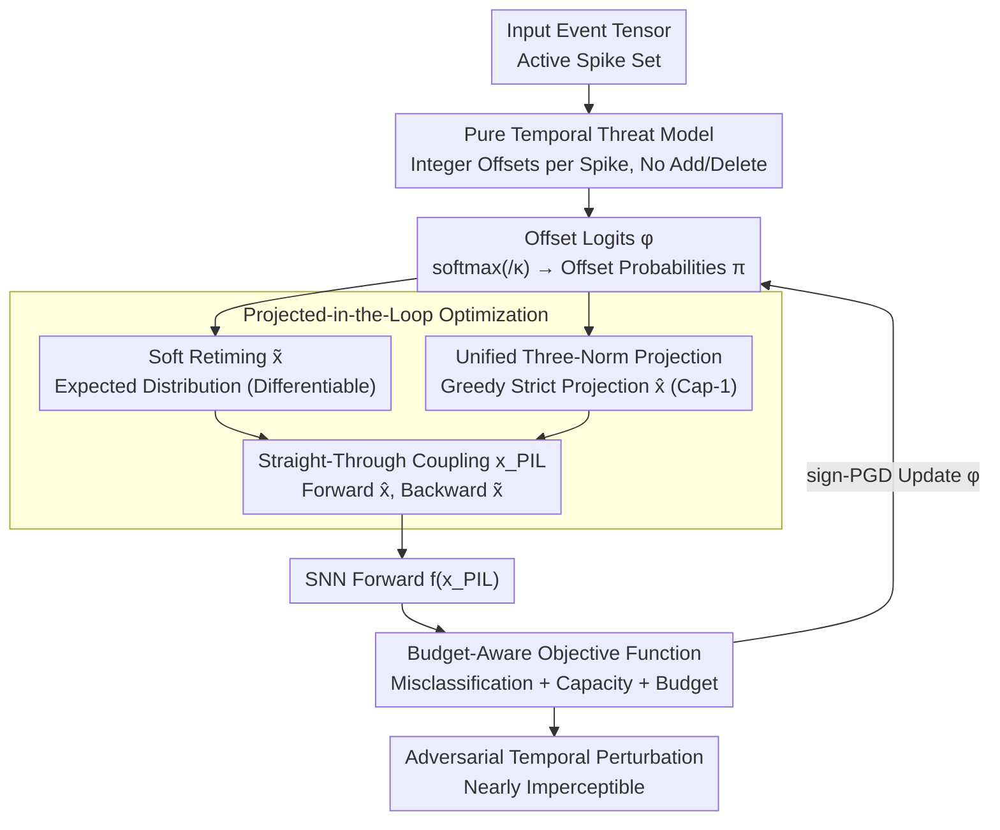

# Time Is All It Takes: Spike-Retiming Attacks on Event-Driven Spiking Neural Networks

**Conference**: ICLR 2026  
**arXiv**: [2602.03284](https://arxiv.org/abs/2602.03284)  
**Code**: [github.com/yuyi-sd/Spike-Retiming-Attacks](https://github.com/yuyi-sd/Spike-Retiming-Attacks)  
**Area**: Adversarial Security in Spiking Neural Networks  
**Keywords**: Spiking Neural Networks, Adversarial Attacks, Spike Retiming, Event-driven, Temporal Robustness, LIF Neuron

## TL;DR
The authors propose the Spike-Retiming Attack—a temporal attack method that alters spike timestamps without adding or deleting spikes. By formalizing a unified three-norm budget ($\mathcal{B}_\infty$ local jitter, $\mathcal{B}_1$ total delay, and $\mathcal{B}_0$ manipulation count) under a capacity-1 constraint, and utilizing Projected-in-the-Loop (PIL) optimization to decouple strict forward projections from soft backward differentiation, the method achieves >90% ASR on CIFAR10-DVS, DVS-Gesture, and N-MNIST with <2% spike perturbation. This reveals a critical temporal vulnerability in event-driven SNNs.

## Background & Motivation

**Temporal Computing Characteristics of SNNs**: Spiking Neural Networks (SNNs) rely on discrete spikes and temporal coding for computation, offering low power consumption and low latency advantages on neuromorphic processors. Direct training of SNNs via Spatio-Temporal Backpropagation (STBP) and surrogate gradients has reached near-ANN accuracy, with temporal information playing a decisive role in their computations.

**Limitations of Prior Work**: Existing SNN adversarial attacks (such as PGD, RGA, HART, SpikeFool, and PDSG-SDA) primarily inherit strategies from the image domain by modifying intensity values or the number of events. These attacks alter the energy or firing rate statistics, making them easily detectable by intensity- or rate-based defensive measures.

**Realism of Timing Attacks**: Event cameras naturally exhibit timestamp noise (jitter) and readout latency, and SNN pipelines typically quantize events into discrete time bins. Attacks that only change timestamps while keeping spike counts and amplitudes constant fall entirely within the range of sensor temporal uncertainty. These attacks do not change frame-level intensity or rate statistics, making them extremely difficult to detect with existing defenses.

**Defense Gap**: Conventional defenses (such as certified robustness, adversarial training, and bio-inspired mechanisms) focus on regularizing intensity, rate, or membrane potential perturbations. Very few schemes address input temporal perturbations, leaving a significant gap in temporal robustness evaluation.

**Paradigm Shift from Addition/Deletion to Reallocation**: While traditional attacks search in the 0-norm space of "adding/deleting spikes," this paper transforms the attack into a "reallocation" problem on the time axis. It redistributes spike timestamps while maintaining a capacity-1 constraint for each event line, making it applicable to both binary and integer event grids.

## Method

### Overall Architecture

The study shifts the focus from "where to add or delete spikes" to "when existing spikes should be moved," reframing adversarial attacks as a temporal reallocation problem. The process begins with a pure temporal threat model where each active spike is assigned a set of offset logits, softened into offset probabilities $\pi$. The framework then splits into two paths: the forward pass applies a strict projection to the discrete event grid based on probabilities (satisfying capacity constraints and norm budgets), while the backward pass utilizes soft retiming results in an expected sense to propagate gradients. These paths are coupled via a straight-through estimator and fed into the SNN to calculate classification loss. Finally, a budget-aware objective function drives the sign-PGD iteration to update the logits, decoupling discrete feasibility from gradient optimization to find nearly imperceptible temporal perturbations across three norm budgets.

### Key Designs

**1. Pure Temporal Threat Model: Shifting Timestamps Without Addition or Deletion**

The attack targets the input event tensor $\bm{x} \in \mathbb{Z}_{\geq 0}^{T \times C \times H \times W}$. For each active spike $(s, j) \in \mathcal{A}(\bm{x})$, the attacker selects an integer offset $\delta_{s,j}$ to move it from time $s$ to $t = s + \delta_{s,j}$. The placement function $P(\bm{x}; \delta)$ replays the spike at the new time. This design ensures that frame-level energy and firing rate statistics remain unchanged, staying within the bounds of natural timestamp jitter and readout latency which makes the attack difficult for statistical defenses to detect. Constraints ensure $0 \leq t < T$ and mandate **capacity-1 non-overlapping**, meaning each event line at each time bin holds at most one spike. This applies to both binary grids and integer grids (by splitting counts into individual unit packets).

**2. Unified Three-Norm Budget: A Framework for Different Stealth Preferences**

To provide adjustable and clear semantic budgets, perturbation intensity is characterized by three norms. $\mathcal{B}_\infty(\varepsilon)$ limits the maximum jitter per spike $|\delta_{s,j}| \leq \varepsilon$, corresponding to sensor uncertainty. $\mathcal{B}_1(\varepsilon)$ limits the total temporal offset $\sum |\delta_{s,j}| \leq \varepsilon$, providing a global knob scaled by event density. $\mathcal{B}_0(\varepsilon)$ limits the number of manipulated spikes $\sum \mathbb{I}\{\delta_{s,j} \neq 0\} \leq \varepsilon$, targeting a minimal footprint. All three use a unified optimization framework with substituted budget penalty terms.

**3. Projected-in-the-Loop (PIL) Optimization: Decoupling Feasibility and Differentiability**

The core challenge involves the discrete search space of integer offsets and capacity constraints. PIL uses straight-through estimation to address this. It introduces offset logits for each spike over a feasible set $\mathcal{U}_p$, converted to probabilities $\pi[s,j,u] = \text{softmax}(\phi[s,j,u]/\kappa)$. This allows for a differentiable **soft retiming result** $\tilde{\bm{x}} = S_\pi(\bm{x})$ for gradient flow and a **strict projection result** $\hat{\bm{x}} = P^*(\bm{x}; \pi, \mathcal{B}_p(\varepsilon))$ for the forward pass (placing spikes greedily based on probability). Coupled as $\bm{x}_{\text{PIL}} = \hat{\bm{x}} + (\tilde{\bm{x}} - \text{stopgrad}(\tilde{\bm{x}}))$, the network sees the strictly feasible $\hat{\bm{x}}$ during forward passes while gradients flow through $\tilde{\bm{x}}$. Ablation shows that removing PIL drops ASR in binary $\mathcal{B}_1$ from 98.5% to 84.3%.

**4. Budget-Aware Objective Function: Driving Misclassification, Capacity, and Budget Simultaneously**

The logits are trained using the objective:

$$\mathcal{J} = \mathcal{L}(f(\bm{x}_{\text{PIL}}), y) - \lambda_{\text{cap}} \cdot \text{Cap}(\pi; \bm{x}) - \lambda_{\text{budget}} \cdot \mathcal{R}_p(\pi; \varepsilon)$$

The task loss $\mathcal{L}$ maximizes cross-entropy for non-targeted misclassification. The capacity regularization $\text{Cap} = \frac{1}{|\mathcal{A}|} \sum_{j,t} [\text{occ}[t,j] - 1]_+^2$ penalizes bins where expected occupancy exceeds 1, pushing the distribution toward feasibility. The budget penalty $\mathcal{R}_p$ is a normalized hinge loss guiding logits to converge within norm limits. Logits are updated via clipped sign-PGD: $\phi \leftarrow \text{clip}_{[-\phi_{\max}, \phi_{\max}]}(\phi + \alpha \cdot \text{sign}(\nabla_\phi \mathcal{J}))$, with default hyperparameters $\kappa=1, \alpha=1, \phi_{\max}=10, \lambda_{\text{cap}}=20, \lambda_{\text{budget}}=10$.

## Key Experimental Results

### Experimental Settings
- **Datasets**: CIFAR10-DVS (10 classes), DVS-Gesture (11 classes), N-MNIST (10 classes)
- **Models**: ConvNet, Spiking ResNet18, VGGSNN, SpikingResformer (all directly trained SNNs)
- **Time Bins**: $T=10$; Metric: Attack Success Rate (ASR)

### Main Results (Binary Grid)

| Dataset | Model | Clean Acc | $\mathcal{B}_\infty(1)$ | $\mathcal{B}_\infty(3)$ | $\mathcal{B}_0$ Max |
|--------|------|---------|------------------------|------------------------|---------------------|
| N-MNIST | ConvNet | 99.06% | **100%** | 100% | 98.5% (400) |
| N-MNIST | ResNet18 | 99.62% | **100%** | 100% | 100% (300) |
| DVS-Gesture | VGGSNN | 95.14% | 96.4% | 100% | 98.9% (4k) |
| DVS-Gesture | SpResF | 91.67% | 92.1% | 100% | 99.2% (4k) |
| CIFAR10-DVS | SpResF | 81.30% | **100%** | 100% | 100% (4k) |

**Key Findings**: Under $\mathcal{B}_\infty$, a jitter of just 1-bin is enough to saturate ASR; under $\mathcal{B}_0(4\text{k})$ for DVS-Gesture, >98% ASR is achieved by altering only 2.45% of spikes.

### Main Results (Integer Grid)

| Dataset | Model | Clean Acc | $\mathcal{B}_\infty(1)$ | $\mathcal{B}_\infty(3)$ | $\mathcal{B}_0$ Max |
|--------|------|---------|------------------------|------------------------|---------------------|
| N-MNIST | VGGSNN | 99.71% | 46.3% | 100% | 49.8% (600) |
| DVS-Gesture | ResNet18 | 94.40% | 71.0% | 93.3% | 98.1% (8k) |
| DVS-Gesture | SpResF | 92.71% | 70.7% | 84.0% | 80.6% (8k) |
| CIFAR10-DVS | SpResF | 82.90% | **100%** | 100% | 100% (8k) |

**Key Findings**: SNNs on integer grids generally exhibit higher robustness under $\mathcal{B}_1$ and $\mathcal{B}_0$, requiring larger budgets for similar ASR levels. This is attributed to smoother pre-activation distributions, stable integration of temporal convolutions/normalization, and reduced fluctuations in surrogate gradients and BN statistics.

### Ablation Study (DVS-Gesture + VGGSNN)

| Variant | Binary $\mathcal{B}_\infty(1)$ | Binary $\mathcal{B}_1(8k)$ | Binary $\mathcal{B}_0(4k)$ | Integer $\mathcal{B}_\infty(3)$ | Integer $\mathcal{B}_0(8k)$ |
|------|------------|------------|------------|------------|------------|
| Full Method | 96.4% | 98.5% | 98.9% | 85.0% | 95.9% |
| w/o PIL | 92.7% | 84.3% | 88.6% | 63.0% | 83.1% |
| w/o Cap | 95.6% | 98.5% | 98.5% | 77.6% | 89.6% |
| w/o $\mathcal{R}_p$ | — | 76.6% | 93.0% | — | 84.9% |

PIL is the most significant contributor (Binary $\mathcal{B}_1$: 98.5%→84.3%), while the budget penalty $\mathcal{R}_p$ has the most pronounced effect on $\mathcal{B}_1$.

## Highlights & Insights

1. **First Pure Temporal Threat Model**: It formalizes a temporal attack that maintains spike counts and amplitudes, supporting three norm budgets ($\mathcal{B}_\infty/\mathcal{B}_1/\mathcal{B}_0$) across both binary and integer event grids, filling a gap in SNN temporal robustness evaluation.

2. **Ingenious PIL Optimization**: By using a forward strict projection for feasibility and a backward soft differentiation for gradients, combined with capacity regularization and budget-aware penalties, the framework achieves efficient gradient-guided searches within discrete constraints.

3. **High Stealth**: The attack does not alter frame-level intensity or rate statistics and remains within sensor temporal uncertainty ranges. On DVS-Gesture, models can be compromised by tampering with <2.5% of spikes, making it difficult for existing defenses (filtering, adversarial training) to counter.

4. **Discovery of Polarity-Specific Shift Patterns**: Positive polarity channels tend toward delays (red-shift) while negative polarity channels tend toward advances (blue-shift), revealing asymmetric temporal dependencies in SNNs for positive and negative events.

## Limitations & Future Work

1. **White-box Assumption**: The current attack requires full model access (parameters and gradients). Performance in black-box scenarios is limited, and cross-architecture transferability requires further study.

2. **Low Targeted Attack Success Rate**: Compared to non-targeted ASR (>90%), targeted ASR is significantly lower (approx. 25% under $\mathcal{B}_\infty(1)$), necessitating more effective targeted optimization strategies.

3. **High Cost of Adversarial Training**: Adversarial training with spike-retiming significantly degrades clean accuracy (dropping to 22-48% on binary grids), and the robustness gains are limited, suggesting current defense frameworks are ill-suited for pure temporal threats.

4. **Performance Sensitivity to Time Bins**: As the number of time bins $T$ increases (e.g., from 10 to 40), the ASR for binary grids under a fixed $\mathcal{B}_0$ budget drops significantly (from 98.9% to 13.3%), indicating attack efficiency is inversely related to temporal resolution.

5. **Computational Overhead**: The strict projection step involves sorting and greedy scanning, and scalability to large-scale event streams has not been fully explored.

## Related Work & Insights

- **SNN Training**: STBP (Wu et al., 2018), tdBN (Zheng et al., 2021), TET (Deng et al., 2022), Surrogate Gradients (Li et al., 2021).
- **SNN Adversarial Attacks**: RGA (Bu et al., 2023), HART (Hao et al., 2024), SpikeFool (Büchel et al., 2022), GSAttack (Yao et al., 2024), PDSG-SDA (Lun et al., 2025).
- **SNN Defense**: Certified Robustness via IBP/Randomized Smoothing (Mukhoty et al., 2024), Gradient Sparsity Regularization (Liu et al., 2024d), Potential Disturbance Minimization (Ding et al., 2024a), DVS Noise Filtering (Marchisio et al., 2021b).

## Rating

| Dimension | Rating |
|------|------|
| Novelty | ⭐⭐⭐⭐⭐ |
| Theoretical Depth | ⭐⭐⭐⭐ |
| Experimental Thoroughness | ⭐⭐⭐⭐⭐ |
| Value | ⭐⭐⭐⭐ |
| Writing Quality | ⭐⭐⭐⭐ |

**Overall Recommendation**: ⭐⭐⭐⭐⭐ — A pioneering work that systematically evaluates the temporal robustness of SNNs. The threat model is rigorously formalized, and experiments are comprehensive across 3 datasets, 4 models, 3 norms, and 2 grid types. The PIL optimization framework effectively bridges discrete feasibility and gradient optimization, exposing fundamental temporal vulnerabilities in event-driven SNNs.

<!-- RELATED:START -->

## Related Papers

- [\[ICLR 2026\] Robust Spiking Neural Networks Against Adversarial Attacks](robust_spiking_neural_networks_against_adversarial_attacks.md)
- [\[ICLR 2026\] Robustify Spiking Neural Networks via Dominant Singular Deflation under Heterogeneous Training Vulnerability](robustify_spiking_neural_networks_via_dominant_singular_deflation_under_heteroge.md)
- [\[AAAI 2026\] MPD-SGR: Robust Spiking Neural Networks with Membrane Potential Distribution-Driven Surrogate Gradient Regularization](../../AAAI2026/ai_safety/mpd-sgr_robust_spiking_neural_networks_with_membrane_potential_distribution-driv.md)
- [\[CVPR 2026\] Towards Reliable Evaluation of Adversarial Robustness for Spiking Neural Networks](../../CVPR2026/ai_safety/towards_reliable_evaluation_of_adversarial_robustness_for_spiking_neural_network.md)
- [\[ICLR 2026\] ATEX-CF: Attack-Informed Counterfactual Explanations for Graph Neural Networks](atex-cf_attack-informed_counterfactual_explanations_for_graph_neural_networks.md)

<!-- RELATED:END -->
