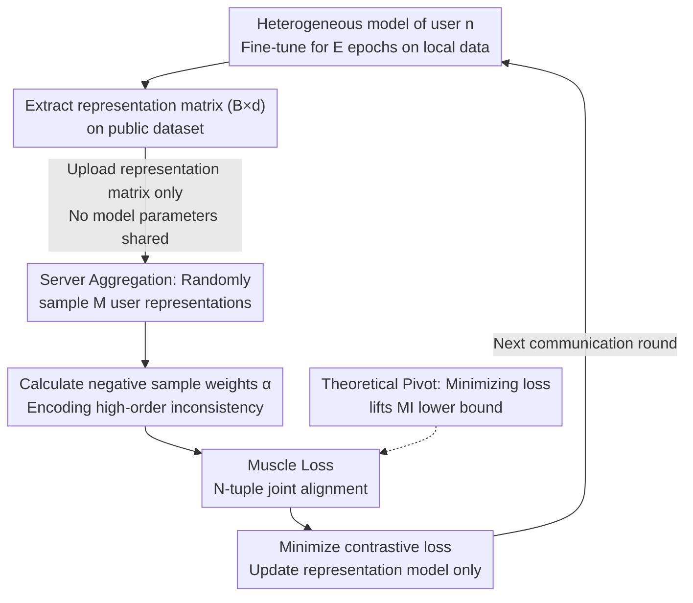

# Toward Enhancing Representation Learning in Federated Multi-Task Settings

**Conference**: ICLR 2026  
**arXiv**: [2602.01626](https://arxiv.org/abs/2602.01626)  
**Code**: Available (provided in supplementary material)  
**Institution**: Huawei Noah's Ark Lab, Montreal  
**Area**: AI Safety  
**Keywords**: Federated Multi-Task Learning, Contrastive Learning, Muscle Loss, Model Heterogeneity, Mutual Information Maximization

## TL;DR

This paper proposes Muscle loss—an N-tuple level multi-model contrastive learning objective whose minimization is equivalent to maximizing the lower bound of mutual information among all model representations. Based on this, the FedMuscle algorithm is designed to align the representation spaces of heterogeneous models using a public dataset. It naturally handles model and task heterogeneity, consistently outperforming SOTA baselines in CV/NLP multi-task settings (up to $\Delta$ +28.65%).

## Background & Motivation

**Background**: Federated Multi-Task Learning (FMTL) enables users with different tasks/models to collaborate on training without sharing data. With the proliferation of Foundation Models (FM), users choose different pre-trained models for fine-tuning based on resource constraints, making model and task heterogeneity the norm.

**Limitations of Prior Work**: Existing FMTL methods (FeSTA, FedBone, FedHCA2, FedLPS, etc.) assume users utilize fully or partially homogeneous model architectures (e.g., shared encoders), limiting the flexibility of model selection.

**Key Challenge (Pairwise Alignment)**: When more than two models are involved, existing methods apply InfoNCE pairwise to every pair of models $\rightarrow \mathcal{L}^n_{Pairwise} = \sum_{m \neq n} \mathcal{L}^{n,m}_{InfoNCE}$. This decomposition only captures binary dependencies and fails to effectively model joint dependencies among $N$ model representations.

**Limitations of Knowledge Distillation**: KD-based methods like FedDF and FCCL require models to have the same logit dimensions (i.e., models must associate with the same task), failing to handle cross-task heterogeneity.

**Lack of Theoretical Justification for Gramian Loss**: The Gramian contrastive loss proposed by Cicchetti et al. (2025) can align multiple models simultaneously but lacks theoretical justification and incurs high computational costs (requiring Gramian matrix determinants, $(M+1)^3$ higher complexity).

**Key Insight**: The fundamental purpose of sharing model parameters is to establish a shared representation space. Thus, the objective should be to learn a shared representation space directly rather than forcing parameter sharing. Through N-tuple contrastive learning combined with Mutual Information (MI) maximization theory, this goal can be achieved systematically.

## Method

### Overall Architecture

FedMuscle abandons the traditional Federated Learning approach of "synchronizing parameters" and instead allows each user to maintain their own heterogeneous models, aligning their representation spaces only on a public dataset accessible to all. In each communication round, users first fine-tune the entire model on local data, then send the representation matrix extracted from the public data to the server. The server aggregates representations from other users and returns them; users then minimize the Muscle contrastive loss to update only their representation models. **Mechanism**: The theoretical pivot of this design is that minimizing Muscle loss is equivalent to maximizing the lower bound of mutual information among all model representations, making representation alignment equivalent to cross-model knowledge transfer.

### Key Designs

**1. Muscle Loss: Upgrading Pairwise Alignment to N-tuple Joint Alignment**

Existing methods for more than two models sum InfoNCE pairwise: $\mathcal{L}^n_{Pairwise} = \sum_{m \neq n} \mathcal{L}^{n,m}_{InfoNCE}$. This fails to characterize joint dependencies. Muscle loss uses a single model representation $\bm{z}_i^n$ as the anchor, treats representations from all models for the same data point $i$ as positive samples, and combinations where at least one model corresponds to a different data point as negative samples. This models high-order joint dependencies in a single objective:

$$\mathcal{L}^n_{\text{Muscle}}(\bm{z}_i^n) = -\log \frac{\alpha_{(i,...,i)} \exp\left(\bm{z}_i^n \cdot \sum_{m \neq n} \bm{z}_i^m / \tau^{(N)}_{n,m}\right)}{\sum_{\bm{j} \in \mathcal{J}^n} \alpha_{\bm{j}} \exp\left(\bm{z}_i^n \cdot \sum_{m \neq n} \bm{z}^m_{j_m} / \tau^{(N)}_{n,m}\right)}$$

Since both positive and negative samples are defined based on public data points, there are no requirements for model architecture or task types.

**2. Weighting Coefficient $\alpha_{\bm{j}}$: Incorporating Negative Sample Similarities**

A key difference between Muscle loss and pairwise methods is the inclusion of a weight for each negative combination: $\alpha_{\bm{j}} = \exp\left(-\frac{1}{2} \sum_{m \neq n} \sum_{m' \neq n,m} \gamma^{(N)}_{m,m'} \bm{z}^m_{j_m} \cdot \bm{z}^{m'}_{j_{m'}}\right)$, where $\gamma^{(N)}_{m,m'} = 1/\tau^{(N-1)}_{m,m'} - 1/\tau^{(N)}_{m,m'}$ is always positive. This means $\alpha_{\bm{j}}$ is larger when non-anchor model representations in the negative sample are more dissimilar, emphasizing highly inconsistent combinations—high-order information discarded by pairwise methods. This weight is derived theoretically from optimal density ratios.

**3. MI Lower Bound Guarantee: Linking Contrastive Loss to Knowledge Transfer**

Theorem 1 shows $I(\bm{z}_i^n; \{\bm{z}_i^m\}_{m \neq n}) \geq (N-1)\log(B) - \mathbb{E}\mathcal{L}^n_{\text{Muscle}}(\bm{z}_i^n)$. Minimizing Muscle loss effectively raises the lower bound of mutual information. The lower bound becomes tighter as batch size $B$ increases, explaining why larger $B$ yields better experimental results.

**4. Communication Efficiency: Representation Sharing and User Sampling**

Each user only sends a $B \times d$ representation matrix (e.g., $32 \times 256$), which is bandwidth-efficient and provides a layer of privacy for pre-trained models. To avoid exponential growth of negative combinations, the server randomly samples $M$ representations from the other $N-1$ users for each user $n$, reducing complexity from $B^{N-1}$ to $B^M$. Experiments show $M=3$ balances performance ($\Delta$=+26.70%) and communication (0.956GB/round).

## Key Experimental Results

### Table 1: Setup1 Uni-modal Baseline Comparison (Pascal VOC Public Dataset)

| Method | User1 MLC | User4 IC100 | User6 IC10 | $\Delta$(\%) |
|------|-----------|-------------|------------|------|
| Local Training | 42.17 | 24.77 | 43.77 | 0.00 |
| CoFED | 47.47 | 24.67 | 43.40 | +5.83 |
| SimCLR | 40.80 | 27.43 | 49.03 | +3.57 |
| SAGE | 41.97 | 24.50 | 43.33 | +0.96 |
| FedHeNN | 41.27 | 24.10 | 41.63 | -0.41 |
| **FedMuscle** | **46.33** | **36.67** | **66.57** | **+26.70** |

### Table 2: Setup2 Multi-modal + Multi-task (CV+NLP, 10 Users)

| Method | MLC(U1-3) | IC100(U4-5) | IC10(U6) | SS(U7-8) | TC(U9-10) | $\Delta$(\%) |
|------|--------------|----------------|-------------|-------------|--------------|------|
| Local Training | 42-44 | 24-25 | 43.77 | 32-34 | 41-56 | 0.00 |
| **FedMuscle** | **47-51** | **29-36** | **61.60** | **33-34** | **46-54** | **+14.39** |

### Table 3: CreamFL Integration Experiment (35 Users, 5K Test Images)

| Method | i2t_R@1 | t2i_R@1 | $\Delta$(\%) |
|------|---------|---------|------|
| Local Training | 24.78 | 17.72 | 0.00 |
| CreamFL | 24.48 | 17.96 | +0.88 |
| **CreamFL+Muscle** | **25.50** | **18.20** | **+1.94** |

## Key Findings

1.  **Muscle Loss Consistently Outperforms Baselines**: On three public datasets (Pascal VOC/COCO/CIFAR-100), FedMuscle achieved $\Delta$ of +26.70%, +28.65%, and +16.88% respectively, significantly higher than second-place CoFED (+5.83% to +9.85%).
2.  **Public Dataset Quality Impact**: Datasets with detailed images (COCO/Pascal VOC) performed best. CIFAR-100 showed lower gains due to lack of detail, but FedMuscle remained effective across all.
3.  **Muscle vs. Gramian vs. Pairwise**: Muscle improved performance by 11.2% to 28.4% over Gramian loss across various datasets, demonstrating the advantage of the theoretical weighting coefficients.
4.  **Effectiveness in Non-IID Settings**: In a 12-user, 4-task setting with Dirichlet ($\alpha=0.1$) partition, FedMuscle achieved $\Delta=+17.40\%$, showing strong robustness.
5.  **M=3 is Optimal**: As $M$ increased from 1 to 5, $\Delta$ rose from +17.90% to +27.74%, but communication cost grew exponentially. $M=3$ represents the best trade-off.
6.  **Plug-and-play Capability**: Replacing LCR/GCA in CreamFL with Muscle improved multimodal retrieval performance.

## Highlights & Insights

-   **Paradigm Shift**: From "parameter sharing" to "representation space sharing." The core of FL is not parameter synchronization but representation alignment. This perspective is more fundamental and naturally supports model heterogeneity.
-   **Theoretical Necessity of N-tuple**: Analogous to the many-body problem, joint dependencies of $N$ models cannot be decomposed into $\binom{N}{2}$ pairwise dependencies. Weighting coefficients $\alpha_{\bm{j}}$ encode these high-order interactions.
-   **Tight MI Lower Bound**: The MI lower bound tightens as batch size $B$ increases, which is consistent with experimental observations.
-   **Practicality of LoRA**: Using LoRA (rank=16) on pre-trained FMs enables parameter-efficient fine-tuning and heterogeneity support, aligning with real-world deployment.

## Limitations

1.  **Exponential Communication Growth with M**: Downlink cost is $B^M \times d$. At $M=5$, it reaches 381GB/round, limiting large-scale user scenarios.
2.  **Public Dataset Dependency**: Requires a common dataset (~5000 samples), which might be unavailable in privacy-strict environments.
3.  **Limited Cross-modal Alignment**: Setup 2 showed smaller gains for Semantic Segmentation (SS) and Text Classification (TC) missions, indicating room for improvement in cross-modal transfer.
4.  **Manual Temperature Tuning**: $\tau^{(N)}_{n,m}$ and $\tau^{(N-1)}_{n,m}$ are fixed (0.2 and 0.15), lack an adaptive mechanism.

## Related Work & Insights

| Dimension | FedMuscle (Ours) | FedHeNN (Makhija 2022) | CreamFL (Yu 2023) |
|------|-----------------|----------------------|-------------------|
| Alignment | N-tuple Muscle Loss | CKA proximal term | LCR+GCA (pairwise) |
| Theory | MI Lower Bound | None (CKA reliability issues) | None |
| Model Heterogeneity | Full support | Support | Support (needs global model) |
| Task Heterogeneity | Full support | Partial support | No (same task) |
| Communication | Repr. matrix | Model parameters | Repr. + Gradient |
| Objective | Local models | Local models | Global model |

## Rating

-   **Novelty**: ⭐⭐⭐⭐⭐ (N-tuple multi-model contrastive learning + MI theory + weight derivation is highly original)
-   **Experimental Thoroughness**: ⭐⭐⭐⭐ (CV/NLP multimodal + various heterogeneous settings; missing larger scale >12 user verification)
-   **Writing Quality**: ⭐⭐⭐⭐⭐ (Rigorous theoretical derivation, consistent notation, logical flow)
-   **Value**: ⭐⭐⭐⭐ (Principled contribution to heterogeneous FL, though communication cost is a deployment bottleneck)

<!-- RELATED:START -->

## Related Papers

- [\[CVPR 2026\] FedRE: A Representation Entanglement Framework for Model-Heterogeneous Federated Learning](../../CVPR2026/ai_safety/fedre_a_representation_entanglement_framework_for_model-heterogeneous_federated_.md)
- [\[ICCV 2025\] Active Membership Inference Test (aMINT): Enhancing Model Auditability with Multi-Task Learning](../../ICCV2025/ai_safety/active_membership_inference_test_amint_enhancing_model_auditability_with_multi-t.md)
- [\[ICLR 2026\] Dataless Weight Disentanglement in Task Arithmetic via Kronecker-Factored Approximate Curvature](dataless_weight_disentanglement_in_task_arithmetic_via_kronecker-factored_approx.md)
- [\[ICLR 2026\] Adaptive Methods Are Preferable in High Privacy Settings: An SDE Perspective](adaptive_methods_are_preferable_in_high_privacy_settings_an_sde_perspective.md)
- [\[ICLR 2026\] Fair Conformal Classification via Learning Representation-Based Groups](fair_conformal_classification_via_learning_representation-based_groups.md)

<!-- RELATED:END -->
