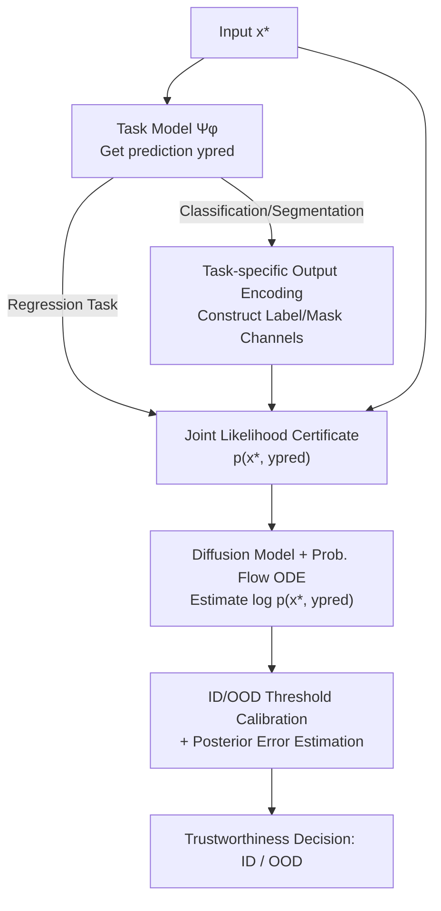

# Towards a Certificate of Trust: Task-Aware OOD Detection for Scientific AI

**Conference**: ICLR 2026  
**OpenReview**: [https://openreview.net/forum?id=2RuSWLQK82](https://openreview.net/forum?id=2RuSWLQK82)  
**Area**: AI Safety / Trustworthiness / OOD Detection / Scientific Machine Learning  
**Keywords**: OOD Detection, Diffusion Models, Joint Likelihood, Trust Certificate, Scientific Regression

## TL;DR
To address the prevalence of regression tasks in scientific computing, this paper utilizes a score-based diffusion model trained on the joint distribution $p(x, y_{\text{pred}})$. By treating the joint log-likelihood as a "certificate of trust" for model predictions, it demonstrates a strong correlation with actual prediction errors. This allows for determining whether an AI prediction is trustworthy (ID/OOD) without ground truth values at test time. The method is validated on various scientific datasets, including PDEs, satellite remote sensing, and brain tumor segmentation.

## Background & Motivation
**Background**: Deep learning is rapidly penetrating scientific computing. Tasks such as weather forecasting, fluid dynamics, and PDE solving increasingly replace traditional numerical methods with data-driven models like neural operators because they are computationally efficient and can learn patterns from historical data lacking analytical physical models. Most of these tasks are essentially **regression**: predicting a spatially or temporally varying physical field from initial or boundary conditions.

**Limitations of Prior Work**: Pure data-driven models are "interpolative"—performing well within the training distribution but significantly degrading on Out-of-Distribution (OOD) inputs without **actively signaling their failure**. While physical models still obey physical laws under extreme unseen conditions, neural networks provide no such guarantee. In other words, deep learning predictions **lack a certificate of trust**, leaving users unable to judge the accuracy of a given prediction.

**Key Challenge**: The field of OOD detection has revolved around **image classification** over the past decade (energy score, softmax confidence, density estimation, normalizing flows, etc.). However, the overwhelming majority of tasks in scientific computing are **regression**. While OOD detection in classification can rely on class confidence or discrete label density, regression outputs are continuous high-dimensional fields. These lack "class confidence," and defining an "anomaly" in the output is difficult. How to perform OOD detection for regression tasks remains a largely unsolved open problem.

**Goal**: Construct a metric $c(x^\star)$ as a certificate that (i) can be computed **without knowing the ground truth $y^\star$**, and (ii) correlates with the actual loss $\ell(y^\star, \Psi_\varphi(x^\star))$—where a low certificate value indicates "this prediction may be untrustworthy."

**Key Insight**: The authors noted that observing the density $p(x)$ of input $x$ is **task-agnostic**. The same input $x$ could be used for solving PDEs or other tasks; the input distribution does not contain information on "how difficult this task is at this specific point." Therefore, the certificate must incorporate the **model's prediction**.

**Core Idea**: Use the **joint likelihood** $p(x, y_{\text{pred}})$ of the "input + prediction" as the certificate and estimate this joint density using a score-based diffusion model. Samples with large prediction errors result in low joint likelihood, thus being classified as OOD.

## Method

### Overall Architecture
The system integrates "a regression/classification model to be evaluated $\Psi_\varphi$" with "an independently trained score-based diffusion denoiser $D_\theta$." The diffusion model learns the joint distribution $p(x, y)$ on training data pairs $(x_n, y_n)$ (notably, the diffusion model **never touches** $\Psi_\varphi$ during its training). During online evaluation, for any new input $x^\star$, $\Psi_\varphi$ first generates a prediction $y_{\text{pred}}=\Psi_\varphi(x^\star)$. Then $(x^\star, y_{\text{pred}})$ is fed into the diffusion model. The joint log-likelihood $\log p(x^\star, y_{\text{pred}})$ is calculated via path integration along the Probability Flow ODE, serving as certificate $c$. This is compared against an ID/OOD boundary calibrated from a small set of training samples. For discrete tasks like classification or segmentation, a task-specific output encoding step is performed before constructing the joint variables.

### Key Designs

**1. Joint Likelihood Certificate: Encoding "Task Difficulty" into Trust Metrics**

The authors address the limitation that "input density $p(x)$ alone cannot reflect task difficulty." They provide a heuristic derivation in the appendix showing the approximate relationship between error and likelihood:

$$\log\big(\ell(y^\star, \Psi_\varphi(x^\star))\big) \le \alpha\log(\epsilon) - \log\big(p(x^\star, y_{\text{pred}})\big) + O(\epsilon^\beta)$$

Where $\epsilon$ is the mean loss and $\alpha, \beta$ are positive constants. This implies: prediction error is negatively correlated with joint likelihood $p(x^\star, y_{\text{pred}})$; dense data areas (high likelihood) have small errors, while sparse areas (low likelihood) may have very large errors. Crucially, joint likelihood can be decomposed as:

$$\log p(x^\star, y_{\text{pred}}) = \log p(x^\star) + \log p(y_{\text{pred}} \mid x^\star)$$

The first term $p(x^\star)$ measures if the input itself falls within the training distribution; **the second term, conditional likelihood $p(y_{\text{pred}}\mid x^\star)$, is the core of "task-awareness"**—it characterizes how "natural/difficult" it is to predict $y_{\text{pred}}$ from $x^\star$. This term allows the certificate to surpass task-agnostic $p(x)$. In experiments on the NS-Sines dataset, where input likelihood $p(x)$ is high but the downstream PDE solving is difficult with large errors, $p(x)$ alone would misclassify it as trustworthy. However, the joint likelihood correctly assigns a low score due to the conditional term. This is the source of the term "task-aware."

**2. Score-based Diffusion + Probability Flow ODE for Joint Likelihood Estimation**

The joint density $p(x, y)$ is analytically intractable for high-dimensional fields, so this paper approximates it using diffusion models. Diffusion models map a Gaussian prior to the target distribution. The equivalent Probability Flow ODE is $\frac{dz}{dt} = -\tfrac12\sigma_t^2\, s(z(t);t)$, where $s$ is the score function. Precise log-density is obtained via path integration:

$$\log p_0(z(0)) = \log p_T(z(T)) - \int_0^T \tfrac12\sigma_t^2\,(\nabla\cdot s)(z(t);t)\,dt$$

The joint variable $z=(x, y)$ is fed into the system. The divergence term $\nabla\cdot s$ is approximated using a stochastic estimator, and the score is obtained from the trained denoiser $D_\theta$ via Tweedie's formula. This design offers three advantages: first, the likelihood is "calculated" rather than "learned" via a scalar head, which is theoretically rigorous; second, diffusion training does not rely on $\Psi_\varphi$, making the method **zero-shot and model-agnostic**—ablation studies show that switching backbones from CNO to ViT, UNet, or C-FNO while reusing the diffusion model maintains the likelihood-error correlation; third, computing the certificate for a single sample takes less than a second, far faster than Bayesian methods like MC-Dropout.

**3. ID/OOD Threshold Calibration and Posterior Error Estimation**

With numerical certificate values, a boundary is needed to categorize samples. The authors take a small number (e.g., 32) of "decision samples" from the training distribution, calculating the median $l_e$ and standard deviation $\sigma_e$ of their certificates. ID is defined as certificates $> l_e - 1.5\sigma_e$, and OOD as those below. This draws a vertical boundary on the "Error vs. Certificate" plane. Combined with a horizontal error threshold (e.g., 95th percentile of training error), the plane is divided into four quadrants. An ideal certificate minimizes samples in Region I (judged ID but high error) and Region III (judged OOD but low error). Furthermore, if a small set (~64) of test ground truths is available, an exponential curve can be fitted (given the implied relationship in Eq. 2) to convert the certificate directly into a **quantitative posterior error estimate**, which is highly valuable for scientific applications.

**4. Task-Specific Output Encoding: Transferring to Classification and Segmentation**

In regression, $y_{\text{pred}}$ is the predicted field, but classification/segmentation outputs are discrete. For classification, the authors avoid argmax and instead transform the prediction into a label channel: **sampling label values independently from the categorical distribution $p(y \mid x)$ per pixel**, then concatenating them to the image channels. Thus, low-confidence predictions introduce random "pollution" in the label channel, leading to low likelihood from the diffusion model, while correct high-confidence predictions remain unaffected. For segmentation, the strategy is similar, but **white noise is used to corrupt non-semantic pixels during training** to reduce the interference of irrelevant backgrounds. This design allows the framework to cover CIFAR/MNIST and BraTS2020 brain tumor segmentation.

### Loss & Training
The diffusion denoiser $D_\theta$ is trained using standard denoising score matching on data pairs $(x_n, y_n)$ (500 epochs for Wave experiments). The regression model $\Psi_\varphi$ is trained independently using task-specific losses (L1 for PDE regression, softmax cross-entropy for classification). The two training processes are **not coupled**. No further training is required during the certificate calculation phase; only Probability Flow ODE integration is performed.

## Key Experimental Results

### Main Results
On datasets including Wave, Navier-Stokes (including the challenging NS-MIX), MERRA-2 satellite humidity forecasting, and brain tumor segmentation, the joint likelihood certificate **JLBC** was compared against diffusion baselines (JDPath, JSBDDM, etc.) and the non-diffusion baseline OODC:

| Dataset | Metric | JLBC (Ours) | Strongest Diffusion Baseline | OODC |
|:---|:---|:---|:---|:---|
| NS-MIX (Hardest) | ACC | **0.947** | 0.788 | 0.424 |
| NS-MIX | AUROC | **0.992** | 0.918 | – |
| Wave | AUROC | 0.936 | **0.946**(JMSSM) | – |
| MERRA-2 | AUROC | 0.992 | 0.998 | – |
| Brain | AUROC | 0.808 | 0.808 | – |
| **Average** | ACC | **0.899** | 0.886 | 0.617 |
| Average | FPR | **0.033** | 0.043 | 0.224 |
| Average | AUROC | **0.945** | 0.927 | – |

JLBC performed best on average, significantly leading on NS-MIX (ACC 0.947 vs 0.788), achieving near-perfect OOD discrimination. The non-diffusion baseline OODC lagged behind and requires test ground truth.

### Ablation Study

| Configuration | Key Finding | Description |
|:---|:---|:---|
| Diffusion Training | Stronger correlation with more training | Stabilizes after ~100 epochs, becoming reliable. |
| Decision Samples (4→32) | 4 samples are too conservative | Boundaries stabilize as more samples are added. |
| Regression Backbones | Low likelihood corresponds to high error | Robust across CNO, ViT, UNet, and C-FNO backbones. |
| Input Likelihood $p(x)$ only | **No correlation** with error on NS-MIX | Task-agnostic certificates fail, proving joint likelihood necessity. |

### Key Findings
- **Joint Likelihood vs. Input-Only**: In NS-MIX, $p(x)$ is nearly uncorrelated with error (NS-Sines has the highest input likelihood but largest error). Joint $p(x, y_{\text{pred}})$ shows clear correlation—the strongest evidence for why "task-awareness" is required.
- **Cross-modal/View OOD**: In brain tumor segmentation, the method correctly identifies samples with different MRI modalities (trained on FLAIR, tested on T2) and unseen anatomical orientations as OOD.
- **Speed**: Single-sample certificate calculation takes a fraction of a second, proving faster and more accurate than Bayesian methods like MC-Dropout.

## Highlights & Insights
- **"Certificate" Perspective**: Reconceptualizes OOD detection from "learning a discriminator" to "calculating a theoretically supported joint likelihood." It provides a clear meaning for the scores rather than a black-box rating.
- **Joint Likelihood Decomposition $p(x)+p(y\mid x)$**: Explains why pure input density fails in scientific regression—an insight more valuable than the algorithm itself.
- **"Soft-label Channel" for Discrete Tasks**: The technique of translating classification confidence into diffusion likelihood via per-pixel sampling is a reusable bridge for inserting discontinuous outputs into generative models.
- **Zero-shot + Model-Agnostic**: Decoupling the diffusion model from the task model means the same certifier can "stamp" any new model architecture, which is engineering-friendly.

## Limitations & Future Work
- The error-likelihood relationship is a **heuristic approximation**; no exact formula exists. Posterior error estimation requires some ground truth and assumes exponential fitting.
- Requires training an additional diffusion model for every task. Training high-dimensional scientific fields is computationally expensive. AUROC on complex tasks like brain segmentation (0.808) is lower than PDEs, indicating bottlenecks in likelihood estimation for complex distributions.
- ID/OOD boundaries are set using empirical rules ($l_e - 1.5\sigma_e$). While valid, stricter conformal/FPR control methods could be used.
- Segmentation validation was limited to binary (tumor/non-tumor); multi-class segmentation and 3D spatio-temporal distributions are not yet covered.

## Related Work & Insights
- **vs. DiffPath (Heng et al., 2024)**: Previous methods focus on diffusion path curvature on the input distribution. This paper adapts these to the "joint input-output" setting for fair comparison, showing JLBC is the most stable on average.
- **vs. $p(x)$-based Density (Normalizing Flow / GMM)**: The core argument is that $p(x)$ is task-agnostic and fails in scientific regression, necessitating the conditional term $p(y \mid x)$.
- **vs. Bayesian Uncertainty (MC-Dropout)**: Bayesian methods rely on stochastic forward passes. This method is faster and more accurate on Wave because likelihood is calculated through a single ODE integration.

## Rating
- Novelty: ⭐⭐⭐⭐⭐ First systematic task-aware OOD detection for scientific regression; joint likelihood decomposition is clean.
- Experimental Thoroughness: ⭐⭐⭐⭐⭐ Covers PDE, satellites, classification, and segmentation with robust ablations.
- Writing Quality: ⭐⭐⭐⭐ Clear theoretical motivation, though many key figures/derivations are in the appendix.
- Value: ⭐⭐⭐⭐⭐ Addresses the "trustworthiness" bottleneck in deploying Scientific AI with a general, engineering-friendly framework.

<!-- RELATED:START -->

## Related Papers

- [\[ICLR 2026\] AP-OOD: Attention Pooling for Out-of-Distribution Detection](ap-ood_attention_pooling_for_out-of-distribution_detection.md)
- [\[ICLR 2026\] Watermark-based Detection and Attribution of AI-Generated Content](watermark-based_attribution_of_ai-generated_content.md)
- [\[CVPR 2026\] Scaling Up AI-Generated Image Detection with Generator-Aware Prototypes](../../CVPR2026/ai_safety/scaling_up_ai-generated_image_detection_with_generator-aware_prototypes.md)
- [\[ICLR 2026\] Dataless Weight Disentanglement in Task Arithmetic via Kronecker-Factored Approximate Curvature](dataless_weight_disentanglement_in_task_arithmetic_via_kronecker-factored_approx.md)
- [\[ICLR 2026\] Tug-of-War No More: Harmonizing Accuracy and Robustness in Vision-Language Models via Stability-Aware Task Vector Merging](tug-of-war_no_more_harmonizing_accuracy_and_robustness_in_vision-language_models.md)

<!-- RELATED:END -->
