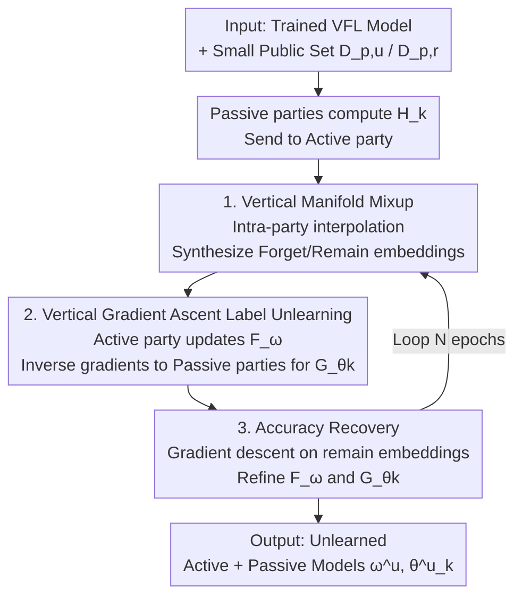

# Towards Privacy-Guaranteed Label Unlearning in Vertical Federated Learning: Few-Shot Forgetting without Disclosure

**Conference**: ICLR 2026  
**OpenReview**: [https://openreview.net/forum?id=G1JdmhkicJ](https://openreview.net/forum?id=G1JdmhkicJ)  
**Code**: https://github.com/bryanhx/Towards-Privacy-Guaranteed-Label-Unlearning-in-Vertical-Federated-Learning  
**Area**: Federated Learning / Machine Unlearning / Privacy and Security  
**Keywords**: Vertical Federated Learning, Label Unlearning, Few-shot, Manifold Mixup, Gradient Ascent  

## TL;DR
Addressing the unique dilemma in Vertical Federated Learning (VFL) where "labels are both input and privacy," this paper proposes the first VFL label unlearning method. It utilizes a small set of public data with manifold mixup to synthesize embeddings, followed by gradient ascent on active/passive parties to erase target labels and gradient descent to recover performance on the remaining set. The entire process completes in seconds—16–1200x faster than baselines—with minimal loss in remaining set accuracy.

## Background & Motivation
**Background**: Vertical Federated Learning (VFL) allows multiple institutions with complementary features (e.g., banks and hospitals) to build joint models without sharing raw data. Passive parties hold features and train bottom models $G_{\theta_k}$, while the active party holds labels and trains the top model $F_\omega$. Both sides collaborate by exchanging intermediate embeddings $H_k$ and gradients. Regulations like GDPR and CCPA grant users the "right to be forgotten," necessitating unlearning support in VFL.

**Limitations of Prior Work**: Research on Machine Unlearning (MU) and Federated Unlearning (FU) has focused almost exclusively on horizontal scenarios (HFL). The few existing works in VFL only address **feature unlearning**—how to remove the contribution of a passive party when it leaves the system. However, in VFL, labels serve a dual role: they are necessary inputs for training and highly sensitive information (e.g., "HIV status" or "loan approval"). The requirement for **label unlearning** remains largely unaddressed, and no scheme exists where the active party initiates a collaborative unlearning process among all parties.

**Key Challenge**: Synchronous constraints in VFL amplify the cost of unlearning. Parties hold different features over a shared sample ID space, requiring intermediate results to be exchanged and aligned at every step. The entire system must wait for the slowest participant to finish each round. Applying the conventional approach of "retraining/fine-tuning with the full remaining data" results in unlearning overhead being multiplied by these synchronization delays, making it impractical.

**Goal**: To efficiently erase the influence of target labels $D_u$ from both active and passive models in VFL while ensuring: (i) no collapse in remaining set accuracy, (ii) minimal dependency on auxiliary data, and (iii) no full retraining.

**Key Insight**: The authors observe that few-shot learning principles can break this bottleneck. Fewer samples lead to faster forward passes and gradient updates. However, using only ~40 samples for unlearning provides weak signals. Thus, **manifold mixup**, traditionally used for data augmentation, is repurposed to interpolate at the hidden embedding layer. This "creates" rich unlearning and recovery signals from small samples, making few-shot unlearning both fast and effective.

**Core Idea**: A three-step process involving "embedding-level mixup for signal generation + gradient ascent for label erasure + gradient descent for accuracy recovery." It utilizes a small public dataset to complete VFL label unlearning in seconds without passive parties ever accessing the raw labels.

## Method

### Overall Architecture
The method is built upon a pre-trained VFL system where the active party holds labels and the top model $F_\omega$, and $K$ passive parties hold features and bottom models $G_{\theta_k}$. When the active party requests to unlearn a batch of samples (index set $I_u$, data $D_u$), the workflow utilizes a tiny public labeled set $D_{p,u}$ (for forgetting) and $D_{p,r}$ (for retention) in three steps:

First, passive parties compute local embeddings for the small samples and send them to the active party. The active party performs manifold mixup **within each respective passive party** to synthesize enhanced forget embeddings $\vec{H}^u_k$ and remain embeddings $\vec{H}^r_k$, expanding sparse samples into dense signals. Second, **gradient ascent** is performed on the synthesized forget embeddings. The active party updates $F_\omega$, then transmits $\partial \ell / \partial \vec{H}^u_k$ to the passive parties. The passive parties use these inverse gradients to update $G_{\theta_k}$ locally, erasing the corresponding representations without touching raw labels. Third, **gradient descent** is performed on synthesized remain embeddings to recover accuracy on the remaining set. These steps iterate within each epoch.

### Key Designs

**1. Vertical Manifold Mixup: Expanding Few-shot Sparse Signals at the Embedding Layer**

Small public sets $D_{p,u}$ typically contain only ~40 samples per label, providing insufficient unlearning signals. Instead of mixing raw features (which are heterogeneous across parties in VFL), the authors perform linear interpolation on **hidden embeddings**:

$$\text{Mix}_\lambda(a,b)=\lambda\cdot a+(1-\lambda)\cdot b,\quad \lambda\in[0,1],$$

The labels are mixed similarly as $\text{Mix}_\lambda(y^{p,u}_i,y^{p,u}_j)$. This maximizes the loss on synthesized pairs to facilitate unlearning. Crucially, mixup occurs only within each passive party using a shared $\lambda$, **requiring no extra coordination between passive parties** and respecting VFL privacy boundaries. Manifold mixup covers a broader representation space, providing sufficient signals for few-shot unlearning.

**2. Vertical Gradient Ascent Label Unlearning: Active Ascent, Passive Local Erasure**

Using synthesized forget embeddings $\{\vec{H}^u_k\}$, unlearning is achieved via gradient ascent. The active party concatenates embeddings $\vec{H}^u=[\vec{H}^u_1,\dots,\vec{H}^u_K]$ and updates the top model:

$$\omega=\omega+\eta\nabla_\omega \ell(F_\omega(\vec{H}^u),\vec{y}^u),$$

this pushes label information away from $F_\omega$. The active party then sends $\partial\ell/\partial\vec{H}^u_k$ to passive parties, who update bottom models via the chain rule: $\theta_k=\theta_k+\eta\nabla_{\vec{H}^u}\ell\cdot\nabla_{\theta_k}\vec{H}^u_k$. **Passive parties only receive gradients regarding embeddings and never see raw labels**, which is key to "unlearning without disclosure." Theorem 1 provides theoretical backing: forget gradients computed from synthesized embeddings align with those from the **full** forget set when the model has converged.

**3. Accuracy Recovery: Inverse Descent on Remain Embeddings**

Pure gradient ascent can degrade accuracy on the remaining set $D_r$. The third step uses a small retention set $D_{p,r}$ to perform **gradient descent** on the main task loss:

$$\omega=\omega-\eta\nabla_\omega \ell(F_\omega(\vec{H}^r),\vec{y}^r),\qquad \theta_k=\theta_k-\eta\nabla_{\vec{H}^r}\ell\cdot\nabla_{\theta_k}\vec{H}^r_k.$$

This alternates with the unlearning step, simultaneously pushing away target labels and pulling back retained labels. Ablations show this module restores $D_r$ accuracy from 88.11% to 89.29% (comparable to full-data training).

### Loss & Training
The procedure follows Algorithm 1 with an outer loop of $N$ epochs. Each epoch sequentially executes manifold mixup $\to$ gradient ascent $\to$ gradient descent. Learning rate $\eta$ and batch size $b$ are the primary hyperparameters. The process achieves performance close to full-data retraining using only ~40 public samples per label, completing in seconds.

## Key Experimental Results

### Main Results
Evaluated on seven datasets (MNIST, CIFAR-10/100, ModelNet, Brain Tumor MRI, COVID-19 Radiography, and Yahoo Answers) using ResNet18/Vgg16/MixText. Metrics: $D_r$ accuracy (higher is better), $y^u$ accuracy (near 0 is better), and MIA ASR (should be slightly lower than retraining). Representative results for ResNet18 single-label unlearning:

| Dataset | Metric | Baseline (Before) | Retrain | SSD | Ours |
|--------|------|------|------|------|------|
| CIFAR-10 | $D_r$↑ | 90.61 | 91.26 | 87.17 | **89.29** |
| CIFAR-10 | $y^u$↓ | 93.10 | 0.00 | 0.00 | **0.00** |
| ModelNet | $D_r$↑ | 94.26 | 93.90 | 81.89 | **87.69** |
| Brain MRI | $D_r$↑ | 97.46 | 98.81 | 85.93 | **93.79** |
| COVID-19 | $D_r$↑ | 92.82 | 93.85 | 81.11 | **92.35** |

Ours outperforms baselines like Fine-Tuning, Fisher, Amnesiac, UNSIR, and SSD in achieving a balance between "clean forgetting" ($y^u\to0$) and "accuracy preservation" ($D_r \approx$ Retrain).

### Ablation Study
ResNet18 on CIFAR-10 single-label unlearning (Figure 3):

| Configuration | $D_r$ Acc | $y^u$ Acc | Note |
|------|---------|---------|------|
| GA-A (Full 5000 samples GA) | 86.87 | 0 | Forgets well, but $D_r$ collapses |
| GA-S (40 samples, no mixup/recovery) | 89.29 | 40.48 | Restores $D_r$, but **fails to forget** |
| GA-S + Manifold Mixup (no recovery) | 88.11 | 0 | Forgets well, but $D_r$ degrades moderately |
| Ours (Full modules, 40 samples) | **89.29** | **0** | Clean forgetting without performance loss |

### Key Findings
- **Mixup is the "switch" for few-shot unlearning**: Without it (GA-S), $y^u$ remains high (40.48%). With it, $y^u$ reaches zero, proving that embedding interpolation solves the signal sparsity bottleneck.
- **Recovery module ensures performance**: GA-S+mixup $\to$ Ours brings $D_r$ from 88.11% back to 89.29%, showing the necessity of the recovery step.
- **Massive Speedup**: 16–1200x faster than baselines on CIFAR-10. Time scales linearly with the number of passive parties.
- **Robustness to Privacy Mechanisms**: Effective under Differential Privacy and Gradient Compression.

## Highlights & Insights
- **Repurposing Augmentation for Unlearning**: Manifold mixup, designed to enhance generalization, is used here to synthesize signals for erasure. Applying it at the embedding layer sidesteps the challenge of heterogeneous features in VFL.
- **End-to-end Label Privacy**: Passive parties only ever receive embedding gradients. They never touch raw labels, fulfilling the "without disclosure" promise.
- **Theoretical Grounding**: Theorem 1 proves the alignment between synthesized gradients and full-set gradients, justifying the efficacy of few-shot data.

## Limitations & Future Work
- **Public Set Dependency**: Requires a high-quality small $D_{p,u}$/$D_{p,r}$. Distribution shifts may weaken gradient alignment.
- **ASR Control**: ASR remains high on some datasets. Achieving 0% ASR may cause the Streisand effect; balancing it to be "slightly below retrain" is a delicate task.
- **Theoretical Scope**: Current proof covers single-label unlearning; multi-label scenarios lack formal guarantees despite empirical success.
- **Sync Constraints**: While faster, the method still requires round-trip communication per epoch, which may scale poorly with massive numbers of passive parties.

## Related Work & Insights
- **vs. Horizontal Federated Unlearning (HFU)**: HFU is well-studied for label/client/sample unlearning, but assumes horizontal data splits. This paper addresses the vertical split where labels are centralized and sensitive.
- **vs. Existing VFL Feature Unlearning**: Unlike prior work focusing on passive party withdrawal, this is the first to address **label unlearning** initiated by the active party.
- **vs. Few-shot Unlearning**: Unlike methods using model inversion, this approach leverages manifold mixup, which is more compatible with the privacy constraints of VFL.

## Rating
- Novelty: ⭐⭐⭐⭐⭐ First VFL label unlearning method; clever use of mixup for signal generation.
- Experimental Thoroughness: ⭐⭐⭐⭐ Broad dataset/architecture coverage; further exploration of ASR control needed.
- Writing Quality: ⭐⭐⭐⭐ Clear three-step logic and theoretical support.
- Value: ⭐⭐⭐⭐⭐ Vital for VFL deployment in regulated industries (healthcare/finance) with high efficiency.

<!-- RELATED:START -->

## Related Papers

- [\[ICLR 2026\] Label Smoothing Improves Machine Unlearning](label_smoothing_improves_machine_unlearning.md)
- [\[ICLR 2026\] Identifying Robust Neural Pathways: Few-Shot Adversarial Mask Tuning for Vision-Language Models](identifying_robust_neural_pathways_few-shot_adversarial_mask_tuning_for_vision-l.md)
- [\[ICLR 2026\] FaLW: A Forgetting-aware Loss Reweighting for Long-tailed Unlearning](falw_a_forgetting-aware_loss_reweighting_for_long-tailed_unlearning.md)
- [\[ICLR 2026\] Decoupling the Class Label and the Target Concept in Machine Unlearning](decoupling_the_class_label_and_the_target_concept_in_machine_unlearning.md)
- [\[ICLR 2026\] Learnability and Privacy Vulnerability are Entangled in a Few Critical Weights](learnability_and_privacy_vulnerability_are_entangled_in_a_few_critical_weights.md)

<!-- RELATED:END -->
