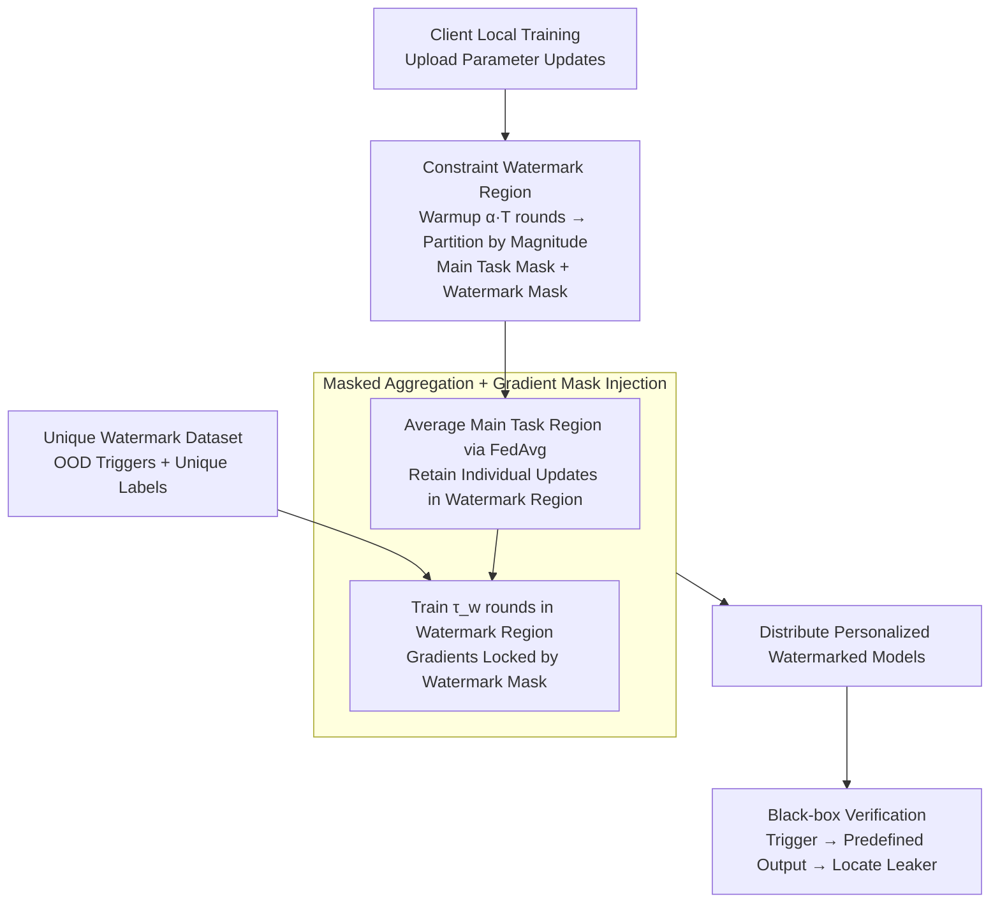

# Traceable Black-box Watermarks for Federated Learning

**Conference**: ICLR 2026  
**arXiv**: [2505.13651](https://arxiv.org/abs/2505.13651)  
**Code**: [GitHub](https://github.com/JiiahaoXU/TraMark)  
**Area**: AI Security  
**Keywords**: Federated Learning, Black-box Watermarking, Traceability, Model Leakage Detection, Masked Aggregation  

## TL;DR

TraMark is proposed to realize server-side traceable black-box watermark injection in Federated Learning (FL) for the first time by partitioning the model parameter space into main task areas and watermark areas, and employing masked aggregation to prevent watermark collisions. It achieves a 99.58% verification rate with only a 0.54% reduction in main task accuracy.

## Background & Motivation

1.  **FL faces model leakage risks**: In FL systems, every client can access the global model. Malicious clients may copy and illegally distribute the model, threatening the collective interests of all participants. Protecting the intellectual property of FL-trained models has become a critical challenge.

2.  **Existing watermarking methods have limitations**: Parameter-level watermarks (e.g., FedTracker) require white-box access to model parameters for verification, which is infeasible in practical deployment scenarios (e.g., API access). While backdoor-level watermarks support black-box verification, existing methods either lack traceability or require modifying local training protocols and accessing client data.

3.  **Conflict between traceability and watermark collision**: Realizing traceability requires injecting different watermarks for each client. However, FedAvg aggregation blends parameters from all clients, leading to watermark collisions that destroy traceability. This represents the **Key Challenge** between traceability and federated aggregation.

4.  **Lack of formal definition**: Despite empirical progress, the literature lacks a formal definition and mathematical modeling of the traceable black-box watermarking problem in FL, hindering the development of systematic solutions.

## Method

### Overall Architecture

TraMark consolidates the entire watermark lifecycle to the server side. Building upon standard FedAvg, the server allows the model to converge through a warmup phase. Then, it partitions each client's parameter space into a "main task area" and a "watermark area." During aggregation, only the main task areas are averaged, while the watermark areas remain independent. Each client model is then branded with a unique backdoor in its watermark area using a dedicated trigger dataset. Finally, personalized watermarked models are distributed back to clients. Consequently, malicious clients cannot interfere with the process, and watermarks do not overwrite each other. Verifiers can determine if a model has leaked and identify the source via black-box queries.

### Key Designs

**1. Constraining Watermark Regions: Confining perturbations to a "dark room" in parameter space to avoid degrading the main task**

Existing methods inject watermarks throughout the entire parameter space, where perturbations dilute main task performance and cause watermark collisions during aggregation. TraMark uses a pair of complementary binary masks to strictly divide the $d$-dimensional parameters. The watermark mask $\mathbf{M}_w \in \{0,1\}^d$ marks $k$ (default 1%) of the parameters, while the main task mask $\mathbf{M}_m \in \{0,1\}^d$ marks the remaining $1-k$, satisfying $\mathbf{M}_w + \mathbf{M}_m = \mathbf{1}^d$. Parameters are not assigned randomly; the model is warmed up for $\alpha \times T$ rounds to establish meaningful weights. The $k \times d$ parameters with the smallest absolute values are selected—these "least important" weights cause minimal damage when carrying watermarks. This explains why **Ours** experiences a ~5% drop in main task accuracy when $\alpha=0$ in the ablation study.

**2. Masked Aggregation + Gradient Mask Injection: Keeping watermarks independent without overflow**

Traceability requires distinct watermarks for each client, but standard FedAvg averages them into a collision. TraMark maintains a personalized global model for each client $i$ and processes regions separately during aggregation:

$$\tilde{\theta}_i = \theta_i + \mathbf{M}_m \odot \frac{1}{n}\sum_{i=1}^{n}\Delta_i + \mathbf{M}_w \odot \Delta_i$$

The main task region undergoes standard FedAvg averaging to share knowledge, while the watermark region only incorporates its own update $\Delta_i$ to preserve uniqueness. During injection, gradients are similarly locked within the watermark region using masks. Training is performed on $\tilde{\theta}_i$ for $\tau_w$ (default 5) rounds using the unique watermark dataset:

$$\tilde{\theta}_i^{s+1} = \tilde{\theta}_i^s - \eta_w g_i^s \odot \mathbf{M}_w$$

Since gradients are masked by $\mathbf{M}_w$, watermark knowledge cannot leak into main task parameters. This "partitioned aggregation + partitioned injection" approach results in extremely low overhead (0.64s per client) and explains the stability of the verification rate (VR) under pruning and fine-tuning attacks—the watermark and main task parameters are disjoint yet deeply coupled.

**3. Unique Watermark Datasets: Eliminating collisions from both triggers and labels**

To ensure watermarks are distinguishable, the datasets assigned to clients must be mutually exclusive in both inputs and outputs. TraMark selects OOD samples unrelated to the main task distribution (e.g., MNIST classes) as triggers, ensuring triggers do not overlap: $\mathcal{X}_i^w \cap \mathcal{X}_j^w = \emptyset$. Simultaneously, predefined outputs are set to be distinct $\phi_i(x) \neq \phi_j(x)$, mapping each client to a different label. During verification, a leaked model will only produce the predefined output for its own trigger set and random guesses for others, allowing the verifier to confirm the leak and locate the specific client.

## Main Results

### Experimental Setup

-   **Datasets**: FMNIST (CNN), CIFAR-10 (AlexNet), CIFAR-100 (VGG-16), Tiny-ImageNet (ViT)
-   **FL Configuration**: 10 clients, 5 local training rounds, learning rate 0.01; IID and non-IID (Dirichlet γ=0.5) settings
-   **Watermark Configuration**: MNIST as the watermark source, 100 samples per class, watermark learning rate 1e-4, $\tau_w=5$, $k=1\%$, $\alpha=0.5$
-   **Baselines**: FedAvg (No watermark), WAFFLE (Black-box non-traceable), FedTracker (White-box traceable)
-   **Metrics**: Main Task Accuracy (MA) and Verification Rate (VR)

### Main Results

| Dataset | FedAvg MA | WAFFLE MA | FedTracker MA/VR | TraMark MA/VR |
|---|---|---|---|---|
| FMNIST | 92.60 | 92.21 | 89.95 / 100.0 | 91.20 / 96.67 |
| FMNIST (N) | 91.52 | 91.41 | 67.50 / 100.0 | 91.31 / 100.0 |
| CIFAR-10 | 89.15 | 89.16 | 87.56 / 60.0 | 88.58 / 100.0 |
| CIFAR-10 (N) | 87.01 | 86.75 | 83.42 / 50.0 | 86.26 / 100.0 |
| CIFAR-100 | 61.91 | 61.68 | 61.05 / 100.0 | 61.13 / 100.0 |
| Tiny-ImageNet | 21.05 | 21.24 | 20.40 / 100.0 | 20.91 / 100.0 |
| **Average** | **65.44** | **65.31** | **61.25 / 87.50** | **64.90 / 99.58** |

### Ablation Study

| Hyperparameter | Configuration | MA (%) | VR (%) |
|---|---|---|---|
| Partition Ratio k=0.5% | Low watermark capacity | 65.70 | 84.17 |
| **Partition Ratio k=1.0% (Default)** | **Balanced** | **65.66** | **99.17** |
| Partition Ratio k=5.0% | High watermark capacity | 65.16 | 100.0 |
| Watermark Dataset 50 samples | Insufficient data | 65.85 | 54.17 |
| **Watermark Dataset 100 samples (Default)** | **Balanced** | **65.51** | **99.17** |
| Watermark Dataset 200 samples | Sufficient data | 65.57 | 100.0 |
| Warmup Ratio α=0 | No warmup | 59.50 | 100.0 |
| **Warmup Ratio α=0.5 (Default)** | **With warmup** | **64.15** | **100.0** |
| Warmup Ratio α=0.7 | Excessive warmup | 65.20 | Decreased |

### Key Findings

1.  **TraMark achieves high traceability with low accuracy loss**: The average VR is 99.58% (vs. FedTracker's 87.50%), while MA decreases by only 0.54% (vs. FedTracker's 4.19%), validating the effectiveness of the parameter space partitioning strategy.
2.  **Robustness to attacks**: VR remains stable under pruning rates of 30%-70% and shows no significant decline after 30 rounds of fine-tuning attacks, indicating high coupling between watermark and main task parameters.
3.  **Warmup training is crucial**: MA drops by approximately 5% without warmup, as initial random parameters cannot accurately determine importance, leading to improper partitioning.
4.  **Flexibility in watermark datasets**: MNIST, SVHN, and WafflePattern datasets all achieve 100% VR, with no statistically significant differences (p≥0.05).

## Highlights & Insights

-   Provides the first formal definition of the traceable black-box watermarking problem in FL, introducing the concepts of watermark collision and traceability constraints.
-   The design of parameter space partitioning combined with masked aggregation is elegant and concise, successfully avoiding collisions while maintaining main task performance.
-   Operates entirely on the server side without requiring client cooperation, providing natural resistance against malicious clients.
-   Incurs extremely low watermark injection overhead (0.67s per client), allowing seamless integration into existing FedAvg frameworks.

## Limitations & Future Work

-   The watermark dataset requires assigning different OOD trigger classes to each client, which limits scalability in tasks with few labels (e.g., 10 main task classes + 10 clients already requires 20 classes).
-   The study only validates classification tasks; the applicability to other task types like generation or detection remains unexplored.
-   While $k=1\%$ is sufficient, the partitioning strategy is based on simple magnitude ranking; more refined importance measures could further improve main task performance.

## Rating

| Dimension | Rating |
|---|---|
| Novelty | ⭐⭐⭐⭐ |
| Effectiveness | ⭐⭐⭐⭐ |
| Reproducibility | ⭐⭐⭐⭐⭐ |
| Practicality | ⭐⭐⭐⭐ |

<!-- RELATED:START -->

## Related Papers

- [\[ICLR 2026\] Black-Box Privacy Attacks on Shared Representations in Multitask Learning](black-box_privacy_attacks_on_shared_representations_in_multitask_learning.md)
- [\[ICLR 2026\] A General Framework for Black-Box Attacks Under Cost Asymmetry](a_general_framework_for_black-box_attacks_under_cost_asymmetry.md)
- [\[ICLR 2026\] SeRI: Gradient-Free Sensitive Region Identification in Decision-Based Black-Box Attacks](seri_gradient-free_sensitive_region_identification_in_decision-based_black-box_a.md)
- [\[CVPR 2026\] SEBA: Sample-Efficient Black-Box Attacks on Visual Reinforcement Learning](../../CVPR2026/ai_safety/seba_sample-efficient_black-box_attacks_on_visual_reinforcement_learning.md)
- [\[ICLR 2026\] Protection against Source Inference Attacks in Federated Learning](protection_against_source_inference_attacks_in_federated_learning.md)

<!-- RELATED:END -->
