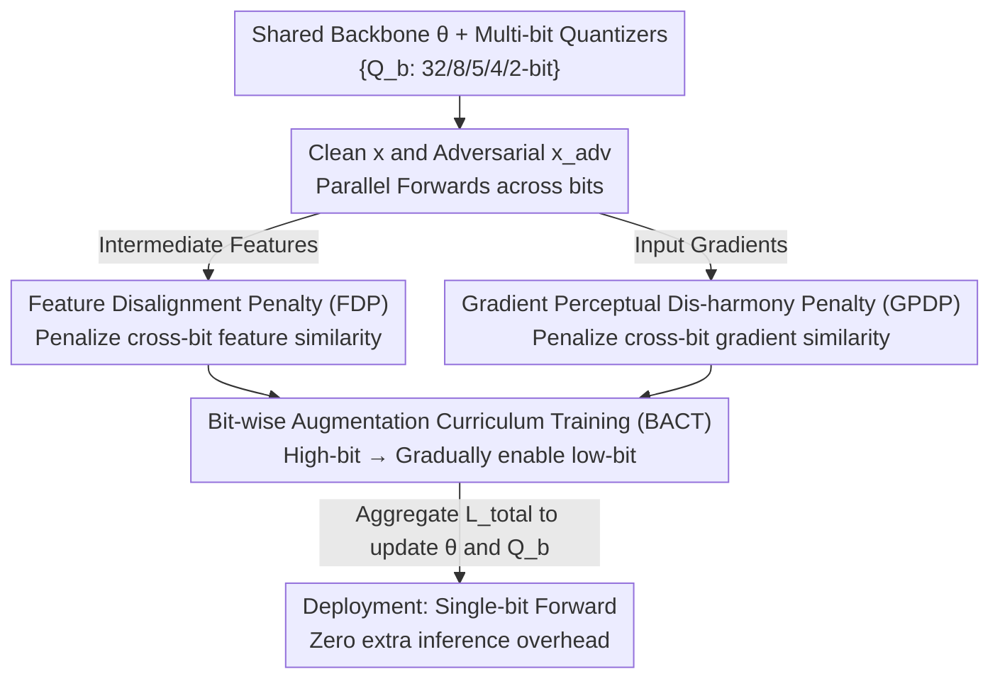

# TriQDef: Disrupting Semantic and Gradient Alignment to Block Adversarial Patch Transfer in Quantized Networks

**Conference**: ICLR 2026  
**OpenReview**: [https://openreview.net/forum?id=acQP99PU8y](https://openreview.net/forum?id=acQP99PU8y)  
**Code**: None  
**Area**: AI Security / Adversarial Robustness / Model Quantization  
**Keywords**: Adversarial Patch, Quantized Neural Networks, Transfer Attack, Perceptual Alignment, Quantization-Aware Training

## TL;DR
This paper discovers that adversarial patches are highly transferable across quantized networks of different bit-widths. The root cause is that models across bits maintain strong "perceptual alignment" in **intermediate features** and **input gradients**. TriQDef utilizes two perceptual mismatch regularizations (FDP + GPDP) along with a bit-wise curriculum training strategy to actively disrupt this cross-bit alignment during training. This reduces the Attack Success Rate (ASR) by over 40% under unseen patches or bit combinations, while incurring almost no loss in clean accuracy and zero extra inference overhead.

## Background & Motivation

**Background**: Quantized Neural Networks (QNNs) are widely deployed on edge devices to save memory and computation. There has been an optimistic view in the academic community that quantization naturally weakens traditional pixel-level adversarial attacks by distorting the gradient landscape and introducing quantization noise (gradient masking effect).

**Limitations of Prior Work**: This intuition of "quantization as defense" fails completely against **adversarial patches**. A patch is a local, high-saliency pattern that deceives predictions by hijacking model attention rather than gradient sensitivity. Patches are robust to input transformations and generalize across architectures. The authors' experiments show that a patch generated on a full-precision model maintains an ASR of over 73% when transferred to an extreme 2-bit QNN (ResNet-56). In other words, quantization down to 2-bit cannot stop patches.

**Key Challenge**: Existing defenses either overfit to specific quantization settings (e.g., PBAT is only effective for patches/bit-widths seen during training, with ASR surging by 20%+ when bit-widths change) or essentially target pixel-level noise (e.g., DWQ, feature smoothing, DiffPure), failing to address the fundamental cause of "cross-bit transferability" of patches. The authors' analysis reveals that patches are universal across different bits because persistent alignment exists between the **internal features** and **input gradient signals** of models with different bit-widths—they share the same structural cues.

**Goal**: To dismantle this "shared channel" during the training phase, forcing models of different bit-widths to learn **inconsistent** feature representations and gradient structures, thereby preventing a single patch from deceiving multiple bit-width versions simultaneously.

**Key Insight**: A key observation is that traditional tools for measuring gradient transferability (cosine similarity) can be misleading. The authors found that while the cosine similarity of gradients between different bit-width models is quite low (0.05–0.25, seemingly pointing in different directions), their similarity at the **perceptual level** (edge structures, texture orientations) is extremely high (HOG cosine similarity remains stable above 0.80). This "hidden perceptual alignment" is the true breeding ground for patch transfer, which cosine similarity fails to capture.

**Core Idea**: Explicitly measure and **penalize** cross-bit feature/gradient alignment using two differentiable **perceptual similarity metrics** (Edge IoU and HOG Cosine). This forces models of different bits to "think differently," disrupting the consensus at the structural and textural levels that patch transfer relies on.

## Method

### Overall Architecture
The TriQDef setup consists of a **shared backbone** $\theta$ (e.g., a ResNet trunk) paired with a set of bit-specific quantizers $\{Q_b\}$ ($b \in \{32,8,5,4,2\}$, where $Q_{32}$ is the identity). The same backbone weights yield different bit-width versions after passing through the corresponding quantizers (using QAT + STE). During training, both clean inputs $x$ and patched adversarial inputs $x_{adv}$ are processed across multiple bit-widths to produce "bit-specific views." The framework compares these views and applies penalties at two levels: intermediate layer features are fed to FDP, and input gradients are fed to GPDP. All losses are aggregated into $\mathcal{L}_{total}$ to update $\theta$ and $\{Q_b\}$ simultaneously, with the process managed by a BACT curriculum scheduler that gradually activates low-bit quantizers. At inference, only the target deployment bit $b^\star$ is used for a single forward pass, resulting in zero runtime overhead and maintaining pure integer deployment.

Patches are constructed as $x_{adv} = x \odot (1-M) + P \odot M$, where $M$ is a binary mask and $P$ is randomly sampled from an offline patch pool (pre-generated on full-precision models with diverse sizes/positions/target classes) or optionally optimized online via EOT.

### Key Designs

**1. Feature Disalignment Penalty (FDP): Making intermediate features "look different" across bits**

FDP targets "semantic alignment"—the fact that internal representations of different bit models remain perceptually similar even with patches (confirmed by the authors on ImageNet using heatmaps showing high Edge IoU and HOG similarity for adjacent bits like 5bit↔4bit). This representation invariance is the foundation of patch universality. FDP calculates the perceptual similarity of features $f^{(l)}_{b_i}(x_{adv})$ and $f^{(l)}_{b_j}(x_{adv})$ for any two different bit models $b_i \neq b_j$ at selected intermediate layers $l$, minimizing it as a penalty:

$$\mathcal{L}_{FDP} = \sum_{l\in L}\sum_{\substack{b_i,b_j\in B\\ b_i\neq b_j}}\Big[\alpha\cdot \text{SoftDice}\big(S(E(f^{(l)}_{b_i})),\,S(E(f^{(l)}_{b_j}))\big) + \beta\cdot \cos\big(H(f^{(l)}_{b_i}),\,H(f^{(l)}_{b_j})\big)\Big]$$

Two complementary perceptual quantities are used: Edge IoU for structure (overlap of Sobel edge maps) and HOG Cosine for texture orientation. Since original Edge IoU (hard binarization) and HOG are non-differentiable, the authors use differentiable approximations: edges use SoftDice with "soft binarization" $S(A;\tau,k)=\sigma(k\cdot(A-\tau))$ ($k=100$, threshold $\tau$ at the 85th percentile), and HOG uses a smooth HOG descriptor. $\alpha=0.5, \beta=1.0$. A key trade-off is that **FDP is only applied to early and middle layers (L1–L3)**, which primarily encode structural cues like edges/textures. High-level semantics and classification heads remain unconstrained. Combined with the joint cross-entropy loss, this disrupts cross-bit structural consensus without causing semantic drift (clean accuracy loss <1%, Grad-CAM shows bits still attend to the same object regions). LPIPS is not used because it targets high-level human semantics and requires three-channel high-resolution inputs, making it unsuitable for single-channel/low-resolution feature or gradient maps.

**2. Gradient Perceptual Dis-harmony Penalty (GPDP): Blocking the hidden transfer channel**

GPDP targets gradient-level alignment missed by FDP. The most counter-intuitive finding is that while the cosine similarity of gradients is low (0.05~0.25), suggesting transfer shouldn't happen, patches still transfer because gradients are highly consistent in **perceptual structure** (HOG cosine remains 0.80+). GPDP directly penalizes this "perceptual consensus": for each pair of bit models, input gradients $\nabla^{b_i}_x = \nabla_x \mathcal{L}_{CE}(f_{b_i}(x_{adv}),y)$ are obtained via backpropagation, and the same structure+texture penalty used in FDP is applied:

$$\mathcal{L}_{GPDP} = \sum_{\substack{b_i,b_j\in B\\ b_i\neq b_j}}\Big[\alpha\cdot \text{SoftDice}\big(\text{Sobel}(\nabla^{b_i}_x),\,\text{Sobel}(\nabla^{b_j}_x)\big) + \beta\cdot \cos\big(\text{SoftHOG}(\nabla^{b_i}_x),\,\text{SoftHOG}(\nabla^{b_j}_x)\big)\Big]$$

It focuses on early-layer gradient structures where saliency is concentrated, weakening shared adversarial vulnerability by diversifying gradient edges and orientations. To preserve clean accuracy, **GPDP is only applied to adversarial inputs**. The significance of this design is its suggestion that the metric for gradient transferability needs upgrading—relying solely on orientation (cosine) misses perceptual alignment.

**3. Bit-wise Augmentation Curriculum Training (BACT): Enabling stable low-bit growth**

Optimizing ultra-low bit quantizers like 2-bit from scratch can cause training to collapse and make cross-bit comparisons for FDP/GPDP impossible. BACT **activates quantizers in stages while always sharing the same $\theta$**: it first learns stable features with high precision (32/8-bit), then gradually includes lower bits (5/4/2-bit) into the active set $B_t$. New bits initialize their observers via short calibration on a held-out subset (without copying weights) and are then fine-tuned with existing bits. This avoids maintaining multiple backbones (saving memory) and forces cross-bit coupling via the shared $\theta$, which empirically improves robustness and stabilizes the optimization of perceptual penalties. The total loss is:

$$\mathcal{L}_{total} = \mathcal{L}_{clean} + \lambda_{adv}\mathcal{L}_{adv} + \lambda_{FDP}\mathcal{L}_{FDP} + \lambda_{GPDP}\mathcal{L}_{GPDP}$$

Where $\mathcal{L}_{clean}$ and $\mathcal{L}_{adv}$ are the average cross-entropy of clean and adversarial inputs across the active set $B_t$. Patches are applied to half of each mini-batch ($\rho=0.5$) to prevent over-regularization. Default $\lambda_{adv}=1$, $\lambda_{FDP}=0.8$, $\lambda_{GPDP}=0.5$.

### Loss & Training
- Quantization uses fake-quantization QAT + STE, with symmetric uniform quantizers (per-channel for weights, per-tensor for activations). Target bits $B=\{32,8,5,4,2\}$.
- CIFAR-10: 200 epochs; ImageNet: 120 epochs. SGD (momentum 0.9, weight decay $1\times10^{-4}$), initial LR 0.1, decayed by 10× at 50% and 75%, batch size 128.
- Patches are sampled from an offline pool by default for efficiency. EOT online optimization is used for ablation/adaptive settings.

## Key Experimental Results

### Main Results

Cross-bit robustness (ASR %, lower is better) compared to PBAT and DWQ. TriQDef achieves the lowest ASR across all attacks and bits, with minimal degradation under unseen patches:

| Defense | Dataset | LAVAN-2bit | GAP-2bit | PatchAttack-2bit |
|------|--------|-----------|----------|------------------|
| PBAT | CIFAR-10 | 39.7 | 37.9 | 49.7 |
| DWQ | CIFAR-10 | 76.4 | 73.5 | 78.2 |
| **TriQDef** | CIFAR-10 | **26.2** | **17.2** | **20.7** |
| TriQDef (Unseen) | CIFAR-10 | 27.3 | 25.5 | 23.5 |
| PBAT (Unseen) | CIFAR-10 | 65.3 | 63.2 | 70.1 |

Clean accuracy (%, higher is better) is maintained, outperforming PBAT and staying close to Standard QAT:

| Defense | Dataset | 32bit | 5bit | 4bit | 2bit |
|------|--------|-------|------|------|------|
| Standard QAT | CIFAR-10 | 89.4 | 85.1 | 80.5 | 78.2 |
| PBAT | CIFAR-10 | 88.2 | 81.6 | 77.8 | 75.5 |
| **TriQDef** | CIFAR-10 | 89.4 | 83.3 | 78.2 | 75.8 |

Comparison with inference-time pre-processing defenses (ImageNet ResNet-50, Robust Accuracy %, higher is better):

| Defense | Type | 32bit | 2bit |
|------|------|-------|------|
| JEDI (2023) | Pre-processing | 64.3 | 23.4 |
| DiffPure (2024) | Pre-processing | 41.7 | 19.6 |
| PBCAT (2025) | Training | 57.8 | 41.2 |
| **TriQDef** | Training | **78.3** | **65.8** |

Pre-processing defenses fail at low bits as quantization destroys feature granularity; DiffPure also requires significant time (5.6~17s/image) and memory (>7GB). TriQDef is a pure training-time defense with zero inference overhead.

### Ablation Study

ASR (%, LAVAN, lower is better):

| Configuration | Setting | CIFAR-10 2bit | ImageNet 2bit |
|------|------|---------------|---------------|
| w/o FDP | Seen | 55.9 | 52.1 |
| w/o GPDP | Seen | 37.6 | 42.5 |
| Full TriQDef | Seen | **26.2** | **28.5** |
| Full TriQDef | Unseen | 27.3 | 30.7 |

### Key Findings
- **FDP is the main contributor**: Removing FDP causes ASR at 2-bit to jump from 26.2% to 55.9% (CIFAR-10), indicating that patches immediately regain strong transferability if cross-bit semantic alignment is preserved.
- **GPDP is indispensable**: Removing GPDP increases ASR by over 10%, proving that disrupting features without disrupting gradients still leaves vulnerabilities.
- **Quantization alone is insufficient**: Methods relying on quantization/randomization like DWQ have ASR over 70%, confirming the "quantization as defense" intuition is incorrect for patches.
- **Strong generalization**: Under unseen patches/bit-widths, TriQDef's ASR only increases by ~2.1%, whereas PBAT often increases by over 15%.

## Highlights & Insights
- **"Cosine similarity can be misleading" is the sharpest insight**: Low cosine $\neq$ low transferability; alignment at the perceptual level (HOG 0.80+) is the true driver of patch transfer. This shifts diagnostic tools for transferability from "orientation" to "structure + texture."
- **Converting non-differentiable descriptors into trainable regularizers**: Using SoftDice, soft binarization, and smooth HOG to incorporate Edge IoU and HOG into end-to-end training is a versatile engineering trick.
- **Shared backbone + Multi-quantizer** parameterization is elegant: A single $\theta$ "stretched" across bits forces coupling and provides a target for disalignment, which is more efficient than independent models.
- **Shifting costs to training**: By handling defense at training time, TriQDef maintains zero extra inference cost and supports pure integer deployment, fitting edge device constraints better than pre-processing methods.

## Limitations & Future Work
- Experiments focused on CNNs (ResNet/VGG) and CIFAR-10/ImageNet. ViT (Swin/DeiT) was used for transferability evaluation but not as the primary target for defense training; validity for Transformer-based QNNs requires more verification.
- Increased training cost: Each batch involves multiple forward passes and gradient calculations (GPDP requires second-order backprop). Multi-bit comparison costs grow with the number of bits.
- Defense inherently assumes the attacker cannot access the training pipeline. Although black-box PatchAttack was tested, robustness boundaries against a white-box attacker aware of TriQDef and specifically circumventing perceptual disalignment are still to be explored.
- Hyperparameters ($\alpha,\beta,\lambda_{FDP},\lambda_{GPDP},\rho$) were determined via ablation; their sensitivity across data/architectures needs more systematic validation.

## Related Work & Insights
- **vs PBAT (Patch-Based Adversarial Training)**: PBAT uses patch augmentation but is narrow, failing when bit-widths change. TriQDef targets the root cause (alignment) and thus generalizes better.
- **vs DWQ / Random Precision / Feature Smoothing**: These target pixel-level noise via gradient masking; TriQDef explicitly models the structural sources of patch transfer.
- **vs JEDI / DiffPure**: These are effective at full precision but suffer from high latency and quantization sensitivity. TriQDef moves the defense to training for zero inference overhead.

## Rating
- Novelty: ⭐⭐⭐⭐⭐ First systematic study of cross-bit patch transfer in QNNs; identifies cosine similarity blind spots.
- Experimental Thoroughness: ⭐⭐⭐⭐ Covers various attacks and data, though ViT training and training cost quantification are less detailed.
- Writing Quality: ⭐⭐⭐⭐ Clear logic chain from observation to method.
- Value: ⭐⭐⭐⭐ Practical zero-overhead defense for edge QNNs.

<!-- RELATED:START -->

## Related Papers

- [\[ICLR 2026\] Robust Adversarial Attacks Against Unknown Disturbances via Inverse Gradient Sample](robust_adversarial_attacks_against_unknown_disturbance_via_inverse_gradient_samp.md)
- [\[AAAI 2026\] Angular Gradient Sign Method: Uncovering Vulnerabilities in Hyperbolic Networks](../../AAAI2026/ai_safety/angular_gradient_sign_method_uncovering_vulnerabilities_in_h.md)
- [\[ICLR 2026\] On Optimal Hyperparameters for Differentially Private Deep Transfer Learning](on_optimal_hyperparameters_for_differentially_private_deep_transfer_learning.md)
- [\[ICCV 2025\] Semantic Alignment and Reinforcement for Data-Free Quantization of Vision Transformers](../../ICCV2025/ai_safety/semantic_alignment_and_reinforcement_for_data-free_quantization_of_vision_transf.md)
- [\[ICLR 2026\] Robust Spiking Neural Networks Against Adversarial Attacks](robust_spiking_neural_networks_against_adversarial_attacks.md)

<!-- RELATED:END -->
