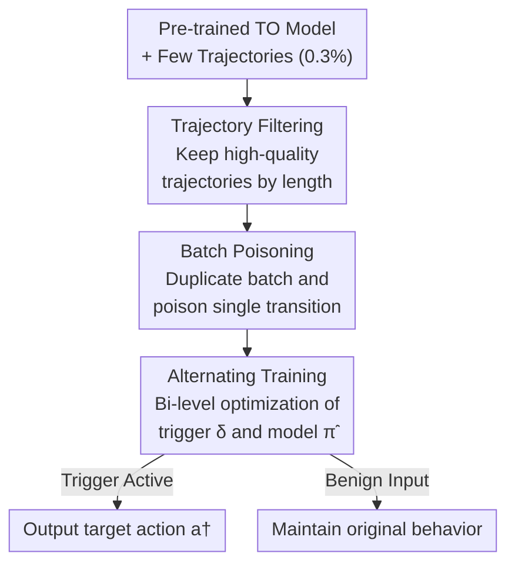

# TrojanTO: Action-Level Backdoor Attacks Against Trajectory Optimization Models

**Conference**: ICLR 2026  
**OpenReview**: [https://openreview.net/forum?id=CNrU5kGJYG](https://openreview.net/forum?id=CNrU5kGJYG)  
**Code**: https://github.com/AndssY/TrojanTO (Available)  
**Area**: AI Security / Backdoor Attack / Offline Reinforcement Learning  
**Keywords**: Backdoor Attack, Trajectory Optimization Models, Offline RL, Post-training Attack, Decision Transformer

## TL;DR
The authors propose TrojanTO, the first action-level backdoor attack against Trajectory Optimization (TO) models such as the Decision Transformer. As a "post-training" attack, it requires poisoning only 0.3% of trajectories without manipulating reward signals. By employing "Trajectory Filtering + Batch Poisoning + Alternating Training," it establishes a strong coupling between the trigger and target actions. Across six D4RL tasks and three TO architectures, TrojanTO improves the composite score (CP) from a baseline of 0.34 to 0.70.

## Background & Motivation

**Background**: Offline reinforcement learning (RL) learns policies directly from existing datasets without online interaction. Trajectory Optimization (TO) models, represented by Decision Transformer (DT) and Decision ConvFormer (DC), have gained popularity. They formulate decision-making as a sequence modeling problem, taking past (action, state, returns-to-go) sequences as input to output the next action by minimizing reconstruction loss. These models have succeeded in continuous action space tasks like robotic control and embodied AI.

**Limitations of Prior Work**: Previous RL backdoor attacks were almost entirely "training-time attacks" that manipulate reward signals to plant backdoors. Since traditional RL agents optimize policies based on Bellman equations to maximize rewards, reward manipulation is the primary attack vector. However, this paradigm fails for TO models for two reasons: first, TO models directly fit target actions and minimize reconstruction loss without relying on reward maximization, rendering reward manipulation ineffective; second, the scale and training costs of TO models are increasing, making attacks tied to the full training process impractical. The most relevant prior work, Baffle, is a policy-level backdoor based on data poisoning that requires a poisoning rate as high as 10%, which is neither practical nor stealthy.

**Key Challenge**: High-dimensional continuous action spaces make precise manipulation exceptionally difficult. Since actions are real-valued vectors rather than finite discrete options, reliably binding a "trigger" to a "specific target action" under a low budget is inherently hard. Furthermore, the insensitivity of TO models to rewards blocks traditional attack paths.

**Goal**: To inject "action-level" backdoors by modifying the parameters of a pre-trained TO model under an extremely low budget, without accessing the original training data or retraining from scratch. Once the trigger is activated, the model must output the attacker-specified target action while remaining indistinguishable from the original model under benign inputs.

**Key Insight**: The authors conducted empirical studies to decompose three basic elements affecting TO backdoors: (1) The choice of target action significantly impacts attack success rates (boundary actions like '1'/'-1' yield nearly 100% ASR, while internal actions like '0' in Walk yield only 0.11); (2) Trigger design (dimension selection and values) is critical; (3) Reward manipulation is largely ineffective for TO backdoors—changing reward values associated with target actions results in almost no change in ASR or BTP. These findings suggest that effort should be focused on trigger-action coupling rather than rewards.

**Core Idea**: Decouple the attack from the training process by formulating it as a **post-training attack**. It uses the "consistency poisoning" principle—Trajectory Filtering for performance, Batch Poisoning for trigger consistency, and Alternating Training to strengthen the coupling between the trigger and target actions—to precisely inject backdoors into released pre-trained models.

## Method

### Overall Architecture
TrojanTO is a post-training attack tailored for supply chain scenarios. The attacker takes a pre-trained TO model and a minimal set of trajectories (~0.3%) to produce a backdoored model $\tilde{\pi}$. This model outputs target action $a^\dagger$ when trigger $\delta$ is present and behaves like the original policy $\pi$ otherwise. The workflow consists of three serial modules: **Trajectory Filtering** to remove low-quality data and prevent overfitting; **Batch Poisoning** to duplicate each batch and poison only a single random transition to maintain context consistency; and **Alternating Training** to perform bi-level optimization between the trigger $\delta$ and model parameters $\tilde{\pi}$.

The attack objective is a dual-target loss:
$$\min_{\tilde{\pi}} \sum_s \left\| \tilde{\pi}([a], [s]+\delta, [\hat{R}])_t - a^\dagger \right\| + \lambda \left\| \tilde{\pi}([a], [s], [\hat{R}])_t - \pi([a], [s], [\hat{R}])_t \right\|$$
where $[s]+\delta$ represents adding the trigger only to the most recent state $s_t$, and $\lambda$ balances effectiveness and stealth.

### Key Designs

**1. Trajectory Filtering (TF): Aligning poisoned data with high-quality behavior distributions**

Distribution shift is a core challenge in offline RL, especially when backdoor training data is limited. Poisoning with sub-optimal trajectories causes the model to overfit to poor behaviors, degrading Benign Task Performance (BTP). Based on the assumption that "longer trajectories represent more successful behaviors," the authors retain only trajectories exceeding a length threshold $\epsilon$: $F_\tau \triangleq \{\tau_i \mid N_s(\tau_i) \ge \epsilon\}$. This step is crucial for stealth; removing TF drops BTP from 0.914 to 0.850.

**2. Batch Poisoning (BP): Eliminating training-inference context mismatch**

Transformer-based models process sequences using teacher-forcing during training. Poisoning an entire batch creates an Out-of-Distribution (OOD) issue where the training context differs from the single-point activation at inference. TrojanTO uses "consistency poisoning": each batch $B_c = ([a], [s], [\hat{R}])$ is duplicated. In the poisoned copy $B_p$, only **one** random transition is modified (e.g., $s_t + \delta$). The backdoor loss targets only this transition:
$$\mathcal{L}_p = \mathbb{E}_{B_p \sim F_\tau}\left[ \left\| \tilde{\pi}(B_p)_t - a^\dagger \right\|^2 \right]$$
Simultaneously, the clean loss $\mathcal{L}_c$ is calculated on the clean copy to maintain main task performance. This ensures the trigger environment during training matches the single-step activation during deployment.

**3. Alternating Training (AT): Bi-level collaborative optimization**

To establish a reliable trigger-action connection in high-dimensional space, the trigger itself must be optimized. TrojanTO adopts an Input-Model Co-optimization (IMC) approach, formulated as bi-level optimization:
$$\begin{cases} \delta^* = \arg\min_\delta \mathbb{E}_{\tau \in F_\tau}[\mathcal{L}_p(\tau, \delta; \tilde{\pi}^*)] \\ \tilde{\pi}^* = \arg\min_{\tilde{\pi}} \mathbb{E}_{\tau \in F_\tau}[\lambda \mathcal{L}_p(\tau, \delta^*; \tilde{\pi}) + (1-\lambda)\mathcal{L}_c(\tau; \tilde{\pi})] \end{cases}$$
The trigger $\delta$ is updated using Momentum Iterative Fast Gradient Sign Method (MI-FGSM). To handle training instability, multi-step updates are used for both stages.

### Loss & Training
The final objective is $\mathcal{L} = \mathcal{L}_p + \lambda \mathcal{L}_c$, with $\lambda \in [0,1]$. As a post-training attack, it runs only on $F_\tau$ with a 0.3% budget. In the latter half of training, the optimization switches to updating only model parameters $\tilde{\pi}$ to ensure convergence.

## Key Experimental Results

### Main Results
Evaluated on 6 D4RL environments (Hopper, HalfCheetah, Walker2d, AntMaze, Kitchen, Pen) and 3 TO models (DT, GDT, DC). Metrics: ASR (Attack Success Rate), BTP (Benign Task Performance), and CP (Harmonic mean of ASR and BTP).

| Method | Avg ASR↑ | Avg BTP↑ | Avg CP↑ | Poison Rate |
|------|-----------|-----------|----------|--------|
| Baffle | 0.369 | 0.792 | 0.342 | 10% |
| IMC | 0.575 | 0.853 | 0.551 | — |
| **TrojanTO** | **0.719** | **0.914** | **0.701** | **0.3%** |

TrojanTO achieves an average CP of 0.701, a 105% improvement over Baffle (0.342) and a 27.2% improvement over IMC (0.551). On the DC architecture, CP reaches 0.814.

### Ablation Study

| Configuration | Avg ASR | Avg BTP | Avg CP | Note |
|------|---------|---------|---------|------|
| TrojanTO (Full) | 0.719 | 0.914 | 0.701 | Full model |
| w/o TF | 0.678 | 0.850 | 0.657 | BTP drops by 0.064 |
| w/o BP | 0.528 | 0.836 | 0.517 | Most comprehensive impact |
| w/o AT | 0.507 | 0.911 | 0.517 | ASR drops significantly |

### Key Findings
- **AT governs effectiveness, while TF/BP govern stealth**: Removing AT causes ASR to crash, while removing TF/BP primarily degrades BTP.
- **Sensitivity to target actions and trigger dimensions**: Boundary actions (near '1'/'-1') are much easier to attack than internal actions (like '0').
- **Persistence**: When the trigger is applied at $s_{t-k}$, the target action can be sustained for $k$ steps, though this is limited by the TO model's context window.
- **Robustness**: The attack is robust to trigger perturbations (e.g., 10% noise), which increases the threat but might slightly lower stealth.
- **Defense**: Standard defenses like pruning, spectral analysis, and fine-tuning were tested; only fine-tuning showed significant mitigation.

## Highlights & Insights
- **The ineffectiveness of reward manipulation** is a counter-intuitive finding. Showing that TO models (as conditional BC) are immune to reward-based attacks shifts the focus to input-action coupling.
- **Post-training attack with 0.3% poisoning** is a highly realistic threat model, fitting perfectly into supply chain scenarios.
- **Consistency Poisoning** is a transferable idea for any sequence-based decision-making model using teacher-forcing.

## Limitations & Future Work
- **Context window constraints**: The backdoor deactivates once the trigger is pushed out of the model's finite context window.
- **Inference injection**: The attack assumes the ability to manipulate observation inputs during deployment.
- **Sensitivity**: High ASR dependence on specific boundary actions and trigger dimensions limits generalization to arbitrary target actions.
- **Fine-tuning defense**: The vulnerability to simple fine-tuning is a practical concern for the attacker.

## Related Work & Insights
- **vs Baffle**: Baffle requires 10% poisoning and is a training-time attack. TrojanTO is post-training, more effective, and uses 30x less data.
- **vs IMC**: TrojanTO adapts IMC's bi-level optimization but adds TF/BP to ensure stealth on sequence models, where standard IMC fails.
- **vs Traditional RL Backdoors**: Shifts the paradigm from "reward manipulation" to "input-action coupling."

## Rating
- **Novelty**: ⭐⭐⭐⭐⭐ First action-level, post-training attack for TO models.
- **Experimental Thoroughness**: ⭐⭐⭐⭐⭐ Extensive tasks, architectures, and defense evaluations.
- **Writing Quality**: ⭐⭐⭐⭐ Clear motivation and decomposition.
- **Value**: ⭐⭐⭐⭐ High practical significance for securing decision-making foundation models.

<!-- RELATED:START -->

<!-- RELATED:END -->

## Related Papers

- [\[ICLR 2026\] Defending against Backdoor Attacks via Module Switching](defending_against_backdoor_attacks_via_module_switching.md)
- [\[ICLR 2026\] Reliable Poisoned Sample Detection against Backdoor Attacks Enhanced by Sharpness-Aware Minimization](reliable_poisoned_sample_detection_against_backdoor_attacks_enhanced_by_sharpnes.md)
- [\[CVPR 2026\] FlowHijack: A Dynamics-Aware Backdoor Attack on Flow-Matching Vision-Language-Action Models](../../CVPR2026/ai_safety/flowhijack_a_dynamics-aware_backdoor_attack_on_flow-matching_vision-language-act.md)
- [\[CVPR 2026\] Towards Human-Imperceptible Backdoor Attacks on Text-to-Image Diffusion Models](../../CVPR2026/ai_safety/towards_human-imperceptible_backdoor_attacks_on_text-to-image_diffusion_models.md)
- [\[CVPR 2026\] Eliminate Distance Differences Induced by Backdoor Attacks: Layer-Selective Training and Clipping to Mask Backdoor Models](../../CVPR2026/ai_safety/eliminate_distance_differences_induced_by_backdoor_attacks_layer-selective_train.md)

<!-- RELATED:END -->
