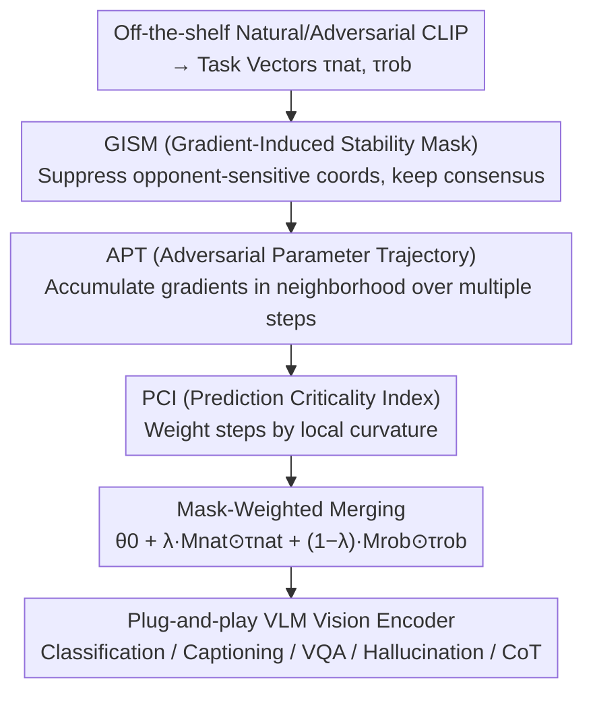

# Tug-of-War No More: Harmonizing Accuracy and Robustness in Vision-Language Models via Stability-Aware Task Vector Merging

**Conference**: ICLR 2026  
**OpenReview**: [https://openreview.net/forum?id=KOO1cDm2bt](https://openreview.net/forum?id=KOO1cDm2bt)  
**Area**: Multimodal VLM / Adversarial Robustness / Model Merging  
**Keywords**: Task Vector Merging, Adversarial Robustness, CLIP, Clean-Robust Trade-off, Gradient Stability  

## TL;DR
Addressing the persistent trade-off where "improving VLM robustness inevitably degrades clean accuracy," this paper proposes PISTOLE. Instead of retraining, it selectively merges off-the-shelf "naturally fine-tuned" and "adversarially fine-tuned" CLIP task vectors based on **prediction stability**. By using complementary gradient stability masks to suppress conflicting coordinates and weighting adversarial parameter trajectories with curvature-sensitive metrics, it "bends" the typically linear clean-robust frontier toward a better sweet spot, improving both clean and robust accuracy by approximately 5% across 14 datasets.

## Background & Motivation

**Background**: Foundation vision-language models like CLIP perform remarkably well on various benchmarks but are extremely fragile to adversarial perturbations; even minor input noise can cause performance collapse. The primary remedy is **adversarial fine-tuning** (e.g., TeCoA, FARE, PMG), which incorporates adversarial examples into training to gain robustness.

**Limitations of Prior Work**: Adversarial fine-tuning almost always comes at the cost of clean accuracy. Finding an acceptable "clean-robust" compromise often requires expensive hyperparameter searches and multiple retraining sessions, which lacks scalability. This **clean-robust trade-off** has been repeatedly proven to be a stubborn tension that does not vanish even as models scale.

**Key Challenge**: The authors first asked a natural question: since "model merging" in the parameter space can fuse multiple fine-tuned models without retraining, can it also merge the **conflicting** objectives of natural and adversarial fine-tuning? Their preliminary experiments found that simply performing a linear summation (vanilla merging) of the two task vectors results in a **near-linear** clean-robust trade-off curve with no sweet spot. This is because naive addition treats all coordinates **equally**, failing to distinguish which parameters benefit both objectives and which create conflicts.

**Key Insight**: Through gradient analysis (Figure 1), the authors observed that the gradient directions of natural and adversarial losses only show moderate consistency and degrade as the attack radius increases—meaning that compatible and conflicting directions **coexist**. Consequently, merging should not be uniform but should **selectively** retain consensus coordinates and suppress adversarial ones.

**Core Idea**: Treat **prediction stability** as a proxy for "cross-objective compatibility." If a parameter remains invariant under perturbation by the opponent's objective, it should be preserved; if the opponent's objective would strongly alter it, it should be attenuated. Based on this, complementary masks are constructed to filter task vectors for merging, resulting in PISTOLE (PredIction STability-aware mOdeL mErging).

## Method

### Overall Architecture
The input to PISTOLE consists of two **off-the-shelf** fine-tuned CLIP vision encoders: a natural model $\theta_{nat}$ obtained via empirical risk minimization on clean data, and a robust model $\theta_{rob}$ obtained through adversarial fine-tuning (defaulting to PMG with 10-step PGD, $\ell_\infty, \epsilon=2/255$). Relative to the pre-trained model $\theta_0$, they define task vectors $\tau_{nat}=\theta_{nat}-\theta_0$ and $\tau_{rob}=\theta_{rob}-\theta_0$. The goal is to obtain an encoder $\theta_{\text{PISTOLE}}$ with a better clean-robust trade-off solely by performing **coordinate-wise selective merging** of these task vectors without any retraining.

The pipeline consists of three steps: first, estimate the stability of each parameter using gradient magnitudes from both objectives to construct a pair of **Gradient-Induced Stability Masks** (GISM) that suppress coordinates sensitive to the opponent's objective. Second, use **Adversarial Parameter Trajectories** (APT) to accumulate gradients over multiple steps, extending the point estimate to a neighborhood to capture high-curvature pockets. Third, use the **Prediction Criticality Index** (PCI) to weight each step during accumulation, allowing fragile (high-curvature) predictions to contribute more. Finally, the two task vectors are multiplied by their respective path-refined masks, added according to a mixing coefficient $\lambda$, and added back to $\theta_0$.

### Key Designs

**1. GISM (Gradient-Induced Stability Mask): Avoiding Mutual Interference**

Naive addition yields a linear frontier because it does not distinguish which coordinates the opponent's objective intends to modify heavily. The intuition behind GISM is that coordinates with large gradient magnitudes are sensitive coordinates the objective "wants to move." To avoid reintroducing adversarial vulnerability during merging, **one objective's sensitive coordinates are used to suppress the other's task vector**. Specifically, expected gradients for both objectives are layer-wise normalized (divided by the layer's max magnitude and raised to the power of $\gamma$ to compress dynamic range) to obtain $\tilde g_{nat}, \tilde g_{rob} \in [0, 1]^d$. Complementary masks are then constructed as:

$$M_{nat}=(1-\tilde g_{rob})^{\kappa},\qquad M_{rob}=(1-\tilde g_{nat})^{\kappa},$$

where $\kappa \ge 1$ sharpens the selectivity. The mask $M_{nat}$ applied to $\tau_{nat}$ is determined by the **robust objective's** gradient—the more the robust objective wants to change a coordinate, the more it is suppressed. To provide a controllable "stability budget," a layer-wise quantile capping is applied (capping the top-$q$ most sensitive coordinates to the $q$-th quantile). Theorem 1 proves that after filtering with the opponent's mask, cross-objective first-order interference is upper-bounded by a tunable factor $\rho \le 1$, and as $\kappa$ increases or capping tightens, $\rho$ decreases monotonically. This provides the mathematical basis for "bending" the linear frontier.

**2. APT (Adversarial Parameter Trajectory): Extending Stability to the Neighborhood**

GISM masks only consider gradient magnitudes at the **single points** $(\theta_{nat}, \theta_{rob})$, capturing first-order instability but potentially missing nearby "high-curvature pockets"—coordinates that are stable at a point but become highly sensitive with slight movement. APT fills this gap using **adversarial perturbations in parameter space**. For each objective $s$, within a Frobenius ball of radius $\eta\|\theta_s\|_F$ centered at $\theta_s$, the model performs $K$ steps of projected gradient ascent along the local worst-case direction:

$$\theta_s^{(i+1)}\leftarrow \Pi_{\theta_s+V_{\theta_s}}\big(\theta_s^{(i)}+\beta\, u_s^{(i)}\big),$$

where $u_s^{(i)}$ is the normalized loss gradient direction. The natural objective uses clean inputs, while the robust objective uses adversarial inputs. Gradients are accumulated along this trajectory to reconstruct path-integrated stability scores $\tilde g_s^{\text{path}}$, which are then masked and capped as in GISM. The logic is simple: coordinates that remain stable under worst-case parameter nudges are safe to keep; those with large gradients along the trajectory are fragile and should be attenuated during merging.

**3. PCI (Prediction Criticality Index): Prioritizing Fragile Predictions**

Should every step along the trajectory be weighted equally? No—flat, confidence-saturated regions should be down-weighted, while high-curvature, fragile regions should be amplified. PCI is such a curvature-aware scalar measuring prediction sensitivity to parameter perturbations:

$$\text{PCI}(x,c,\theta)=\mathbb{E}_{\Delta\in V_\theta}\frac{p_c(x;\theta+\Delta)-p_c(x;\theta)}{p_c(x;\theta)},$$

i.e., the expected relative change in the ground-truth class confidence when isotropic perturbations $\Delta$ are sampled within the parameter ball $V_\theta$. A high PCI indicates a "volatile" prediction (fragile knowledge). PCI weights the path-integrated gradients, up-weighting high-PCI samples in the accumulated gradient to guide the merging away from fragile predictions that would otherwise dominate the post-fusion error. Theorem 2 provides a second-order characterization: for small $\eta$, $\text{PCI} \approx \frac{\sigma^2}{2}\frac{\mathrm{Tr}(H_c(\theta))}{p_c(x;\theta)}$, meaning PCI is proportional to the Hessian trace (curvature). This links PCI weighting to "biasing toward flat minima for better generalization"—confirmed by curvature analysis showing PISTOLE keeps loss-parameter curvature lower than vanilla merging, with the best trade-off occurring at $\lambda=0.2$ where curvature is lowest.

### Loss & Training
PISTOLE **is not a training method**; it is a training-free merging operator. The backbone is CLIP ViT-L/14; the natural vector comes from clean data ERM, and the robust vector comes from PMG (10-step PGD, $\ell_\infty, \epsilon=2/255$, step size $1/255$). The final merged displacement is:

$$\tau^*(\lambda)=\lambda\,(M_{nat}^{\text{path}}\odot\tau_{nat})+(1-\lambda)\,(M_{rob}^{\text{path}}\odot\tau_{rob}),\quad \theta_{\text{PISTOLE}}=\theta_0+\tau^*(\lambda),$$

with a default mixing coefficient $\lambda=0.2$. Robustness is evaluated using AutoAttack. For downstream transfer, the vision encoder of LLaVA-1.5-7B or OpenFlamingo-9B is replaced with the merged encoder, while the rest remains frozen.

## Key Experimental Results

### Main Results
Zero-shot classification on 14 datasets (CLIP ViT-L/14, AutoAttack $\ell_\infty, \epsilon=2/255$, Sum = Average of Clean and Robust):

| Method | Clean | Robust | Sum |
|------|-------|--------|-----|
| TeCoA | 61.56 | 43.26 | 104.82 |
| PMG | 64.46 | 45.74 | 110.20 |
| FARE | 65.50 | 42.97 | 108.47 |
| TGA | 62.11 | 45.19 | 107.30 |
| **PISTOLE** | **69.24** | **47.65** | **116.89** |

Relative to the strongest adversarial fine-tuning baseline, clean accuracy improved by ~5% and robust accuracy by ~5.8%. PISTOLE maintains Sum leadership across backbones (ViT-H/14, ViT-B/32), larger perturbation radii ($\epsilon=3/255, 4/255$), and PEFT settings with LoRA (e.g., ViT-H/14: 126.06 vs FARE 120.80).

Downstream transfer (plug-and-play encoder replacement) also showed consistent leads:

| Task | Metric | Strongest Baseline | PISTOLE |
|------|------|----------|---------|
| COCO captioning (LLaVA) | CIDEr Sum | 156.4 (FARE) | 165.5 |
| VQAv2 (LLaVA) | Acc Sum | 104.8 (FARE) | 110.6 |
| POPE Hallucination (ViT-L) | Mean F1 | 80.8 (FARE) | 83.0 |
| ScienceQA CoT (ViT-L) | Mean Acc | 52.4 (FARE) | 54.1 |

### Ablation Study
Step-by-step addition of the three core modules (Average of 14 datasets):

| Configuration | Clean | Robust | Sum | Description |
|------|-------|--------|-----|------|
| Vanilla addition | 66.57 | 44.54 | 111.11 | Baseline |
| +GISM | 67.78 | 45.69 | 113.47 | Complementary stability masks |
| +GISM+PCI | 68.36 | 46.47 | 114.83 | Added curvature weighting |
| +GISM+APT | 67.64 | 47.11 | 114.75 | Added adversarial trajectory (improves robust) |
| **Full (GISM+PCI+APT)** | **69.24** | **47.65** | **116.89** | Complete model |

### Key Findings
- **GISM is the foundation**: Adding only the mask improves both clean and robust metrics (Sum +2.36), confirming that "mutually suppressing sensitive coordinates" is key to bending the linear frontier.
- **PCI favors Clean, APT favors Robust**: PCI primarily improves the clean side by prioritizing fragile predictions, while APT improves the robust side via neighborhood gradient refinement. They are complementary.
- **Natural Vector Source**: Using a "naturally fine-tuned" model is better than using a "zero-shot pre-trained" model as the natural vector (Sum 116.89 vs 114.93), as ERM task calibration displacements are closer to the consensus direction of the robust objective.
- **$\lambda=0.2$ is the sweet spot**: This point exhibits the lowest loss-parameter curvature and the best trade-off, aligning with the "bias toward flat minima" prediction from Theorems 1 and 2.

## Highlights & Insights
- **Stability as a Compatibility Proxy**: Instead of directly optimizing conflicting objectives, the method uses "whether the opponent's objective would change this coordinate" as a filter, allowing for selective fusion without joint retraining.
- **Strong Theory-Practice Loop**: Theorem 1 provides a first-order interference bound, Theorem 2 links PCI to the Hessian trace, and curvature measurements confirm these, showing it is not just a collection of tricks.
- **Transferable Motif**: The concepts of "complementary gradient masks + accumulation along adversarial parameter trajectories + curvature weighting" are not limited to clean-robust trade-offs and could theoretically be applied to any **partially conflicting objectives**.
- **Hallucination reduction**: The hallucination rate also decreased, which the authors attribute to the stability mask suppressing "overconfident yet fragile" features, suggesting shared underlying mechanisms between adversarial stability and hallucination mitigation.

## Limitations & Future Work
- **Dependency on high-quality adversarial models**: PISTOLE does not retrain but requires a good $\theta_{rob}$ (defaulting to PMG). Merging quality is constrained by the upstream fine-tuning quality.
- **Vision-encoder centric**: The method only merges task vectors for the CLIP vision tower; the text tower and downstream LLM remain frozen, limiting the trade-off space to the vision side.
- **Hyperparameter count**: $\kappa$, quantile $q$, trajectory steps $K$, radius $\eta$, temperature $\gamma$, and $\lambda$ all need to be set. While it saves on retraining, the cost of mask construction and hyperparameter sensitivity is mainly detailed in the appendix rather than the main text.
- **First-order/Local Theory**: Theorem 1 is a first-order bound and Theorem 2 is a small-$\eta$ approximation, which may loosen under large displacements far from the fine-tuned solution.

## Related Work & Insights
- **vs. Adversarial Fine-Tuning (TeCoA / FARE / PMG / TGA)**: These methods trade clean accuracy for robustness through training; PISTOLE treats their outputs as **off-the-shelf components** for selective fusion without retraining, achieving higher Sum scores.
- **vs. Naive Merging (Task Arithmetic) / WiSE-FT**: Naive merging weights all coordinates equally, resulting in a linear frontier; PISTOLE uses coordinate-wise reweighting via stability masks to create a "bent" frontier.
- **vs. Ties-Merging / AdaMerging**: These also handle merging conflicts but rely on sign/magnitude cropping or learned coefficients, **ignoring parameter-space perturbations and local loss geometry**. PISTOLE differs by introducing adversarial trajectories and curvature-aware PCI.

## Rating
- Novelty: ⭐⭐⭐⭐⭐ First to apply task vector merging to the "clean vs. robust" conflict with a stability-curvature framework.
- Experimental Thoroughness: ⭐⭐⭐⭐⭐ 14 datasets, multiple backbones, radii, LoRA settings, 4 types of downstream transfer, and detailed curvature analysis.
- Writing Quality: ⭐⭐⭐⭐ Motives and theory are clear, though notation and mask details are dense; some hyperparameter analysis is relegated to the appendix.
- Value: ⭐⭐⭐⭐⭐ Training-free, plug-and-play, and transferable to downstream tasks, making it highly practical for deployment.

<!-- RELATED:START -->

## Related Papers

- [\[ICLR 2026\] Identifying Robust Neural Pathways: Few-Shot Adversarial Mask Tuning for Vision-Language Models](identifying_robust_neural_pathways_few-shot_adversarial_mask_tuning_for_vision-l.md)
- [\[ICML 2026\] Towards Fine-Grained Robustness: Attention-Guided Test-Time Prompt Tuning for Vision-Language Models](../../ICML2026/ai_safety/towards_fine-grained_robustness_attention-guided_test-time_prompt_tuning_for_vis.md)
- [\[CVPR 2026\] A Provable Energy-Guided Test-Time Defense Boosting Adversarial Robustness of Large Vision-Language Models](../../CVPR2026/ai_safety/a_provable_energy-guided_test-time_defense_boosting_adversarial_robustness_of_la.md)
- [\[ICLR 2026\] MoReBench: Evaluating Procedural and Pluralistic Moral Reasoning in Language Models, More than Outcomes](morebench_evaluating_procedural_and_pluralistic_moral_reasoning_in_language_mode.md)
- [\[ICLR 2026\] Towards a Certificate of Trust: Task-Aware OOD Detection for Scientific AI](towards_a_certificate_of_trust_task-aware_ood_detection_for_scientific_ai.md)

<!-- RELATED:END -->
