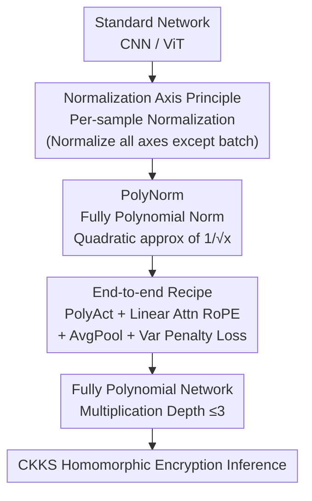

# ULD-Net: Enabling Ultra-Low-Degree Fully Polynomial Networks for Homomorphically Encrypted Inference

**Conference**: ICLR 2026  
**OpenReview**: [https://openreview.net/forum?id=Jngc6oTe8R](https://openreview.net/forum?id=Jngc6oTe8R)  
**Code**: https://github.com/xiexi51/ULD-Net  
**Area**: Privacy-Preserving Inference / Homomorphic Encryption / AI Security  
**Keywords**: Homomorphic Encryption, Fully Polynomial Networks, Ultra-Low-Degree Polynomials, Normalization, Privacy-Preserving Inference

## TL;DR
ULD-Net proposes a method to train "fully polynomial networks" from scratch. By utilizing a polynomial-only normalization layer, PolyNorm (consisting only of additions and multiplications), activation values are stabilized within a well-behaved range. This allows ultra-low-degree fully polynomial models with multiplication depth $\le 3$ to scale to ViT/ImageNet for the first time (ViT-Small achieves 76.70% top-1 on ImageNet), achieving a 2.76× homomorphic encryption inference speedup compared to previous SOTA.

## Background & Motivation

**Background**: Machine learning is increasingly delivered as a service (MLaaS), making the confidentiality of user data and model weights essential. Homomorphic Encryption (HE, especially the CKKS scheme suitable for ML) allows additions and multiplications directly on ciphertexts, serving as an ideal foundation for privacy-preserving inference. However, deep networks are dominated by non-polynomial operators like ReLU, GELU, LayerNorm, and Softmax, which are either extremely expensive or unsupported in HE.

**Limitations of Prior Work**: The prevailing approach is to use high-degree polynomials to approximate these non-polynomial operators after training, or to offload them to other secure protocols. However, high-degree/cascaded polynomials significantly increase the "multiplication depth" of HE, which is the primary factor determining computation speed and grows logarithmically with the polynomial degree. Furthermore, such approximations are fragile when training on large models and datasets. For instance, Lee et al. used cascaded polynomials with an equivalent degree of 6075 to stabilize ResNet-18 on ImageNet, which is catastrophic for HE inference. SMART-PAF reduced this to 81, but its complex training pipeline is difficult to migrate and scale to fully polynomial ViTs.

**Key Challenge**: Fully polynomial networks face a trade-off between stability and efficiency. Polynomials of degree $\ge 2$ grow explosively when inputs exceed a narrow range. In deep stacks, this instability is amplified layer by layer, deviating the optimization process, especially on high-variance large datasets. To ensure stability, high-degree/cascaded polynomials are used to keep approximation errors within the target range—but this directly inflates HE costs.

**Goal**: To revisit the problem from first principles: Is it possible to avoid post-hoc approximation and instead train a network from scratch where "every layer is a low-degree polynomial," maintaining accuracy while minimizing HE costs?

**Key Insight**: The authors observe that numerical constraints in fully polynomial models are primarily imposed by normalization layers. Normalization maps inputs to zero mean and unit variance, preventing the absolute values of polynomial inputs from becoming too large and avoiding divergent outputs. Thus, the problem transforms into: how to design a normalization layer using **only addition and multiplication** that robustly controls activation ranges, paired with an appropriate normalization axis.

**Core Idea**: Replace LayerNorm/BatchNorm with PolyNorm—a fully polynomial normalization layer (centered on approximating $1/\sqrt{x}$ with a quadratic function). Combined with a "per-sample normalization" axis principle, all activations, attention, and pooling are replaced with ultra-low-degree polynomial operators. This enables the training of fully polynomial networks with multiplication depth $\le 3$ from scratch without relying on high-degree approximations.

## Method

### Overall Architecture

ULD-Net maintains the macro-structure of the original network but replaces every non-polynomial operator with an ultra-low-degree (multiplication depth $\le 3$) polynomial substitute. This results in a "pure $+$ and $\times$" fully polynomial network compatible with CKKS HE engines. The core of this replacement is PolyNorm, which constrains activations into a well-behaved range before each polynomial layer. Other operators (activation, attention, pooling) are transformed into low-degree polynomial forms, supported by a variance-aware penalty loss to stabilize training.

### Key Designs

**1. Normalization Axis Principle: Per-sample parameters to prevent outlier interference**

For a fully polynomial network to remain stable, the **axis of normalization** is critical. Through variance analysis, the authors conclude that per-sample normalization is mandatory. For CNNs, `[B,C,H,W]` tensors are normalized along `[C,H,W]`; for ViTs, `[B,N,D]` tensors are normalized along `[N,D]`.

Why? Consider $n$ pairs of "normalization + polynomial" layers. If two samples $X\sim\mathcal{N}(\mu,\sigma^2 I)$ and $X'\sim\mathcal{N}(\mu,\sigma'^2 I)$ use parameters determined only by $X$, the variance of $X'$ after the first layer becomes $v'_1=(\sigma'/\sigma)^2=r$. In subsequent layers, variance propagates as:

$$v'_{i+1}\approx c\,(v'_i)^d,\qquad c=\frac{a_d^2\,\mathrm{Var}[Z^d]}{\mathrm{Var}[p(Z)]}$$

where $d$ is the polynomial degree. Expanding this yields $v'_n\approx c^{\frac{d^n-1}{d-1}} r^{d^n}$. When $r>c^{-1/(d-1)}>1$, variance grows **exponentially regarding layer depth**, leading to numerical explosion. This is the root cause of why fully polynomial models are difficult to scale. Per-sample normalization forces each sample to unit variance, breaking this exponential chain.

**2. PolyNorm: Quadratic approximation of $1/\sqrt{x}$ for pure arithmetic normalization**

Standard normalization $\mathrm{Norm}[x]=\frac{x-E[x]}{\sqrt{\mathrm{Var}[x]+\epsilon}}$ involves $E[x]$ and $\mathrm{Var}[x]=E[x^2]-E[x]^2$, which are polynomial. The bottleneck is non-polynomial $f(x)=1/\sqrt{x}$. PolyNorm replaces this with a quadratic function $g(x)=a(x-b)^2+c$.

To determine $a, b, c$, the authors emphasize a local point $\mu$: they force $g$ to match $f$ in both **value and derivative** at $\mu$, setting $b=k\mu$ such that $g$ is upward-opening and positive. This yields:

$$a=-\frac{1}{4(1-k)\mu^{5/2}},\quad c=\frac{5-k}{4\mu^{1/2}},\quad k\in(1,5).$$

A "numerical constraint" requires $g(x)\le f(x)$ on $(0,k\mu)$, which narrows $k$ to $[2.438,5)$. This constraint ensures that PolyNorm provides actual "numerical suppression" rather than just an approximation. To keep inputs within the "sweet spot" of $g$, the authors introduce relative variance $v=\mathrm{Var}[x]/\overline{\mathrm{Var}}$ (where $\overline{\mathrm{Var}}$ is the running mean), ensuring the expectation of $\mu v$ is $\mu$. The final form is:

$$\mathrm{PolyNorm}[x]=(x-E[x])\cdot g(\mu v)\cdot\sqrt{\mu/\overline{\mathrm{Var}}},$$

where $\sqrt{\mu/\overline{\mathrm{Var}}}$ is a pre-computable constant. Parameters used are $k=4, \mu=2$, resulting in a multiplication depth of 3.

**3. End-to-end Recipe: Low-degree substitutes and variance penalty loss**

To ensure the entire network is fully polynomial, activation (ReLU/GELU) is replaced with $\mathrm{PolyAct}(x)=\mathrm{Dropout}(\sum_{i=0}^{n}\alpha_i c_i x^i)$ with $n \le 3$. ViT attention is replaced with a linear attention using Rotary Positional Embeddings (RoPE). MaxPool is replaced by AvgPool.

Two stabilization details are added: 1) Warmup using real non-polynomial normalization before switching to PolyNorm. 2) Variance-aware penalty losses:

$$L_1=\frac{1}{N}\sum_{i=1}^{N}v_i\cdot\lambda_1,\qquad L_2=\frac{1}{N}\sum_{i=1}^{N}(v_i-1)^2\cdot\lambda_2.$$

$L_1$ suppresses large variances, while $L_2$ pulls the distribution toward 1, where $g(x)$ performs optimally.

### Loss & Training
Training is conducted in plaintext using polynomial operators. The total loss includes standard classification loss plus $L_1$ and $L_2$. Training utilized PyTorch 2.7 and 8 A100 GPUs. HE inference is implemented using the Microsoft SEAL 3.4.5 CKKS RNS variant with $2^{15}$ degree and 881-bit modulus for 128-bit security.

## Key Experimental Results

### Main Results

Comparison on ResNet-18 / ImageNet (Original accuracy: 69.76%):

| Method | Activation Degree | Test Acc. | Model Latency (s) | Gain |
|------|---------|-----------|--------------|--------|
| Lee et al. (2021) | 6075 | 69.35% | 144896 | 3.50× |
| SMART-PAF | 81 | 69.40% | 114277 | 2.76× |
| **ULD-Net (Ours)** | **2** | **69.79%** | **41408** | — |

Comparison on ViT-Small vs NEXUS:

| Dataset | Method | Test Acc. | Non-poly Op Latency (s) | Gain |
|--------|------|-----------|----------------------|--------|
| CIFAR-10 | NEXUS | 91.39% | 7995 | 20.5× |
| CIFAR-10 | **ULD-Net** | **91.48%** | **390** | — |
| Tiny-ImageNet | NEXUS | 60.52% | 24231 | 20.5× |
| Tiny-ImageNet | **ULD-Net** | **61.40%** | **1182** | — |

ULD-Net is the **first** to scale fully polynomial models to ViT/ImageNet (ViT-Small 76.70% on ImageNet).

### Ablation Study

Comparison with partial replacement methods (ResNet-18 / CIFAR-100, original 77.84%):

| Method | ReLU Replace Ratio | Test Acc. | Latency (s) | Note |
|------|-----------|-----------|------------|------|
| SNL | 0.88 | 73.75% | 2052 | Partial |
| AutoReP | 0.87 | 75.48% | 2053 | Partial |
| **ULD-Net** | **1** | **78.81%** | **647** | Full replacement, +3.33% Acc, 3.17× speedup |

### Key Findings
- **Multiplication depth is the bottleneck for HE**: Compared to degrees 6075 or 81, ULD-Net's degree-2 approach reduces activation latency by 8.12× and total latency by 2.76×.
- **Full replacement can improve accuracy**: Low-degree polynomial activations can provide better non-linearity, outperforming the original model by +0.97% on CIFAR-100.
- **Synergy between Axis and PolyNorm**: Per-sample normalization prevents exponential variance explosion, while the $g \le f$ constraint locks activations in a stable range.

## Highlights & Insights
- **Simplifying "Square Root Inverse"**: Transformed a significant HE hurdle into a pre-computable constant and a simple quadratic function through local matching and one-sided constraints.
- **Theoretic Analysis of Variance**: The $v'_n=O(r^{d^n})$ derivation provides a mathematical explanation for why fully polynomial models previously failed to scale.
- **Architecture Agnostic**: The combination of PolyNorm, PolyAct, and Linear Attention works consistently across CNNs and ViTs.

## Limitations & Future Work
- **Scalability**: Currently verified up to ViT-Base (~86M parameters); effectiveness on ViT-Large or LLMs remains an open question.
- **Accuracy-Degree Trade-off**: In deeper architectures like VanillaNet-7, the degree requirement increases to 3 to maintain accuracy.
- **Evaluation**: The accuracy of linear attention substitutes for Softmax needs more systematic evaluation on long-sequence tasks.

## Related Work & Insights
- **vs Lee et al. / SMART-PAF**: These use high-degree post-hoc approximations. ULD-Net trains degree-3 models from scratch, significantly reducing HE depth.
- **vs SNL / AutoReP**: These leave some non-polynomial operators, requiring expensive secure protocols. ULD-Net achieves 100% replacement with higher accuracy and lower latency.
- **vs NEXUS**: NEXUS optimizes systems but maintains high multiplication depth for LayerNorm/Softmax. ULD-Net reduces depth to 2/3, achieving 20.5× non-polynomial operator acceleration.

## Rating
- Novelty: ⭐⭐⭐⭐⭐ First to scale fully polynomial models to ImageNet scale using clean quadratic approximations.
- Experimental Thoroughness: ⭐⭐⭐⭐ Extensive comparisons across architectures and datasets, though larger models are pending.
- Writing Quality: ⭐⭐⭐⭐ Clear chain of logic from variance analysis to method design.
- Value: ⭐⭐⭐⭐⭐ High engineering value for privacy-preserving inference by minimizing multiplication depth.

<!-- RELATED:START -->

## Related Papers

- [\[ICLR 2026\] Video Unlearning via Low-Rank Refusal Vector](video_unlearning_via_low-rank_refusal_vector.md)
- [\[NeurIPS 2025\] DESIGN: Encrypted GNN Inference via Server-Side Input Graph Pruning](../../NeurIPS2025/ai_safety/design_encrypted_gnn_inference_via_server-side_input_graph_pruning.md)
- [\[ICML 2025\] Fully Heteroscedastic Count Regression with Deep Double Poisson Networks](../../ICML2025/ai_safety/fully_heteroscedastic_count_regression_with_deep_double_poisson_networks.md)
- [\[ICLR 2026\] Robust Federated Inference](robust_federated_inference.md)
- [\[CVPR 2026\] All Vehicles Can Lie: Efficient Adversarial Defense in Fully Untrusted-Vehicle Collaborative Perception via Pseudo-Random Bayesian Inference](../../CVPR2026/ai_safety/all_vehicles_can_lie_efficient_adversarial_defense_in_fully_untrusted-vehicle_co.md)

<!-- RELATED:END -->
