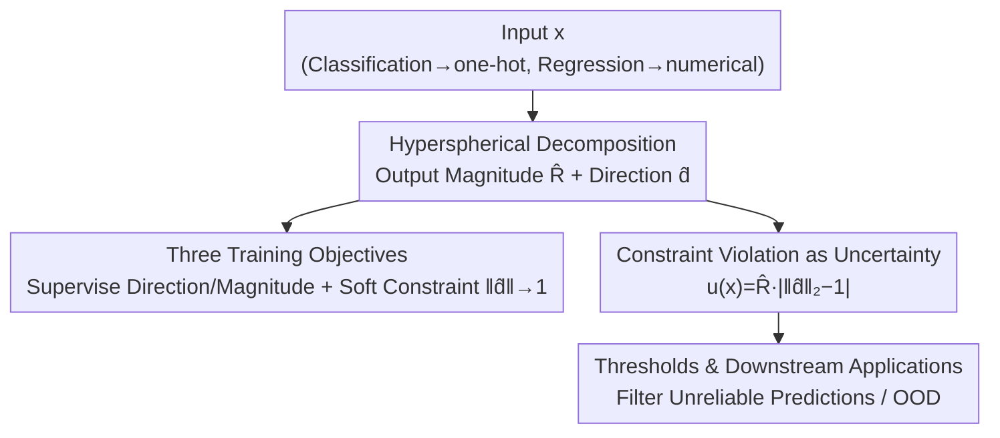

# Uncertainty Estimation via Hyperspherical Confidence Mapping

**Conference**: ICLR 2026  
**OpenReview**: [https://openreview.net/forum?id=G4JYxxI23T](https://openreview.net/forum?id=G4JYxxI23T)  
**Code**: https://github.com/Abandoned-Puppy/HCM (CIFAR-10 / Two-Moons / 1D Regression)  
**Area**: AI Safety / Uncertainty Estimation / Confidence Calibration  
**Keywords**: Uncertainty Quantification, Hyperspherical Decomposition, Calibration, OOD Detection, Sampling-free Inference

## TL;DR
This paper proposes Hyperspherical Confidence Mapping (HCM), which decomposes network outputs into "magnitude $R$ + unit direction vector $\hat{d}$" and treats the degree of deviation of $\hat{d}$ from the unit sphere as uncertainty. This achieves **sampling-free, distribution-assumption-free** deterministic uncertainty estimation, matching or even exceeding Deep Ensembles and Evidential Learning in classification and regression task with minimal inference overhead.

## Background & Motivation

**Background**: In high-risk scenarios such as autonomous driving, medical diagnosis, and semiconductor manufacturing, providing only a predicted value is insufficient; the "reliability of the prediction" must also be provided. Current mainstream uncertainty estimation methods are roughly divided into four categories: sampling-based (MC Dropout, Deep Ensembles), distribution-based (Gaussian Regression, Dirichlet, Evidential Learning), interval-based (Quantile Regression, conformal prediction), and similarity-based (based on feature space distance/density).

**Limitations of Prior Work**: Each category has structural flaws. Sampling-based methods require multiple stochastic forward passes or training multiple models, leading to high computational and memory overhead impractical for real-time scenarios. Distribution-based methods allow single-pass inference but rely on strong priors (Gaussian/Dirichlet), which can be distorted by multimodal or complex uncertainties. Interval-based methods often require multiple quantile outputs and meticulously designed objectives, typically only guaranteeing marginal coverage without providing per-sample reliability. Similarity-based methods depend on class prototypes or density estimation, making them naturally suited for classification but difficult to extend to regression.

**Key Challenge**: Existing methods often fail to simultaneously satisfy five attributes: "Sampling-free ↔ No Distribution Assumption ↔ Task-agnostic ↔ Real-time ↔ Interpretable" (Table 1 in the paper directly compares these). The root cause is that most methods operate on **predicted distributions or sampling statistics** rather than directly extracting reliability from the geometric structure of the output.

**Goal**: To find a deterministic, lightweight uncertainty metric that is universal to classification and regression and whose score is inherently interpretable.

**Key Insight**: The authors observe that if the target vector $y$ is written in the form of "magnitude × unit direction" as $y=Rd$ ($\|d\|_2=1$), then whether the learned direction $\hat{d}$ falls on the unit sphere serves as a natural geometric constraint. When the model is uncertain about an input, its predicted $\hat{d}$ will deviate from the unit sphere. This deviation can be calculated without any sampling or distribution assumptions.

**Core Idea**: Use the "degree of violation of the unit sphere constraint" instead of "sampling variance/distribution parameters" to measure uncertainty—specifically, $u(x):=\hat{R}(x)\,\big|\,\|\hat{d}(x)\|_2-1\,\big|$, and theoretically prove it as a lower bound for prediction error.

## Method

### Overall Architecture

HCM reformulates the traditional "unconstrained regression" problem as an "optimization under unit sphere constraints" and interprets the degree of constraint violation directly as uncertainty. The pipeline is: first, unify any task (one-hot for classification, numerical values for regression) into an $\mathbb{R}^D$ regression framework; the model outputs two branches—a scalar magnitude $\hat{R}$ and a direction vector $\hat{d}$, with the final prediction being $\hat{y}=\hat{R}\hat{d}$; during training, a three-term loss supervises direction, magnitude, and softly enforces $\|\hat{d}\|_2\to 1$; during inference, the uncertainty score $u(x)$ is calculated directly from the deviation of $\hat{d}$ from the unit sphere without additional forward passes.

### Key Designs

**1. Hyperspherical Decomposition: Decomposing Output into "Magnitude × Direction" to Apply Geometric Constraints**

Traditional prediction involves unconstrained regression of target values in $\mathbb{R}^D$, providing no structural information about confidence. HCM rewrites the target $y$ as $y=Rd$, where $R\in\mathbb{R}^+$ is the magnitude and $d\in\mathbb{R}^D$ is the unit direction satisfying $\|d\|_2=1$. The model predicts $\hat{R}$ and $\hat{d}$ separately to reconstruct $\hat{y}=\hat{R}\hat{d}$. The authors emphasize this is not a random heuristic: the unit sphere constraint is **unbiased and prior-free**—it treats every dimension of the output equally, unlike other constraints that break dimensional symmetry or inject directional bias. For scalar regression ($D=1$), the target is embedded into a minimal $D=2$ space by duplicating it as $y_{\exp}=(y,y)$, allowing the same decomposition to be used seamlessly. This step also distinguishes it from previous text calibration work that only applied hyperspherical constraints to classification logits (e.g., Gong et al. 2022); HCM performs magnitude-direction decomposition **on the target itself**, enabling unified handling of classification and regression.

**2. Constraint Violation as Uncertainty: Extracting Confidence Scores from Deviation**

With the decomposition, the prediction becomes a constrained optimization $\min_{\hat{R},\hat{d}} \mathcal{L}(\hat{R}\hat{d},y)\ \text{s.t.}\ \|\hat{d}\|_2=1$. However, the authors do not enforce this as a hard constraint. Since the ground truth $d$ satisfies $\|d\|_2=1$, the training objective naturally pulls $\hat{d}$ toward the unit norm; the remaining deviation serves as a signal for model reliability. The uncertainty score is defined as:

$$u(x):=\hat{R}(x)\,\Big|\,\|\hat{d}(x)\| _2-1\,\Big|.$$

This score is calculated deterministically from the model output without sampling, labels, or auxiliary networks, making it extremely lightweight. Its elegance lies in translating abstract "uncertainty" into a number with clear geometric meaning: the further $\hat{d}$ is from the unit sphere, the higher the score. In Two-Moons experiments, samples with high $u(x)$ cluster along the line connecting the directions of the two classes—matching the "ambiguous samples" at the decision boundary.

**3. Error Lower Bound Guarantee: Transforming Scores into Provable Error Proxies**

To ensure $u(x)$ is a reliable metric, the authors prove a monotonic relationship with the true error (Proposition 1): defining $\epsilon:=\frac{|e_R|}{\hat{R}\|e_d\|_2}$, the prediction error satisfies $\|e_y\|_2\ge u(x)(1-\epsilon)$. The derivation uses triangle and reverse triangle inequalities, relying on the key inequality $\hat{R}\|e_d\|_2\ge u(x)$. In a well-trained model, $|e_R|$ is typically much smaller than $\hat{R}\|e_d\|_2$ (i.e., $\epsilon\ll 1$), making $u(x)$ a reliable lower bound for the true error: **High $u(x) \implies$ high error**. This provides the score with a clear interpretability—the higher the score, the more "mathematically destined" the prediction is to be inaccurate. The authors also define a variance-like quantity $\hat{\sigma}^2(x):=\frac{1}{D-1}u(x)\big(\hat{R}(x)(1+\|\hat{d}(x)\|_2)\big)$ and prove that under Gaussian noise, $\hat{\sigma}^2(x)=\sigma^2+O(\cdot)$, allowing it to deterministically track noise levels and characterize the aleatoric component.

**4. Thresholding and Training Objectives: Implementing the Score for Decision Making**

A score alone is insufficient for decision-making; criteria for "how high is too high" and a training objective are needed. Training utilizes a three-term loss:

$$\mathcal{L}_{\text{total}}=\phi_d\big(R\|e_d\|_2\big)+\phi_R\big(e_R\big)+\lambda_{\text{norm}}\phi_{\text{norm}}\big(\|\hat{d}\|_2-1\big),$$

where the first two terms supervise direction and magnitude, and the third term softly enforces the unit norm constraint with weight $\lambda_{\text{norm}}$. Each $\phi_\star$ is drawn from the same loss family (power-$p$ / Huber / smooth-$\ell_1$), providing flexibility in curvature and robustness. This is essentially a soft relaxation of the original constrained problem. For the decision side, two thresholding strategies are provided: when the task **has** a clear tolerance $\varepsilon$ (industrial/safety scenarios), $u(x)>\varepsilon$ is used directly to flag predictions violating the tolerance. When **no** explicit tolerance exists, an empirical high percentile (e.g., 95% or 99%) of $u(x)$ from the validation set is used as a threshold to flag anomalies.

### Loss & Training

The core loss is the three-term $\mathcal{L}_{\text{total}}$ described above. For large-scale classification (CIFAR-10 OOD), the authors introduce **HCM mix**: generating cross-class interpolated samples using mixup. Original HCM under one-hot supervision might push predictions excessively toward a single class direction, limiting uncertainty expression. Interpolated labels created by mixup correspond to directions "located between class anchors" in the hyperspherical decomposition; these intermediate directions naturally have a magnitude less than 1, allowing HCM to more faithfully express uncertainty. The authors note that this improvement is unique to the geometric structure of HCM—applying mixup to traditional methods may actually degrade performance.

## Key Experimental Results

### Main Results

OOD Detection on CIFAR-10 (OpenOOD protocol, ResNet-18, average AUROC over 5 random seeds):

| Method | Near OOD | Far OOD | AVG |
|------|----------|---------|-----|
| MSP | 86.73 | 88.96 | 87.85 |
| Ensembles | 88.89 | 90.86 | 90.15 |
| MC Dropout | 85.21 | 90.50 | 88.33 |
| Energy | 87.52 | 89.36 | 88.62 |
| KNN | 88.07 | 92.59 | 90.97 |
| NCI | 86.49 | 92.49 | 90.36 |
| HCM | 82.23 | 86.45 | 85.04 |
| **HCM mix** | 87.90 | 90.12 | **89.44** |

HCM mix achieves an average AUROC of 89.44%, comparable to the strongest baselines like KNN (90.97%) and NCI (90.36%), but with the **lowest inference latency across all methods**—a direct benefit of being sampling-free and independent of distribution assumptions.

Regression Calibration for NYU-v2 Monocular Depth Estimation (U-Net backbone):

| Method | Pearson ↑ | Spearman ↑ | cov@1σ | ECEreg ↓ | RMSE ↓ |
|------|-----------|-----------|--------|----------|--------|
| EDL | 0.1084 | 0.1370 | 0.6906 | 0.0609 | 0.1241 |
| MC Dropout | 0.1932 | 0.2580 | 0.7019 | 0.0645 | 0.1189 |
| Ensembles | 0.2381 | 0.4684 | 0.6957 | 0.1838 | 0.1234 |
| HCM | **0.4919** | **0.5425** | 0.7433 | 0.2160 | 0.1485 |

HCM significantly leads in the **alignment between uncertainty and true error** (Pearson / Spearman), stemming from Proposition 1. The trade-off is slightly inferior performance in coverage, ECEreg, and RMSE compared to baselines explicitly estimating variance, as small errors in the two components compound when reconstructing $\hat{y}=\hat{R}\hat{d}$.

### Ablation Study

Industrial Semiconductor Wafer Geometry Regression (Proprietary data, MLP, Quantile Normalization):

| Method | Pearson ↑ | Spearman ↑ | cov@2σ | RMSE ↓ |
|------|-----------|-----------|--------|--------|
| EDL | −0.2508 | −0.1837 | 0.8813 | 4.7909 |
| Ensemble | 0.3227 | 0.1220 | 0.8755 | 4.6783 |
| MC Dropout | −0.0785 | −0.0630 | 0.8961 | 6.5602 |
| HCM | **0.8435** | **0.7579** | 0.8667 | 5.4022 |

The gap is further amplified on industrial noisy data: baseline correlations are even negative (uncertainty inversely related to error), while HCM's Pearson of 0.8435 nearly locks error to the score. The authors verify that on this dataset, the lower bound in Proposition 1 is almost tight, with $u$ closely tracking true error.

### Key Findings
- **Alignment vs. Coverage Trade-off**: HCM does not explicitly estimate variance, so it is less dominant in coverage/ECEreg/RMSE, but it gains much stronger monotonic alignment between the score and error—a critical attribute for safety scenarios involving filtering unreliable samples.
- **Mixup Synergy**: Mixup is a geometric fit for HCM rather than a generic trick; one-hot labels tend to oversaturate direction, and mixup creates intermediate directions with magnitudes naturally < 1, filling the gap in uncertainty expression.
- **Decision Boundary as High Uncertainty Zone**: In Two-Moons, high $u(x)$ samples precisely cluster on the lines connecting class directions, which corresponds to the decision boundary in the input space.
- **Training Dynamics Sensitivity**: Excessive $\lambda$ or learning rates can break the unit norm constraint and push $d$ away from the sphere, interfering with the learning of $R$.

## Highlights & Insights
- **Geometric Uncertainty**: Decomposing uncertainty into magnitude-direction and unit sphere violation provides a deterministic, interpretable definition with a provable lower bound—a significant departure from sampling statistics or distribution parameters.
- **Unified Framework**: While similarity/prototype methods are biased toward classification, HCM treats classification as $\mathbb{R}^D$ regression on decomposed targets, allowing both to share the same mechanism.
- **Transferable Logic**: Any task where the output can be split into magnitude and direction can adopt this "constraint violation as uncertainty" paradigm for lightweight UQ.
- **Theory-Practice Loop**: Proposition 1 is not just ornamental; it directly explains why HCM can filter high-error industrial samples based only on $u(x)$ without seeing ground truth labels.

## Limitations & Future Work
- Authors acknowledge that $u(x)$ depends on training dynamics; inappropriate $\lambda$ or learning rates can break constraints. It also does not explicitly distinguish between aleatoric and epistemic uncertainty.
- HCM operates at the output layer and requires lightweight fine-tuning, making it difficult to apply directly to frozen or zero-shot Large Language Models.
- The method assumes targets can be decomposed into "magnitude-direction," which might be restrictive for tasks with inherently multi-valued outputs.
- The structural cost of slightly increased RMSE due to reconstructing $\hat{R}\hat{d}$ and weaker coverage/ECEreg suggests it may not be suitable for scenarios requiring strict probabilistic coverage guarantees.
- Future work: Scaling to larger/multimodal models, improving uncertainty decomposition, and using $u(x)$ to flag high-error samples for active learning.

## Related Work & Insights
- **vs. Sampling (Deep Ensembles / MC Dropout)**: These rely on multiple passes/models for variance estimation, which is accurate but expensive. HCM is deterministic, single-pass, and stronger in score-error alignment, though slightly weaker in coverage.
- **vs. Distribution (EDL / Gaussian Regression)**: These bet on Gaussian/Dirichlet priors and can fail or be overconfident with complex uncertainties. HCM is prior-free and maintains calibration across the [0,1] range.
- **vs. Hyperspherical Calibration (Gong et al. 2022)**: These only apply constraints to classification logits; HCM decomposes the **target itself** and derives uncertainty from constraint violation, unifying regression and classification.
- **vs. Similarity (KNN / Mahalanobis / Energy)**: These depend on class prototypes or density, excelling in OOD detection but struggling with regression. HCM is task-agnostic.

## Rating
- Novelty: ⭐⭐⭐⭐⭐ Reformulating uncertainty as "hyperspherical constraint violation" offers a fresh perspective with theoretical support.
- Experimental Thoroughness: ⭐⭐⭐⭐ Covers classification OOD, depth regression, and real industrial data, but regression benchmarks are limited and lack validation on larger models.
- Writing Quality: ⭐⭐⭐⭐ Clear motivation, intuitive Table 1 comparison, and a solid loop between theory and experiments.
- Value: ⭐⭐⭐⭐ Lightweight deterministic UQ has high practical value for safety/industrial deployment, although it requires fine-tuning and cannot yet adapt to frozen LLMs.

<!-- RELATED:START -->

## Related Papers

- [\[AAAI 2026\] Credal Ensemble Distillation for Uncertainty Quantification](../../AAAI2026/ai_safety/credal_ensemble_distillation_for_uncertainty_quantification.md)
- [\[ICLR 2026\] Fair Decision Utility in Human-AI Collaboration: Interpretable Confidence Adjustment for Humans with Cognitive Disparities](fair_decision_utility_in_human-ai_collaboration_interpretable_confidence_adjustm.md)
- [\[ICML 2026\] Position: Uncertainty Quantification in LLMs is Just Unsupervised Clustering](../../ICML2026/ai_safety/position_uncertainty_quantification_in_llms_is_just_unsupervised_clustering.md)
- [\[ICLR 2026\] RESFL: An Uncertainty-Aware Framework for Responsible Federated Learning by Balancing Privacy, Fairness and Utility](resfl_an_uncertainty-aware_framework_for_responsible_federated_learning_by_balan.md)
- [\[ICML 2026\] Memory as a Markov Matrix: Sample Efficient Knowledge Expansion via Token-to-Dictionary Mapping](../../ICML2026/ai_safety/memory_as_a_markov_matrix_sample_efficient_knowledge_expansion_via_token-to-dict.md)

<!-- RELATED:END -->
