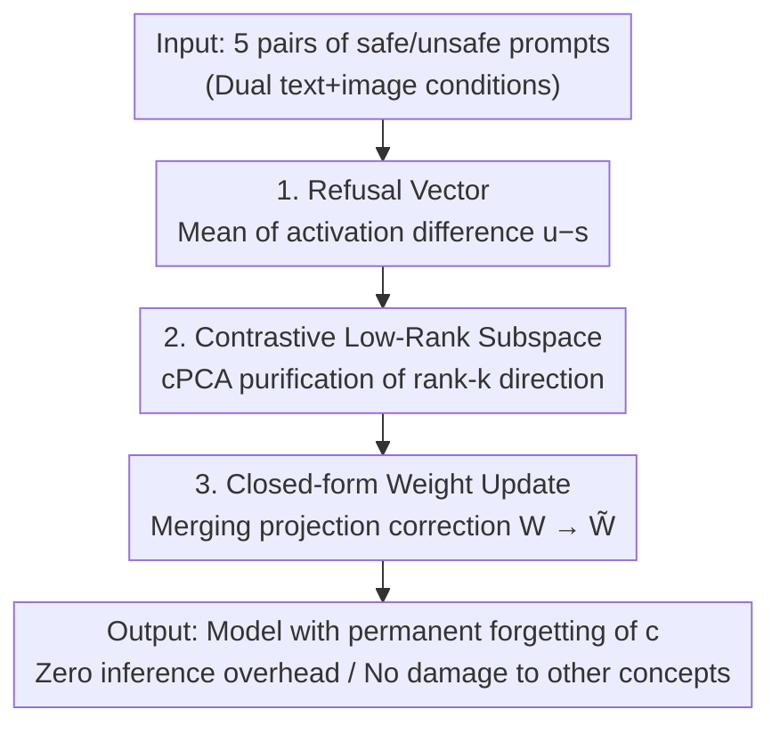

# Video Unlearning via Low-Rank Refusal Vector

**Conference**: ICLR 2026  
**OpenReview**: [https://openreview.net/forum?id=U1XBHtXl7Y](https://openreview.net/forum?id=U1XBHtXl7Y)  
**Paper**: [Project Page](https://www.pinlab.org/video-unlearning)  
**Code**: See project page (Repository not yet explicitly provided)  
**Area**: AI Safety / Machine Unlearning / Video Diffusion Models / Concept Erasure  
**Keywords**: Video Unlearning, Refusal Vector, Contrastive Low-Rank Decomposition, Closed-form Weight Update, Safe Generation

## TL;DR
This work proposes the first training-free, closed-form weight update framework for concept erasure in video diffusion models. By using only 5 pairs of safe/unsafe prompts to estimate a "refusal vector" and applying contrastive low-rank decomposition to decouple target concepts from unrelated semantics, the authors analytically incorporate corrections into model weights. This approach reduces unsafe generation rates in OPEN-SORA and ZEROSCOPET2V by an average of 36.3% and 58.2%, respectively, without compromising video quality or adding inference overhead.

## Background & Motivation

**Background**: Text-to-video diffusion models (e.g., OPEN-SORA, ZEROSCOPET2V), trained on massive uncurated web datasets, can generate high-fidelity videos for industrial applications like advertising and simulation. However, "uncurated corpora" inevitably lead to the learning of unsafe concepts (nudity, violence, copyrighted characters), posing risks of misuse. Purifying these models at the weight level is a prerequisite for responsible release.

**Limitations of Prior Work**: Existing machine unlearning methods fall into two flawed categories. **Filtering-based methods** (keyword blocking, content moderation, SAFREE, VideoEraser) only intercept tokens during inference; they can be bypassed once an attacker obtains the weights. In **Weight-update methods**, fine-tuning (e.g., NullSCE) modifies parameters and denoising dynamics but requires expensive per-concept retraining and is prone to catastrophic forgetting of unrelated semantics or the "resurrection" of erased concepts. While image-domain training-free closed-form edits (UCE, RECE) exist, they target CLIP text encoders and frame-independent architectures, making them inapplicable to video models.

**Key Challenge**: The video domain lacks an unlearning solution that is permanent (weight-level), inexpensive (no retraining), and precise (no collateral damage to unrelated concepts). Filtering treats the symptoms, not the cause; fine-tuning is effective but too costly and disruptive.

**Goal**: Design a training-free, zero-inference-overhead closed-form weight update for video diffusion models to permanently erase specific unsafe concepts from denoiser parameters while preserving quality, temporal consistency, and prompt alignment.

**Key Insight**: The authors leverage the "Linear Representation Hypothesis" from mechanistic interpretability, where many concepts correspond to a single direction in the activation space. While LLMs use a "refusal direction" to control behavior, this work migrates this to video diffusion and **simultaneously utilizes both text and image conditions** for the first time to more accurately approximate the target concept direction.

**Core Idea**: Estimate a refusal vector using the mean difference of "unsafe-safe" activations, purify it from unrelated semantics using a contrastive low-rank subspace, and analytically subtract this direction from the model weights.

## Method

### Overall Architecture
The objective is to permanently remove a concept $c$ (e.g., nudity) from the weights of a pre-trained video diffusion model $\phi$ without retraining. The framework consists of three steps: estimating a "refusal vector" using a minimal set of paired samples, purifying it within a contrastive low-rank subspace, and analytically merging the correction into the weight matrix of a linear layer to produce $\tilde{W}$. The resulting model "forgets" $c$ while leaving other concepts intact.

### Key Designs

**1. Refusal Vector: Locating the "Concept Axis" via Activation Difference**

To erase concept $c$, one must first understand its internal representation. The authors collect $N$ pairs of inputs $\{(x_i^{\text{unsafe}}, x_i^{\text{safe}})\}$ that differ only in the presence of $c$ (e.g., "blonde nude woman" vs. "blonde woman"). These are passed through model $\phi$ to obtain activation sets $U=\{u_i\}$ and $S=\{s_i\}$. Based on the "Linear Representation Hypothesis"—where $c$ exists in $U$ but not in $S$—the difference $r_i = u_i - s_i$ captures the internal representation change. The refusal vector at layer $l$ is the mean of these differences:

$$r^l = \frac{1}{N}\sum_{i=1}^{N}(u_i^l - s_i^l)$$

During modification, rather than subtracting $r$ entirely (which would shift all embeddings), the authors **only subtract the projection component of the sample along the $r$ direction**:

$$\tilde{x}^l = x^l - \lambda\left\langle x^l, \frac{r^l}{\lVert r^l\rVert}\right\rangle\frac{r^l}{\lVert r^l\rVert}$$

where $\lambda$ controls inhibition strength. If $x^l$ does not contain $c$, the dot product is zero, leaving the generation unchanged. If it does, the alignment leads to attenuation. This work **combines text and image conditions** into $x_i$ ($x_i=(x_i^{\text{txt}}, x_i^{\text{img}})$), providing a more accurate approximation than methods acting only on tokens or text encoder latents.

**2. Contrastive Low-Rank Decomposition (cPCA): Purifying the Concept Axis**

A direct refusal vector $r$ may be **entangled** (non-orthogonal) with safe concepts (e.g., "woman", "man") in the representation space. Subtracting $r$ would cause collateral unlearning. The solution is to constrain the projection to a low-rank subspace that retains the primary signal of $c$ while discarding entangled components.

The differences are organized into matrix $R\in\mathbb{R}^{H\times N}$. After centering, the covariance $C_r=\bar{R}^T\bar{R}$ undergoes SVD ($C_r=U\Sigma V^T$), and the first $k$ columns of the left singular matrix $U_k$ span the subspace. To further protect neutral concepts (e.g., dog, tree), **Contrastive PCA** is introduced. Neutral prompt activations $E$ and their covariance $C_e$ are collected. SVD is performed on $C=C_r-\alpha C_e$, where $\alpha$ regulates the suppression of neutral directions. This subspace **maximizes target-specific variance while minimizing neutral variance**. Ablation shows cPCA reduces censorship in the "pornography" category more effectively than pure PCA (13.4% vs 16.9%).

**3. Closed-form Weight Update: Embedding Corrections Permanently**

The aforementioned modifications act on "input embeddings" during inference. The authors demonstrate that this subspace-aware correction can be **analytically transferred to the weights**. For a linear layer $x^{l+1}=W^{l+1}x^l$, replacing $x^l$ with $\tilde{x}^l$ yields:

$$x^{l+1}=W^{l+1}\left(I-\lambda U_k\frac{\hat{r}\hat{r}^T}{\lVert\hat{r}\rVert_2^2}U_k^T\right)x^l=\tilde{W}^{l+1}x^l$$

By replacing $W^{l+1}$ with the modified $\tilde{W}^{l+1}$, the directions aligned with $c$ are explicitly removed from the parameters. This **closed-form update introduces no extra memory or computational overhead during inference**. This is the key advantage over filtering (bypassable) and fine-tuning (expensive): it is permanent, cost-free, and targets specific linear layers, specifically the cross-attention FFNs responsible for spatiotemporal information propagation.

### Loss & Training
This method is **training-free and has no loss function**. The pipeline involves only forward passes to obtain activations, SVD, and a single analytical weight replacement. Key hyperparameters: the refusal vector is applied to layers 17–18 (empirically most effective), 5 prompt pairs are used (a balance of quality/efficiency), cPCA rank $k=100$, and inhibition coefficient $\lambda=1$.

## Key Experimental Results

Evaluation was conducted on two models (OPEN-SORA, ZEROSCOPET2V) across two benchmarks (T2VSafetyBench, SafeSora) using three metrics: ① **Unsafe Generation Rate** judged by GPT-4o (Censorship, lower is better), ② **FVD** (video quality/temporal consistency, lower is better), and ③ **MM-Notox** (semantic preservation for safe prompts). Compared against NullSCE (fine-tuning) and SAFREE (filtering).

### Main Results

T2VSafetyBench / OPEN-SORA (vs. NullSCE):

| Category | Baseline Censorship | NullSCE | Ours | FVD (Baseline→Ours) |
|------|------|------|------|------|
| Copyright/Trademarks | 73.0% | 48.0% | **33.0%** | 147.83 → 149.12 |
| Pornography | 44.7% | 23.0% | **13.4%** | 169.44 → 151.24 |
| Sequence Action Risks | 41.8% | 22.0% | **9.1%** | 182.07 → 172.19 |
| Gore | 74.9% | - | **5.3%** | 162.31 → 154.74 |
| Public Figures | 10.0% | 9.0% | **2.0%** | 160.98 → 176.50 |
| Average | 48.9% | 25.5% | **12.6%** | 164.53 → 160.36 |

SafeSora / ZEROSCOPET2V (vs. SAFREE):

| Category | Baseline Censorship | SAFREE | Ours | FVD (Baseline→Ours) |
|------|------|------|------|------|
| Violence | 71.7% | 50.6% | **10.2%** | 54.46 → 59.17 |
| Terrorism | 76.0% | 52.0% | **4.0%** | 79.66 → 69.44 |
| Racism | 73.3% | 57.8% | **4.4%** | 56.54 → 57.22 |
| Sexual | 51.5% | 18.2% | **9.1%** | 60.96 → 63.51 |
| Animal Abuse | 67.8% | 37.0% | **22.2%** | 95.62 → 95.80 |
| Average | 68.1% | 43.1% | **9.9%** | 69.44 → 69.02 |

The method achieves the lowest unsafe rates across both setups, reducing censorship by an average of 12.9% more than NullSCE and 33.2% more than SAFREE. FVD remains stable, and MM-Notox scores decrease (indicating higher safety), proving that video quality and alignment are preserved.

### Ablation Study
Decomposition of components on T2VSafetyBench "Pornography" subset:

| Configuration | Censorship | Note |
|------|---------|------|
| Baseline | 44.7% | Unmodified |
| Refusal Vector only | 18.0% | Single refusal direction helps significantly |
| + PCA | 16.9% | Low-rank purification adds gain |
| + cPCA | **13.4%** | Contrastive low-rank is strongest; best decoupling |

Other analyses: cPCA rank $k=100$ is optimal; $\lambda=1$ balances erasure and quality; the method is robust to semantic similarity in prompt pairs and random re-sampling of the neutral set in cPCA (fluctuation < 2%).

### Key Findings
- **cPCA is the Precision Driver**: Moving from "Refusal Vector only (18.0%)" to "+cPCA (13.4%)" shows that decoupling concepts from neutral semantics is key to reducing collateral damage.
- **Minimal Samples Suffice**: Only 5 prompt pairs are needed to estimate an effective direction—an extremely low supervisory cost for unlearning.
- **Zero Cost for Quality**: FVD remains consistent with the baseline, and zero inference overhead is added, validating the advantage of closed-form updates over fine-tuning or filtering.
- **Qualitative Interpretability**: Qualitative results show precise corrections (e.g., "pornography → clothed", "dangerous balcony → adding railings", "Ferrari logo → badge removal"), suggesting the refusal direction encodes specific concepts rather than the whole scene.

## Highlights & Insights
- **Transferring LLM "Refusal Directions" to Video**: Demonstrates that the linear representation hypothesis holds in spatiotemporal denoising architectures.
- **Elegant Closed-form Equivalence**: The analytical derivation converting input modification into a weight matrix projection is a powerful and reusable trick for permanent model editing.
- **Dual-path Approximation**: Jointly utilizing text and image conditions approximates the true concept distribution in video models more closely than token-only methods.
- **Contrastive PCA for Safety**: The idea of maximizing target variance while suppressing neutral variance (cPCA) is highly applicable to any task requiring the erasure of concept A without harming concept B.

## Limitations & Future Work
- **Per-concept and Per-layer Hyperparameters**: Hyperparameters like layer choice, rank, and $\lambda$ were found empirically; their generalizability across different models or concepts requires further study.
- **Variable Performance**: Erasure for "Animal Abuse" (22.2%) is weaker than other categories, suggesting some concepts are more deeply entangled or spatially dispersed.
- **Evaluation Dependency**: Reliability depends on GPT-4o as a judge; while it aligns with human judgment, biases in automated evaluation may exist.
- **Future Directions**: Exploring joint erasure of multiple concepts, adaptive layer/rank selection, and robustness against "concept resurrection" attacks.

## Related Work & Insights
- **vs. SAFREE / VideoEraser (Filtering)**: These only block tokens and do not change weights; the proposed work permanently erases concepts from parameters, offering superior average censorship reduction (9.9% vs. 43.1% on SafeSora).
- **vs. NullSCE (Fine-tuning)**: NullSCE requires per-concept retraining; this method is **training-free, closed-form, and zero-overhead**, while achieving more thorough erasure (12.6% vs. 25.5% on T2VSafetyBench).
- **vs. UCE / RECE (Image-domain Closed-form)**: Those focus on frame-independent architectures; this work specifically designs updates for spatiotemporal activations and cross-attention FFNs in video models.

## Rating
- Novelty: ⭐⭐⭐⭐⭐ First training-free closed-form weight unlearning framework for video diffusion, successfully deploying refusal vectors and cPCA.
- Experimental Thoroughness: ⭐⭐⭐⭐ Extensive evaluation across two models and benchmarks, though comparisons could cover even more categories.
- Writing Quality: ⭐⭐⭐⭐ Clear progression from motivation to mathematical derivation; qualitative results support the theory well.
- Value: ⭐⭐⭐⭐⭐ Low cost, zero overhead, and permanent erasure make this highly practical for the safe release of open-source video models.

<!-- RELATED:START -->

## Related Papers

- [\[NeurIPS 2025\] Spectral Perturbation Bounds for Low-Rank Approximation with Applications to Privacy](../../NeurIPS2025/ai_safety/spectral_perturbation_bounds_for_low-rank_approximation_with_applications_to_pri.md)
- [\[ICLR 2026\] Jailbreaking on Text-to-Video Models via Scene Splitting Strategy](jailbreaking_on_text-to-video_models_via_scene_splitting_strategy.md)
- [\[ICLR 2026\] ULD-Net: Enabling Ultra-Low-Degree Fully Polynomial Networks for Homomorphically Encrypted Inference](uld-net_enabling_ultra-low-degree_fully_polynomial_networks_for_homomorphically_.md)
- [\[ICLR 2026\] Privacy Beyond Pixels: Latent Anonymization for Privacy-Preserving Video Understanding](privacy_beyond_pixels_latent_anonymization_for_privacy-preserving_video_understa.md)
- [\[ICLR 2026\] Tug-of-War No More: Harmonizing Accuracy and Robustness in Vision-Language Models via Stability-Aware Task Vector Merging](tug-of-war_no_more_harmonizing_accuracy_and_robustness_in_vision-language_models.md)

<!-- RELATED:END -->
