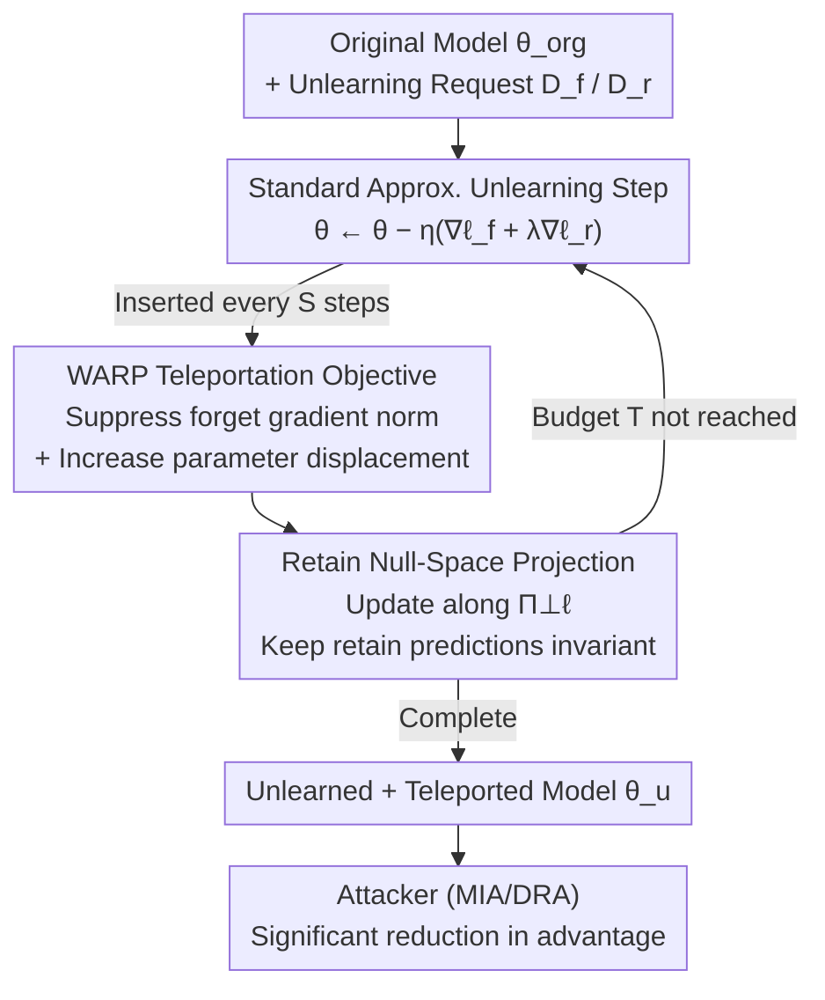

# WARP: Weight Teleportation for Attack-Resilient Unlearning Protocols

**Conference**: ICLR 2026  
**OpenReview**: [https://openreview.net/forum?id=404TzkOCUD](https://openreview.net/forum?id=404TzkOCUD)  
**Code**: https://github.com/mammadmaheri7/WARP_Unlearning  
**Area**: AI Security / Machine Unlearning / Privacy Attacks and Defense  
**Keywords**: Approximate Unlearning, Member Inference, Data Reconstruction, Weight Teleportation, Network Symmetry

## TL;DR
This paper points out that approximate machine unlearning can conversely leak the data being forgotten. This leakage is attributed to two root causes: "large gradient norms of forgotten samples" and "parameters being too close to the original model after unlearning." The authors propose WARP, a plug-and-play defense that utilizes the loss-preserving symmetry of neural networks to "teleport" the model to another point on the loss isosurface. This simultaneously suppresses the unlearning gradient norm and increases parameter displacement, reducing black-box attack AUC by up to 64% and white-box by up to 92% across six unlearning algorithms with almost no loss in accuracy.

## Background & Motivation
**Background**: Machine unlearning (MU) aims to implement the "right to be forgotten"—allowing a trained model to completely erase the influence of a specific forget-set $D_f$, ideally achieving a result equivalent to retraining from scratch on the remaining retain-set $D_r$. Since retraining is costly, **approximate unlearning** has become mainstream: directly fine-tuning the original model $\theta_{org}$ to maximize the loss of the forget-set while using the retain-set to maintain accuracy, trading formal guarantees for efficiency. Representative methods include NegGrad+, SCRUB, SalUn, PGU, BadTeacher, SRF-ON, etc.

**Limitations of Prior Work**: Unlearning is intended to protect privacy but may ironically leak the data it intends to erase. If an attacker simultaneously obtains the pre-unlearning model $\theta_{org}$ and the post-unlearning model $\theta_u$, they can perform a **differential attack**: the parameter difference $\Delta\theta = \theta_u - \theta_{org}$ is, in a first-order sense, an approximation of the gradient of the forgotten samples. This effectively "hands over" the samples to the attacker, allowing direct reconstruction of the original images via gradient inversion. Even models that originally resisted Membership Inference Attacks (MIA) can become vulnerable after unlearning.

**Key Challenge**: Leakage stems from two factors overlooked in previous unlearning work. First, the privacy risk of forgotten samples is positively correlated with their **gradient norm** in the original model—samples with larger gradients cause greater parameter changes when deleted, making them easier to identify via MIA and easier to reconstruct. Second, to preserve retain accuracy, approximate unlearning typically involves **small-step updates**, causing $\theta_u$ to remain close to $\theta_{org}$. Thus, the parameter difference $\Delta\theta$ encodes a strong signal of the forgotten data. Combined, unlearning becomes an attack surface.

**Goal**: (1) Quantify these two root causes and design specialized MIA/DRA attacks for unlearning scenarios to prove the threat is real; (2) Provide a defense that can be attached to any gradient-based unlearning algorithm without requiring training-time statistics.

**Key Insight**: The authors notice that deep networks possess a large number of **loss-preserving symmetries** (rescaling, permutation, basis change, etc.) that shift parameters without changing predictions. Since the danger after unlearning comes from "proximate parameters + large unlearning gradients," the model is "teleported" to another point on the loss isosurface using these symmetries—predictions remain unchanged, but parameters are moved and unlearning gradients are suppressed, making it difficult for an attacker to disentangle "unlearning" from "teleportation."

**Core Idea**: Use loss-preserving symmetry teleportation $\theta \leftarrow g\cdot\theta$ to reparameterize the model after unlearning. This reduces forget-set gradient energy and increases parameter dispersion without altering predictions, thereby erasing signals in $\Delta\theta$ that could be exploited by an attacker.

## Method

### Overall Architecture
This paper follows two lines of work. **Attack Line (Auditing Tools)**: Construct unlearning-specific membership inference and data reconstruction attacks to prove that existing methods leak information in both black-box and white-box settings. **Defense Line (Core Method WARP)**: Treat loss-preserving symmetry as a "teleportation" operator integrated into the unlearning workflow. The framework below depicts the defense pipeline of WARP—the inputs are the original model $\theta_{org}$ and unlearning requests $D_f$. During standard approximate unlearning iterations, a teleportation step is inserted every $S$ steps. The teleportation step solves for a symmetry transformation that "suppresses forget gradients + increases parameter displacement," and uses retain null-space projection to restrict the transformation to a subspace that does not change retain predictions. The final output is $\theta_u$, which has both forgotten $D_f$ and moved away from the neighborhood of $\theta_{org}$, significantly reducing the advantage of MIA/DRA. The attack line acts as a benchmark for evaluating the defense and is not shown in the pipeline.

### Key Designs

**1. Attributing leakage to two root causes and designing a customized reconstruction attack**

The authors decompose "why unlearning leaks" into two quantifiable root causes: large gradient norms of forget samples (Figure 1 shows a clear positive correlation between gradient norm and U-LiRA privacy risk), and the proximity of unlearned parameters to the original model. To prove this, they design specialized attacks. On the black-box side, LiRA is adapted into U-LiRA, using shadow models with the same algorithms and hyperparameters for strong adaptive auditing. On the white-box side, Gaussian gradient difference testing is extended to the unlearning scenario, comparing gradients of the same sample on $\theta_{org}$ and $\theta_u$ as a residual membership signal.

The primary difficulty lies in the **reconstruction attack**: the observed $\Delta\theta$ is not a pure unlearning gradient but a mixture of retain and forget gradients, $\Delta\theta \approx -\eta\,(g_r - \alpha g_f)$. Direct gradient inversion on this is contaminated by $g_r$, leading to poor reconstruction quality. The key innovation is **Orthogonal Subspace Filtering**: gradient snapshots $G_{org}, G_u$ are taken on a probe set for the original and unlearned models respectively. Thin SVD is used to obtain the dominant left singular vectors for projectors $\Pi_{org}=U_{org}U_{org}^\top$ and $\Pi_u^\perp = I-U_uU_u^\top$. Then:

$$\tilde g_f = \Pi_{org}\,\Pi_u^\perp\!\left(-\tfrac{1}{\eta}\Delta\theta\right).$$

The intuition is: unlearning suppresses the forget direction, but the retain directions remain in both models. Thus, $\Pi_u^\perp$ filters out retain components that "still exist after unlearning," and $\Pi_{org}$ preserves directions that were "active before unlearning." Combining these isolates $\alpha g_f$ with a high signal-to-noise ratio. Using the filtered $\tilde g_f$ as the inversion target $\hat x_f \in \arg\min_x D(\nabla_\theta\ell(f(x;\theta_{org}),y),\,\tilde g_f)$ yields significantly higher reconstruction success than attacking $\Delta\theta$ directly.

**2. WARP: Formulating "suppressing forget gradients" and "increasing parameter displacement" as a teleportation objective**

To address the two root causes, the defense must perform two opposing tasks: minimize unlearning gradients and move parameters away from $\theta_{org}$, all without changing predictions. The authors use a family of loss-preserving symmetries $G$—transformations satisfying $L(X,\theta)=L(g\cdot(X,\theta))$—to unify these tasks into a single "teleportation" $\theta\leftarrow g\cdot\theta$ (moving along the loss isosurface). The choice of $g$ is determined by:

$$g^\star \in \arg\min_{g\in G}\;\Big\{\underbrace{\textstyle\sum_{(x,y)\in D_f}\|\nabla_\theta\ell(f(x;g\cdot\theta),y)\|_2^2}_{\text{Minimize forget gradient}} - \beta\,\underbrace{\|g\cdot\theta-\theta\|_2^2}_{\text{Maximize parameter dispersion}}\Big\}\quad \text{s.t. } \ell_r(g\cdot\theta\mid D_r)\le \ell_r(\theta\mid D_r)+\varepsilon.$$

The first term directly suppresses the squared gradient norm of forget samples. The second term uses symmetry-preserving random perturbations to push parameters away from $\theta_{org}$, injecting "harmless noise." The constraint ensures retain performance remains stable. The beauty is that because the transformation follows the loss isosurface, the attacker sees a $\Delta\theta$ mixed with teleportation displacement unrelated to unlearning, making it impossible to cleanly separate "what was forgotten" from "where it was teleported."

**3. Retain null-space projection instantiation + plug-and-play interleaved scheduling**

To solve the abstract objective efficiently on modern networks, one cannot simply enumerate group actions. The authors instantiate $T_\phi$ using teleportation based on retain null-space projection. The teleportation loss is defined as $L_{tel}(\theta)=\sum_{(x,y)\in B_f}\|\nabla_\theta\ell(f(x;\theta),y)\|_2^2-\beta\|\theta-\theta_{org}\|_2^2$. For each layer, thin SVD is performed on the layer input matrix $R_\ell$ of a retain minibatch. The top $k$ left singular vectors $B_\ell$ span the retain subspace, and its orthogonal complement projector is $\Pi_\ell^\perp = I - B_\ell B_\ell^\top$. The teleportation step updates weights only within this complement space:

$$W_\ell^{t+1} \leftarrow W_\ell^{t} - \eta_{tel}\,\Pi_\ell^\perp\big(\nabla_{W_\ell}L_{tel}(\theta^t)\big).$$

This descends $L_{tel}$ to suppress forget gradients while restricting movement to directions orthogonal to retain representations, keeping retain predictions almost invariant. Finally, **plug-and-play**: the $W_\ell$ updates are interleaved with standard unlearning updates every $S$ steps. It requires no per-sample gradients or stored statistics during training, allowing it to be attached to any gradient-based post-processing unlearning algorithm like NGP, SCRUB, SalUn, PGU, BT, or SF.

### Loss & Training
The approximate unlearning core optimizes a composite objective $\min_\theta \ell_f(\theta\mid D_f)+\lambda\,\ell_r(\theta\mid D_r)$ (forget term + retain regularization), with the iterative form $\theta_{t+1}=\theta_t-\eta_t(\nabla_\theta\ell_f+\lambda\nabla_\theta\ell_r)$. WARP does not change this core but inserts a teleportation step every $S$ steps. Parameters $\beta$ tune the balance between gradient suppression and displacement, while $k$ adjusts the retain subspace rank.

## Key Experimental Results

### Main Results
Evaluations cover CIFAR-10 / Tiny-ImageNet / ImageNet-1K using ResNet-18 and ViT-B/16. The forget-set consists of approximately 1% of the training data per class. WARP is compared across six unlearning algorithms.

Under black-box U-LiRA (T=64 shadow models, strong adaptive), WARP reduces membership leakage across all forget samples and for the "most vulnerable" 1% slice, with the greatest gains in low FPR regions:

| Method | Metric | Base | + WARP | Gain (Relative) |
|------|------|------|--------|----------|
| NGP | AUC (Overall) | 0.545 | 0.516 | 64.4% |
| NGP | TPR@1 | 0.030 | 0.014 | 80.0% |
| SCRUB | Slice AUC | 0.710 | 0.610 | 47.6% |
| SF | Slice AUC | 0.518 | 0.501 (Near random) | 94.4% |
| BT | TPR@5 (Overall) | 0.287 | 0.219 | 28.7% |

Under white-box Gaussian gradient difference testing (640 unlearned models), AUC universally decreases. PGU improved from 0.659→0.533 (**92.9%** improvement), BT 0.938→0.907, and SCRUB 0.700→0.657.

### Ablation Study
In the reconstruction attack (ImageNet-1K, ResNet-18, NGP), WARP significantly degrades the attacker's reconstruction quality (lower PSNR/SSIM is better for defense):

| Configuration | PSNR↑ | LPIPS(Alex)↓ | SSIM↑ | Feat MSE↓ |
|------|-------|--------------|-------|-----------|
| Standard Unlearning | 10.74 | 0.34 | 0.12 | 5.39 |
| + WARP | 7.38 | 0.46 | 0.08 | 11.28 |
| Defense Improvement | +45.5% | +26.1% | +31.6% | +52.2% |

### Key Findings
- No single unlearning algorithm dominates across all axes: SF appears robust under black-box auditing but leaks significantly in white-box settings, highlighting the need for dual-threat model auditing.
- Black-box "robust" methods like NGP/SF still show considerable leakage under white-box gradient/weight evidence.
- WARP's gains are concentrated in low FPR regions (TPR@0.1 / TPR@1) because the retain null-space projection suppresses forget gradients and narrows extreme margins, cutting off high-confidence signals.
- Accuracy is almost unaffected, with BT/SF even showing slight improvements.

## Highlights & Insights
- **Leveraging "Loss-preserving Symmetry" as a Privacy Defense**: Teleportation moves along the loss isosurface, keeping predictions constant while suppressing gradients and increasing displacement. This provides a "free" confusion displacement in $\Delta\theta$—the perspective of "prediction invariance = defense freedom" is highly transferable.
- **Orthogonal Subspace Filtering as a Double-Edged Sword**: It serves as the authors' strongest reconstruction attack while simultaneously defining the target signal the defense needs to erase, creating a closed logical loop between attack and defense.
- **Plug-and-play, zero training-time statistics**: It does not modify the original unlearning algorithm and does not store per-sample gradients, allowing it to be attached to diverse methods (gradient ascent, regularization, saliency, projection, distillation).

## Limitations & Future Work
- The defense and attack assume the attacker **simultaneously holds** $\theta_{org}$ and $\theta_u$ (strong white-box/differential setting). If the attacker only has a single model, the root causes and defense benefits may need re-evaluation.
- Experiments are focused on image classification (ResNet-18 / ViT-B/16). Generalization to LLMs and generative models needs further verification regarding teleportation overhead and feasibility.
- The ~1% accuracy loss on NGP suggests a trade-off between gradient suppression/displacement and utility.
- The defense primarily reduces attack success rates **heuristically**; it lacks the formal guarantees found in "DP-style" approaches.

## Related Work & Insights
- **vs. Differential Attacks / Gradient Inversion (Hu et al., Bertran et al.)**: They proved that $\Delta\theta$ approximates unlearning gradients; this paper not only strengthens that (orthogonal subspace filtering) but provides a defense to erase the signal.
- **vs. Network Teleportation (Armenta et al., Zhao et al.)**: They used loss-preserving symmetry for optimization; this paper is the first to use it for privacy defense.
- **vs. DP-Langevin Unlearning (Chien et al.)**: That is a formal route based on calibrated noise; WARP is a lighter, prediction-preserving symmetry-based route.

## Rating
- Novelty: ⭐⭐⭐⭐⭐ Using loss-preserving symmetry teleportation for unlearning privacy defense is a highly novel perspective.
- Experimental Thoroughness: ⭐⭐⭐⭐ Wide coverage of datasets, architectures, and algorithms; however, it is limited to vision tasks and has not reached LLMs.
- Writing Quality: ⭐⭐⭐⭐ The logical chain from root causes to attack to defense is clear.
- Value: ⭐⭐⭐⭐⭐ A plug-and-play, near-zero-cost method to mitigate privacy leakage has direct practical value for implementing the "right to be forgotten."

<!-- RELATED:START -->

## Related Papers

- [\[ICLR 2026\] Dataless Weight Disentanglement in Task Arithmetic via Kronecker-Factored Approximate Curvature](dataless_weight_disentanglement_in_task_arithmetic_via_kronecker-factored_approx.md)
- [\[CVPR 2025\] NoT: Federated Unlearning via Weight Negation](../../CVPR2025/ai_safety/not_federated_unlearning_via_weight_negation.md)
- [\[ICLR 2026\] Label Smoothing Improves Machine Unlearning](label_smoothing_improves_machine_unlearning.md)
- [\[ICLR 2026\] Machine Unlearning under Retain–Forget Entanglement](machine_unlearning_under_retainforget_entanglement.md)
- [\[ICLR 2026\] Distributional Machine Unlearning via Selective Data Removal](distributional_machine_unlearning_via_selective_data_removal.md)

<!-- RELATED:END -->
