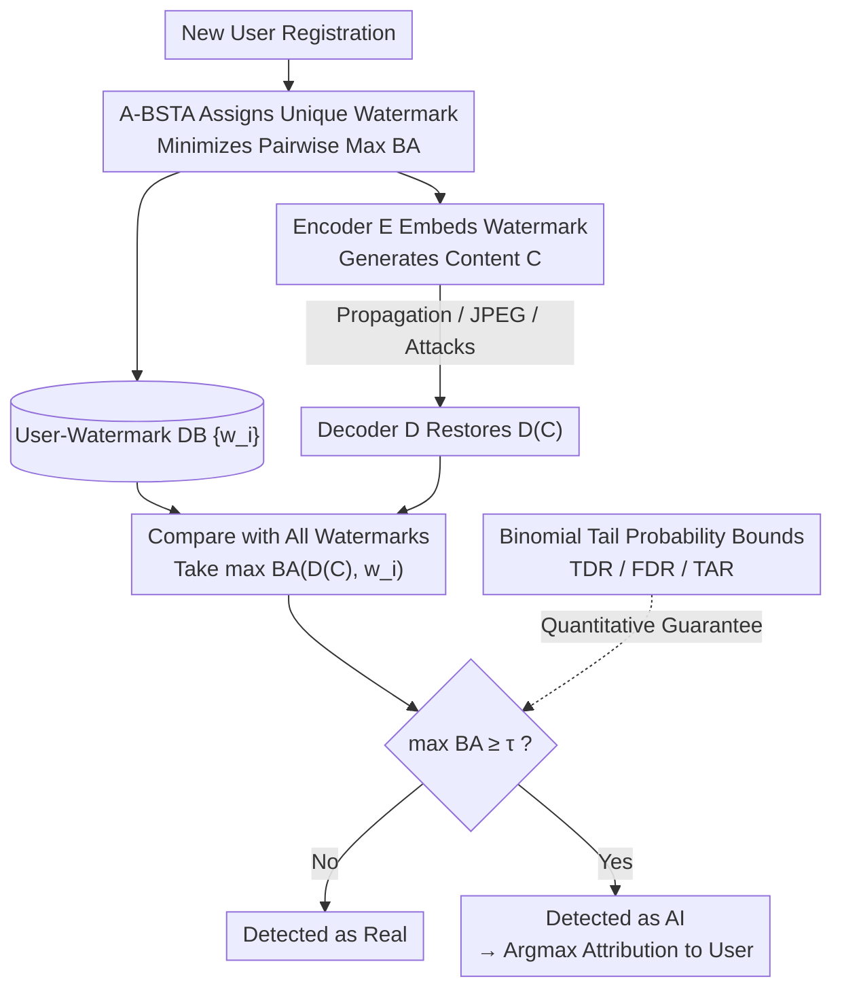

# Watermark-based Detection and Attribution of AI-Generated Content

**Conference**: ICLR 2026  
**arXiv**: [2404.04254](https://arxiv.org/abs/2404.04254)  
**Code**: None  
**Area**: AI Safety  
**Keywords**: watermark, attribution, AI-generated content, detection, digital forensics

## TL;DR

This paper presents the first systematic study of watermark-based user-level detection and attribution for AI-generated content. It providing theoretical analysis (TDR/FDR/TAR bounds), an efficient watermark selection algorithm (A-BSTA), and cross-modal (image and text) experimental validation. The results demonstrate that detection and attribution inherit the accuracy and (lack of) robustness of the underlying watermarking methods.

## Background & Motivation

**Background**: Generative AI (e.g., DALL-E, Midjourney, ChatGPT) can generate highly realistic content, leading to ethical issues such as misinformation and copyright disputes. Companies like Google, OpenAI, and Microsoft have deployed watermarking for **detection**—identifying if content is AI-generated. Existing literature primarily focuses on "user-agnostic" detection, where the same watermark is embedded regardless of the user.

**Limitations of Prior Work**: There is a growing need for **attribution**: once content is detected as AI-generated, it must be traced back to the specific registered user who generated it. This is crucial for law enforcement investigations of cybercrimes (e.g., spreading disinformation). Despite its importance, research in this area is nearly non-existent.

**Key Challenge**: When the number of users is very large (e.g., 100,000 or 1,000,000), how to ensure each user's watermark is unique enough to maintain high attribution accuracy without significantly increasing the false detection rate.

## Method

### Overall Architecture

The paper decomposes "user-level attribution" into three stages: registration, generation, and detection/attribution. During registration, the provider uses A-BSTA to assign a unique watermark bit string to the user. During generation, this string is embedded into images or text by an encoder. Later, the watermark is decoded from suspicious content and compared against the database. If the maximum bitwise accuracy (BA) exceeds a threshold, the content is detected as AI-generated, and the user with the highest BA is identified for attribution. The process does not modify the underlying watermarking method but focuses on watermark allocation (A-BSTA) and decision logic.

### Key Designs

**1. A-BSTA: Watermark Allocation as an Approximate Farthest String Problem**  
To ensure stable attribution, the core task in the registration phase is to minimize the maximum pairwise BA between any two users. This is formulated as $\min_{w_s} \max_{i} BA(w_i, w_s)$, which is equivalent to the NP-hard Farthest String problem. The proposed A-BSTA (Approximate Bounded Search Tree Algorithm) introduces three engineering optimizations: using random watermarks instead of complements for initialization, limiting the search tree depth to $d=8$ for $O(snm^d)$ complexity, and iteratively increasing the set size $m$. A-BSTA maintains the maximum pairwise BA below $0.74$ with a latency of only ~24ms per watermark.

**2. Dual-purpose Threshold for Detection and Attribution**  
For a given content $C$, the system first determines if its maximum BA against the user database exceeds a threshold: $\max_i BA(D(C), w_i) \geq \tau$ (where $\tau > 0.5$). If passed, attribution is performed by selecting $i^* = \arg\max_i BA(D(C), w_i)$. This unified similarity ranking avoids training separate classifiers for attribution, provided that user watermarks are sufficiently "far" apart—a property guaranteed by A-BSTA.

**3. Quantitative TDR/FDR/TAR Bounds**  
The paper defines True Detection Rate ($TDR_i$), False Detection Rate ($FDR$), and True Attribution Rate ($TAR_i$). Based on two estimable properties ($\beta$-accurate and $\gamma$-random), these are modeled using binomial tail probabilities. Specifically, the $TDR$ lower bound is $Pr(n_i \geq \tau n) + Pr(n_i \leq n - \tau n - \bar{\alpha_i} n)$ (where $n_i \sim B(n, \beta_i)$), and $FDR$ upper bound is $1 - Pr(n' < \tau n)^s$ (where $n' \sim B(n, 0.5+\gamma)$). A key insight is that when $\tau > \frac{1+\bar{\alpha_i}}{2}$, the $TDR$ and $TAR$ bounds are approximately equal, implying "detection implies attribution."

## Key Experimental Results

### Main Results

Experiments were conducted on Stable Diffusion, Midjourney, and DALL-E 2 using HiDDeN (a learned watermarking method) with $s=100,000$ users, $n=64$ bits, and $\tau=0.9$.

| Scenario | Avg. TDR | Avg. TAR | FDR | Worst 1% TAR |
| :--- | :--- | :--- | :--- | :--- |
| No Post-processing | ≈1.0 | ≈1.0 | ≈0 | >0.94 |
| JPEG (Q=90) | High | High | ≈0 | Slight decr. |
| Adversarial Attack (Black-box) | 0 | 0 | - | Severe quality loss |

### Watermark Allocation Comparison

| Method | Avg. Generation Time | Max Pairwise BA | Worst User TAR |
| :--- | :--- | :--- | :--- |
| Random | 0.01ms | High | Lowest |
| NRG | 2.11ms | Medium | Medium |
| A-BSTA | 24ms | <0.74 | Highest |

### Ablation Study

| Configuration | Key Metric | Observation |
| :--- | :--- | :--- |
| User count $s$: 10→1M | TDR/TAR slightly decr., FDR incr. | $s$ controls TDR-FDR trade-off |
| Bit length $n$: 32→80 | $n=48/64$ is optimal | Excessive length hurts codec accuracy |
| Threshold $\tau$: 0.7→0.95 | TDR/TAR and FDR move together | Requires careful balancing |

### Key Findings

- Detection and attribution are highly accurate without post-processing (85% of users achieve TAR=1.0).
- Adversarially trained watermarks (like HiDDeN) are robust to common post-processing (JPEG, Gaussian blur).
- Theoretical bounds align well with experimental TDR/TAR, though the FDR upper bound is loose.
- A-BSTA significantly improves worst-case user performance with acceptable latency.
- The framework is applicable to AI-generated text using text-watermarking methods (e.g., AWT).

## Highlights & Insights

- **Theoretical-Practical Alignment**: Derives TDR/FDR/TAR bounds applicable to any watermarking method using parameters estimable from experiments.
- **"Detection is Attribution"**: Insight that a sufficiently high threshold ensures that successful detection almost guarantees correct attribution, simplifying system design.
- **Practical Solver for NP-hard Problem**: Connects watermark allocation to the farthest string problem and utilizes theoretical computer science algorithms.
- **Cross-modal Generality**: The same framework works for both image and text attribution.

## Limitations & Future Work

- Watermarking remains fragile under white-box adversarial attacks (TDR/TAR can drop to 0), a limitation of the underlying watermarking itself.
- Theoretical analysis assumes watermark bits are independent, which may not hold in practice.
- The FDR theoretical upper bound is loose, especially with high bitwise correlation.
- Evaluations utilized low-resolution images (128x128); scaling to higher resolutions remains to be seen.
- Watermark selection algorithms still have room for optimization for extremely large user bases.

## Related Work & Insights

The work bridges digital watermarking (non-learned like Tree-Ring, learned like HiDDeN) and AI safety. Unlike user-agnostic detection, user-aware attribution shifts the focus from "Is it AI?" to "Who generated it?". The implementation of A-BSTA demonstrates the value of migrating algorithms from theoretical computer science to applied AI security.

## Rating

- Novelty: ⭐⭐⭐⭐ (First systematic study of attribution, though detection is established)
- Experimental Thoroughness: ⭐⭐⭐⭐ (Three GenAI models + text + various post-processing)
- Writing Quality: ⭐⭐⭐⭐⭐ (Clear theory, detailed experiments, complete framework)
- Value: ⭐⭐⭐⭐ (Highly practical for GenAI service providers)

<!-- RELATED:START -->

## Related Papers

- [\[CVPR 2026\] Skyra: AI-Generated Video Detection via Grounded Artifact Reasoning](../../CVPR2026/ai_safety/skyra_ai-generated_video_detection_via_grounded_artifact_reasoning.md)
- [\[CVPR 2026\] Scaling Up AI-Generated Image Detection with Generator-Aware Prototypes](../../CVPR2026/ai_safety/scaling_up_ai-generated_image_detection_with_generator-aware_prototypes.md)
- [\[CVPR 2026\] SAGA: Source Attribution of Generative AI Videos](../../CVPR2026/ai_safety/saga_source_attribution_of_generative_ai_videos.md)
- [\[ICLR 2026\] Towards a Certificate of Trust: Task-Aware OOD Detection for Scientific AI](towards_a_certificate_of_trust_task-aware_ood_detection_for_scientific_ai.md)
- [\[CVPR 2026\] SAIDO: Scene-Aware and Importance-Guided Dynamic Optimization for Generalizable AI-Generated Image Detection](../../CVPR2026/ai_safety/saido_generalizable_detection_of_ai-generated_images_via_scene-aware_and_importa.md)

<!-- RELATED:END -->
