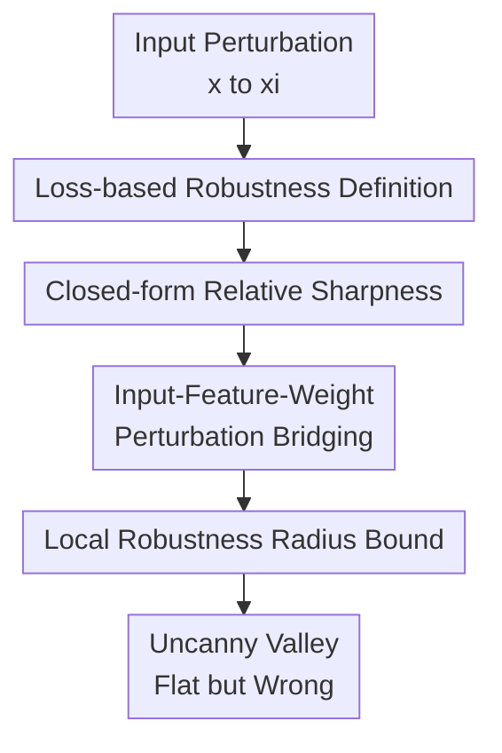

# When Flatness Does (Not) Guarantee Adversarial Robustness

**Conference**: ICLR2026  
**OpenReview**: [https://openreview.net/forum?id=sptCQnKS9X](https://openreview.net/forum?id=sptCQnKS9X)  
**Code**: Not released  
**Area**: AI Security / Adversarial Robustness Theory  
**Keywords**: Adversarial robustness, flatness, relative sharpness, loss landscape, gradient masking

## TL;DR
This paper reformulates the empirical intuition of whether "flat minima lead to adversarial robustness" into a provable problem. It concludes that flatness provides a lower bound for local loss stability around a point but cannot guarantee global robustness, as adversarial examples often fall into high-confidence, low-curvature, but incorrectly classified flat regions.

## Background & Motivation
**Background**: In adversarial robustness, a classic observation is that neural networks are fragile to small input perturbations; in generalization theory, another popular observation is that flatter parameter space minima tend to generalize better. Consequently, many works link these two: if the loss landscape of a model is flat, predictions should not change drastically when the input is perturbed.

**Limitations of Prior Work**: This claim seems reasonable but faces a critical gap. Flatness is usually quantified in parameter space, focusing on how the loss changes as weight $w$ varies; however, adversarial examples occur in input space, focusing on how loss and predictions change when $x$ is perturbed to $x+\delta$. In linear models, $w(x+\delta_x)$ can be rewritten as $(w+\delta_w)x$, allowing for an equivalence; however, in deep networks with nonlinear feature extractors, this relationship no longer holds directly.

**Key Challenge**: Flatness appears to be evidence of robustness, but it might simply be a byproduct of confidence. Under cross-entropy loss, high-confidence predictions naturally lead to smaller Hessians; if the model is also highly confident in a wrong category, that region will similarly appear flat. This implies "flatness" does not necessarily mean "correctness" or "globally hard to attack."

**Goal**: The authors aim to answer three precise questions: First, whether relative flatness in parameter space can formally bound the loss change caused by input space perturbations; second, whether this constraint is pointwise or global; third, why adversarial attacks exhibit the phenomenon of becoming "flatter yet more confidently wrong."

**Key Insight**: Instead of analyzing the Hessian of all parameters, the paper decomposes the network into a feature extractor $\phi$ and a final classifier $g(w\phi(x))$, focusing on the relative sharpness of the penultimate layer. This is crucial as the Hessian of the final layer can be derived in closed form, exposing the relationship between curvature, feature norms, weight norms, and softmax confidence.

**Core Idea**: Use the relative sharpness of the penultimate layer to translate "parameter space flatness" into "input space local loss stability," then prove that this stability only covers a limited basin around a sample and cannot prevent attacks from crossing boundaries into incorrect but equally flat high-confidence regions.

## Method

### Overall Architecture
The method does not propose a new defense algorithm but establishes a theory-experiment loop: reformulate adversarial robustness into a loss-change version, derive the closed-form expression for penultimate layer relative sharpness, bridge input perturbations to feature and weight perturbations via the feature extractor, and finally obtain a local robustness radius using Taylor expansion, which is validated through controlled scaling experiments.

The logic is summarized in four steps: definitionally, moving from "prediction flips" to "significant loss increase"; geometrically, quantifying local curvature via the penultimate layer Hessian trace; propagationally, bounding input perturbations to feature space via Lipschitz feature extractors; and conclusionally, showing that flatness provides a local basin but cannot guarantee correctness outside that basin.

### Key Designs
**1. Loss-based Adversarial Examples: Linking Robustness Directly to Curvature**

Traditional adversarial examples focus on whether the predicted label changes: finding the minimal perturbation $r^*$ such that $f(x+r^*) \ne f(x)$. This is suitable for evaluating attack success rates but not for analyzing the loss landscape because label flipping is a discrete event. The paper introduces loss-change adversarial examples: a perturbation $r$ is considered a violation of loss stability if $\ell(f(x+r), y)-\ell(f(x), y)>\epsilon$.

This is not a change of concept but a continuous version of the classic definition. If the loss is small on clean samples, a prediction flip usually corresponds to a positive loss increase; conversely, with a conservative threshold $\epsilon$, a large loss increase implies a flip. Robustness can then be defined as: for all $\xi \in B_\delta(x)$, $\ell(f(\xi),y)-\ell(f(x),y)\le \epsilon$. This allows Taylor expansion, Hessian traces, and perturbation radii to coexist in a single formula.

**2. Penultimate Relative Sharpness: Decomposing Flatness into Confidence, Feature Scale, and Weight Scale**

The paper follows the "relative flatness" idea from Petzka et al., but to avoid confusion, it uses relative sharpness $\kappa_{Tr}(w)$:

$$
\kappa_{Tr}(w)=\|w\|^2 Tr(H(w,S)).
$$

For a single sample and cross-entropy loss, the authors derive the closed-form Hessian for the final classification layer:

$$
H(w,\{(x,y)\})=(diag(\hat{y})-\hat{y}\hat{y}^T)\otimes \phi\phi^T,
$$

Thus, relative sharpness becomes:

$$
\kappa_{Tr}(w)=\|w\|^2 \sum_{j=1}^{k}\hat{y}_j(1-\hat{y}_j)\sum_{i=1}^{d}\phi_i^2.
$$

This formula is the core lens of the study. It shows that curvature is not just "parameter geometry" but is strongly controlled by softmax confidence: as class probability approaches $1$, $\hat{y}_j(1-\hat{y}_j)$ approaches $0$, and the Hessian trace decreases. High-confidence predictions naturally appear flat, whether correct or not.

**3. Bridging Input and Weight Perturbations: Explaining Why Flatness Only Provides Local Guarantees**

To connect input space perturbations and parameter space flatness, the paper assumes the feature extractor $\phi$ is $L$-Lipschitz and the clean feature norm satisfies $\|\phi(x)\|\ge r$. If $\|\xi-x\|\le \delta$, the feature perturbation can be written as:

$$
\phi(\xi)=\phi(x)+\Delta A\phi(x), \quad \Delta\le L\delta r^{-1},
$$

where $A$ is an orthogonal matrix. Using the linear structure of the final layer, $w\phi(\xi)$ is rewritten as $(w+\Delta wA)\phi(x)$. This step provides a clean theoretical explanation: near the penultimate layer, input perturbations can be viewed as controlled perturbations of the classification layer weights.

A Taylor expansion of $\ell(w+\Delta wA)$ around $w$ follows. When the model converges to a local minimum, the first-order term is handled, the second-order term is controlled by $\kappa_{Tr}^{\phi}(w)$, and the third-order remainder is controlled by the number of classes, feature dimensions, and the Lipschitz constant. The resulting representative bound is:

$$
\ell(f(\xi),y)-\ell(f(x),y) \le \frac{\delta^2}{2r^2}L^2 \kappa_{Tr}^{\phi}(w) + \frac{\delta^3}{24r^3}kmL^6.
$$

This highlights that decreasing $\kappa_{Tr}$ expands the guaranteed perturbation radius for a given $\epsilon$, but only significantly within a local basin due to the third-order term and feature mapping geometry.

**4. Uncanny Valley: Flat Regions can be High-Confidence Error Zones**

The most counter-intuitive conclusion comes from the attack trajectory. When starting from a clean sample, the region might be flat; as it approaches the decision boundary, relative sharpness peaks. However, once the boundary is crossed, the adversarial sample falls into another flat valley where the model is highly confident in the wrong class, the loss plateaus, and the Hessian trace approaches zero. The authors name this the Uncanny Valley.

This phenomenon refutes the crude claim that "flatness implies robustness." Flatness describes stability around a point but carries no semantic information about whether that stable region belongs to the correct class. Once an adversarial sample enters the wrong side's high-confidence region, flatness metrics improve, which might lead to weaker first-order gradients and cause evaluation artifacts like gradient masking.

### Overall Example
Using ResNet-18 on CIFAR-10, a PGD trajectory can be seen as passing through three regions. Initially, the clean image is in a local basin near the correct class; if the final layer weights are scaled to increase confidence, the loss along the first few attack steps barely moves. As the attack continues, the trajectory nears the decision boundary, uncertainty increases, and relative sharpness peaks.

After crossing the boundary, the prediction flips, but the attack does not stop in the "sharp danger zone." Instead, it often slides into a broad high-confidence error region: loss remains high, but relative sharpness drops to near zero. If one only monitors flatness, the sample appears safe; semantically, it is a stable incorrect prediction. This is why flatness "does not guarantee" robustness.

### Loss & Training
The paper does not propose a new loss but uses cross-entropy as the theoretical backbone. In experiments, relative sharpness is controlled by post-hoc scaling the weights $w_s=sw$ without retraining: larger $s$ increases softmax confidence, reducing $\hat{y}_j(1-\hat{y}_j)$ and thus relative sharpness.

Experiments cover ResNet-18, WideResNet-28-4, DenseNet-121, and VGG-11 with BatchNorm on CIFAR-10/CIFAR-100. Standard training uses SGD for 100 epochs, initial learning rate $0.1$, cosine schedule, and weight decay $10^{-4}$. Adversarial training uses PGD-$\ell_\infty$ ($10$ steps, $\epsilon=8/255$, step size $2/255$); evaluations include PGD-$\ell_2$ and PGD-$\ell_\infty$ to observe basin width and loss growth.

## Key Experimental Results

### Main Results
| Question | Setup | Observation | Conclusion |
|----------|------|----------|------|
| Does flatness reduce local loss growth? | ResNet-18 / CIFAR-10, PGD-$\ell_2$, 25 steps, $\epsilon=0.025$, step 0.001, scales $s\in\{0.25,..,50\}$ | Larger $s$ leads to lower relative sharpness; loss increase distributions shift toward $0$. | Flatness expands the low-loss basin around clean points. |
| Robust accuracy under weak $\ell_2$ attack | Penultimate original model | Reported robust test accuracy: $90.33\%$. | Local stability is visible under weak attacks but is not global robustness. |
| Basin after adversarial training | PGD-$\ell_\infty$ AT ResNet, eval with PGD-$\ell_2$ 50 steps, $\epsilon=0.5$ | Basin width (iteration distance) increases by $\sim 20\times$. | AT primarily expands the reachable range of the basin. |
| First-order attack failure | ResNet-18, PGD-$\ell_\infty$ 10 steps, $\epsilon=8/255$, scale $s$ from $1$ to $100$ | Robust accuracy: $0\%$ at $s=1$, $93\%$ at $s=100$. | Scaling creates "unattackable" networks, likely due to gradient masking. |
| Transfer attack test | Adversarial samples found at $s=1$ transferred to other scales | Transfer success rate: $100\%$. | Vulnerabilities do not disappear; first-order gradients just fail to find them. |

### Ablation Study
| Config | Metric | Description |
|------|---------|------|
| Small scale $s=0.25/0.5$ | Earlier loss rise along trajectory | Lower confidence/higher sharpness leads to a narrower local basin. |
| Original scale $s=1$ | Standard baseline | Full trajectory from clean basin to boundary to error valley is observed. |
| Large scale $s=10/50$ | Concentrated loss increase distribution | Increasing confidence lowers relative sharpness and widens the local basin. |
| Max scale $s=100$ | PGD-$\ell_\infty$ robust acc $93\%$, transfer success $100\%$ | Demonstrates that flatness can induce first-order attack failure. |
| Adv. Trained Model | Basin width approx. $20\times$ wider | Robust training expands the basin but remains limited by local guarantees. |
| Sharpness detection | WideResNet-28-4, 5-fold decision stump accuracy $[0.92, 0.93]$ | Sharpness can signal perturbations, though not a complete detection method. |

### Key Findings
- Flatness has local significance: lower $\kappa_{Tr}$ corresponds to smaller loss increases and wider basins, matching the theoretical bound.
- Flatness lacks global semantics: low-curvature regions can correspond to both correct and incorrect high-confidence predictions.
- Regions near decision boundaries are usually the sharpest due to softmax uncertainty; beyond the boundary, curvature collapses as confidence returns.
- Reducing sharpness via weight scaling makes first-order optimization difficult, but transfer attacks reveal that adversarial fragility remains.
- Adversarial training expands the basin width, but theoretical and empirical evidence suggests local basins cannot replace global certificates.

## Highlights & Insights
- The paper's greatest strength is decomposing a common slogan into testable propositions: flatness does guarantee something, but only a local stability radius in terms of loss-change, not predictive correctness across the distribution.
- The closed-form penultimate Hessian is highly explanatory. It breaks "flatness" into $\|w\|^2$, $\|\phi\|^2$, and $\hat{y}(1-\hat{y})$, showing how confidence "pollutes" flatness metrics.
- The Uncanny Valley is an intuitive concept: adversarial samples cross a sharp boundary into a flat valley of the wrong class. This explains why some flatness-based evaluations mistake "failure to optimize" for "robustness."
- The post-hoc scaling experiment is cleanly designed. By changing only the final layer scale without retraining, it isolates the effect of curvature/confidence on attack trajectories.
- The insight for AI security is that metrics shouldn't just look at local geometry; they must verify the reachability of error regions under strong/transfer attacks. A flat region means the model is stable there, not necessarily correctly stable.

## Limitations & Future Work
- Theoretical conditions are idealized. Proofs depend on Lipschitz feature extractors, feature norm lower bounds, and local minima; the authors note that attention layers introduce additional curvature, so the penultimate-layer focus might not directly cover Transformers.
- The robustness radius bound is primarily explanatory rather than a practical certificate. It contains $L$, $r$, $k$, and $m$, which are hard to estimate tightly on real networks.
- Experiments focus on CIFAR classification and limited LLM prompt attack trajectories; while sufficient for geometric claims, more scale is needed for modern large model scenarios.
- Post-hoc scaling risks gradient masking. The paper identifies this via transfer attacks, but any defense targeting flatness must be evaluated against AutoAttack or EOT.
- Future work should develop metrics that distinguish between "correct flatness" and "incorrect flatness," perhaps by decoupling feature geometry from softmax confidence.

## Related Work & Insights
- **vs SAM / sharpness-aware training**: SAM-like methods optimize parameter flatness to improve generalization and robustness; this paper suggests they specifically expand local basins rather than granting global certificates.
- **vs Petzka et al.'s relative flatness**: Inherits the reparameterization-invariant approach but extends the analysis to the penultimate layer for adversarial perturbation analysis.
- **vs Stutz et al. on Robustness-Flatness correlation**: Earlier works highlighted empirical correlations; this work identifies the local mechanisms where it holds and the global "blind spots" where it fails.
- **vs Certified Robustness / Lipschitz constraints**: Unlike direct input radius certificates, this work explains how parameter geometry affects input stability; it complements rather than replaces certification.
- **vs Gradient Masking**: The $s=100$ results verify classic warnings. The new insight is that high confidence causes Hessian collapse, thus "flatness" itself can manifest as the cause of optimization failure.

## Rating
- Novelty: ⭐⭐⭐⭐☆ Reformulates flatness into closed-form derivations with the Uncanny Valley explanation.
- Experimental Thoroughness: ⭐⭐⭐⭐☆ Multiple architectures and transfer tests, though LLM/Large-scale extensions are preliminary.
- Writing Quality: ⭐⭐⭐⭐☆ Clear narrative; formulas and experiments support each other well.
- Value: ⭐⭐⭐⭐⭐ Vital "correction" on the relationship between flatness and safety for the research community.

<!-- RELATED:START -->

## Related Papers

- [\[ICLR 2026\] Reducing Information Dependency Does Not Cause Training Data Privacy. Adversarially Non-Robust Features Do.](reducing_information_dependency_does_not_cause_training_data_privacy_adversarial.md)
- [\[ICLR 2026\] On the Interaction of Compressibility and Adversarial Robustness](on_the_interaction_of_compressibility_and_adversarial_robustness.md)
- [\[CVPR 2026\] When CLIP Sees More, It Fights Back Harder: Multi-View Guided Adaptive Counterattacks for Test-Time Adversarial Robustness](../../CVPR2026/ai_safety/when_clip_sees_more_it_fights_back_harder_multi-view_guided_adaptive_counteratta.md)
- [\[ICLR 2026\] FERD: Fairness-Enhanced Data-Free Adversarial Robustness Distillation](ferd_fairness-enhanced_data-free_adversarial_robustness_distillation.md)
- [\[ICML 2026\] Flatness-Aware Stochastic Gradient Langevin Dynamics](../../ICML2026/ai_safety/flatness-aware_stochastic_gradient_langevin_dynamics.md)

<!-- RELATED:END -->
