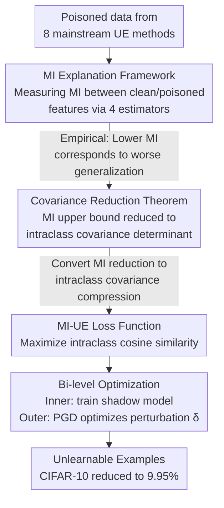

# Why Do Unlearnable Examples Work: A Novel Perspective of Mutual Information

**Conference**: ICLR 2026  
**arXiv**: [2603.03725](https://arxiv.org/abs/2603.03725)  
**Code**: [github.com/hala64/mi-ue](https://github.com/hala64/mi-ue)  
**Area**: AI Security / Data Privacy Protection  
**Keywords**: Unlearnable Examples, Mutual Information, Data Poisoning, Covariance Reduction, Privacy Protection

## TL;DR

This work provides a unified explanation of the effective mechanism of all Unlearnable Examples (UE) from the perspective of Mutual Information (MI) reduction. It proves that reducing the intraclass covariance of poisoned features lowers the MI upper bound. Accordingly, the MI-UE method is proposed to achieve covariance reduction by maximizing intraclass cosine similarity, suppressing test accuracy on CIFAR-10 to 9.95% (near random guessing) while significantly outperforming existing methods under adversarial training defense.

## Background & Motivation

**Background**: Large-scale scraping of internet data for training commercial models (e.g., GPT-4, LAION-5B) has triggered numerous privacy infringement lawsuits. Unlearnable Examples (UE), as a "proactive data defense" measure, have gained attention—users inject imperceptible perturbations satisfy $\|\delta\|_p \leq \epsilon$ before publishing data, causing the generalization ability of unauthorized models trained on this data to drop sharply. The representative method Error-Minimization (EM) can reduce the test accuracy of CIFAR-10 from 94.45% to 24.17%, but a significant gap remains from the random guessing level (10%).

**Limitations of Prior Work**: Meta-existing UE methods are almost entirely designed based on empirical intuition (e.g., "tricking the model into seeing no learnable content," "injecting non-robust features," "creating autoregressive signals"), lacking a unified theoretical explanation. The popular "linear separability" hypothesis has two fundamental flaws: (1) Linear classifiers still achieve 30%+ accuracy on UE data, while deep networks drop to 10%—if UE is just a linear shortcut, why is the linear model less affected? (2) The linear separability of Autoregressive (AR) perturbations is even lower than that of clean data, yet they still exhibit strong unlearnable effects. This indicates that "linear separability" is a symptom, not the root cause.

**Key Challenge**: Perturbations injected by UE cause training data to deviate from the original distribution, breaking the i.i.d. assumption. However, how much and in what way the deviation leads to generalization collapse is unknown. There is a lack of a theoretical tool to measure the relationship between the "degree of distribution shift" and "generalization loss."

**Goal**: (1) Provide a unified information-theoretic explanation framework for all UE methods; (2) Design a principle-driven stronger UE method based on this framework; (3) Explain the "depth effect" phenomenon where deeper networks result in stronger UE effects.

**Key Insight**: Drawing on the idea of using Mutual Information (MI) to measure the correlation between variables across two distributions in representation learning, the authors propose using the mutual information $I(g(X), g(X'))$ between clean features $g(X)$ and poisoned features $g(X')$ in the feature space as a proxy for "learnability"—the lower the MI, the harder it is for the model to recover useful representations of the original distribution from poisoned data.

**Core Idea**: Effective UEs must reduce the mutual information between clean/poisoned features. Minimizing the intraclass covariance of poisoned features (equivalent to maximizing intraclass cosine similarity) can directly optimize the MI upper bound, generating the strongest unlearnable effect.

## Method

### Overall Architecture

The work proceeds in three progressive stages. The first stage is **Empirical Discovery**: systematically measuring the MI reduction of all mainstream UE methods using multiple MI estimators to verify the strong positive correlation (Spearman correlation 0.7818) between "MI reduction ↔ generalization decline." The second stage is **Theoretical Derivation**: proving under the Gaussian Mixture assumption that the MI upper bound contains an intraclass covariance term $\log\det\Sigma_Y$, thereby transforming the MI optimization problem into a manageable covariance reduction problem. The third stage is **Method Design**: proposing MI-UE, which simultaneously trains a shadow model and optimizes the perturbation $\delta$ via bi-level optimization, with the outer objective being the $\mathcal{L}_{mi}$ loss to maximize intraclass cosine similarity and minimize interclass similarity.

### Key Designs

**1. MI Explanation Framework: Replacing empirical intuitions with a unified metric**

By decomposing the classification model into $f = h \circ g$ (where $g$ is the feature extractor and $h$ is the linear classification head), the reason UE prevents the model from learning is essentially that it suppresses the mutual information $I(g(X), g(X'))$ between clean and poisoned features. To verify this, the authors trained ResNet-18 on poisoned data from 8 mainstream UE methods (EM, AP, NTGA, AR, REM, SEM, GUE, TUE) and measured this MI in the feature space. To avoid bias, they used four estimators: Histogram, KDE, k-NN, and MINE, combined with Sliced MI (SMI). The results showed that the MI of all effective UEs is significantly lower than Clean and Random baselines, and a larger MI Gap correlates with a larger Acc Gap. This framework also explains the "depth effect": moving from Linear, 2-NN, 3-NN to LeNet-5, VGG-11, and ResNet-18, the MI reduction and accuracy decline are strictly synchronized. In linear models, $g$ degrades to an identity map, where small-norm perturbations hardly change $I(X, X')$; in deep networks, $g$ amplifies the perturbation's impact in the feature space via error amplification, causing MI to collapse.

**2. Covariance Reduction Theorem (Theorem 5.1): Substituting MI with an optimizable proxy**

MI is extremely difficult to estimate in high-dimensional space, and existing methods suffer from severe statistical bias. Since SGD optimization of MI is also biased, "reducing MI" cannot be used directly as a training objective. Theorem 5.1 provides a workaround: assuming poisoned features $g(X')|Y$ for each class $Y$ approximately follow a Gaussian distribution $\mathcal{N}(\mu_Y, \Sigma_Y)$ (with KL divergence from the true distribution $\leq \epsilon$), an upper bound for MI exists:

$$I(g(X), g(X')) \leq \frac{d}{2}\log(2\pi e) + \frac{1}{2}\mathbb{E}_Y\log(\det\Sigma_Y) + H(g(X')|g(X)) + \mathbb{E}_Y C_Y\sqrt{\epsilon}.$$

The first term is a constant; the third term is constant given a fixed UE generator $\mathcal{G}$ and training algorithm $\mathcal{A}$; the fourth term is a small approximation error. The only actionable term is the intraclass covariance determinant $\det\Sigma_Y$—minimizing it lowers the MI upper bound. Thus, the abstract "mutual information" is reduced to "feature dispersion," making the problem tractable.

**3. MI-UE Loss Function: Translating "covariance compression" into an effective loss**

To reduce $\det\Sigma_Y$, the most straightforward idea is to pull features of the same class together. However, pure Euclidean distance minimization fails in networks with BN/LN, as normalization layers rescale features and vanish the distance optimization gradient. Consequently, MI-UE's $\mathcal{L}_{mi}$ uses a normalization-insensitive cosine metric consisting of two terms. The **Similarity Term** takes the log-ratio of sample pairs in a mini-batch: the numerator is the sum of $\exp(\cos/\tau)$ for intraclass pairs, and the denominator is the sum for interclass pairs. This maximizes intraclass cosine similarity (compressing covariance) while minimizing interclass similarity to prevent feature collapse to a single point. The **Distance Term** $\zeta \cdot \log(1 + \sum_k \|g(x_{b_j}+\delta_{b_j}) - g(x_{b_k}+\delta_{b_k})\|_2)$ acts as a regularization term to enhance robustness, with $\log(1+\cdot)$ used to stabilize gradients.

### Loss & Training

A bi-level optimization (min-min) strategy is adopted: the inner loop trains shadow model parameters $\theta$ using cross-entropy $\mathcal{L}_{ce}$, while the outer loop optimizes perturbation $\delta$ using $\mathcal{L}_{mi}$. Perturbations are generated iteratively via PGD with 10 steps per epoch and a step size of 0.2/255 (CIFAR) or 0.4/255 (ImageNet-subset), with a total budget $\|\delta\|_\infty \leq 8/255$. Generating perturbations for 100 epochs on CIFAR takes approximately 3.6 hours, about 1.5x that of EM. Hyperparameters include temperature $\tau$ for softmax sharpness and balance parameter $\zeta = 0.1$.

## Key Experimental Results

### Main Results: ResNet-18 Comparison across Three Datasets

| Method | CIFAR-10 (%) | CIFAR-100 (%) | ImageNet-subset (%) |
|------|-------------|--------------|-------------------|
| Clean | 94.45 | 76.65 | 80.43 |
| EM | 24.17 | 2.09 | 1.26 |
| AP | 11.21 | 3.73 | 9.10 |
| NTGA | 23.11 | 3.08 | 8.42 |
| REM | 22.94 | 7.52 | 13.74 |
| SEM | 14.78 | 6.29 | 4.10 |
| TUE | 11.25 | 1.34 | 4.95 |
| **MI-UE** | **9.95** | **1.17** | **1.03** |

MI-UE achieves the lowest test accuracy across all three datasets. Notably, on CIFAR-10, it reaches 9.95%, matching the 10-class random guessing level.

### Correlation between MI and Accuracy (CIFAR-10, Histogram Estimator)

| Method | Test Acc (%) | Acc Gap (%) | MI | MI Gap |
|------|-------------|------------|------|--------|
| Clean | 94.45 | - | 0.7122 | - |
| Random | 94.11 | 0.34 | 0.6747 | 0.0375 |
| EM | 24.17 | 70.28 | 0.6400 | 0.0722 |
| AP | 11.21 | 83.24 | 0.5871 | 0.1251 |
| NTGA | 23.11 | 71.34 | 0.6126 | 0.0996 |
| AR | 17.41 | 77.04 | 0.5622 | 0.1500 |
| SEM | 14.78 | 79.67 | 0.5747 | 0.1375 |
| GUE | 12.04 | 82.41 | 0.5895 | 0.1227 |
| TUE | 11.25 | 83.20 | 0.6094 | 0.1028 |
| **MI-UE** | **9.95** | **84.50** | **0.4969** | **0.2153** |

The MI Gap of MI-UE (0.2153) significantly exceeds all baselines, directly validating the core thesis that "lower MI → stronger unlearnability."

### Cross-architecture Transferability (CIFAR-10)

| Model | Clean | EM | AP | AR | SEM | GUE | TUE | MI-UE |
|------|-------|-----|-----|-----|------|------|------|-------|
| ResNet-18 | 94.45 | 24.17 | 11.21 | 17.41 | 14.78 | 12.04 | 11.25 | **9.95** |
| ResNet-50 | 95.16 | 23.57 | 11.66 | 15.28 | 13.61 | 12.99 | 10.01 | **9.98** |
| DenseNet-121 | 94.91 | 24.87 | 11.80 | 16.50 | 15.19 | 12.46 | 11.41 | **9.93** |
| ViT-B | 90.92 | 27.35 | 24.21 | 24.16 | 25.52 | 17.72 | 35.54 | **15.51** |
| LeNet-5 | 80.68 | 26.30 | 31.38 | 73.33 | 22.94 | 13.30 | 28.37 | **10.80** |
| 3-NN | 62.12 | 28.54 | 61.03 | 62.02 | 54.44 | 16.97 | 56.55 | **14.16** |
| 2-NN | 56.15 | 32.50 | 55.78 | 56.75 | 50.79 | 22.08 | 48.75 | **17.82** |

MI-UE performs best across all architectures. Notably, methods like AP, AR, and TUE almost fail on shallow networks (e.g., AP at 61.03% on 3-NN), whereas MI-UE maintains 14.16% on 3-NN, demonstrating robust transferability across depths.

### Adversarial Training Defense (CIFAR-10)

| Method | AT-8 | AT-6 | AT-4 | AT-2 | ST |
|------|------|------|------|------|----|
| Clean | 85.10 | 87.54 | 89.77 | 91.95 | 94.45 |
| EM | 84.57 | 85.42 | 84.29 | 52.81 | 24.17 |
| SEM | 85.99 | 86.82 | 29.77 | 19.41 | 14.78 |
| REM | 85.99 | 81.91 | 39.45 | 30.64 | 22.94 |
| TUE | 84.10 | 86.07 | 89.29 | 91.70 | 11.25 |
| **MI-UE** | **70.56** | **45.55** | **31.79** | **17.39** | **9.95** |

Under the most challenging AT-8 (adversarial training with same budget as UE), MI-UE still suppresses accuracy to 70.56%, while other methods almost completely recover to Clean levels. At AT-6, MI-UE reaches 45.55%, far below the runner-up REM (81.91%).

### Key Findings

- **Strong correlation between MI and efficacy**: Four independent MI estimators consistently show that a larger MI Gap leads to a larger Acc Gap, with a Spearman correlation of 0.7818.
- **Information-theoretic explanation of the depth effect**: In shallow networks, $g$ is near-identity, so small-norm perturbations barely change $I(X, X')$; in deep networks, $g$ amplifies the perturbation, causing MI to drop significantly.
- **Similarity Term >> Distance Term**: Accuracy collapses without the similarity term, but removing the distance term has little effect, proving that covariance reduction (rather than simple point attraction) is the key.
- **MI Regularization**: Adding MINE networks to EM and AP further reduced MI and accuracy, but they still underperform MI-UE, suggesting that indirect optimization via covariance reduction is more effective than direct MI lower-bound optimization.
- **Budget Robustness**: CIFAR-10 accuracy remains around 10% regardless of whether the perturbation budget is 4/255 or 16/255.

## Highlights & Insights

- **Unity of the MI Perspective**: All known effective UEs essentially reduce MI, though through different paths. This is the first unified framework capable of explaining methods like AR that the "linear separability" hypothesis fails to cover.
- **Elegant Bridge from Theory to Method**: The logic flow from MI to covariance determinant to cosine similarity elegantly transforms abstract objectives into optimizable loss terms. Using cosine measures instead of Euclidean distance to bypass normalization layer interference is a broadly applicable design insight.
- **Robustness Across Depths**: Unlike many baselines that fail on shallow models, MI-UE remains effective, indicating the MI reduction mechanism does not rely on specific architecture depths.

## Limitations & Future Work

- **Specialized Defense Bottlenecks**: Specialized UE defenses like ISS and AVA can still recover accuracy to 80%+. Breaking these defenses remains a fundamental challenge for the UE field.
- **Modality Limitation**: Only validated on image classification. While the MI framework is theoretically modality-agnostic, implementations for text or audio require further design.
- **Gaussian Assumption**: Theorem 5.1 assumes feature distributions are Gaussian, which may not hold for all deep networks.
- **Computational Cost**: MI-UE takes 1.5x longer than EM; scalability on larger datasets needs verification.

## Related Work & Insights

- **vs EM (Huang et al., 2020)**: EM makes the model "think there is nothing to learn" by minimizing training loss. MI-UE directly optimizes the MI reduction in feature space, decreasing accuracy from 24.17% to 9.95%.
- **vs AP (Fowl et al., 2021)**: AP injects adversarial poisons. AP is effective on deep networks but fails on shallow ones (3-NN: 61.03%), whereas MI-UE is robust.
- **vs SEM/REM (Robust UE)**: SEM and REM are designed for AT defenses but only work when budget < poison budget/2. MI-UE outperforms them across all AT ranges.
- **Data Privacy Relation**: The MI framework provides theoretical guidance for data protection—future UE designs should target maximizing MI reduction rather than relying on empirical heuristics.

## Rating

- Novelty: ⭐⭐⭐⭐ The MI explanation and covariance reduction theorem are substantial contributions.
- Experimental Thoroughness: ⭐⭐⭐⭐⭐ Comprehensive cross-validation across estimators, depths, baselines, and defenses.
- Writing Quality: ⭐⭐⭐⭐ Clear progression from empirical results to theory to method.
- Value: ⭐⭐⭐⭐ Provides a unified theory and SOTA method, though practical value is limited by specialized defenses.

<!-- RELATED:START -->

## Related Papers

- [\[ICLR 2026\] Reducing Information Dependency Does Not Cause Training Data Privacy. Adversarially Non-Robust Features Do.](reducing_information_dependency_does_not_cause_training_data_privacy_adversarial.md)
- [\[ICML 2026\] Dual-branch Robust Unlearnable Examples](../../ICML2026/ai_safety/dual-branch_robust_unlearnable_examples.md)
- [\[ICML 2025\] Generalization in Federated Learning: A Conditional Mutual Information Framework](../../ICML2025/ai_safety/generalization_in_federated_learning_a_conditional_mutual_information_framework.md)
- [\[ICLR 2026\] Adaptive Methods Are Preferable in High Privacy Settings: An SDE Perspective](adaptive_methods_are_preferable_in_high_privacy_settings_an_sde_perspective.md)
- [\[ICLR 2026\] Nasty Adversarial Training: A Probability Sparsity Perspective for Robustness Enhancement](nasty_adversarial_training_a_probability_sparsity_perspective_for_robustness_enh.md)

<!-- RELATED:END -->
