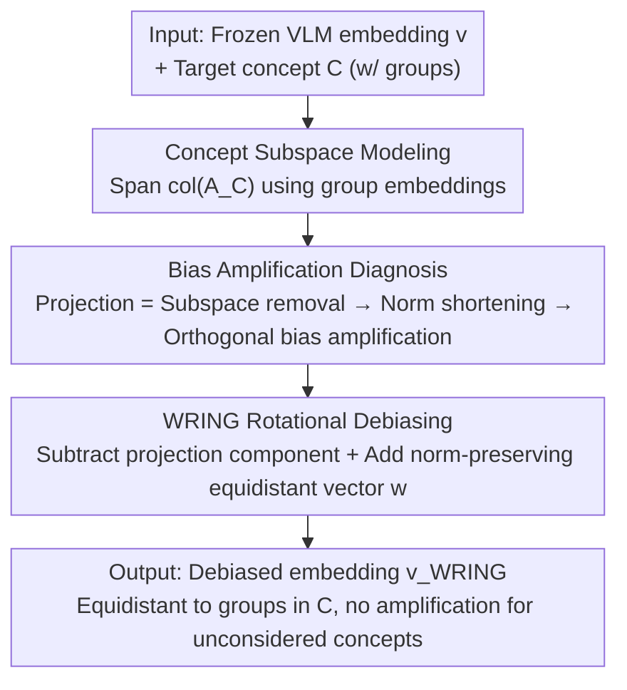

# Wring Out the Bias: A Rotation-Based Alternative to Projection Debiasing

**Conference**: ICLR 2026  
**Paper**: Published as a conference paper at ICLR 2026  
**Code**: None (Cache not provided)  
**Area**: AI Safety / Fairness / Multimodal VLM  
**Keywords**: VLM Debiasing, CLIP, Projection Debiasing, Rotational Debiasing, whac-a-mole, Bias Amplification

## TL;DR
Addressing the "whac-a-mole" dilemma where "projection debiasing" used in vision-language models like CLIP shifts bias from one concept to another unconsidered one, this paper mathematically proves that projection **necessarily** amplifies bias in orthogonal subspaces. It proposes WRING, a method that replaces "subspace deletion" with "embedding rotation within relevant subspaces," effectively eliminating bias in target concepts while virtually avoiding amplification in unconsidered concepts.

## Background & Motivation
**Background**: Vision-language models (VLMs) like CLIP are widely used for zero-shot classification, image retrieval, and face recognition. However, they encode significant biases—typically "spurious correlations," such as using image backgrounds (indoor/outdoor) as a basis for identifying dogs rather than the dogs themselves. Mainstream debiasing methods (especially post-processing types) utilize **projection debiasing**: identifying the subspace corresponding to a target concept (e.g., "background") and projecting embeddings onto its orthogonal complement to "remove" information of that concept.

**Limitations of Prior Work**: While projection debiasing is effective for the **explicitly considered concept**, the authors point out that it amplifies bias in **unconsidered concepts**. For example, removing "background" information from embeddings might cause the model to rely more heavily on "dog breed" shortcuts—the background bias disappears, but the breed bias increases.

**Key Challenge**: This is the known **whac-a-mole dilemma**—debiasing one concept causes remaining bias shortcuts to be amplified. The model does not truly become fair; the bias is merely **transferred and hidden** elsewhere. In reality, it is impossible to enumerate all potential bias concepts, and labels for explicit optimization are often unavailable, allowing amplified biases to **silently escape detection** during evaluation.

**Goal**: To design a debiasing method that eliminates bias for a set of known concepts while keeping the relationship between embeddings and all **unconsidered concepts** nearly constant—thereby not amplifying any unknown biases. This must be achieved without labels for the unconsidered concepts.

**Key Insight**: The authors revisit the mechanism of "why projection amplifies bias." A key observation is that projection **shortens** the norm of the embedding ($\|v-P_Cv\|<\|v\|$). Since bias is defined by the difference in cosine similarity, changes in the norm proportionally amplify relative bias in other directions. Because "deleting subspaces + changing norms" is the root cause, a **norm-preserving** operation is required.

**Core Idea**: Replace "projection" with "rotation"—instead of deleting the target concept subspace, rotate the embedding within that subspace to a position equidistant from all groups. This ensures equal similarity to each group within the concept (rendering it unbiased) while maintaining the norm and the angles to orthogonal directions (thus not amplifying unconsidered biases).

## Method

### Overall Architecture
The method is titled **WRING (Weighted Rotational debiasING)**. It is a post-processing operation: it takes an embedding $v$ from a frozen pre-trained VLM and a target concept $C$ (e.g., "background," containing groups like indoors/outdoors) and outputs a debiased embedding $v_{\text{WRING},C}$ that is unbiased toward $C$ while maintaining relationships with concepts outside $C$.

The logic follows three steps: first, **characterize the concept subspace** (defining the subspace $\text{col}(A_C)$ using a matrix $A_C$ spanned by group embeddings); second, **diagnose why projection amplifies bias** (deriving the analytical expression of post-projection bias to isolate the "amplification term"); and finally, **replace projection with rotation** (compensating for the "removed projection component" with a norm-preserving, equidistant vector $w$) to eliminate the amplification term.

### Key Designs

**1. Concept Subspace Modeling: Localizing "Bias" as a Low-Dimensional Subspace via Group Directions**

The prerequisite for debiasing is to reify "bias" into a manipulable object. The authors follow the linear hypothesis: VLMs encode concepts approximately linearly, with embedding variance of the same concept falling into a low-dimensional subspace. For target concept $C$, directional embeddings $c_1,\dots,c_m$ for each group (e.g., indoors, outdoors) are concatenated into a matrix $A_C\in\mathbb{R}^{n\times m}$, defining the subspace as the column space $\text{col}(A_C)$. Group directions $c_i$ can be obtained via **text embeddings** of group names ("a photo of indoors") or **image embeddings** (mean embedding of the $k=100$ most similar reference images). **Image directions perform better in practice** as they align more closely with the actual data distribution. Bias is defined as the difference in cosine similarity: $\text{bias}(v,c_1,c_2):=\cos\_\text{sim}(v,c_1)-\cos\_\text{sim}(v,c_2)$.

**2. Bias Amplification Diagnosis: Proving Projection Necessarily Amplifies Bias in Orthogonal Subspaces**

This is the theoretical core and the "smoking gun" for the motivation. Let the projection-debiased embedding be $v_{\backslash C}=v-P_Cv$, where $P_C=A_C(A_C^\top A_C)^{-1}A_C^\top$. The authors derive that for directions $d_1, d_2$ of another concept $D\neq C$, the bias after projection is:

$$\text{bias}(v_{\text{PROJ},C},d_1,d_2)=\underbrace{\frac{\|v\|}{\|v-P_Cv\|}}_{\text{放大项}}\cdot\text{bias}(v,d_1,d_2)+\underbrace{\frac{\Delta P_Cv}{\|v-P_Cv\|}}_{\text{改变项}}.$$

The first term is the **amplification term**: since projection removes a component, $\|v-P_Cv\|<\|v\|$, making this coefficient consistently $>1$, which **equally amplifies** any existing bias. The second term is the **shift term** with an indeterminate sign.Crucially, when $D$ is **orthogonal** to the subspace of $C$, the shift term is $0$, and projection **necessarily** amplifies bias. Given that random directions in high-dimensional space are **likely to be orthogonal**, this amplification occurs frequently. This explains the root cause of the whac-a-mole dilemma—the issue is not "finding the wrong concept" but the "subspace removal + norm shortening" operation itself.

**3. WRING Rotational Debiasing: Replacing the Removed Component with a Norm-Preserving Equidistant Vector**

To fix the "subspace removal" issue, WRING **replaces** instead of deletes. it compensates for the projected-out component with a specialized unit vector $w$:

$$v_{\text{WRING},C}:=v-P_Cv+\|P_Cv\|\cdot w.$$

$w$ must satisfy two properties: (1) $w\in\text{col}(A_C)$, which ensures $w$ stays within the target concept subspace—this guarantees $\|v_{\text{WRING},C}\|=\|v\|$ (norm preservation), so angles relative to directions orthogonal to $\text{col}(A_C)$ remain unchanged, and **bias for concepts unrelated to $C$ is unaffected**; (2) $w$ is equidistant from each group embedding $c_i$, i.e., $\text{bias}(w,c_i,c_j)=0\ \forall i,j$. This ensures the debiased embedding is neutral across all groups in $C$. The solution for $w$ (up to a scale) is $\tilde w=A_C(A_C^\top A_C)^{-1}\mathbf{1}$. Essentially, this **rotates** the embedding within the target subspace to an "equiangular" position rather than flattening it.

The bias for unconsidered concept $D$ after WRING becomes:

$$\text{bias}(v_{\text{WRING},C},d_1,d_2)=\text{bias}(v,d_1,d_2)+\underbrace{\frac{\|v-P_Cv\|}{\|v\|}\cdot\frac{\Delta P_Cv}{\|v-P_Cv\|}}_{\text{被抑制的改变项}}-\underbrace{\Delta w}_{\text{阻尼项}}.$$

Compared to projection, there are three improvements: **no amplification term** ($>1$ coefficient is gone), the **shift term is compressed** (by a coefficient $<1$), and a **damping term** $\Delta w$ is added to further cancel bias. Most cleanly, when $D\perp C$, both terms vanish, and WRING **does not amplify orthogonal bias at all**.

### Loss & Training
WRING is a **training-free, label-free** post-processing operation. It performs a closed-form linear transformation on frozen pre-trained VLM embeddings. It requires neither fine-tuning nor labels for unconsidered concepts, giving it a practical advantage over FairerCLIP, which requires labels and training.

## Key Experimental Results

### Main Results
Evaluations were conducted on 4 datasets. For each, one concept was chosen as the debiasing target $C_{\text{debias}}$ and another as the unconsidered concept $C_{\text{uncon}}$. The primary metric was the percentage change in bias for the unconsidered concept (closer to 0 is better). Three CLIP backbones (ViT-B/32, ViT-L/14, L/14-laion2B) were used.

| Dataset | Debiased Concept | Projection Impact on Unconsidered | WRING Impact on Unconsidered |
|--------|---------|----------------------|------------------------|
| FairFace | Gender/Race | Significant amplification, high variance | Much lower amplification, lower variance |
| CelebA | Gender/Race | Bias amplification | Significant suppression of amplification |
| Spawrious | Dog Breed/Background | Amplified Breed/Background bias | Almost no amplification |
| Fashion | Season/Color/Gender| Amplification | Suppressed |

Key Comparison (CelebA hair color task, worst-group accuracy after gender debiasing):

| Method | Worst-Group Accuracy↑ (Gender) | Accuracy Gap↓ (Gender) | Description |
|------|------------------|-----------------|------|
| Baseline CLIP | 72.78 | 17.02 | Original model |
| FairerCLIP | 84.78 | 11.71 | Strongest but **requires labels + training** |
| Projection | 78.89 | 11.87 | Projection debiasing |
| WRING | 80.56 | **9.24** | No training, minimal gap |

### Ablation Study

| Configuration | Key Metrics | Description |
|------|---------|------|
| WRING (img) | More thorough debiasing | Using image embeddings for group directions; best in practice |
| WRING (txt) | Slightly weaker | Using text embeddings; weaker than img |
| Projection (img/txt) | Massive amplification | Significant amplification regardless of direction type |
| SFID | Small change in unconsidered bias | Change is small because **target bias isn't removed** |
| Pipeline Substitution | Lower unconsidered bias change | Replacing projection with WRING in non-linear pipelines improves stability |

### Key Findings
- **Image Directions > Text Directions**: For both projection and WRING, using image embeddings to define group directions results in more thorough debiasing than text descriptions.
- **Pseudo-stability of SFID**: While SFID changes unconsidered concepts less, it also fails to remove the target bias. WRING effectively removes target bias without amplifying others.
- **Lower Variance with WRING**: Projection amplification is unpredictable; WRING consistently avoids amplification with significantly lower variance, validating the theory.
- **Plug-and-play**: Replacing projection in existing pipelines (e.g., Gerych et al. 2024) with WRING maintains debiasing effectiveness while reducing bias drift.

## Highlights & Insights
- **Upgrading whac-a-mole from empirical observation to provable mechanism**: The authors use linear algebra to show that the root cause is "projection shortens norm → amplification term $>1$."
- **Norm-preserving rotation is the key technique**: Debiasing does not require "removing information." Rotating to an equidistant position within the subspace eliminates bias and leaves orthogonal directions untouched.
- **Zero Training, Zero Labels**: As a pure post-processing step, it requires no labels for unconsidered concepts, a critical advantage since enumerating all biases is impossible.
- **Immediate Utility**: As a primitive operation, it can replace projection in any debiasing pipeline with minimal cost.

## Limitations & Future Work
- **Reliance on Linear Concept Hypothesis**: WRING assumes concepts are encoded linearly. Performance may degrade for highly non-linear, entangled concepts.
- **Sensitivity to Group Direction Quality**: Results are sensitive to the definition of group directions (image directions are notably superior).
- **"Not Amplifying" vs. "Actively Eliminating"**: WRING ensures biases are not moved elsewhere, but it does not eliminate existing biases of unconsidered concepts.
- **Inherent Limits of Training-Free Methods**: While WRING outperforms projection, training-based methods like FairerCLIP still have a higher performance ceiling when labels are available.

## Related Work & Insights
- **vs. Projection Debiasing (Bolukbasi 2016 / Seth 2023)**: Older methods delete the subspace, which the authors prove amplifies unconsidered bias. WRING switches to "replace instead of remove."
- **vs. SFID (Jung 2024)**: SFID has a minimal impact but is weak in actual debiasing. WRING wins in both debiasing strength and stability.
- **vs. FairerCLIP (Dehdashtian 2024)**: FairerCLIP achieves high accuracy but requires labels and training. WRING is more general for scenarios where concepts cannot be enumerated.
- **Mechanism Insight**: The whac-a-mole dilemma (Li 2023) receives an analytical explanation here, suggesting that "unseen bias amplification" should be a standard evaluation metric for future debiasing research.

## Rating
- Novelty: ⭐⭐⭐⭐⭐ Proves the empirical "whac-a-mole" dilemma as an inherent property of projection and offers a clean rotational alternative.
- Experimental Thoroughness: ⭐⭐⭐⭐ 4 datasets × 3 backbones, though downstream tasks are somewhat limited.
- Writing Quality: ⭐⭐⭐⭐ Clear theoretical derivation and intuitive diagrams.
- Value: ⭐⭐⭐⭐⭐ A plug-and-play replacement for projection with direct utility for all projection-reliant pipelines.

<!-- RELATED:START -->

## Related Papers

- [\[ICLR 2026\] Adaptive Logit Adjustment for Debiasing Multimodal Language Models](adaptive_logit_adjustment_for_debiasing_multimodal_language_models.md)
- [\[ICLR 2026\] Prior-based Noisy Text Data Filtering: Fast and Strong Alternative for Perplexity](prior-based_noisy_text_data_filtering_fast_and_strong_alternative_to_perplexity.md)
- [\[AAAI 2026\] Alternative Fairness and Accuracy Optimization in Criminal Justice](../../AAAI2026/ai_safety/alternative_fairness_and_accuracy_optimization_in_criminal_j.md)
- [\[CVPR 2026\] Bias at the End of the Score](../../CVPR2026/ai_safety/bias_at_the_end_of_the_score.md)
- [\[ICLR 2026\] Person-Centric Annotations of LAION-400M: Auditing Bias and Its Transfer to Models](person-centric_annotations_of_laion-400m_auditing_bias_and_its_transfer_to_model.md)

<!-- RELATED:END -->
