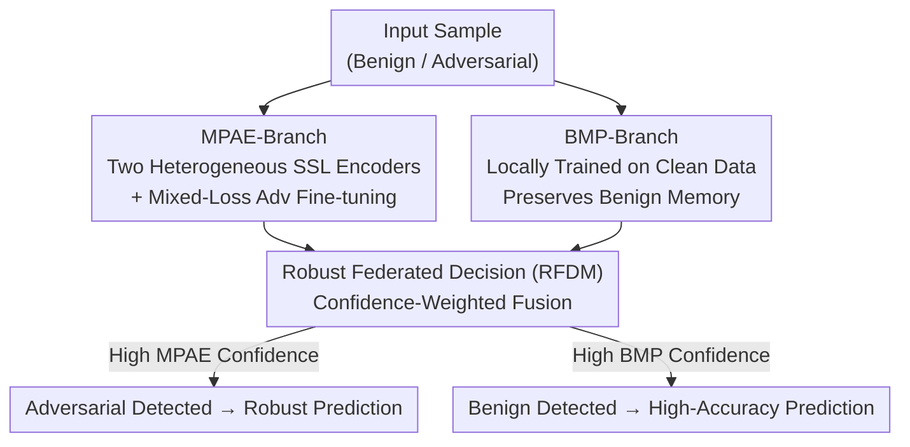

# Zero-Sacrifice Persistent-Robustness Adversarial Defense for Pre-Trained Encoders

**Conference**: ICLR 2026  
**OpenReview**: [https://openreview.net/forum?id=AYFUmgCpkB](https://openreview.net/forum?id=AYFUmgCpkB)  
**Code**: https://github.com/Lawliet0o/ZePAD  
**Area**: AI Security / Adversarial Defense / Self-Supervised Pre-trained Encoders  
**Keywords**: Adversarial Defense, Downstream-Agnostic Adversarial Examples (DAE), Pre-trained Encoders, Confidence, Dual-branch

## TL;DR
ZePAD utilizes two complementary branches (an adversarially fine-tuned multi-encoder branch + a benign branch trained only on clean data) paired with a confidence-based federated decision mechanism. This allows pre-trained encoders to defend against "Downstream-Agnostic Adversarial Examples" (DAE) across multiple downstream tasks with a **single fine-tuning step**, while maintaining or even improving clean accuracy and providing free adversarial detection.

## Background & Motivation
**Background**: Public pre-trained encoders (CLIP, various SimCLR/BYOL/DINO, etc.) trained via Self-Supervised Learning (SSL) have become the standard backbone for downstream tasks. Users can simply fine-tune a classification head, saving the massive cost of training from scratch.

**Limitations of Prior Work**: These public encoders harbor a severe security vulnerability: **Downstream-Agnostic Adversarial Examples (DAE)**. Attackers do not need to know the specific downstream task; by generating perturbations against the encoder (e.g., PAP, AdvEncoder), the resulting adversarial examples can transfer to any downstream model using that encoder, even if the model was locally fine-tuned. Existing defenses mostly rely on "task-specific adversarial fine-tuning," which incurs two costs: significantly **decreased clean accuracy** (e.g., Gen-AF raises robust accuracy from 35.58% to 62.28% but drops benign accuracy from 81.99% to 68.69%) and **poor generalization**, requiring re-tuning for every new task.

**Key Challenge**: There is an inherent conflict between optimizing adversarial robustness and clean performance. Adversarial fine-tuning biases the model toward the adversarial distribution, inevitably sacrificing sensitivity to benign samples. Previous works focused on balancing this trade-off; none achieved improved robustness without sacrificing (or even enhancing) clean accuracy.

**Goal**: The authors set a more stringent standard: **Zero-Sacrifice + Persistent-Robustness**. Specifically: ① No drop (and potentially an increase) in clean accuracy; ② Defense against DAE; ③ No reliance on external data or extra compute; ④ **Fine-tune once, defend everywhere**, eliminating the need for task-specific retraining.

**Key Insight**: The authors move beyond the "hard trade-off in adversarial fine-tuning" and leverage an inherent property of neural networks—**higher confidence is assigned to inputs consistent with the training distribution** (due to memory of data characteristics). Rather than forcing a single encoder to master both benign and adversarial samples, it is more effective to **let different encoders specialize** and fuse their judgments based on confidence differences.

**Core Idea**: Use an "adversarially-enhanced branch" to memorize adversarial samples and a "benign memory branch" to memorize clean samples. During inference, the branch with higher confidence dictates the output. Specialized division of labor + confidence arbitration replaces the robustness/accuracy compromise of a single encoder.

## Method

### Overall Architecture
ZePAD (Zero-Sacrifice Persistent-Robustness Adversarial Defense) employs a **dual-branch structure**. The process involves two steps: **Step 1: Encoder Preparation**—the defender constructs two branches locally: a Multi-Mode Adversarial Enhancement branch (MPAE-Branch, containing two encoders pre-trained with different SSL methods and then adversarially fine-tuned) and a Benign Memory Preservation branch (BMP-Branch, an encoder trained locally only on clean data); **Step 2: Robust Federated Decision Mechanism (RFDM)**—during inference, each branch provides a prediction and confidence score. RFDM weights the three sub-encoders based on confidence—reflecting how well the input matches each branch's training distribution. The final encoder $E$ consists of three sub-encoders: $E_{a,1}$, $E_{a,2}$ (publicly shared + adversarially fine-tuned) and $E_b$ (locally benignly trained), each with its own classification head $H_{a,1}, H_{a,2}, H_b$.

A key observation supports this design: on benign samples, the BMP-Branch yields the highest confidence (as it has only seen clean data), while on adversarial samples, the MPAE-Branch shows higher confidence (having been specifically fine-tuned for them). This **complementary confidence separation** serves as the foundation for federated decision-making and allows ZePAD to distinguish between benign and adversarial samples without explicit training.

### Key Designs

**1. MPAE-Branch: Leveraging diversity of heterogeneous encoders to eliminate common vulnerabilities**

DAEs transfer across downstream tasks because they exploit the sensitivity of an encoder to specific textures or patterns. The authors' counter-strategy is: while a single encoder has fixed vulnerable patterns, **multiple encoders trained with different SSL methods exhibit significantly different feature representations, making it difficult for attackers to find a common vulnerable pattern across all encoders.** Thus, the MPAE-Branch uses two public pre-trained encoders (typically the victim encoder plus an auxiliary one like BYOL), both adversarially fine-tuned to enhance perturbation resistance.

The difficulty lies in the fact that pre-trained encoders are extremely sensitive to fine-tuning; aggressive adversarial fine-tuning can destroy original representation knowledge. To address this, a **mixed loss** is designed to balance "preserving pre-trained knowledge" and "improving robustness":

$$L = L_c + \lambda L_f$$

Where $L_c = L_{CE}(F_\phi(E_\theta(x+\delta)), y)$ is the cross-entropy loss for adversarial samples, and $L_f$ is the encoder feature loss. $L_f$ forces the adversarial feature distribution to approximate the corresponding benign feature distribution. First, feature distance $D_{ij}$ is defined using cosine distance (excluding the nearest neighbor to prevent local high-density data from dominating the loss):

$$D_{ij} = \frac{2 - (\cos(x_i, x_j) - \rho_{x_j})}{\sum_{k \neq j}(2 - \cos(x_i, x_k) - \rho_{x_k})}$$

Then, a KL-like divergence constraints the adversarial pair distances $D^a_{ij}$ to align with benign pair distances $D^b_{ij}$:

$$L_f = \sum_i \sum_j \left[ D^b_{ij}\log\frac{D^b_{ij}}{D^a_{ij}} + (1-D^b_{ij})\log\frac{1-D^b_{ij}}{1-D^a_{ij}} \right]$$

This pulls the feature structure of adversarial samples back to the benign structure, achieving robust fine-tuning while preserving original representations.

**2. BMP-Branch: Maintaining clean accuracy with a clean-only branch**

Adversarial fine-tuning naturally hurts sensitivity to clean samples (in ablations, removing this branch drops BA below the no-defense baseline). The solution is direct: train an additional encoder $E_b$ locally using **only benign data**. Because it only sees clean data, it fully memorizes and captures features critical for benign classification. This branch does not participate in adversarial robustness; its sole role is to "guard accuracy," complementing the MPAE-Branch. This specialization is why ZePAD achieves "zero sacrifice" and even improves clean accuracy.

**3. RFDM Robust Federated Decision: Nonlinear confidence arbitration for seamless integration**

With specialized branches, how can outputs be fused to select the correct branch for both benign and adversarial inputs? The authors use the implicit posterior estimation—networks give high confidence for in-distribution samples and low confidence for out-of-distribution/adversarial inputs. Let $m_i$ be the maximum value of the probability vector from branch $i$. Its confidence $c_i$ is defined as:

$$c_i = m_i e^{3(m_i - 0.5)}$$

This is a **nonlinear amplification**: the authors argue that confidence should not vary linearly with maximum probability; rather, as the probability approaches 1, the growth rate should accelerate. Normalized weights are then calculated:

$$W_i = \frac{c_i}{\sum_{k=1}^{3} c_k}$$

On benign samples, the BMP-Branch dominates due to its high confidence, providing high-accuracy predictions. On adversarial samples, the MPAE-Branch takes over, providing robust predictions. No additional training to "judge" adversariality is required.

**4. Training-Free DAE Detection: Confidence difference as a detector**

Since MPAE and BMP branches show opposing confidence patterns for benign/adversarial samples, this phenomenon is used as a **zero-extra-training detection mechanism**: if MPAE confidence is 0.1 higher than BMP confidence, the sample is classified as a DAE. While not the primary focus, it achieves an average detection accuracy of 82.52% when fine-tuning data matches downstream data (CIFAR10) and 79.04% when it does not (ANIMALS10).

### Loss & Training
Adversarial fine-tuning for 20 epochs, batch size 256, Adam optimizer. The classification head is a 3-layer MLP. Adversarial perturbation limit is $10/255$. ResNet18 serves as the backbone with pre-trained weights from `solo-learn`. MPAE-Branch uses mixed loss $L = L_c + \lambda L_f$, while the BMP-Branch is trained only on local benign data.

## Key Experimental Results

Validated across **11 SSL methods** (W-MSE / BYOL / NNCLR / SimCLR / MoCo v2+/v3 / SupCon / RESSL / DINO / SwAV / VibCreg) and **6 datasets** (CIFAR10 / STL10 / ANIMALS10 / GTSRB / ImageNet20 / SVHN). Attack methods include AdvEncoder, PAP, UAP, UAPGD, SSP. Metrics used are BA (Benign Accuracy), RA (Robust Accuracy), and ASR (Attack Success Rate).

### Main Results: Zero-Sacrifice + Persistent-Robustness
In semi-black-box scenarios, ZePAD increases both BA and RA relative to the un-defended baseline.

| Setup (Pre-train → Downstream) | Metric | baseline (Avg) | ZePAD (Avg) | Gain |
|--------------------|------|--------------|-----------|------|
| ImageNet → SVHN | BA | 66.41 | 94.59 | **+29.20** |
| CIFAR10 → ANIMALS10| BA | 65.99 | 98.03 | +32.03 |
| CIFAR10 → SVHN | RA | 13.11 | 86.97 | **+73.86** |
| ImageNet → SVHN | RA | 12.79 | 85.84 | +73.05 |

Cross-task effectiveness (Adversarial Fine-tuning set ≠ Downstream set): After fine-tuning on GTSRB, BA on CIFAR10 / ANIMALS10 increased by +21.70 / +23.82 avg. Fine-tuning on CIFAR10 yielded RA of 73.19 / 73.94 on STL10 / ANIMALS10—verifying "fine-tune once, defend everywhere."

### Ablation Study (DINO@CIFAR10 Fine-tuned, ANIMALS10 Tested)

| Adv Fine-tuning | MPAE Branch | BMP Branch | BA | RA | ASR |
|:---:|:---:|:---:|------|------|------|
| × | × | × | 85.01 | 35.46 | 63.35 |
| × | ✓ | ✓ | 90.84 | 59.40 | 38.89 |
| ✓ | × | ✓ | 91.57 | 70.35 | 26.71 |
| ✓ | ✓ | × | 84.51 | 72.47 | 19.36 |
| ✓ | ✓ | ✓ | **91.66** | **74.71** | 21.99 |

### Key Findings
- **Without Adv Fine-tuning**: RA drops and ASR rises, showing fine-tuning is the primary robustness source. However, BA/RA still exceeds the baseline, confirming that "heterogeneous SSL feature complementarity" provides intrinsic gains.
- **Without MPAE-Branch**: RA drops significantly while BA remains stable—MPAE handles robustness without hurting generalization.
- **Without BMP-Branch**: BA falls below the undefended baseline (84.51 < 85.01), confirming adversarial training hurts generalization; BMP is the key to maintaining clean accuracy.
- **Comparison with SOTA Defenses** (SimCLR, ImageNet → STL10): ZePAD outperforms existing methods.

| Method | BA | RA (AdvEncoder) |
|------|------|------|
| PGD-AT (2018) | 22.19 | 19.04 |
| MART (2019) | 42.79 | 42.36 |
| TRADES (2019) | 50.79 | 50.66 |
| Gen-AF (2024 S&P) | 68.69 | 62.28 |
| **Ours** | **82.07** | **73.26** |

## Highlights & Insights
- **Leveraging in-distribution confidence as defensive leverage**: Instead of battling the robustness/accuracy trade-off, the model lets branches specialize in different distributions and uses confidence to arbitrate.
- **Decoupled dual-branch design is reusable**: When objectives conflict (Robustness vs. Clean Accuracy), utilizing specialized experts and a lightweight arbitrator is often more effective than forcing compromises within a single model.
- **"Free" Adversarial Detection**: Detection capability is a byproduct of confidence separation. Achieving ~80% detection without explicit training suggests that proper representation separation contains inherent discriminative information.
- **Diversity as a shield**: Using encoders with different training paradigms prevents attackers from locating a universal vulnerability, a valuable insight for ensemble defenses.

## Limitations & Future Work
- The authors admit ZePAD's interpretability could be improved to better understand the mechanism of DAEs.
- **Storage and Inference Overhead**: Maintaining three sub-encoders and three heads is heavier than single-encoder defenses; computational comparisons are relegated to the appendix.
- **Validation Scope**: Currently verified on classification tasks; expansion to detection/segmentation is theoretically possible but requires more validation.
- **Hyperparameter Sensitivity**: The coefficient 3 in $c_i = m_i e^{3(m_i-0.5)}$ and the 0.1 detection threshold are empirical; their robustness across different attack strengths requires more exploration.

## Related Work & Insights
- **vs. Gen-AF (2024 S&P)**: Gen-AF uses single-encoder adversarial fine-tuning and struggles with the accuracy/robustness trade-off, leading to significant accuracy drops and requiring task-specific re-tuning. ZePAD bypasses this via the dual-branch approach.
- **vs. PGD-AT / TRADES / MART**: These classical methods are task-specific and show low BA/RA in DAE scenarios (BA usually 20–50%). ZePAD maintains BA above 80% and RA above 70%.
- **Insight**: When structural conflicts exist between defense and performance, a "specialization by training distribution" approach (letting modules focus on the data categories they master) may be superior to internal trade-offs in a single model.

## Rating
- Novelty: ⭐⭐⭐⭐⭐ Innovative use of confidence/memory characteristics for a "zero-sacrifice" defense.
- Experimental Thoroughness: ⭐⭐⭐⭐⭐ Extensive coverage across 11 SSL methods, 6 datasets, and 5 attacks, including detection and cross-task tests.
- Writing Quality: ⭐⭐⭐⭐ Concepts are clear, though the dense table frequency and reliance on appendices for white-box/overhead details are notable.
- Value: ⭐⭐⭐⭐⭐ Directly addresses a real-world vulnerability in public encoders with an attractive "fine-tune once" deployment model.

<!-- RELATED:START -->

## Related Papers

- [\[ICLR 2026\] On the Interaction of Compressibility and Adversarial Robustness](on_the_interaction_of_compressibility_and_adversarial_robustness.md)
- [\[CVPR 2025\] Split Adaptation for Pre-trained Vision Transformers](../../CVPR2025/ai_safety/split_adaptation_for_pre-trained_vision_transformers.md)
- [\[AAAI 2026\] Privacy Auditing of Multi-Domain Graph Pre-Trained Model under Membership Inference Attack](../../AAAI2026/ai_safety/privacy_auditing_of_multi-domain_graph_pre-trained_model_under_membership_infere.md)
- [\[ICLR 2026\] DRIFT: Divergent Response in Filtered Transformations for Robust Adversarial Defense](drift_divergent_response_in_filtered_transformations_for_robust_adversarial_defe.md)
- [\[ICLR 2026\] FERD: Fairness-Enhanced Data-Free Adversarial Robustness Distillation](ferd_fairness-enhanced_data-free_adversarial_robustness_distillation.md)

<!-- RELATED:END -->
