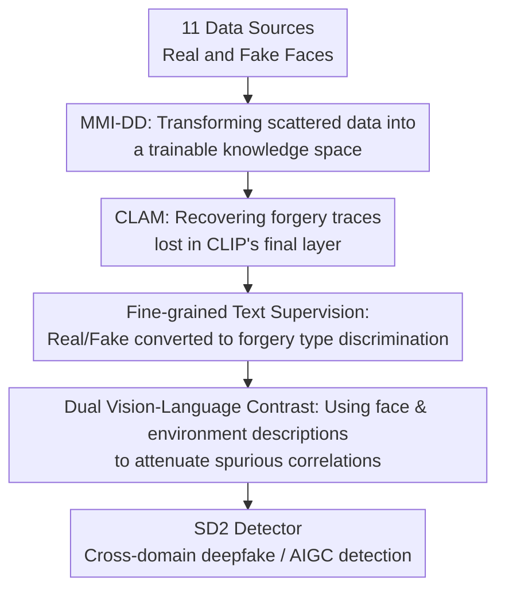

# A Rich Knowledge Space for Scalable Deepfake Detection

**Conference**: ICLR2026  
**OpenReview**: [https://openreview.net/forum?id=hNd5L7WnjC](https://openreview.net/forum?id=hNd5L7WnjC)  
**Code**: No public code  
**Area**: AIGC Detection / Deepfake Detection  
**Keywords**: Deepfake Detection, AIGC Detection, CLIP Fine-tuning, Multi-modal Dataset, Cross-domain Generalization

## TL;DR
This paper integrates 11 deepfake and real face sources into the MMI-DD dataset, scaling to 3.6 million images. It proposes SD2, which utilizes CLIP's hierarchical visual features, fine-grained textual forgery labels, and VLM-generated descriptions for joint training. This ensures that the deepfake detector gains stronger cross-domain and AIGC generalization capabilities on large-scale heterogeneous data instead of suffering from performance degradation.

## Background & Motivation
**Background**: Deepfake detection has long relied on face forensics datasets and specially designed detectors. Early methods typically sought clues from spatial artifacts, frequency domain anomalies, temporal inconsistencies, or reconstruction errors. Recent methods have begun to leverage Vision-Language Models like CLIP, transferring pre-trained visual representations to binary real/fake classification or forgery category identification.

**Limitations of Prior Work**: The problem is not a lack of data, but rather that data are fragmented. Benchmarks such as FaceForensics++, DFDC, KoDF, DF40, and DFFD are often trained or evaluated in isolation. Many papers follow the paradigm of "train on one source dataset, test on another." Models trained this way only encounter limited forgery algorithms, facial distributions, and post-processing methods, leading to a collapse in generalization when facing mixed sources, compression, identities, backgrounds, and generation methods in real-world scenarios.

**Key Challenge**: Intuitively, more data should lead to a stronger detector. However, the authors observe that directly applying adaptation methods like CLIP, CLIP-LoRA, or CLIP-SVD to increasingly large heterogeneous deepfake data does not result in stable performance gains and may even cause degradation. The root cause is that large-scale data simultaneously increases "richer knowledge" and "stronger distribution chaos." If supervision signals remain coarse real/fake labels, models easily memorize dataset-specific artifacts, background biases, or ambiguous boundaries between textual labels.

**Goal**: This work addresses three sub-problems. First, how to unify existing deepfake benchmarks into a resource truly suitable for large-scale training rather than fragmented evaluation. Second, how to enable CLIP to learn "which type of forgery" instead of just "real or fake." Third, how to utilize image-text supervision to expand forgery knowledge while preventing the model from using non-forensic factors like background, lighting, and identity as shortcuts.

**Key Insight**: The observation is that deepfake detection should not be treated merely as a binary classification problem but as the construction of a "knowledge space" encompassing forgery types, facial attributes, environmental context, and low-level artifacts. CLIP already possesses image-text alignment capabilities, but the final visual layer of vanilla CLIP is more semantic and does not necessarily preserve fine-grained forgery traces. The textual side also requires finer category anchors than "a real/fake photo."

**Core Idea**: Use the large-scale multi-source multi-modal dataset MMI-DD to provide rich supervision and employ SD2 to transform CLIP into a scalable vision-language learner for deepfake detection. This allows the model to simultaneously learn forgery type boundaries, cross-layer visual artifacts, and face/environment semantic alignment.

## Method

### Overall Architecture
The proposed method consists of two parts: first, constructing MMI-DD by unifying 11 data sources into 3.6 million face images with annotations for real or four forgery types; second, training SD2 using LoRA fine-tuning on CLIP's image and text encoders, fusing intermediate visual layers with CLAM, and optimizing for classification, textual label separation, and dual image-text contrastive objectives.

During testing, the model requires no complex post-processing. Given an image, SD2 extracts visual representations and calculates similarity with embeddings of five category labels: REAL, Face Swapping, Face Reenactment, Entire Face Synthesis, and Face Editing. It is classified as real if the REAL similarity is highest; otherwise, it is classified as fake with the corresponding forgery type.

### Key Designs
**1. MMI-DD: Transforming scattered data into a trainable knowledge space**

The authors aggregate data by processing deepfake datasets (DF40, DFF, DFFD, DFDCP, KoDF, FF++, TIMIT) and real face datasets (CelebA, CelebA-HQ, CelebV-HQ, FFHQ) through a unified pipeline, resulting in approximately 1.53 million real images and 2.05 million fake images (totaling ~3.58 million). All deepfake images undergo consistent face cropping and cleaning to ensure the model sees a broad range of forgery sources rather than overfiting to local patterns of a single benchmark.

Crucially, MMI-DD provides more than binary labels; it categorizes forgeries into Face Swapping, Face Reenactment, Entire Face Synthesis, and Face Editing. This design moves deepfake detection from "does it look fake" to "where is it fake and what generation mechanism was used." For vision-language models like CLIP, this provides specific semantic anchors, allowing image representations to form clearer decision boundaries around different forgery types.

**2. CLAM: Recovering forgery traces lost in CLIP's final layer**

CLIP's final visual representation excels at expressing semantics (e.g., "a photo of a face"), but deepfake detection requires low- or mid-level details like local texture discontinuities, edge blending traces, compression artifacts, and unnatural relations between the face and background. Using only the final layer's `[CLS]` token for classification tends to wash out these fine-grained forensic signals.

CLAM extracts the `[CLS]` token from each Transformer layer of the CLIP image encoder to form a hierarchical feature sequence $f_{cls}=[f_{cls}^{(1)}, f_{cls}^{(2)},...,f_{cls}^{(L)}]$, then uses multi-head self-attention to model dependencies across layers. The attended sequence is average-pooled into $f'_{sat}$ and concatenated with the final layer representation $f_{final}$. A lightweight adapter produces the final visual representation $f$:

$$
f = W_2 \cdot GELU(W_1 \cdot Concat([f'_{sat}, f_{final}]))
$$

This module allows the model to autonomously select which layers' forensic clues are most useful for the current target. This is vital for large-scale heterogeneous training, as different forgery types leave traces at different levels: swapping may rely on boundaries and identity consistency, whereas synthesis may depend on texture and semantic naturalness.

**3. Fine-grained Text Supervision: Forgery type discrimination**

Instead of binary real/fake classification on a linear head, SD2's classification loss is based on the similarity between image and type-text representations. In each batch, the model samples text labels for REAL, FS, FR, EFS, and FE (e.g., Face Swapping might use varied descriptions beyond just "a photo of a Face Swapping"). The image representation $f_i$ and the corresponding type-text embedding $u_{c_i}$ compute cosine similarity, optimized via cross-entropy:

$$
L_C = -\sum_i \log \frac{\exp(\tau \cdot sim(f_i,u_{c_i}))}{\sum_j \exp(\tau \cdot sim(f_i,u_{c_j}))}
$$

The authors also noted that these text labels might not be naturally separable in CLIP's text embedding space. If "face swapping" and "face reenactment" vectors are too close, the image side will be hindered by ambiguous textual boundaries. Thus, a Text Label Separation Loss is added to push the similarity matrix of type-text embeddings toward an identity matrix:

$$
L_S = \|sim(u,u^T)-I\|_F^2
$$

This expands the "textual category coordinate system" of the classifier before aligning images to it, solving a practical issue in large-scale multi-type training where category names share high semantic similarity.

**4. Dual Vision-Language Contrast: Attenuating spurious correlations**

MMI-DD generates two types of VLM descriptions for each image: face attributes and environmental context. Intuitively, background, age, or lighting are not evidence of forgery; however, in real data, they may strongly correlate with specific sources, leading models to mistake a "background style" for a "forgery type." Instead of discarding this context, the authors explicitly include it in contrastive learning.

Specifically, each image forms positive pairs with its face description $d_i^f$ and environment description $d_i^e$, with other descriptions in the batch acting as negatives. A SigLIP-style sigmoid binary cross-entropy contrastive loss is used. The dual loss $L_D$ forces image representations to align with both facial details and scene context. This explicit modeling helps the model distinguish "what the context is" from "what the forensic evidence is."

### Loss & Training
The total objective for SD2 is:

$$
L_{SD2}=\alpha \cdot L_C + L_S + L_D
$$

Where $L_C$ is the fine-grained image-text classification loss, $L_S$ is the text label separation loss, and $L_D$ is the dual image-text contrastive loss, with $\alpha=2.0$. The backbone is CLIP-ViT-L/14. Both image and text encoders are fine-tuned using LoRA (rank 8) with a learning rate of $5e^{-7}$ and a batch size of 1024 (via gradient accumulation) for 4 epochs. Standard deepfake data augmentations (rotation, resizing, brightness/contrast, compression) are applied.

Testing uses simple text labels per category to compute five logits, without training a complex classification head. This maintains the output within the CLIP image-text matching framework.

## Key Experimental Results

### Main Results
Experiments cover in-domain facial deepfake detection, cross-domain facial deepfake detection, and non-face AIGC image detection. Cross-domain results are the most critical.

| Task / Dataset | Metric | SD2 | Prev. SOTA | Gain |
|--------|------|------|----------|------|
| In-domain facial deepfake (Avg of 11) | mAUC | 95.76 | SPSL 94.58 | +1.18 |
| Cross-domain (UADFV / WildDeepFake / DFDC / DF40-Test) | mAUC | 87.79 | CLIP-SVD 81.98 | +5.81 |
| GenImage AIGC Detection | mACC | 88.50 | AIDE 86.88 | +1.62 |

| Cross-domain Dataset | Metric | SD2 | CLIP-SVD | Observation |
|--------|------|------|----------|------|
| UADFV | AUC | 96.44 | 95.47 | Stable on traditional deepfake frames |
| WildDeepFake | AUC | 82.80 | 75.89 | Significant improvement in wild distributions |
| DFDC | AUC | 80.36 | 69.57 | Robust against complex real-world scenes |
| DF40-Test FE | AUC | 74.06 | 60.60 | Major gain in face editing detection |
| DF40-Test Avg | mAUC | 87.79 | 81.98 | Multi-modal training improves generalization |

### Ablation Study
| Configuration | Key Metric | Description |
|------|---------|------|
| $L_C$ + $L_S$ only | 80.24 mAUC | Outperforms many baselines; type-text supervision is effective |
| + CLAM | 81.84 mAUC | Hierarchical features add +1.60; mid-layer artifacts are valuable |
| + $L_D$-Face | 84.34 mAUC | Face semantic descriptions provide stronger supervision |
| + Full $L_D$ (Face & Env) | 87.79 mAUC | Best performance; environment descriptions help identify context shortcuts |

| Training Scale | Xception | CLIP-LoRA | CLIP-SVD | SD2 |
|------|---------|-----------|----------|-----|
| 100K | 71.11 | 78.84 | 82.27 | 82.90 |
| 1M | 71.69 | 78.40 | 82.00 | 84.85 |
| 3M | 72.96 | 72.12 | 81.98 | 87.79 |

### Key Findings
- The "scalability curve" is the most compelling finding: vanilla CLIP-LoRA performance drops from 78.84 to 72.12 when scaling from 100K to 3M images, while SD2 rises from 82.90 to 87.79. This proves the method addresses how heterogeneous supervision is absorbed, not just model capacity.
- While the gain from CLAM is smaller than that from dual contrastive loss, it addresses low-level forensic signals; relying only on final semantic layers causes the model to miss local artifacts.
- The role of environment descriptions is counter-intuitive: they do not help judge real/fake based on background but explicitly model background factors to reduce the risk of the model using them as false evidence.
- On GenImage, SD2 using only linear probing on the vision encoder still outperforms AIDE, suggesting that forensic knowledge learned from deepfakes has transferability to general synthetic image detection.

## Highlights & Insights
- **Data integration is a core contribution**: MMI-DD is not just a larger pile of images; it unifies real/fake labels, category labels, and VLM descriptions. This allows for a real discussion on whether detectors can scale with data size.
- **Capturing CLIP's failure mode**: The authors do not assume foundation models are naturally scalable for this task. They show that CLIP adaptation methods saturate or degrade under large-scale data and design supervision to specifically counteract this.
- **Textual label separation as a stabilizer**: Many vision-language methods assume prompt separability. In fine-grained deepfake types, this does not hold. Explicitly pulling apart textual categories is a transferable trick for fine-grained multi-modal classification.
- **Context modeling strategy**: Instead of removing spurious contexts, modeling them explicitly allows the model to "know what they are." This could inspire tasks in medical imaging, remote sensing, or cross-device forensics.
- **Transfer of forensic knowledge**: Results on GenImage indicate that encoders trained on face deepfakes learn general representations of synthesis traces and texture statistics beyond just facial features.

## Limitations & Future Work
- MMI-DD remains face-centric. While verified on GenImage, the training data does not cover broader T2I, video generation, 3D synthesis, or multi-modal forgery scenarios.
- The paper primarily focuses on image-level detection, without deep dives into temporal inconsistencies, audio-video sync, or identity drifting in videos.
- VLM-generated descriptions, while audited via sampling, may contain biases, hallucinations, or omissions that introduce noise into the contrastive learning process.
- Training costs are significant: 3.6M images, CLIP-ViT-L/14, dual-encoder LoRA, and 8x RTX 3090s represent a barrier for some researchers.
- Future work could extend MMI-DD into a cross-modal knowledge base, incorporating audio, video clips, model sources, and social platform re-encoding information to move beyond "real/fake" toward source and chain-of-custody forensics.

## Related Work & Insights
- **vs Xception / SPSL / RECCE**: These rely on spatial, frequency, or reconstruction artifacts. While architectures are explicit, SD2 leverages CLIP's image-text space and multi-source data to learn a broader knowledge space.
- **vs CLIP-LoRA**: CLIP-LoRA demonstrates that parameter-efficient fine-tuning alone is insufficient. When data scales from 100K to 3M, CLIP-LoRA degrades, highlighting that without proper supervision, heterogeneous data increases chaos.
- **vs CLIP-SVD / Effort**: CLIP-SVD tries to preserve pre-trained knowledge during adaptation. SD2 goes further by introducing category text, hierarchical visual artifacts, and VLM descriptions to organize new forensic knowledge.
- **vs UnivFD / AIDE**: These target general AI image detection. SD2, starting from face deepfakes, outperforms them on GenImage, suggesting "multi-type forensic supervision + vision-language alignment" is more scalable than detecting specific generator traces.
- **Insight**: This paper represents a data-centric route for deepfake detection: as generative models and forgery types become more complex, the key is not just a more sensitive artifact module but a training space capable of hosting diverse forgery knowledge.

## Rating
- Novelty: ⭐⭐⭐⭐☆ The combination of dataset integration, type-text supervision, and dual description contrast is complete; while individual modules are not radical, the problem definition is precise.
- Experimental Thoroughness: ⭐⭐⭐⭐⭐ Covers in-domain, cross-domain, scalability curves, ablations, hyperparameters, and GenImage transfer.
- Writing Quality: ⭐⭐⭐⭐☆ Clear main line and persuasive visuals; however, many data construction details are in the appendix.
- Value: ⭐⭐⭐⭐⭐ Highly practical for deepfake/AIGC detection, particularly in proving that "more data requires appropriate supervision structures."

<!-- RELATED:START -->

## Related Papers

- [\[CVPR 2026\] Investigating Self-Supervised Representations for Audio-Visual Deepfake Detection](../../CVPR2026/aigc_detection/investigating_self-supervised_representations_for_audio-visual_deepfake_detectio.md)
- [\[ICLR 2026\] RelayFormer: A Unified Local-Global Attention Framework for Scalable Image and Video Manipulation Localization](relayformer_a_unified_local-global_attention_framework_for_scalable_image_and_vi.md)
- [\[CVPR 2026\] Inconsistency-aware Multimodal Schrodinger Bridge for Deepfake Localization](../../CVPR2026/aigc_detection/inconsistency-aware_multimodal_schrodinger_bridge_for_deepfake_localization.md)
- [\[CVPR 2026\] NOWA: Null-space Optical Watermark for Invisible Capture Fingerprinting and Tamper Localization](../../CVPR2026/aigc_detection/nowa_null-space_optical_watermark_for_invisible_capture_fingerprinting_and_tampe.md)
- [\[ICLR 2026\] Beyond Raw Detection Scores: Markov-Informed Calibration for Boosting Machine-Generated Text Detection](beyond_raw_detection_scores_markov-informed_calibration_for_boosting_machine-gen.md)

<!-- RELATED:END -->
