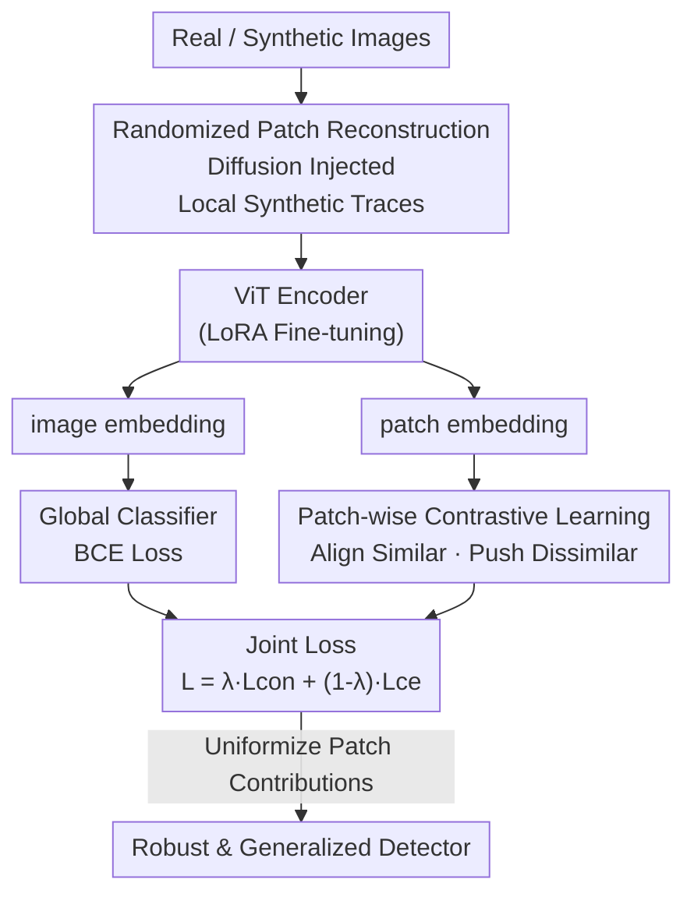

# All Patches Matter, More Patches Better: Enhance AI-Generated Image Detection via Panoptic Patch Learning

**Conference**: ICLR2026  
**OpenReview**: [https://openreview.net/forum?id=ob7PJs8kPU](https://openreview.net/forum?id=ob7PJs8kPU)  
**Code**: To be confirmed  
**Area**: AIGC Detection / AI-Generated Image Identification  
**Keywords**: AIGI Detection, Patch-level Learning, Contrastive Learning, Diffusion Reconstruction, Generalizability

## TL;DR
This paper proposes the detection principles "All Patches Matter, More Patches Better," identifying that existing AI-generated image (AIGI) detectors suffer from a "Few-Patch Bias"—focusing only on a minimal set of patches. A Panoptic Patch Learning (PPL) framework is designed, using Randomized Patch Reconstruction (RPR) and Patch-wise Contrastive Learning (PCL) to spread discriminative power across all patches. This significantly improves cross-generator generalizability and robustness on GenImage, DRCT-2M, AIGCDetectBenchmark, and real-world Chameleon datasets (e.g., CLIP backbone achieves 97.2% mAcc on GenImage with a std of only 1.7).

## Background & Motivation
**Background**: AI-generated image detection is a typical "cat-and-mouse game." As generative architectures evolve and models update frequently, it is impossible to train on all synthetic data. Thus, detectors must possess strong generalizability to unseen generators. Current mainstream approaches follow two lines: local methods (patch-wise/pixel-wise, assuming low-level stylistic differences) and global methods (e.g., UnivFD using CLIP for global features, FatFormer with frequency adapters, or DRCT using contrastive loss to reinforce hard samples).

**Limitations of Prior Work**: AIGI possesses a unique property absent in traditional classification—**Universal Artifact Distribution**. Since synthetic images are generated via a unified process, discriminative features are not concentrated on foreground objects but are **uniformly scattered across every patch**. Every patch carries synthesis traces (the authors demonstrate that tiling a single patch across the whole image still yields 90% accuracy on GenImage SDv1.4). Existing detectors fail to exploit this property.

**Key Challenge**: Through counterfactual analysis, the authors expose a prevalent issue: **Few-Patch Bias**. Three pieces of evidence are provided: (1) Vanilla ViT attention maps are highly concentrated on a few patches, regardless of backbone or LoRA tuning; (2) Detectors are extremely fragile to specific patches, where masking a single patch drops accuracy by $18.7\% \pm 4.1\%$; (3) Using Controlled Direct Effect (CDE) to quantify patch contributions reveals a heavily skewed distribution—few patches have high CDE, while others contribute almost nothing despite containing artifacts. This is attributed to the **"Lazy Learner" effect**: once a few patches provide "easy-to-learn" artifacts that minimize loss, the model takes a shortcut and stops exploring other regions.

**Goal**: To force the detector to utilize all patches uniformly, thereby closing blind spots and enhancing cross-generator generalizability. This involves solving two sub-problems: (1) breaking the reliance on dominant patches; (2) ensuring all patches possess consistent discriminative capabilities.

**Key Insight**: Since artifacts are pervasive, the way to prevent "shortcuts" is to actively create a scenario where the model cannot succeed by relying on fixed patches and to align all similar patches in the representation space to "flatten" discriminative power.

**Core Idea**: Use Randomized Patch Reconstruction (RPR) to randomly inject synthetic traces into patches of real images, forcing the model to discriminate across random regions. Then, use Patch-wise Contrastive Learning (PCL) to align representations of patches with the same label, ensuring uniform contributions across the image.

## Method

### Overall Architecture
Panoptic Patch Learning (PPL) implements the principles "All Patches Matter, More Patches Better" at both the **data strategy** and **learning strategy** levels. During training, **Randomized Patch Reconstruction (RPR)** is applied to a portion of real images—injecting synthetic traces via diffusion reconstruction into randomly selected patches to create "locally synthetic" samples. This forces the model away from fixed regions. Simultaneously, the ViT encoder outputs both image-level and patch-level embeddings. Image embeddings undergo global classification (BCE loss), while patch embeddings undergo **Patch-wise Contrastive Learning (PCL)** to pull patches of the same class together and push different classes apart, diluting dominant patches and diffusing discriminative power. The distribution of CDE becomes more uniform as training progresses.

### Key Designs

**1. Detection Principles and Few-Patch Bias Diagnosis: Quantifying "Idle Patches" via CDE**

The authors introduce **Controlled Direct Effect (CDE)** to quantify the causal contribution of each patch. For a patch at row $i$ and column $j$, CDE is defined as the difference in classification logits before and after masking that patch:

$$\text{CDE} := \delta_{I} - \delta_{I-(i,j)}, \qquad \delta := \text{logit}_{\text{synth}} - \text{logit}_{\text{real}}$$

Where $I$ is the original image and $I-(i,j)$ is the image with the corresponding patch zeroed out. Visualizing CDE via heatmaps shows that weak detectors (e.g., UnivFD) have sparse high-CDE patches, while stronger detectors (e.g., DRCT) have more activated patches and a more uniform distribution. PPL aims to "flatten" this CDE distribution.

**2. Randomized Patch Reconstruction (RPR): Injecting Traces into Real Images**

RPR avoids "Lazy Learner" behavior by performing diffusion reconstruction (using SDv1.4 inpainting, strength $s=0.25$, 50 steps) on a real image to get a "reconstructed version." Then, a ratio $r_{rpr}$ of patches from the original real image is replaced with patches from the reconstructed version. This creates a sample where only specific random patches contain synthetic textures while maintaining global semantic coherence. This prevents the model from overfitting to "unnatural" stitching boundaries while forcing it to identify artifacts in arbitrary regions.

**3. Patch-wise Contrastive Learning (PCL): Uniformizing Discriminative Power**

PCL applies contrastive constraints to the patch tokens. It pulls patches with the same label (both real or both synthetic) together and pushes different labels apart using a margin-based contrastive loss:

$$L_{con} = \sum_{i,j:\,i\neq j}\Big[\, Y\cdot d^{2} + (1-Y)\cdot \max\big(0,\ \alpha - d^{2}\big)\,\Big]$$

Where $d$ is the Euclidean distance between patch embeddings. This forces the model to generate consistent responses for all synthetic patches, effectively "dragging" non-dominant patches into the same discriminative cluster as the dominant ones. The total loss is:

$$L_{total} = \lambda L_{con} + (1-\lambda) L_{ce}$$

Default settings are $\lambda=0.3$ and margin $\alpha=1.0$.

### Loss & Training
The backbone uses LoRA-tuned CLIP or DINOv2. Images are cropped to $224 \times 224$. The optimization objective is $L_{total}$, combining image-level BCE and patch-level contrastive loss. Patch-level labels are naturally obtained from the RPR process without additional annotation.

## Key Experimental Results

### Main Results
Cross-generator generalizability is the core metric: training on GenImage SDv1.4 and testing on others.

| Dataset / Setting | Metric | Ours (CLIP) | Ours (DINOv2) | Prev. SOTA | Gain |
|--------|------|------|------|----------|------|
| GenImage Cross-Model | mAcc | **97.2 ± 1.7** | 95.9 ± 3.0 | C2P-CLIP 95.8 ± 4.0 | +1.4, lower std |
| DRCT-2M Cross-Model | mAcc | **99.50 ± 0.1** | 99.06 ± 0.1 | DRCT 91.35 ± 4.7 | +8.15, 47× lower std |
| AIGCDetectBenchmark | mAcc | 93.36 ± 6.3 | **94.41 ± 4.2** | AIDE 92.77 ± 7.7 | Superior even vs. GAN training |
| Chameleon (Real-world) | Acc | 69.33 | **72.07** | AIDE 65.77 | +6.3 |

Key observations: (1) PPL provides high accuracy with **significantly lower standard deviation**, indicating stability; (2) Strong cross-architecture generalizability—detecting GAN images despite training only on diffusion data; (3) Significant leads on the real-world Chameleon dataset.

### Ablation Study

| Configuration | Conclusion |
|------|---------|
| Full PPL (RPR + PCL) | Best performance; RPR and PCL are complementary. |
| Diffusion Reconstruction vs. Stitching | Diffusion is superior due to semantic coherence. |
| $\lambda$ (Contrastive Weight) | Peak performance at $\lambda=0.3$. |
| $r_{rpr}$ (Reconstruction Ratio) | Optimal at $\approx 50\%$; too high a ratio degrades performance. |
| $s$ (Reconstruction Strength) | Smaller $s$ is better for both accuracy and efficiency. |

### Key Findings
- **RPR and PCL Complementarity**: Creating scattered traces (data side) and flattening discriminative power (learning side) work better together than separately.
- **CDE Uniformity vs. Generalizability**: A positive correlation exists between CDE uniformness and cross-generator performance.
- **Robustness**: PPL remains stable under JPEG compression (Q=60), Gaussian blur, and resizing.

## Highlights & Insights
- **Causal quantification via CDE**: Moving beyond qualitative attention maps to quantify actual causal contributions of patches.
- **"Lazy Learner" Mitigation**: A combination of data augmentation (RPR) and representation alignment (PCL) successfully forces the model out of "shortcut" patterns.
- **Superiority of Diffusion-based Injection**: Choosing diffusion reconstruction over simple pasting preserves semantics and avoids overfitting to edge artifacts.
- **Zero-cost Labels**: Leveraging the inherent ground truth of the RPR process for patch-level supervision.

## Limitations & Future Work
- **Dependency on Diffusion**: RPR requires an in-painting diffusion model during training.
- **Aesthetic/Semantic Constraints**: $r_{rpr}$ requires tuning; too many reconstructed patches can be counterproductive.
- **Uniform Generation Assumption**: The principle "All Patches Matter" holds for full-image generation but may need adaptation for **local editing or partial synthesis (e.g., deepfakes, inpainting)** where artifacts are not uniform.

## Related Work & Insights
- **Vs. Patch-wise Methods**: Unlike methods that "select" high-priority patches (furthering Few-Patch Bias), PPL leverages all of them.
- **Vs. Global Methods**: PPL combines the strength of foundation models (CLIP/DINOv2) with fine-grained patch constraints, whereas global methods often miss local artifacts.
- **Inspiration**: The "Diagnosis via Causal Measure → Data-driven Decentralization → Representation Alignment" framework is applicable to other domains where discriminative cues are unevenly distributed.

## Rating
- Novelty: ⭐⭐⭐⭐⭐ 
- Experimental Thoroughness: ⭐⭐⭐⭐⭐ 
- Writing Quality: ⭐⭐⭐⭐⭐ 
- Value: ⭐⭐⭐⭐ 

<!-- RELATED:START -->

## Related Papers

- [\[ICLR 2026\] FakeXplain: AI-Generated Image Detection via Human-Aligned Grounded Reasoning](fakexplain_ai-generated_image_detection_via_human-aligned_grounded_reasoning.md)
- [\[ICLR 2026\] Unveiling Perceptual Artifacts: A Fine-Grained Benchmark for Interpretable AI-Generated Image Detection](unveiling_perceptual_artifacts_a_fine-grained_benchmark_for_interpretable_ai-gen.md)
- [\[ICML 2026\] Dissect and Prune: Enhancing Robustness in AI-Generated Image Detection](../../ICML2026/aigc_detection/dissect_and_prune_enhancing_robustness_in_ai-generated_image_detection.md)
- [\[CVPR 2026\] Enabling Supervised Learning of Generative Signatures for Generalized AI-Generated Images Detection](../../CVPR2026/aigc_detection/enabling_supervised_learning_of_generative_signatures_for_generalized_ai-generat.md)
- [\[CVPR 2026\] PPM-CLIP: Probabilistic Prompt Modeling for Generalizable AI-Generated Image Detection](../../CVPR2026/aigc_detection/ppm-clip_probabilistic_prompt_modeling_for_generalizable_ai-generated_image_dete.md)

<!-- RELATED:END -->
