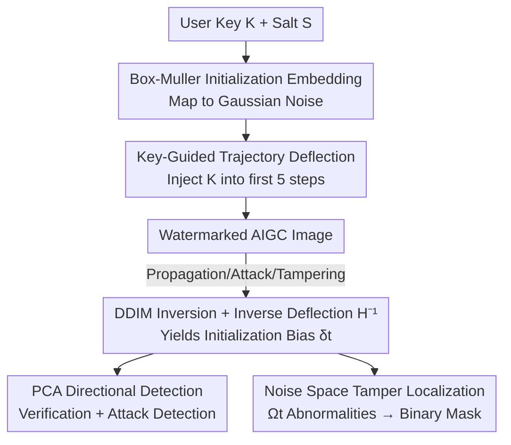

# Attack-Resistant Watermarking for AIGC Image Forensics via Diffusion-based Semantic Deflection

**Conference**: ICLR 2026  
**OpenReview**: [https://openreview.net/forum?id=wyucYNGPiW](https://openreview.net/forum?id=wyucYNGPiW)  
**Code**: https://github.com/QingyuLiu/PAI  
**Area**: AIGC Detection / Digital Watermarking / Diffusion Model Forensics  
**Keywords**: Inherent Watermarking, Diffusion Models, Copyright Forensics, Tamper Localization, DDIM Inversion  

## TL;DR
Ours proposes PAI—a training-free, plug-and-play inherent watermarking framework for diffusion models. By combining "initialization embedding" and "key-guided denoising trajectory deflection," user identity is deeply entangled with image semantics. The "initialization bias" obtained via DDIM inversion serves as a unified forensic signal for copyright verification, attack detection, and semantic-level tamper localization. PAI achieves an average verification accuracy of 98.43% under 12 types of attacks, outperforming SOTA by 37.25%.

## Background & Motivation
**Background**: With the proliferation of AIGC images, protecting copyright and traceability is critical. Watermarking falls into two categories: **embedded** (injecting signals post-generation via encoder-decoder networks or frequency transforms) and **inherent** (incorporating watermarks into the generation process, e.g., Tree-Ring or Gaussian Shading). Inherent methods are considered more practical due to semantic coupling and the lack of additional training.

**Limitations of Prior Work**: Real-world adversaries use aggressive techniques—**removal attacks** to erase evidence, **spoofing attacks** to forge ownership, and **local tampering** (e.g., face swapping) to maliciously alter semantics while maintaining realism. Existing solutions suffer from two flaws: (1) They use 1D scalar criteria (bit counts or single thresholds) for ownership, where removal lowers the score and spoofing raises it, creating a **trade-off where removal and spoofing cannot be countered simultaneously**. (2) Most only provide binary detection and lack forensic capabilities; pixel-based localization (e.g., EditGuard) fails against tools like Gemini 2.0 Flash that perform global semantic-level edits.

**Key Challenge**: Watermark robustness stems from the coupling strength between the signal and image semantics. Prior inherent methods only inject signals at the **initialization noise**, which is insufficient. Furthermore, collapsing adversarial behavior into a scalar discards the directional information needed to distinguish different attacks.

**Goal**: To build a training-free, plug-and-play framework providing: (1) high-confidence copyright verification bound to a private key; (2) resistance to removal, spoofing, tampering, and adaptive attacks; (3) semantic-level tamper localization.

**Key Insight**: Robustness increases with "semantic coupling." Since initial noise injection is insufficient, the key should be injected into the **denoising trajectory**, allowing the identity signal to accumulate and entangle deeper with content.

**Core Idea**: Replace "initial noise injection" with "key-guided trajectory deflection" and use the **initialization bias** from DDIM inversion as a unified signal: its magnitude determines authenticity, its direction in PCA subspace distinguishes removal/spoofing, and its spatial anomalies localize tampering.

## Method

### Overall Architecture
PAI is deployed on the provider side in two stages. **Generation**: User private key $K$ and timestamp salt $S$ are embedded into initial Gaussian noise via Box-Muller transform, followed by trajectory deflection in early denoising steps. **Forensics**: A candidate image is mapped back to noise space via DDIM inversion with inverse deflection. Subtracting the theoretical initial noise $F(K,S)$ yields the **initialization bias $\delta_t$**, which drives three tasks: verification (magnitude), attack classification (PCA direction), and tamper localization (spatial anomalies).

### Key Designs

**1. Box-Muller Initialization Embedding: Injecting identity without breaking Gaussian priors**

Diffusion sampling requires initial noise $x_t \sim N(0,1)$. Direct key injection may deviate from Gaussian, harming quality. Ours uses the Box-Muller transform:
$$x_t^{wm}=F(K,S)=\sqrt{-2\ln S}\cdot\cos\big(2\pi\cdot\Phi(K)\big),$$
where $K \sim N(0,1)$, $S \sim U(0,1)$, and $\Phi(\cdot)$ is the CDF. This ensures $x_t^{wm}$ strictly follows $N(0,1)$. $K$ provides **verifiability**, while $S$ (from metadata) provides **diversity** to avoid identical outputs for the same prompt.

**2. Key-Guided Trajectory Deflection: Deep identity-content entanglement**

Prior methods focusing only on initial noise are easily stripped. Ours introduces **progressive injection**: replacing predicted $\hat{x}_0$ with a deflection function $H(K,x_t^{wm},t)$:
$$x_{t-1}^{wm}=\sqrt{\bar\alpha_{t-1}}\cdot H(K,x_t^{wm},t)+\sqrt{1-\bar\alpha_{t-1}}\cdot\epsilon_\theta(x_t^{wm},t),$$
where $H(K,x_t^{wm},t)=(\gamma K+1)\cdot\hat{x}_0$. Every step applies a tiny deflection using $K$, accumulating into a semantically coherent watermark. To balance quality and robustness, deflection is applied only in the **first 5 steps** ($t=50, \gamma=0.1$). This "trajectory-level coupling" forces any incorrect key during inversion to produce structural bias.

**3. Initialization Bias & PCA Direction: Distinguishing removal from spoofing**

Verification subtracts the theoretical $F(K,S)$ from the inverted $\hat{x}_t^{wm}$ to find $\delta_t = \hat{x}_t^{wm} - F(K,S)$. 
**Vanilla Verification**: Uses the second moment $E[|\delta_t|^2] < \tau_{vanilla}$. 
**Robust Verification**: Removal and spoofing may have similar magnitudes but **opposite directions** in high-dimensional latent space. By projecting $\delta_t$ into PCA space ($k=2$), ours models benign bias as $z \sim N(\mu,\Sigma)$ and uses Mahalanobis distance $D^2(z) \sim \chi^2_k$. $D^2(z) > \tau_{robust}$ indicates an attack. This allows ours to identify removal attacks while maintaining ownership.

**4. Noise Space Tamper Localization: Robustness against global semantic editing**

Pixel-level localization fails under global editing. Ours observes that RGB differences $\Omega_0$ align with noise-space anomalies $\Omega_t$. Since the original $x_0^{wm}$ is unknown, ours estimates $\hat\Omega_t = \delta_t^{c'} - \bar\Delta_t$, where $\delta_t^{c'}$ is the bias of the tampered image and $\bar\Delta_t$ is the mean intrinsic bias of non-watermarked samples. This supports localization for PS, Simswap, and global commercial tools like Gemini 2.0 Flash.

### Loss & Training
Ours is **completely training-free**. The watermark injection modifies the diffusion sampling iteration, and verification is the inverse process with hypothesis testing. No neural network parameters are updated.

## Key Experimental Results

### Main Results

PAI achieves top-tier accuracy and quality under clean conditions:

| Dataset | Metric | PAI(T2I) | Gaussian Shading | Tree-Ring | EditGuard |
|--------|------|----------|------------------|-----------|-----------|
| COCO | ACC↑ | 100.0 | 100.0 | 99.72 | 99.69 |
| CelebA-HQ | ACC↑ | 100.0 | 100.0 | 99.96 | 99.67 |

PAI breaks the removal-spoofing trade-off (Ownership ACC%):

| Attack | Metric | PAI(T2I) | Gaussian Shading | Stable Signature |
|----------|------|----------|------------------|------------------|
| Removal (Avg O-ACC)↑ | Ownership | 99.00 | 99.93 | 43.95 |
| Spoofing (Avg O-ACC)↑ | Ownership | 96.33 | 15.77 | 99.92 |

Regarding localization, EditGuard fails against global semantic editing (Stable Inpainting):

| Tamper Type | Metric | PAI | EditGuard |
|----------|------|-----|-----------|
| Stable Inpainting (Global) | O-ACC↑ | 100.0 | 0.08 |
| Three-category Avg | AUC↑ | 89.77 | 75.77 |

### Ablation Study
| Configuration | Result | Note |
|------|---------|------|
| Full PAI (PCA) | 99% Rem / 96.3% Spf | Direction is key to breaking the trade-off |
| 1D Scalar Baseline | Trade-off exists | Magnitude cannot separate removal/spoofing |
| Altering Salt $S$ | 100% Ownership | Ownership is tied to $K$, not $S$ |
| White-box Extraction | Optimization fails | Key cannot be easily imitated or extracted |

### Key Findings
- **PCA Direction is the Game Changer**: Removal and spoofing are directionally distinct in the latent space. Magnitude-only criteria inevitably compromise one for the other.
- **Trajectory Coupling Defeats White-box Attacks**: Even with gradient optimization, attackers cannot suppress bias to the level of a valid key without knowing the key itself.
- **Noise-space Localization is robust**: While pixel-based methods collapse under global editing (O-ACC 0.08%), PAI remains effective.

## Highlights & Insights
- **Unified Forensic Signal**: The "initialization bias" handles three tasks via magnitude, PCA direction, and spatial distribution, avoiding multiple detectors.
- **Box-Muller for Prior Preservation**: Efficiently maps keys to strict $N(0,1)$ noise, ensuring no degradation in generation quality or diversity.
- **Engineering Deep Coupling**: Implements the observation "robustness scale with semantics" by injecting signals progressively into the denoising path.
- **Direction vs. Magnitude**: A perspective shift from scalar magnitude to latent direction solves the long-standing removal-spoofing trade-off.

## Limitations & Future Work
- **DDIM Inversion Dependency**: Relies on inversion accuracy. High intrinsic errors in few-step samplers might shrink the margin between valid and invalid keys.
- **Deployment Assumptions**: Assumes a trusted provider side. If the key database is compromised, the entire system fails.
- **Localization F1 Gap**: While superior in global editing, PAI lags slightly behind EditGuard in very fine-grained local edits (e.g., PS F1: 66.24 vs 86.07).
- **Hyperparameter Sensitivity**: The deflection strength $\gamma$ must be manually balanced for different base models or resolutions.

## Related Work & Insights
- **vs. Gaussian Shading / Tree-Ring**: These use 1D criteria and initial-only injection, leading to the removal-spoofing trade-off. Ours breaks this via trajectory deflection and PCA analysis.
- **vs. EditGuard / Stable Signature**: Embedded methods require training and are sensitive to unseen degradations. Ours is training-free and robust to commercial global edits.
- **vs. Pixel-level Localization**: PAI maps RGB tampering to noise-space anomalies $\hat\Omega_t$, maintaining effectiveness where pixel-level methods fail (e.g., inpainting).

## Rating
- Novelty: ⭐⭐⭐⭐⭐ (Unified bias analysis across three forensic tasks)
- Experimental Thoroughness: ⭐⭐⭐⭐ (Comprehensive attacks but fine-grained F1 could be higher)
- Writing Quality: ⭐⭐⭐⭐ (Clear motivation and theory)
- Value: ⭐⭐⭐⭐⭐ (Practical solution for breaking the removal-spoofing trade-off)

<!-- RELATED:START -->

## Related Papers

- [\[ICLR 2026\] Spherical Watermark: Encryption-Free, Lossless Watermarking for Diffusion Models](spherical_watermark_encryption-free_lossless_watermarking_for_diffusion_models.md)
- [\[ICLR 2026\] Semantic Visual Anomaly Detection and Reasoning in AI-Generated Images](semantic_visual_anomaly_detection_and_reasoning_in_ai-generated_images.md)
- [\[ICLR 2026\] Omni-IML: Towards Unified Interpretable Image Manipulation Localization](omni-iml_towards_unified_interpretable_image_manipulation_localization.md)
- [\[ICLR 2026\] FakeXplain: AI-Generated Image Detection via Human-Aligned Grounded Reasoning](fakexplain_ai-generated_image_detection_via_human-aligned_grounded_reasoning.md)
- [\[ICLR 2026\] HSIC Bottleneck for Cross-Generator and Domain-Incremental Synthetic Image Detection](hsic_bottleneck_for_cross-generator_and_domain-incremental_synthetic_image_detec.md)

<!-- RELATED:END -->

## Related Papers

- [\[ICLR 2026\] Spherical Watermark: Encryption-Free, Lossless Watermarking for Diffusion Models](spherical_watermark_encryption-free_lossless_watermarking_for_diffusion_models.md)
- [\[ICLR 2026\] Semantic Visual Anomaly Detection and Reasoning in AI-Generated Images](semantic_visual_anomaly_detection_and_reasoning_in_ai-generated_images.md)
- [\[ICLR 2026\] Omni-IML: Towards Unified Interpretable Image Manipulation Localization](omni-iml_towards_unified_interpretable_image_manipulation_localization.md)
- [\[ICLR 2026\] FakeXplain: AI-Generated Image Detection via Human-Aligned Grounded Reasoning](fakexplain_ai-generated_image_detection_via_human-aligned_grounded_reasoning.md)
- [\[ICLR 2026\] HSIC Bottleneck for Cross-Generator and Domain-Incremental Synthetic Image Detection](hsic_bottleneck_for_cross-generator_and_domain-incremental_synthetic_image_detec.md)

<!-- RELATED:END -->
