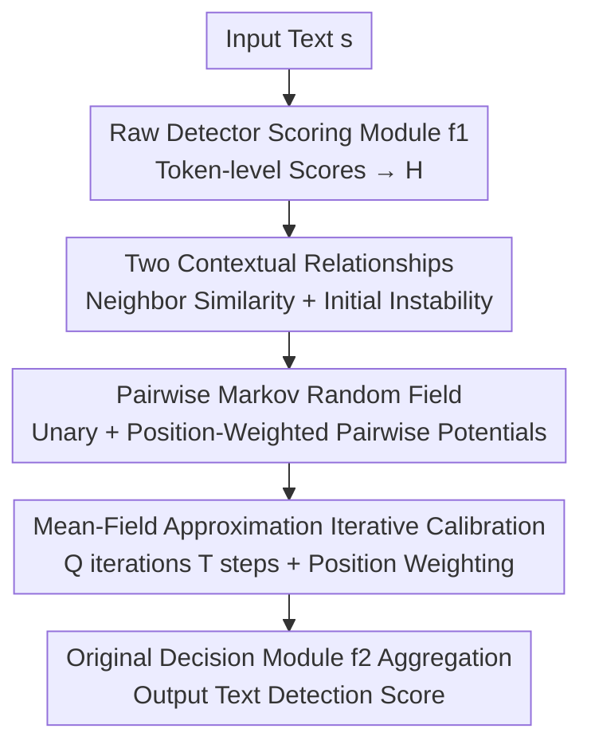

# Beyond Raw Detection Scores: Markov-Informed Calibration for Boosting Machine-Generated Text Detection

**Conference**: ICLR2026  
**OpenReview**: [https://openreview.net/forum?id=Lzwkeg2o2z](https://openreview.net/forum?id=Lzwkeg2o2z)  
**Code**: https://github.com/tmlr-group/MRF_Calibration  
**Area**: Machine-Generated Text Detection / AIGC Detection  
**Keywords**: MGT Detection, Score Calibration, Markov Random Field, Mean-Field Approximation, Metric-based Detectors

## TL;DR
This paper argues that token-level scores of mainstream "metric-based" machine-generated text (MGT) detectors are contaminated by the randomness of LLM sampling. It utilizes Markov Random Fields (MRF) to characterize two patterns: "neighbor similarity" and "initial instability." Through mean-field approximation, this is implemented as a lightweight iterative component with only 2x2 parameters that can be layered onto any existing detector. It significantly boosts the AUROC of various baseline detectors with almost no additional overhead (e.g., increasing DetectGPT's AUROC on the Essay dataset from 44% to 92%).

## Background & Motivation
**Background**: Machine-generated text detection currently follows two main paradigms. One is **model-based**, where a binary classifier is trained on human-written/machine-generated text (e.g., OpenAI detector, ChatGPT detector, SeqXGPT). The other is **metric-based**, which leverages statistical biases left by LLMs during generation. Typical metrics include Log-Likelihood, Log-Rank, Entropy, and methods involving perturbation/regeneration like DetectGPT, Fast-DetectGPT, and DNA-GPT. Metric-based methods are more practical as they do not require training large models, are LLM-agnostic, and usually offer better generalization.

**Limitations of Prior Work**: After placing these metric-based methods into a unified framework (comparing "data / score aggregation / detection decision"), the authors found they share a **threshold decision** mechanism—calculating a total score for a text and classifying it as machine-generated if it exceeds a threshold. This means detection performance **depends entirely on the precision of the scores**. However, LLM sampling randomness causes certain tokens to deviate from the underlying assumptions of these methods (e.g., the Log-Rank assumption that generated tokens always have high ranks), leading to **biased token-level scores with low discriminative power**. Worse, existing methods simply use **naive aggregation (direct summation)** of these potentially inaccurate token scores into a total text score, making no attempt to correct the underlying token-wise errors.

**Key Challenge**: Detection quality depends on score precision, which is undermined by generation randomness, and existing "naive aggregation" fails to correct this, instead carrying the noise into the threshold decision. In other words, the bottleneck is not "which metric to use," but the fact that the "calculated token scores themselves are noisy."

**Goal**: Design a universal enhancement component, **decoupled from specific detectors**, to calibrate token-level detection scores and universally improve the performance of all metric-based detectors.

**Key Insight**: Since detection scores are bound to tokens and the auto-regressive generation mechanism of LLMs naturally creates token dependencies, there should be **relationships between the detection scores of contextual tokens** that are easily overlooked. Revealing and modeling these relationships allows contextual information to correct single-point score errors. Starting from a simplified single-layer single-head Transformer model, the authors theoretically and empirically reveal two laws: **Neighbor Similarity** (detection scores of adjacent tokens have smaller variance and are closer to each other) and **Initial Instability** (detection scores of the first few tokens in a sentence are highly volatile and unreliable).

**Core Idea**: Encode these two laws into a **Markov Random Field (MRF)** and implement it via **mean-field approximation** as a lightweight iterative neural network layer. This layer sits on top of existing detectors for score calibration, using "contextual consistency" to fix "single-token noise."

## Method

### Overall Architecture
The method is a **plug-and-play calibration module**. Given a text $s$, the "scoring module" $f_1$ of any existing detector is used to calculate raw token-level detection scores (normalized into a prior probability matrix $H$ for machine/human classes). These are then passed to the MRF calibration component $f_{mrf}$, which constructs a pairwise MRF over the token sequence. It uses **unary potentials** to receive raw scores and **position-weighted pairwise potentials** to encode "neighbor similarity + initial instability." The mean-field approximation unfolds the solution into $T$ iterative update steps. Finally, the calibrated scores are passed to the original detector's "decision module" $f_2$ to aggregate the final text score. The entire pipeline is denoted as $f_{enh}(s) = f_1 \circ f_{mrf} \circ f_2(s)$, adding only $2\times2$ parameters without changing the original detector's structure.

### Key Designs

**1. Two Contextual Relationships: Neighbor Similarity and Initial Instability as "Priors"**

Calibration requires a direction for correction. Starting from a simplified single-layer single-head Transformer (attention $a_t = \mathrm{softmax}(1/t \cdot x_t W_Q W_K^\top X_{t-1}^\top) X_{t-1} W_V W_O$), the authors prove a theorem (Theorem 1) regarding upper and lower bounds of attention scores. From the "attention $\to \log p(x_{t+1})$ continuous mapping," they derive two laws. **Neighbor Similarity**: The variance of detection scores for adjacent tokens is significantly smaller than for distant tokens. The theorem describes a positive feedback loop similar to simulated annealing; if the current score is high, the next tends to be high, preventing drastic jumps. **Initial Instability**: Scores for tokens at the start of a sentence are statistically more unstable. The theorem's bounds are strongly correlated with the current step $t$; when $t$ is small (early positions), the $\eta$ and $C$ in the bounds are large, allowing for violent fluctuations in $a_t$. Empirical verification confirms that detection score distance increases with the number of hops (adjacent being most similar) and the difference between adjacent scores is large at the start and converges as position progresses. These laws correspond to the MRF's pairwise potential and position-weighting function.

**2. Pairwise Markov Random Field: Encoding Laws into the Energy Function**

How to transform "neighbors should be similar" and "initial tokens should be distrusted" into an optimizable objective? Each token $s_t$ is assigned a binary random variable $y_{s_t} \in \{0, 1\}$ (human/machine). The token labels $y_s$ for the text form a Gibbs distribution $P(y_s) = \frac{1}{Z}\exp(-E(s, y_s))$. Maximizing the posterior is equivalent to minimizing the energy function:

$$E(s, y_s) = \sum_{t=1}^{N}\Psi_U(s_t, y_{s_t}) + \sum_{t=1}^{N}\sum_{s_j \in N(s_t)}\Psi_P(y_{s_t}, y_{s_j})$$

where the neighborhood $N(s_t) = \{s_{t-1}, s_{t+1}\}$. The **unary potential** $\Psi_U(s_t, y_{s_t}) = -\log p(s_t)$ directly receives the probabilities from the original detector (normalized 0-1 scores for detectors without probabilistic output). The **pairwise potential** encodes neighbor similarity: a penalty if neighbor labels differ and a reward if they match, $\Psi_P(y_{s_t}, y_{s_j}) = w \cdot (2 \cdot I(y_{s_t} \neq y_{s_j}) - 1), w \ge 0$. To encode initial instability, a position-weighting function $\beta(t)$ suppresses the weight of the pairwise potential at the beginning of the sentence:

$$\Psi_P(y_{s_i}, y_{s_j}) = \beta(j) \cdot w \cdot (2 \cdot I(y_{s_i} \neq y_{s_j}) - 1), \quad \beta(t) = \frac{1}{1 + \exp(-(t - t_0))}$$

$\beta(t)$ is a Sigmoid centered at $t_0$, smoothly suppressing the pairwise potential before $t_0$ (the unstable region) to prevent unreliable initial neighbors from amplifying errors.

**3. Mean-Field Approximation: Unfolding MRF Inference into a Lightweight Iterative Layer**

Direct posterior inference for MRF requires calculating the partition function $Z$ over $2^N$ label combinations, which is infeasible. The authors use **mean-field theory** for approximate inference: using a factorizable distribution $Q(y_s) = \prod_t Q_{s_t}(y_{s_t})$ to approximate $P(y_s)$. By minimizing KL divergence, they derive the optimal update formula for single tokens and represent it in matrix form. The unary potential corresponds to $-\log H$ ($H = [1-p(s), p(s)]$). The pairwise potential corresponds to a weighted adjacency matrix $A^{corr}$ (with $\beta(\cdot)$ as non-zero elements). Crucially, the authors **relax the weights** rather than using one set for all "neighbor relationships," introducing $W_{mrf} \in \mathbb{R}^{2\times2}_+$ to allow machine-generated and human-written neighbors to have different influences. The final update rule (implemented via softmax for $\frac{1}{z}\exp(\cdot)$) is:

$$Q^t = \mathrm{softmax}\!\left(\log Q^{t-1} - A^{corr}Q^{t-1}\!\left(W_{mrf} \odot \begin{bmatrix}-1&1\\1&-1\end{bmatrix}\right)\right), \quad Q^0 = H$$

Iterated $T$ times. After convergence, the final scores are suppressed again via position weighting: $Q_{final} = [\beta(1), ..., \beta(N)] \odot Q^T$. The component is implemented via sparse-dense matrix multiplication with $O(NT)$ complexity. The only learnable parameters are in the $2\times2$ matrix $W_{mrf}$, trained using supervised cross-entropy. This minimal parameter count is key to its **robustness against overfitting and excellent cross-domain/cross-LLM generalization**.

### Loss & Training
The only learnable parameter is the MRF's $2\times2$ weight $W_{mrf}$. The number of iterations $T$ and position center $t_0$ are hyperparameters. Training uses standard binary cross-entropy on $D_{train}$. Inference follows Algorithm 1: construct $A^{corr} \to$ initialize $Q^0 = H$ with raw token scores $\to$ iterate $T$ times $\to$ apply position weighting to get $Q_{final} \to$ aggregate results via $f_2$.

## Key Experimental Results

### Main Results
The method was tested on four public datasets: Essay, Reuters, DetectRL, and TruthfulQA, as an "enhancement layer" for 10 metric-based detectors. The enhanced versions are marked with the `-M` suffix. Metrics used are AUROC and TPR@FPR=1%. The table below shows average AUROC (%) in cross-LLM settings:

| Detector | Essay Original Avg | Essay +M | DetectRL Original Avg | DetectRL +M |
|--------|------|------|------|------|
| Likelihood | 96.17 | **97.79** | 72.20 | **80.84** |
| Log-Rank | 96.03 | **97.32** | 72.06 | **83.29** |
| Entropy | 83.93 | **89.01** | 63.34 | **67.02** |
| DetectGPT | 44.09 | **91.95** | 48.60 | **72.95** |
| Fast-DetectGPT | 69.08 | **79.92** | 60.97 | **61.68** |
| DNA-GPT | 95.26 | **98.07** | 67.79 | **69.75** |

Improvements are **particularly significant for weak detectors**: DetectGPT jumped from 0.15% to 37.18% (+37.03% gain) and Likelihood from 52.4% to 77.86% (+25.46% gain) in single-LLM Essay settings. This indicates that while their underlying assumptions were reasonable, estimation errors were previously holding them back. The enhanced detectors also showed stronger generalization and robustness across domains (arXiv, Writing, XSum, Yelp) and under hybrid text or Dipper/Polish rewriting attacks.

### Ablation Study
The method consists of two components: the MRF layer (neighbor similarity) and the position-weighting function (initial instability).

| Configuration | Effect | Description |
|------|------|------|
| Full | Best | Complete MRF + Position version |
| w/o MRF | Significant drop | Removes neighbor similarity modeling |
| w/o Pos | Significant drop | Removes suppression of initial instability |

### Key Findings
- **Removing either component causes a drop in performance**, but keeping either one still outperforms the original detector, proving both laws are effective.
- **Component contributions vary by detector type**: For single-text metrics like Likelihood and Log-Rank, position weighting contributes the most (as they suffer more from initial instability). For perturbation-based methods like DetectGPT, where some randomness is already mitigated, MRF calibration becomes the primary source of gain.
- **MRF vs NN Calibration**: While direct calibration with a three-layer NN (`-nn`) performs well within the same LLM distribution, its performance crashes in cross-LLM scenarios. This indicates the NN overfits the training data, while the structured MRF with minimal parameters learns a "universal correction" capability.

## Highlights & Insights
- **Shifting the focus from "better metrics" to "more accurate scores"**: The authors identify that all metric-based methods suffer from token-level noise, shifting the research effort to calibration, which is a decoupled and reusable perspective.
- **Closed loop of Theory → Empirical → Modeling**: The two laws are derived from simplified Transformer theory, encoded via MRF components, and implemented via mean-field approximation. Each step is verifiable.
- **Minimal parameters as a "moat"**: Using a $2\times2$ matrix $W_{mrf}$ and $O(NT)$ overhead ensures the method generalizes across domains and LLMs without overfitting. This "contextual consistency" trick could potentially migrate to other tasks like sequence anomaly detection.

## Limitations & Future Work
- The theoretical analysis is based on a **simplified single-layer single-head Transformer model**. Whether full-scale multi-layer LLMs strictly satisfy these laws is supported by empirical evidence but lacks a formal mathematical proof (which the authors acknowledge is intractable).
- The neighborhood only considers **directly adjacent tokens** (first-order Markov). Long-range dependencies (e.g., syntactic/discourse relations) are not modeled, leaving room for improvement in long or structured texts.
- Position weighting uses a fixed Sigmoid shape where $t_0$ and iteration steps $T$ are hyperparameters that may require tuning for different corpora/detectors.
- It remains a **supervised** calibration requiring labeled text to learn $W_{mrf}$ weights.

## Related Work & Insights
- **vs Model-based (ChatGPT-D / MPU / SeqXGPT)**: Model-based methods easily overfit and require retraining for new LLMs. This method follows the metric-based route and uses minimal parameters for calibration, offering better generalization.
- **vs Vanilla Metric-based (Likelihood / Log-Rank / DetectGPT)**: These methods design different metrics but aggregate noisy scores directly. This paper acts as a **universal plugin** that calibrates scores, providing the largest gains to the weakest baselines (e.g., DetectGPT).
- **vs Neural Network Calibration**: NN calibration fails in cross-LLM scenarios due to overfitting. This structured MRF approach uses prior knowledge to trade parameter complexity for generalization.

## Rating
- Novelty: ⭐⭐⭐⭐⭐ Systematic introduction of MRF/Mean-field priors to MGT score calibration with theoretical grounding.
- Experimental Thoroughness: ⭐⭐⭐⭐⭐ Coverage over four datasets, ten detectors, cross-LLM/domain/hybrid/rewriting attacks, and NN comparisons.
- Writing Quality: ⭐⭐⭐⭐ Logical flow from framework to laws to implementation; dense formulas but clear reasoning.
- Value: ⭐⭐⭐⭐⭐ Plug-and-play, negligible overhead, huge gains for weak detectors, high practical value.

<!-- RELATED:START -->

## Related Papers

- [\[ACL 2026\] ExaGPT: Example-Based Machine-Generated Text Detection for Human Interpretability](../../ACL2026/aigc_detection/exagpt_example-based_machine-generated_text_detection_for_human_interpretability.md)
- [\[ICLR 2026\] Learning From Dictionary: Enhancing Robustness of Machine-Generated Text Detection in Zero-Shot Language via Adversarial Training](learning_from_dictionary_enhancing_robustness_of_machine-generated_text_detectio.md)
- [\[ACL 2026\] Beyond the Final Actor: Modeling the Dual Roles of Creator and Editor for Fine-Grained LLM-Generated Text Detection](../../ACL2026/aigc_detection/beyond_the_final_actor_modeling_the_dual_roles_of_creator_and_editor_for_fine-gr.md)
- [\[ACL 2026\] When Personalization Tricks Detectors: The Feature-Inversion Trap in Machine-Generated Text Detection](../../ACL2026/aigc_detection/when_personalization_tricks_detectors_the_feature-inversion_trap_in_machine-gene.md)
- [\[ICLR 2026\] D&R: Recovery-based AI-Generated Text Detection via a Single Black-box LLM Call](dr_recovery-based_ai-generated_text_detection_via_a_single_black-box_llm_call.md)

<!-- RELATED:END -->
