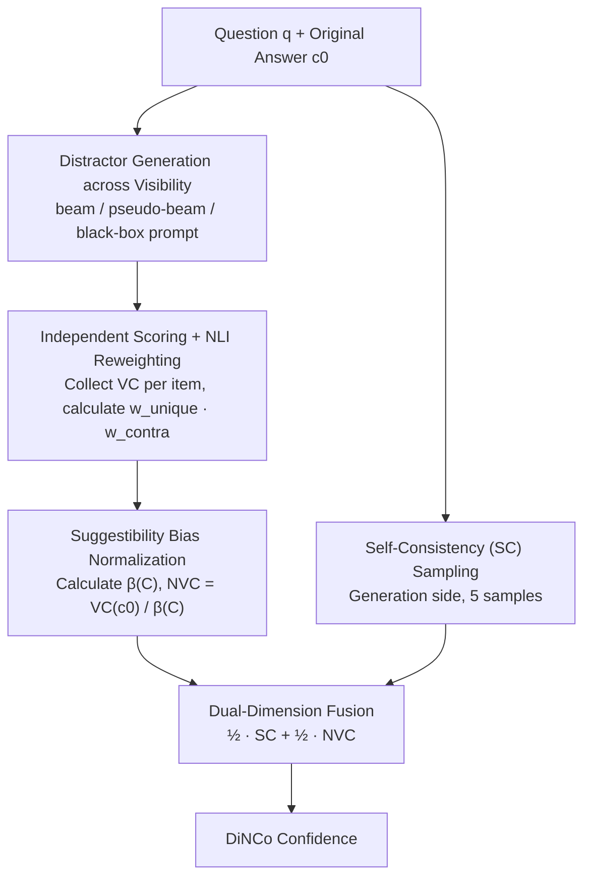

# Calibrating Verbalized Confidence with Self-Generated Distractors

**Conference**: ICLR 2026  
**arXiv**: [2509.25532](https://arxiv.org/abs/2509.25532)  
**Code**: [victorwang37/dinco](https://github.com/victorwang37/dinco)  
**Area**: AIGC Detection  
**Keywords**: Confidence Calibration, Verbalized Probability, Distractor Generation, NLI Reweighting, Generation-Verification Consistency

## TL;DR

The DiNCo method is proposed to expose "suggestibility bias" by having LLMs **independently** evaluate automatically generated distractors (plausible but incorrect alternative answers). By normalizing with the total confidence across distractors and fusing two complementary dimensions—generation consistency and verification consistency—it significantly improves confidence calibration in short-form QA and long-form generation tasks.

## Background & Motivation

**Background**: LLMs can directly output their certainty regarding an answer through "verbalized confidence"—either by having the model report a numerical value (e.g., "80%") or via the $P(\text{True})$ approach. This single-call method is far more efficient than multi-sample approaches, but the calibration quality remains a challenge.

**Limitations of Prior Work**:
- **Overconfidence**: Verbalized confidence is systematically higher than accuracy; models often report 0.8+ confidence even for incorrect answers.
- **Confidence Saturation**: Scores cluster in narrow intervals (e.g., 0.9-1.0), making it impossible to effectively distinguish correct and incorrect answers regardless of the threshold settings.
- **Incomparability across Difficulties**: Incorrect answers for easy questions and correct answers for difficult questions may receive identical scores.

**Key Observation**: The authors propose the "suggestibility" hypothesis—when an LLM knows little about a topic, **placing a claim into the context itself inflates the model's confidence in that claim**. Experimental verification shows that the total confidence $\beta(C)$ for incorrectly answered questions is significantly higher than that for correctly answered ones, confirming that models are more "suggestible" under cognitive uncertainty.

## Method

### Overall Architecture

DiNCo (Distractor-Normalized Coherence) addresses the systematic inflation of LLM verbalized confidence and the score saturation in the 0.9–1.0 range. Its premise is the neglected phenomenon of **suggestibility bias**: when a model lacks knowledge, simply presenting a claim for evaluation raises its confidence, leading to 0.8+ scores for errors. DiNCo's strategy is to use "poison against poison": since any claim in context is equally inflated, the method actively generates a set of plausible but incorrect **distractors** for the original answer. The model scores these **independently**, and the total confidence across these distractors is used to factor out the inflated component from the original answer.

The pipeline receives a "question $q$ + original answer $c_0$": it first gathers a set of high-probability distractors under any model access level, collects verbalized confidence for each distractor independently, applies a lightweight NLI model to deduplicate and adjust scores to obtain a total bias factor $\beta(C)$, and divides the confidence of $c_0$ by $\beta(C)$ to get the Normalized Verification Confidence (NVC). Finally, this is fused equally with an independent Self-Consistency (SC) sampling (from the generation side) to produce the final confidence. The process requires zero training, utilizing only an external 184M NLI model.

### Key Designs

**1. Cross-Visibility Distractor Generation: Obtaining high-probability alternatives under any model access**

Normalization relies on a set of high-probability, mutually exclusive alternative claims to form the denominator. The goal is to maximize $\sum_{c \in C} f^{\text{VC}}(c)$ within a budget of $|C| \leq K$ to cover answers the model deems "possible." The generation method adapts to model visibility: for open-source models where logits are available, beam search is used to produce high-probability, non-repetitive answers; for API models exposing only top-token probabilities, "pseudo-beam search" is used as an approximation; for pure black-box models, the model is prompted to list candidates without any probability access. For long-term generation, paragraphs are decomposed into atomic claims per FactScore, and distractors are generated for each claim to enable claim-level calibration.

**2. Independent Scoring + NLI Reweighting: Preventing model "cheating" and correcting overlap bias**

Confidence must be queried **separately** for each distractor rather than presenting all candidates in a single prompt. In joint prompts, models may use simple arithmetic to ensure probabilities sum to one, masking true inconsistencies—a reason why joint methods like K-VC often fail. However, independently collected distractors may not be strictly mutually exclusive: some might be redundant or not contradict the original answer. The authors use a DeBERTa-v3-base NLI model to compute two weights for soft correction: the uniqueness weight $w_{\text{unique}}(c) = \frac{1}{\sum_{c' \in C} P(\text{entail} \mid c', c)}$ discounts repetitive items, and the contradiction weight $w_{\text{contra}}(c) = \frac{P(\text{contra} \mid c_0, c) + P(\text{contra} \mid c, c_0)}{2}$ discounts items that do not actually contradict the original answer. Ablation shows that removing this step degrades the NVC ECE from 0.171 to 0.358.

**3. Suggestibility Bias Normalization: Factoring out "Real Confidence × Bias Factor"**

The authors model verbalized confidence as the latent true confidence multiplied by a suggestibility bias scalar: $f^{\text{VC}}(c) = \beta(c) \cdot f^{\text{lat}}(c)$, where $\beta(c)$ measures the lift caused by "placing claim $c$ in context." Assuming the bias is approximately equal for a set of logically related, mutually exclusive claims $C$ ($\beta(c) \approx \beta(C)$) and that latent confidence satisfies normalization $\sum_{c \in C} f^{\text{lat}}(c) = 1$, the bias factor can be derived as the weighted sum of verbalized confidence scores:

$$\beta(C) = \max\!\left(1,\; f^{\text{VC}}(c_0) + \sum_{c \in C} f^{\text{VC}}(c) \cdot w_{\text{unique}}(c) \cdot w_{\text{contra}}(c)\right),$$

Then, the normalized confidence is $f^{\text{NVC}}(c_0) = f^{\text{VC}}(c_0) / \beta(C)$. The $\max(1, \cdot)$ operation prevents over-amplification when the set of claims is incomplete.

**4. Dual-Dimension Fusion: Bridging the gap between Generator and Verifier**

The authors observe that the highest-probability answer from beam search and the highest-confidence answer from the verification stage match only in 59.2% of cases, indicating that "how a model generates" and "how a model judges" are fundamentally different signals. DiNCo fuses these equally: $f^{\text{DiNCo}}(c) = \frac{1}{2} f^{\text{SC}}(c) + \frac{1}{2} f^{\text{NVC}}(c)$, where $f^{\text{SC}}$ is the self-consistency estimate (generation side) and $f^{\text{NVC}}$ is the normalized verification confidence. At a budget of $K=10$, 5 samples are allocated to SC and 5 distractors to NVC.

## Key Experimental Results

### Main Results: Short-form QA

| Method | TriviaQA ECE ↓ | TriviaQA AUC ↑ | SimpleQA ECE ↓ | SimpleQA AUC ↑ |
|------|:-:|:-:|:-:|:-:|
| VC | 0.240 | 0.817 | 0.547 | 0.644 |
| K-VC | 0.341 | 0.604 | 0.338 | 0.632 |
| MSP | 0.149 | 0.819 | 0.263 | 0.800 |
| SC | 0.236 | 0.785 | 0.220 | 0.750 |
| NVC | 0.171 | 0.853 | 0.164 | 0.729 |
| **DiNCo** | **0.097** | **0.879** | **0.089** | **0.786** |

> TriviaQA results are for Qwen3-8B; SimpleQA results are for GPT-4.1. DiNCo outperforms the best baseline (MSP) by an average of 0.077 (TriviaQA) and 0.092 (SimpleQA) in ECE.

### Main Results: Long-form Generation (FactScore)

| Method | Qwen3-8B ECE ↓ | Qwen3-8B Pearson $r$ ↑ | Gemma-3-4B ECE ↓ | Gemma-3-4B Pearson $r$ ↑ |
|------|:-:|:-:|:-:|:-:|
| VC | 0.433 | 0.073 | 0.527 | -0.081 |
| SC | 0.162 | 0.468 | 0.197 | 0.629 |
| NVC | 0.191 | 0.444 | 0.123 | 0.695 |
| **DiNCo** | **0.076** | **0.518** | **0.172** | **0.724** |

### Key Findings

- **Saturation**: DiNCo achieves $\Delta_0 = 0.998$ (almost every sample has a unique confidence score), compared to only 0.670 for VC and 0.832 for SC@100.
- **Scaling SC**: Increasing SC from 10 to 100 samples (7.6x the FLOPs of DiNCo) offers minimal ECE improvement and fails to match DiNCo's performance.
- **NLI Necessity**: Removing NLI reweighting degrades NVC ECE from 0.171 to 0.358, confirming the crucial role of deduplication.

## Highlights & Insights

**Value** ⭐⭐⭐⭐
- Analyzes overconfidence through "suggestibility bias," providing a clear theoretical motivation with experimental support.
- The method is applicable to both open-source and closed-source models and scales from short-form QA to long-form generation.
- Zero-resource and training-free, requiring only a lightweight NLI model (<1% of total FLOPs).

**Limitations** ⭐⭐⭐
- Distractor quality depends on the model's own generative capabilities, which may limit performance for smaller models.
- The assumption that bias $\beta$ is nearly equal across related claims may not hold for semantically distant claims.
- Long-form scenarios require claim decomposition, increasing pipeline complexity.

## Related Work & Insights

| Category | Representative Work | Difference from DiNCo |
|---------|---------|---------------|
| Verbalized Confidence | P(True), Verbalized Numerical | Single evaluation; suffers from suggestibility and saturation |
| Joint Multi-candidate Prompting | Top-K-VC, CaCoST | Joint presentation allows models to mask inconsistency via arithmetic |
| Self-Consistency | SC, SC-VC | Uses only generation consistency; ignores the verification dimension |
| Softmax Probability | MSP | Depends on canonical answer formats; cannot scale to long-form text |
| **DiNCo** | Ours | Independent distractor evaluation + NLI Reweighting + Dual-dimension fusion |

## Summary & Future Work

DiNCo addresses the neglected "suggestibility bias" in LLMs by automatically generating distractors and evaluating confidence independently to calibrate bias. It further fuses generation and verification dimensions. Under zero-resource settings, it achieves cross-task and cross-model calibration improvements with minimal overhead. Future work includes using smaller models for distractor generation to reduce costs, extending the method to multi-turn dialogue, and exploring integration with post-hoc calibration methods like temperature scaling.

<!-- RELATED:START -->

## Related Papers

- [\[ICML 2026\] LLM Self-Recognition: Steering and Retrieving Activation Signatures](../../ICML2026/aigc_detection/llm_self-recognition_steering_and_retrieving_activation_signatures.md)
- [\[CVPR 2026\] Investigating Self-Supervised Representations for Audio-Visual Deepfake Detection](../../CVPR2026/aigc_detection/investigating_self-supervised_representations_for_audio-visual_deepfake_detectio.md)
- [\[ACL 2026\] REFLEX: Self-Refining Explainable Fact-Checking via Verdict-Anchored Style Control](../../ACL2026/aigc_detection/reflex_self-refining_explainable_fact-checking_via_verdict-anchored_style_contro.md)
- [\[NeurIPS 2025\] QiMeng-NeuComBack: Self-Evolving Translation from IR to Assembly Code](../../NeurIPS2025/aigc_detection/qimeng-neucomback_self-evolving_translation_from_ir_to_assembly_code.md)
- [\[ICLR 2026\] Learn-to-Distance: Distance Learning for Detecting LLM-Generated Text](learn-to-distance_distance_learning_for_detecting_llm-generated_text.md)

<!-- RELATED:END -->
