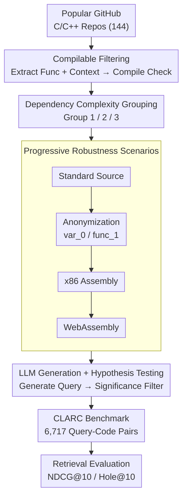

# CLARC: C/C++ Benchmark for Robust Code Search

**Conference**: ICLR 2026  
**arXiv**: [2603.04484](https://arxiv.org/abs/2603.04484)  
**Code**: [GitHub](https://github.com/ClarcTeam/CLARC) / [HuggingFace](https://huggingface.co/datasets/ClarcTeam/CLARC)  
**Area**: AIGC Detection  
**Keywords**: Code Retrieval, C/C++ Benchmark, Compilation Validation, Code Embedding, Assembly Language, Robustness

## TL;DR
Constructs CLARC, the first compilable C/C++ code retrieval benchmark (6,717 query-code pairs), using an automated pipeline to extract code from GitHub and generate/validate queries via LLM with hypothesis testing. It covers four retrieval scenarios—Standard, Anonymized, Assembly, and WebAssembly—revealing that existing code embedding models rely excessively on lexical features (NDCG@10 drops from 0.89 to 0.67 after anonymization) and significantly underperform in binary-level retrieval.

## Background & Motivation
**Background**: Existing code retrieval benchmarks primarily focus on Python/Java (e.g., CodeSearchNet, CoSQA, COIR). Embedding-based retrieval models (Voyage-code-3, OpenAI embedding, etc.) are standard for large-scale retrieval.

**Limitations of Prior Work**:
   - **Language Coverage Bias**: C/C++ is core to systems programming, yet mainstream benchmarks ignore or de-emphasize C/C++ text-to-code retrieval.
   - **Non-compilable Code**: Many code snippets in existing benchmarks lack includes/dependencies and cannot be compiled, disconnecting them from actual engineering practice.
   - **Hidden Lexical Reliance**: Benchmarks rarely test robustness against identifier renaming or anonymization; high scores may result from variable name matching rather than semantic understanding.
   - **Absence of Binary Level**: Security auditing and reverse engineering require code searching at the assembly or binary level, but no benchmarks evaluate such capabilities.

**Key Challenge**: Code retrieval models claim to understand "code semantics," but if they rely on lexical features like variable or function names, they will fail on obfuscated or assembly code.

**Core Idea**: Build a code retrieval benchmark covering the full stack from source code to binary. Use anonymization and compilation to low-level languages to systematically test semantic understanding versus lexical matching.

## Method

### Overall Architecture

CLARC is an automated construction pipeline from GitHub source code to natural language queries. It first crawls independently compilable functions from popular C/C++ repositories (**Compilable Filtering**), then categorizes them into three groups based on dependency complexity (**Dependency Complexity Grouping**). Each function is then abstracted through four retrieval scenarios: "Source $\rightarrow$ Anonymization $\rightarrow$ Assembly $\rightarrow$ WebAssembly" (**Progressive Robustness Scenarios**). Finally, queries are generated by LLMs and filtered using statistical hypothesis testing to remove low-quality samples (**LLM Generation + Hypothesis Testing**). The final dataset contains 6,717 validated query-code pairs. Evaluation uses two metrics: **NDCG@10**, which measures ranking quality of top-10 results (higher is better), and **Hole@10**, which tracks the proportion of missing relevant documents in the top 10 (lower is better, specifically capturing severe omissions in assembly/binary retrieval). The design aims to determine whether high model scores indicate true semantic understanding or simply memorization of variable names.

### Key Designs

**1. Compilable Filtering: Aligning Benchmarks with Real Engineering**
A major issue with existing C/C++ benchmarks is that code snippets lack includes or dependency definitions and cannot be compiled. CLARC extracts functions from 144 repositories (45 for evaluation, 99 for training) by establishing a whitelist of standard library headers and extracting the complete dependency context (type definitions, helper functions) along the call graph. Only functions that successfully compile in this prepared environment are retained. This ensures code integrity and provides the foundation for low-level language scenarios—code that cannot compile cannot generate assembly.

**2. Dependency Complexity Grouping: Deconstructing Retrieval Difficulty**
Understanding an isolated small function versus a complex function with nested calls and custom type dependencies presents different challenges. CLARC splits evaluation pairs into three groups: Group 1 (standalone functions with no custom dependencies, avg. 12.8 LOC), Group 2 (depends on custom types but no helper functions, 13.3 LOC), and Group 3 (depends on both custom types and helper functions, 71.5 LOC, significantly more complex). This allows for quantifiable experiments on how dependency context impacts retrieval.

**3. Progressive Robustness Scenarios: Stripping Lexical Clues**
To distinguish between semantic understanding and simple keyword matching (e.g., matching a query with a function named `compute_hash`), CLARC uses four abstraction levels: **Standard Source** (original naming), **Anonymization** (replaces all identifiers with `var_0`, `func_1`, etc., leaving only control flow and structure), **Assembly** (compiled to x86 assembly to simulate reverse engineering), and **WebAssembly** (compiled to `.wat` format to simulate web security auditing). This chain progressively strips high-level language features to isolate the contributions of lexical matching.

**4. LLM Generation + Hypothesis Testing for Quality Control**
Queries are generated by LLMs as code summaries. To prevent hallucinations or mismatches, CLARC introduces human scoring combined with statistical hypothesis testing. Evaluators rate the match between the generated query and code; these scores must be significantly higher than a random baseline to be included. This transforms "query quality" from a subjective impression into a statistically grounded conclusion.

## Key Experimental Results

### Main Results (6 Models × 4 Scenarios)

| Model | Standard NDCG@10 | Anonymized NDCG@10 | Decline |
|------|-------------|---------------|---------|
| Voyage-code-3 | **0.89** | 0.67 | -24.7% |
| OpenAI-embed-large | 0.85 | 0.60 | -29.4% |
| CodeT5+ | 0.72 | 0.55 | -23.6% |
| OASIS | 0.68 | 0.54 | -20.6% |
| Nomic-emb-code | 0.78 | 0.58 | -25.6% |

### Assembly/WebAssembly Retrieval

| Metric | Average Performance |
|------|---------|
| Assembly Hole@10 (Best Model) | ~17.1% |
| WebAssembly Hole@10 | Higher (Worse performance) |

### Analysis by Dependency Complexity

| Group | Standard NDCG@10 | Anonymized NDCG@10 |
|-------|-------------|---------------|
| Group 1 (Standalone) | Highest | Most significant drop |
| Group 3 (Complex) | Second highest | Smaller drop |

### Key Findings
- **Consistent Performance Drop After Anonymization**: All models declined by 20-30%, proving a heavy reliance on lexical features like variable/function names.
- **Assembly-level Retrieval is a Major Challenge**: Even the best model has a 17.1% omission rate (Hole@10), suggesting code retrieval is currently unreliable for security auditing or reverse engineering.
- **Group 1 (Standalone Functions) Drops Most After Anonymization**: Likely because standalone functions rely more heavily on descriptive naming for context.
- **Commercial Models Lead in Standard Scenarios**: However, their advantage shrinks after anonymization, implying their "semantic understanding" partially stems from superior lexical matching.
- **Robustness-optimized OASIS**: Showed the smallest decline but low absolute performance levels.

## Highlights & Insights
- **Systematic Falsification of "Lexical Reliance"**: Quantifies how much performance comes from lexical features versus true semantic understanding through a clean anonymization design.
- **Full-stack Coverage**: The progressive abstraction from high-level source to WebAssembly provides an elegant evaluation framework.
- **Value of Compilability**: Ensures code integrity and context, making the benchmark closer to real-world engineering and enabling dependency complexity analysis.
- **Reusable Automated Pipeline**: Other languages or projects can utilize this workflow to build similar benchmarks.

## Limitations & Future Work
- Currently covers only C/C++; benchmarks for Python, Java, and Rust are needed.
- Assembly testing is limited to x86; ARM or RISC-V may exhibit different characteristics.
- Queries generated by LLMs may differ in distribution from actual developer search intents.
- The evaluation set size (1,245 pairs) is relatively small compared to datasets like CodeSearchNet.
- Multi-stage retrieval (re-ranking) or RAG scenarios were not explored.

## Related Work & Insights
- **vs. CodeSearchNet**: Focuses on Python/Go/Ruby, lacks C/C++ text-to-code, and does not verify compilability.
- **vs. COIR**: A multi-task code retrieval benchmark but lacks anonymization or assembly-level robustness testing.
- **vs. XCodeEval**: Includes C++ but not from real-world projects.
- **Implications for Embedding Models**: The significant degradation after anonymization suggests a need for better semantic modeling (e.g., program analysis, control flow graphs) rather than pure text embeddings.

## Rating
- Novelty: ⭐⭐⭐⭐ First compilable C/C++ benchmark with progressive source-to-binary design.
- Experimental Thoroughness: ⭐⭐⭐⭐ 6 models × 4 scenarios × 3 complexity levels + statistical validation.
- Writing Quality: ⭐⭐⭐⭐ Detailed pipeline description and rigorous statistical verification.
- Value: ⭐⭐⭐⭐⭐ Dataset contribution is valuable for code retrieval and security communities, exposing critical model weaknesses.

<!-- RELATED:START -->

## Related Papers

- [\[NeurIPS 2025\] DuoLens: A Framework for Robust Detection of Machine-Generated Multilingual Text and Code](../../NeurIPS2025/aigc_detection/duolens_a_framework_for_robust_detection_of_machine-generated_multilingual_text_.md)
- [\[ICLR 2026\] Unveiling Perceptual Artifacts: A Fine-Grained Benchmark for Interpretable AI-Generated Image Detection](unveiling_perceptual_artifacts_a_fine-grained_benchmark_for_interpretable_ai-gen.md)
- [\[ICLR 2026\] No Pixel Left Behind: A Detail-Preserving Architecture for Robust High-Resolution AI-Generated Image Detection](no_pixel_left_behind_a_detail-preserving_architecture_for_robust_high-resolution.md)
- [\[ICML 2026\] AutoBaxBuilder: Bootstrapping Code Security Benchmarking](../../ICML2026/aigc_detection/autobaxbuilder_bootstrapping_code_security_benchmarking.md)
- [\[AAAI 2026\] BAID: A Benchmark for Bias Assessment of AI Detectors](../../AAAI2026/aigc_detection/baid_a_benchmark_for_bias_assessment_of_ai_detectors.md)

<!-- RELATED:END -->
