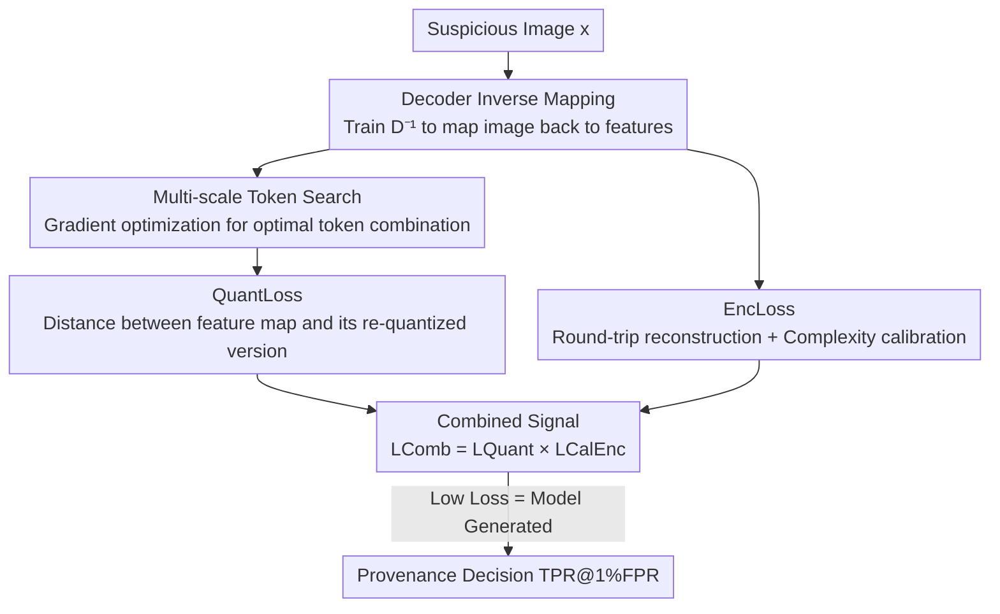

# Data Provenance for Image Auto-Regressive Generation

**Conference**: ICLR2026  
**OpenReview**: [https://openreview.net/forum?id=qYu4wj7O3z](https://openreview.net/forum?id=qYu4wj7O3z)  
**Code**: To be confirmed  
**Area**: AIGC Detection / Data Provenance / Image Autoregressive Generation  
**Keywords**: Data Provenance, Image Autoregressive Models, Codebook Quantization, Decoder Inverse Mapping, Post-hoc Detection

## TL;DR
Without altering the generation process or requiring watermarks, this paper leverages the "features left by Image Autoregressive (IAR) models in the codebook quantization space." By utilizing a trained inverse decoder and two complementary signals—QuantLoss and EncLoss—it achieves nearly 100% TPR@1%FPR for post-hoc provenance detection across mainstream IAR models including VAR, RAR, LlamaGen, and Infinity.

## Background & Motivation
**Background**: Image Autoregressive models (IARs) adopt the "next token prediction" paradigm from Large Language Models, encoding images into discrete token sequences for step-by-step generation. Representative models like VAR, RAR, LlamaGen, and Infinity can produce images nearly indistinguishable from real photographs. As these models become widely used, determining whether an image was generated by a specific IAR model has become a critical need. This is directly related to combating misinformation, identifying fraud, attributing responsibility for harmful content, and preventing model collapse caused by generated images polluting training data.

**Limitations of Prior Work**: Existing provenance methods primarily fall into two categories: **watermarking** or **fingerprinting**. Both require **actively embedding additional signals** into the model or image during training or generation. This introduces three major issues: (1) embedding can cause perceptible or statistical changes that harm generation quality; (2) they are ineffective for **already released, unmarked images**—one cannot retroactively embed signals; (3) there is a constant trade-off between robustness, imperceptibility, and applicability. Existing "reconstruction-based" methods like RONAN, LatentTracer, and AEDR do not require embedded signals, but RONAN only works for deterministic generation (inapplicable to stochastic IAR sampling), while LatentTracer and AEDR perform poorly on IARs.

**Key Challenge**: Watermarking and fingerprinting require "pre-emptive intervention," whereas images requiring provenance in the real world are often "found post-hoc and unmarked." There is no motivation for provenance when intervention is possible, and intervention is impossible when provenance is needed.

**Goal**: To develop a **post-hoc, model-agnostic framework that does not modify the generation process** to determine whether a suspicious image was generated by a given IAR model.

**Key Insight**: The authors discovered an interesting phenomenon: IARs encode images into discrete tokens from a **fixed codebook**. This quantization step leaves model-specific "fingerprints" in the generated images. Specifically, the token representation of a generated image **remains closer to codebook entries than that of a natural image**. Since generated images are "composed" from these codebook entries, natural images come from a much larger and more diverse real distribution.

**Core Idea**: Use the "distance to the codebook after mapping the image back to the latent space" as a provenance signal. Generated images are closer (lower quantization error), while natural images or those from other models are farther (higher quantization error). Combining this signal (QuantLoss) with a complementary encoder-decoder consistency signal (EncLoss) enables near-perfect provenance detection.

## Method

### Overall Architecture
The IAR tokenizer structure consists of three parts: an **encoder $E$** (CNN, projecting pixels $x\in\mathbb{R}^{H\times W\times 3}$ to feature maps $f$), a **quantizer $Q$** (containing codebook $Z\in\mathbb{R}^{N\times C}$, mapping spatial features $f^{(i,j)}$ to the nearest codebook entry to get discrete tokens $t_Z$), and a **decoder $D$** (restoring quantized feature maps $f_Z$ to images). Generation follows the path $t_Z \xrightarrow{Q^{-1}} f_Z \xrightarrow{D} x_Z$.

The problem addressed is: given a suspicious image $x$ and an IAR model $M$ (with white-box access to $E, D, Q$), judge if $x$ was generated by $M$ post-hoc. The strategy reverses the generation chain: starting from image $x$, a trained **inverse decoder $D^{-1}$** maps it back to feature maps, which are then **quantized** to token space to measure the fit to the codebook (QuantLoss). Simultaneously, an "image $\to$ latent $\to$ image" round-trip consistency is measured (EncLoss). The product of these two signals forms the final provenance criterion.

### Key Designs

**1. QuantLoss: Using "Distance to Codebook" as a Provenance Signal**

This design capitalizes on the observation that tokens of generated images are closer to the codebook. Formally, if $x$ is generated by the target IAR, the feature map $f$ mapped by an ideal inverse decoder $D^{-1}$ should **already be quantized** (each feature vector exactly matching a codebook entry). Thus, re-quantization $f \xrightarrow{Q} t \xrightarrow{Q^{-1}} f_Z$ introduces minimal error ($f \approx f_Z$). Conversely, natural images or those from other IARs show high quantization error. QuantLoss is defined as the distance before and after quantization:

$$\mathcal{L}_{\text{Quant}}(x) = \|f - f_Z\|_2 = \|f - Q^{-1}(Q(f))\|_2.$$

Efficiency is a key advantage: QuantLoss **is calculated entirely in the latent space of the autoencoder**, avoiding full image decoding. It is nearly 2x faster than reconstruction baselines and 4x faster than AEDR, with single-image detection taking less than 10ms on most IARs.

**2. Decoder Inverse Mapping: Training $D^{-1}$ instead of reusing the Encoder**

To calculate QuantLoss, the image must be mapped back to feature maps. Stating the mapping with the IAR's original encoder $E$ yields poor results because $E$ is trained on natural images and does not fit the "generated image $\to$ original tokens" path well. Thus, an **inverse decoder is trained separately**: initialized with encoder weights and fine-tuned on images generated by the target IAR. During training, codebook $Z$ and decoder $D$ are frozen, and the objective is to allow $D^{-1}$ to reconstruct $f_Z$ from $D(f_Z)$:

$$\mathcal{L}_{\text{inv}} = \|f_Z - D^{-1}(D(f_Z))\|_2.$$

This step is **purely post-hoc** and does not interfere with the original training/generation. Fine-tuning only uses images generated by the target IAR. Including data augmentation during fine-tuning allows $D^{-1}$ to produce consistent quantized features for both original and perturbed images, significantly enhancing robustness.

**3. Multi-scale Token Search: De-quantization tailored for next-scale models like VAR**

For single-scale IARs (e.g., RAR), de-quantization $Q$ is sufficient. However, multi-scale IARs (e.g., VAR) define generation as "next-scale prediction." Multiple scales of tokens contribute to each spatial feature. Greedy search cannot reverse the feature map back to the original token combination. This is solved as an optimization problem: given a target feature map $f$, find the optimal multi-scale token combination $\{t_k\}_{k=1}^K$ to minimize reconstruction error:

$$\min_{\{t_k\}_{k=1}^K} \big\| f - \hat{f}(\{t_k\}_{k=1}^K) \big\|_2^2.$$

Logits for each codebook entry are initialized for the token map and optimized via gradient descent. For true VAR-generated maps, QuantLoss decreases significantly; for others, it remains high. This component is denoted as **QuantLoss Opt**.

**4. EncLoss: Complementary Round-trip Consistency + Complexity Calibration**

EncLoss assumes that compressed generation $f_Z \xrightarrow{D} x_Z$ is lossless if reversed by an ideal $D^{-1}$. Natural images suffer higher compression loss. Round-trip error is defined as $\mathcal{L}_{\text{Enc}} = \|\text{Rec}(x) - x\|_2$, where $\text{Rec}(x) := D(D^{-1}(x))$. To mitigate false positives from low-complexity natural images, a **calibration factor** is added using a second round-trip to estimate inherent image complexity:

$$\mathcal{L}_{\text{Enc}}^{\text{Cal}} = \frac{\|\text{Rec}(x) - x\|_2}{\|\text{Rec}(\text{Rec}(x)) - \text{Rec}(x)\|_2}.$$

The final metric is the product: $\mathcal{L}_{\text{Comb}} = \mathcal{L}_{\text{Quant}} \times \mathcal{L}_{\text{Enc}}^{\text{Cal}}$.

### Loss & Training
Only the inverse decoder $D^{-1}$ requires training using the $\mathcal{L}_{\text{inv}}$ objective. Everything else is performed post-hoc without changing the original model.

## Key Experimental Results

### Main Results
Evaluation was conducted on LlamaGen, RAR, Taming, VAR, Infinity, and VQ-Diffusion. Real images were sourced from ImageNet, MS-COCO, and LAION. The primary metric is **TPR@1%FPR**.

| Target Model | Method | ImageNet | MS-COCO | RAR | Infinity |
|--------|------|------|------|------|------|
| LlamaGen | Reconstruction | 33.6 | 44.3 | 39.7 | 70.0 |
| LlamaGen | LatentTracer | 93.5 | 97.9 | 96.3 | 99.0 |
| LlamaGen | AEDR | 50.9 | 50.5 | 59.5 | 70.7 |
| LlamaGen | **Ours** | **100.0** | **100.0** | **100.0** | **100.0** |
| RAR | AEDR | 29.5 | 36.6 | — | 49.9 |
| RAR | **Ours** | **100.0** | **100.0** | — | **100.0** |
| Infinity | AEDR | 1.6 | 56.2 | 3.0 | — |
| Infinity | **Ours** | **99.4** | **99.4** | **99.5** | — |

Ours achieves nearly 100% TPR across almost all models, outperforming baselines like LatentTracer/AEDR significantly.

### Ablation Study
Table 3 breaks down the contribution of QuantLoss, EncLoss, and their product (TPR@1%FPR):

| Model | QuantLoss | EncLoss | QuantLoss × EncLoss | Notes |
|------|---------|---------|------|------|
| RAR | 99.9 | 98.2 | **100.0** | Combination is the most stable |
| Taming | 99.6 | 100.0 | **100.0** | EncLoss already saturated |
| VAR (Naive QuantLoss) | 0.4 | 100.0 | — | Naive quantization fails on VAR |
| VAR (**QuantLoss Opt**) | 95.0 | 100.0 | **100.0** | Search saves QuantLoss |
| Infinity | 99.4 | 0.0 | 0.0 | EncLoss hiders combination |

Table 2 shows robustness against post-processing on RAR:

| Method | Noise(0.05) | JPEG(60) | Contrast(2.0) | Resize(0.5) |
|------|------|------|------|------|
| AEDR | 7.3 | 8.9 | 1.4 | 0.2 |
| Ours (w/o Aug) | 60.4 | 91.7 | 45.7 | 88.5 |
| Ours (w/ Aug) | **87.8** | **96.1** | **91.1** | **98.4** |

### Key Findings
- **No single signal is universal**: QuantLoss is strong on Infinity where EncLoss fails. Conversely, EncLoss is strong on VAR where naive QuantLoss is weak.
- **VAR requires multi-scale token search**: Naive QuantLoss is only 0.4% on VAR, but QuantLoss Opt reaches 95%.
- **Augmented fine-tuning improves robustness**: Specifically for Contrast (45.7$\to$91.1) and Noise.
- **Efficiency comes from latent calculation**: QuantLoss is faster than pixel-based reconstruction methods.

## Highlights & Insights
- **Codebook quantization as an intrinsic fingerprint**: The necessary step of quantization for generation becomes a "free" natural fingerprint.
- **Post-hoc, no-watermark, retroactive**: It addresses the blind spot of pre-emptive watermarking for already released images.
- **Counter-intuitive Inverse Decoder**: Realizing that the original encoder is not the best inverse for the decoder is key to high performance.
- **Differentiable multi-scale de-quantization**: Formulating next-scale token mapping as an optimization problem is a transferable insight for hierarchical quantization.

## Limitations & Future Work
- **White-box Assumption**: Requires access to $E, D, Q$, making it inapplicable to closed-source models.
- **Model-specific training**: An inverse decoder must be trained for each model.
- **Signal stability**: The failure of combined signals on models like Infinity suggests a need for automated signal selection.
- **Adversarial Robustness**: Not fully evaluated against adaptive attacks targeting codebook distance.

## Related Work & Insights
- **vs. Watermarking/Fingerprinting**: These hurt image quality and cannot be used retroactively. Ours is post-hoc and non-intrusive.
- **vs. RONAN**: Only works for deterministic generation; inapplicable to the stochasticity of IAR.
- **vs. LatentTracer**: Designed for diffusion; computationally expensive and performs worse on IAR.
- **vs. Member Inference Attack (MIA)**: MIA focuses on dataset auditing; ours focuses on content attribution.

## Rating
- Novelty: ⭐⭐⭐⭐⭐ First post-hoc framework for IAR; "quantization as fingerprint" is insightful.
- Experimental Thoroughness: ⭐⭐⭐⭐ Broad model coverage and robustness testing, though lacks adaptive attack evaluation.
- Writing Quality: ⭐⭐⭐⭐ Clear logic from observation to signal design.
- Value: ⭐⭐⭐⭐⭐ High practical value for forensics and determining model collapse.

<!-- RELATED:START -->

## Related Papers

- [\[ACL 2025\] ChemActor: Enhancing Automated Extraction of Chemical Synthesis Actions with LLM-Generated Data](../../ACL2025/aigc_detection/chemactor_enhancing_automated_extraction_of_chemical_synthesis_actions_with_llm-.md)
- [\[ICLR 2026\] Omni-IML: Towards Unified Interpretable Image Manipulation Localization](omni-iml_towards_unified_interpretable_image_manipulation_localization.md)
- [\[ICLR 2026\] All Patches Matter, More Patches Better: Enhance AI-Generated Image Detection via Panoptic Patch Learning](all_patches_matter_more_patches_better_enhance_ai-generated_image_detection_via_.md)
- [\[ICLR 2026\] Attack-Resistant Watermarking for AIGC Image Forensics via Diffusion-based Semantic Deflection](attack-resistant_watermarking_for_aigc_image_forensics_via_diffusion-based_seman.md)
- [\[ICLR 2026\] FakeXplain: AI-Generated Image Detection via Human-Aligned Grounded Reasoning](fakexplain_ai-generated_image_detection_via_human-aligned_grounded_reasoning.md)

<!-- RELATED:END -->
