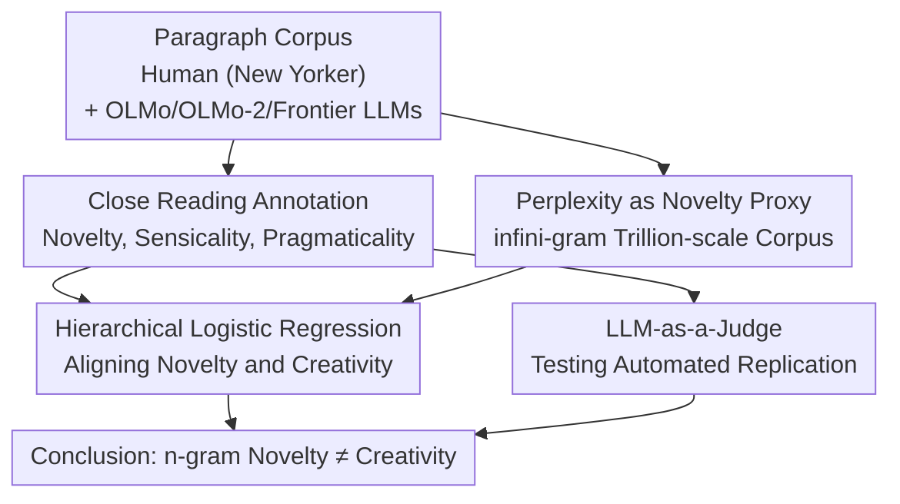

# Death of the Novel(ty): Beyond n-Gram Novelty as a Metric for Textual Creativity

**Conference**: ICLR 2026  
**arXiv**: [2509.22641](https://arxiv.org/abs/2509.22641)  
**Code**: [github.com/asaakyan/ngram-creativity](https://github.com/asaakyan/ngram-creativity)  
**Area**: AIGC Detection  
**Keywords**: textual creativity, n-gram novelty, LLM evaluation, close reading, pragmaticality

## TL;DR

Through close reading annotations of 8,618 expressions by 26 professional writers, this study reveals that n-gram novelty is insufficient to measure textual creativity—approximately 91% of expressions with high n-gram novelty are not considered creative, and a negative correlation exists between high n-gram novelty and low pragmaticality in open-source LLMs.

## Background & Motivation

**n-gram novelty is widely used for creativity evaluation**: Recent tools such as infini-gram have made it possible to calculate n-gram novelty on trillion-token scale corpora. Metrics like the Creativity Index rely heavily on n-gram novelty to measure textual creativity.

**The standard definition of creativity in psychology requires dual attributes**: Creativity = novelty + appropriateness. n-gram novelty alone is insufficient to capture the complete definition of creativity.

**Two sub-dimensions of appropriateness**: The paper decomposes "appropriateness" into "sensicality" (whether the expression itself is semantically fluent) and "pragmaticality" (whether the expression is reasonable and natural within its context).

**The popularity of LLM writing assistance brings creativity concerns**: Research indicates that LLM-assisted writing may lead to a decline in collective creativity, homogenization, and the proliferation of "AI slop."

**Limitations of existing evaluation methods**: Automated n-gram metrics are too coarse, and expert human evaluation is difficult to scale. It remains unclear whether LLM-as-a-Judge can replace expert judgment.

**Core Problem**: What is the actual relationship between n-gram novelty and creativity as judged by human experts? Can LLMs replicate the close reading creativity judgments of experts?

## Method

### Overall Architecture

This paper does not propose a new model but instead builds an empirical pipeline to answer a question often taken for granted: "Does n-gram novelty actually equal creativity?" The pipeline starts with paragraphs written by humans and LLMs. First, professional writers perform **close reading annotation** for each expression, decomposing the psychological definition of "novelty + appropriateness" into three annotatable dimensions to produce "ground truth." Simultaneously, infini-gram is used to calculate the perplexity of each expression on a trillion-token corpus as an **n-gram novelty proxy**. These two signals are aligned using **hierarchical logistic regression** to quantify the extent to which novelty predicts human-judged creativity. Finally, an **LLM-as-a-Judge** path is established to test whether automated models can replicate the fine-grained judgments of experts and potentially replace expensive expert annotation.

### Key Designs

**1. Close Reading Annotation: Decomposing creativity into three independently annotatable dimensions**

Creativity is defined in psychology as "novelty + appropriateness," but "appropriateness" has not been previously operationalized, with automated metrics focusing only on the novelty half. The paper decomposes each expression into three independently annotatable judgments: sensicality (semantic fluency), pragmaticality (naturalness within context), and perceived novelty. "Creativity" is defined as satisfying all three. The corpus includes 50 human paragraphs (~400 words each) from the New Yorker, 25 paragraphs each from OLMo (7B) and OLMo-2 (32B) (generated using summaries of human texts as prompts), and 5 explorative paragraphs each from GPT-5 and Claude 4.1. Twenty-six professional writers from top MFA programs annotated the text in batches of 10, with 3 annotators per paragraph, highlighting expressions they deemed creative. This fine-grained expert annotation serves as the ground truth, achieving high inter-annotator agreement for novelty ($\kappa_{free}=0.78$) and pragmaticality ($\kappa_{free}=0.72$).

**2. Using Perplexity as an n-gram Novelty Proxy**

To quantify "how new an n-gram is," the paper utilizes the the $\infty$-probability from infini-gram to calculate the perplexity of each expression on a trillion-scale corpus. Higher perplexity indicates that the word combination is rarer in the training corpus, thus representing higher n-gram novelty. The reference corpora are the respective training sets of OLMo and OLMo-2 (2.6T / 4.2T tokens), ensuring that "novelty" is defined relative to the text the model has seen. This transforms abstract n-gram novelty into a continuous variable that can be directly compared with human annotations via regression.

**3. Hierarchical Logistic Regression to Align Dual Signals**

With "creativity annotations" and "perplexity" signals, simple regression would be problematic due to high correlation within the same annotator or same paragraph topic. The paper instead employs a Generalized Linear Mixed Model (GLMM), using random intercepts to absorb variance across annotators and paragraph topics. The target variable is binary "creative or not," and predictors include log-standardized perplexity, generation source (human / OLMo / OLMo-2), and their interaction term. The interaction term is specifically used to test if the effect of perplexity on creativity varies by source. The key conclusion—that novelty and pragmaticality are negatively correlated in open-source LLMs but not in humans—is derived from this interaction term.

**4. LLM-as-a-Judge: Testing Whether Automation Can Replace Expensive Expert Annotation**

Expert close reading is accurate but expensive and difficult to scale. The paper tests whether LLMs can serve as a substitute. The task is defined as "extracting perceived novel or non-pragmatic expressions from a given paragraph," evaluated using F1 scores with a matching threshold of normalized indel similarity $\geq 90\%$. Evaluated models include zero-shot/few-shot frontier models (GPT-5, Claude 4.1/4.5, Gemini 2.5 Pro/3 Pro) and fine-tuned models (OLMo2 7B, Qwen3 8B, Llama-3.1 8B). Distributional validation is also performed using Style Mimic and LMArena datasets to see if the LLM-J novelty scores align with expert and crowdsourced preferences better than the n-gram-only Creativity Index.

## Key Experimental Results

### Main Results

| Metric | Value |
|------|------|
| Total Annotated Expressions | 8,618 (2,783 unique) |
| Perceived Novel Expressions | 589 unique |
| Non-pragmatical Expressions | 722 unique |
| Creative Highlights | 241 new expressions |
| Inter-annotator Agreement $\kappa_{free}$ (Novelty) | 0.78 (sd=0.11) |
| Inter-annotator Agreement $\kappa_{free}$ (Pragmaticality) | 0.72 (sd=0.12) |

**Key Finding**: n-gram perplexity is significantly positively correlated with creativity (OR ≈ 1.96/SD, $p < 0.001$), but approximately 91% of expressions in the highest n-gram novelty quartile ($n=3928$) were not judged as creative; approximately 25% of creative expressions had below-average perplexity.

### Ablation Study

**Creativity Comparison by Generation Source (EMM contrasts vs Human)**:

| Model | Odds Ratio | 95% CI | p-value |
|------|-----------|--------|------|
| Claude 4.1 | 0.521 | [0.289, 0.939] | 0.024 |
| GPT-5 | 0.511 | [0.279, 0.938] | 0.024 |
| OLMo | 0.500 | [0.370, 0.676] | <0.001 |
| OLMo-2 | 0.588 | [0.439, 0.788] | <0.001 |

The probability of an expression being judged as creative was significantly lower for all LLMs compared to humans.

**LLM-as-a-Judge Performance**:
- Novel expression identification F1: Reasoning models ≈ 41.3 (few-shot GPT-5), Random baseline 9.6
- Non-pragmatic expression identification F1: Reasoning models ≈ 13.5, Random baseline 2.3
- Detecting non-pragmatic expressions is significantly harder than detecting novel ones.

### Key Findings

1.  **Negative correlation between n-gram novelty and pragmaticality in open-source LLMs**: OLMo $\beta=-0.17$ ($p=0.027$), OLMo-2 $\beta=-0.48$ ($p<0.001$); no such effect in human writing ($\beta=0.01$, $p=0.92$).
2.  **AI detector scores do not predict creativity**: Likelihood scores from the Pangram AI detector showed no significant correlation with expression creativity or pragmaticality.
3.  **Writing quality reward models predict creativity**: Reward model scores are significantly positively correlated with both creativity (OR=1.30, $p<0.001$) and pragmaticality (OR≈1.33, $p<0.001$).
4.  **LLM-J novelty scores outperform Creativity Index**: On Style Mimic data, LLM-J novelty ($\beta=0.63$, $p=0.014$) predicted expert preferences better than the Creativity Index ($\beta=0.51$, $p=0.038$).

## Highlights & Insights

-   **Operationalizing the psychological definition of creativity**: Decomposing creativity into sensicality + pragmaticality + perceived novelty provides three annotatable dimensions, laying a foundation for automated evaluation.
-   **Counter-intuitive findings challenge the "authority" of n-gram novelty**: The fact that 91% of high n-gram novelty expressions are not considered creative serves as a critical warning for all subsequent work relying on n-gram metrics.
-   **The "Novelty-Pragmaticality" tradeoff in LLM writing**: As LLMs attempt to generate more novel text, they are more likely to produce expressions that are inappropriate for the context, a tradeoff that does not exist in human writing.
-   **Value of the close reading annotation paradigm**: Provides a fine-grained, expression-level annotated dataset for research into textual creativity.

## Limitations & Future Work

-   Exploratory research on frontier closed-source models (GPT-5/Claude 4.1) was conducted at a small scale (only 5 paragraphs each), leading to insufficient statistical power.
-   The study focuses exclusively on the fiction domain; applicability to other genres (poetry, technical writing, journalism) remains unknown.
-   Perplexity as an n-gram novelty proxy may introduce measurement noise, particularly for closed-source models where training data is inaccessible.
-   LLM-as-a-Judge performs poorly in detecting non-pragmatic expressions (F1 < 20), leaving significant room for improvement in automated evaluation.
-   Annotators were all MFA writers with English backgrounds; cross-linguistic and cross-cultural generalizability has not been verified.

## Related Work & Insights

-   **Lu et al. (2025) Creativity Index**: This paper directly challenges its core assumption, noting that n-gram novelty cannot be equated with creativity.
-   **Chakrabarty et al. (2025) AI-Slop Research**: Complementary relationship—this paper analyzes writing quality from both positive (creativity) and negative (non-pragmaticality) perspectives.
-   **McCoy et al. (2023)**: Found that GPT-2 coherence drops at high n-gram novelty, aligning with findings in this paper regarding open-source LLMs.
-   **Insight**: The three-dimensional framework (sensicality + pragmaticality + novelty) can be applied to AIGC detection—not only to detect "if it is AI-generated" but also to evaluate "which dimension of generation quality is problematic."

## Rating

-   ⭐ Novelty: 4.5/5 — Operationalizes the psychological definition of creativity and performs large-scale empirical validation with a unique perspective.
-   ⭐ Experimental Thoroughness: 4/5 — Rigorous main experimental design and substantial annotation scale, though the scale for frontier models is small.
-   ⭐ Writing Quality: 4.5/5 — Clear structure, rigorous statistical modeling, and professional presentation.
-   ⭐ Value: 4/5 — Directly impacts the fields of creativity evaluation and AI writing quality assessment.

<!-- RELATED:START -->

## Related Papers

- [\[ICLR 2026\] Beyond Raw Detection Scores: Markov-Informed Calibration for Boosting Machine-Generated Text Detection](beyond_raw_detection_scores_markov-informed_calibration_for_boosting_machine-gen.md)
- [\[NeurIPS 2025\] CLAWS: Creativity Detection for LLM-Generated Solutions Using Attention Window of Sections](../../NeurIPS2025/aigc_detection/clawscreativity_detection_for_llm-generated_solutions_using_attention_window_of_.md)
- [\[ACL 2026\] Beyond the Final Actor: Modeling the Dual Roles of Creator and Editor for Fine-Grained LLM-Generated Text Detection](../../ACL2026/aigc_detection/beyond_the_final_actor_modeling_the_dual_roles_of_creator_and_editor_for_fine-gr.md)
- [\[ICLR 2026\] PoliCon: Evaluating LLMs on Achieving Diverse Political Consensus Objectives](policon_evaluating_llms_on_achieving_diverse_political_consensus_objectives.md)
- [\[ICLR 2026\] Spherical Watermark: Encryption-Free, Lossless Watermarking for Diffusion Models](spherical_watermark_encryption-free_lossless_watermarking_for_diffusion_models.md)

<!-- RELATED:END -->
