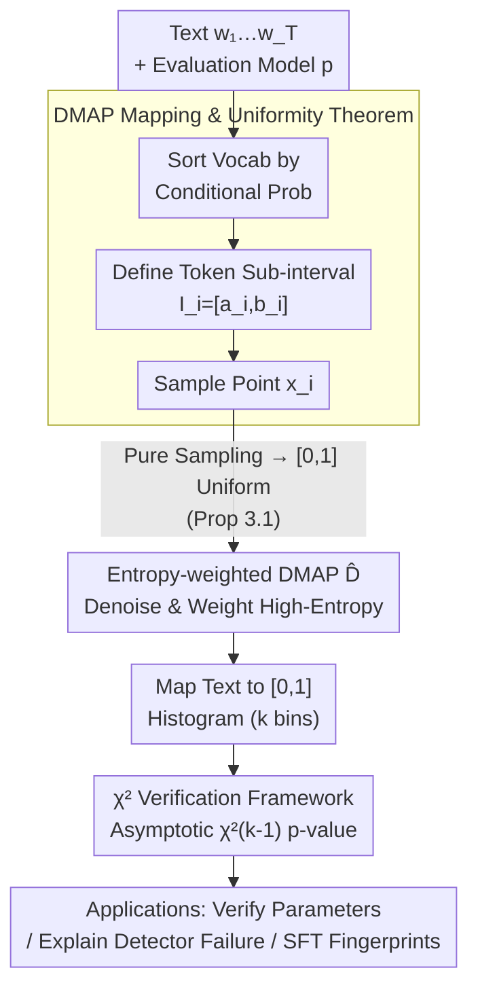

# DMAP: A Distribution Map for Text

**Conference**: ICLR 2026  
**arXiv**: [2602.11871](https://arxiv.org/abs/2602.11871)  
**Code**: [https://github.com/Featurespace/dmap](https://github.com/Featurespace/dmap)  
**Area**: AIGC Detection  
**Keywords**: Text Distribution Map, Machine Text Detection, Statistical Testing, Token Probabilities, Language Model Analysis

## TL;DR

Ours proposes DMAP (Distribution Map), a mathematical framework that maps text to $i.i.d.$ samples in the range $[0,1]$ via next-token probability ranking of language models. It theoretically proves that pure sampling produces a uniform distribution, enabling the use of $\chi^2$ tests to verify generation parameters, uncovering the root cause of why "probability curvature" detectors fail under pure sampling, and visualizing statistical fingerprints left by post-training (SFT/RLHF) in downstream models.

## Background & Motivation

**Background**: Next-token probability distributions of language models contain significant text statistics. Existing methods primarily analyze text features or detect machine-generated text using scalar metrics like perplexity, log-likelihood, and log-rank. DetectGPT pioneered the "probability curvature" concept—judging machine generation by perturbing text and comparing likelihood changes. FastDetectGPT improved efficiency with conditional probability normalization, and Binoculars performed zero-shot detection using probability ratios between two models.

**Limitations of Prior Work**: All curvature-based methods implicitly assume that machine-generated text is systematically biased toward the head of the distribution (selecting high-probability tokens), making "probability curvature" opposite to human text. However, this assumption only holds when using truncated sampling strategies like top-k, top-p, or low temperature. When generators use pure sampling (temperature=1.0, no truncation), this assumption fails entirely: FastDetectGPT's AUROC plunges from 0.702 to 0.200, and Binoculars drops from 0.825 to 0.325, performing worse than random guessing. Worse, the authors identify a systematic data error in existing literature—HuggingFace once defaulted to top-k=50, leading several top-tier papers (DetectGPT, FastDetectGPT, Binoculars) to use top-k=50 in experiments claimed to be pure sampling.

**Key Challenge**: Existing metrics (perplexity, log-rank, etc.) suffer from "contextualization" issues—whether a token's log-likelihood is "abnormally high" depends on the shape of the conditional distribution at that position (i.e., how many reasonable candidates exist). Metrics like perplexity ignore this context. Different genres (poetry vs. news vs. technical writing) systematically affect distribution shapes, making the same probability value mean different things across contexts.

**Goal**: (1) Establish a text statistical representation framework that encodes both rank and probability information with strict mathematical guarantees; (2) Uncover the root cause of existing detection method failures; (3) Provide efficient tools for data integrity verification and post-training analysis.

**Key Insight**: Each token is mapped to a sub-interval in $[0,1]$ based on its rank in the conditional probability distribution—high-probability tokens correspond to the left (near 0), low-probability tokens to the right (near 1), and the interval length equals the token's conditional probability. This mapping is essentially a dynamic rank-based extension of the Probability Integral Transform (PIT) for discrete distributions.

**Core Idea**: DMAP maps text to a distribution on $[0,1]$; pure sampling corresponds to an exact uniform distribution, while any deviation from uniformity serves as a quantifiable signal of generation strategies or text properties.

## Method

### Overall Architecture

DMAP aims to solve the loss of contextual information in scalar metrics by mapping each token to a point in $[0,1]$ so that rank and probability are visible simultaneously. For a text $w_1 \cdots w_T$ and an evaluation model $p$, the pipeline runs position-wise: first, the vocabulary is sorted in descending order by $p(\cdot|w_1 \cdots w_{i-1})$; then, a sub-interval $I_i = [a_i, b_i] \subset [0,1]$ is defined for the actual token $w_i$; finally, a point $x_i$ is selected from $I_i$ (using uniform sampling for the base version or entropy-weighted density for denoising). The resulting $x_1 \cdots x_T$ are placed into $k$ equal-width bins for a histogram—the "distribution fingerprint." This fingerprint enables three applications: $\chi^2$ verification of generation parameters, failure analysis of detectors, and visualization of post-training (SFT/RLHF) traces.

### Key Designs

**1. DMAP Mapping & Uniformity Theorem: Mapping Tokens to $[0,1]$**

This step encodes both "where the token ranks" and "how large its probability is." For position $i$, the set of tokens more probable than $w_i$ is $V_i^+ = \{v \in V : p(v|w_1 \cdots w_{i-1}) > p(w_i|w_1 \cdots w_{i-1})\}$. The left endpoint is $a_i = \sum_{v \in V_i^+} p(v|w_1 \cdots w_{i-1})$, and the right endpoint is $b_i = a_i + p(w_i|w_1 \cdots w_{i-1})$. The location (left endpoint) reflects rank, and length reflects probability. Let $x_i \sim U(a_i, b_i)$. Proposition 3.1 states: when text is generated by model $p$ via pure sampling, $x_1 \cdots x_T$ are $i.i.d.$ uniform on $[0,1]$. For any sub-interval $(c,d)$ within a token $v$'s interval $[a,b)$:

$$\mathbb{P}(x_i \in (c,d)) = p(v|\text{context}) \cdot \frac{d-c}{b-a} = (b-a) \cdot \frac{d-c}{b-a} = d-c$$

This equals the sub-interval length, defining a uniform distribution. This theorem holds for any decoding strategy as long as generation and evaluation share the same distribution. It provides an exact null hypothesis.

**2. Entropy-weighted DMAP ($\hat{D}$): Noise Removal**

Using $x_i \sim U(a_i, b_i)$ introduces randomness. High-probability tokens like "the" contribute little to differentiation. Ours replaces random sampling with a deterministic weighted density function:

$$\hat{D}(\underline{w}) = \frac{\sum_i h_i' \cdot \chi_{I_i}/|I_i|}{\sum_i h_i'}$$

where $h_i$ is the distribution entropy at $i$, and $h_i' = \min(h_i, \lambda)$ is a clipped weight ($\lambda=2$). Using $\chi_{I_i}/|I_i|$ removes sampling noise, while entropy weights shift signal focus to high-entropy positions where the model is most "uncertain."

**3. $\chi^2$ Quantitative Verification Framework**

To move beyond qualitative visual analysis, the uniformity theorem is transformed into a calculation of p-values. $[0,1]$ is divided into $k$ equal bins (using $k = (2T)^{1/3}$ per the Terrell-Scott rule). Bin frequencies $f_i$ are used to construct the statistic:

$$\chi^2 = Tk \sum_{i=1}^{k}(f_i - 1/k)^2$$

Given the $i.i.d.$ uniformity from Proposition 3.1, this statistic asymptotically follows a $\chi^2_{k-1}$ distribution. This allows testing if text was truly generated by a specific strategy; $T \geq 10k$ is recommended for reliable p-values. Using this, the authors identified hidden data errors (top-k=50) in several top-tier papers with high confidence.

## Key Experimental Results

### Main Results: Failure of Curvature Detectors under Pure Sampling

| Method | Generation Model | XSum (k=50) | XSum (Pure) | SQuAD (k=50) | SQuAD (Pure) | Writing (k=50) | Writing (Pure) |
|------|---------|-------------|-------------|-------------|--------------|---------------|----------------|
| FastDetectGPT | Llama-3.1-8B | 0.702 | **0.200** | 0.739 | **0.208** | 0.915 | **0.289** |
| FastDetectGPT | Mistral-7B | 0.770 | 0.276 | 0.819 | 0.299 | 0.906 | 0.339 |
| FastDetectGPT | Qwen3-8B | 0.765 | 0.289 | 0.612 | 0.320 | 0.923 | 0.377 |
| DetectGPT | Llama-3.1-8B | 0.606 | 0.408 | 0.527 | 0.299 | 0.723 | 0.422 |
| DetectGPT | Mistral-7B | 0.679 | 0.486 | 0.586 | 0.365 | 0.688 | 0.457 |
| Binoculars | Llama-3.1-8B | 0.825 | **0.325** | 0.849 | **0.365** | 0.942 | **0.410** |
| Binoculars | Mistral-7B | 0.823 | 0.350 | 0.851 | 0.416 | 0.931 | 0.404 |
| Binoculars | Qwen3-8B | 0.857 | 0.416 | 0.752 | 0.467 | 0.949 | 0.492 |

### Ablation Study: Post-training Fingerprints (Pythia 1B)

| SFT Data | DMAP Distribution Features | Explanation |
|---------|-------------|------|
| Base model (Pythia) | Right-biased (Tail-biased) | Disparity between base model and small eval model |
| OASST2 Human Data | Slight right-bias + Tail-collapse | Distinctive sharp decay at the DMAP tail for human writing |
| OASST2 + Llama T=1.0 | Near base model, slight right-bias | Pure sampling statistics transfer to downstream model |
| OASST2 + Llama T=0.7 | **Left-biased (Head-biased)** | Temperature-based head preference transfers to SFT model |

### Key Findings

- **Curvature assumption reversal**: All three detectors show AUROC < 0.5 under pure sampling, meaning their discrimination direction is inverted. Cross-model evaluation of pure sampling text is tail-biased, similar to but more extreme than human text.
- **Widespread impact of HuggingFace default error**: DMAP's $\chi^2$ test detects the top-k=50 error with $p < 10^{-10}$ using only 10,000 tokens.
- **Robustness to paraphrase attacks**: Machine text paraphrased by DIPPER remains distinguishable from human text on DMAP; paraphrasing only slightly flattens the distribution.
- **Statistical fingerprint transfer**: Models fine-tuned on $T=0.7$ data become head-biased, while those tuned on human or pure-sampling data remain tail-biased.
- **Tail density spike in instruct models**: High density in the last bin may reflect slight overfitting; DMAP can guide SFT early stopping.
- **Rapid convergence**: Clear features appear at 2,000 tokens, with noise significantly reduced at 20,000 tokens.

## Highlights & Insights

- **Mathematical elegance combined with utility**: Proposition 3.1 provides an exact null hypothesis (uniformity), giving all subsequent analyses a rigorous statistical foundation.
- **Expansion of PIT**: Unlike classic PIT, which requires naturally ordered categorical variables, DMAP handles tokens by dynamically re-ranking them by model probability.
- **Meta-research value**: DMAP acts as a data auditor, uncovering systematic errors in top-tier papers due to default library settings.
- **Low compute requirements**: DMAP analysis can be performed with small models like OPT-125m on consumer hardware in minutes.

## Limitations & Future Work

- **Analysis tool vs. Detector**: DMAP does not directly output a binary classification; a separate decision maker must be built on top of DMAP features.
- **Model evaluation assumption**: Requires a specified evaluation model; cross-model evaluation naturally introduces tail-bias that may mask other signals.
- **Short text constraints**: $\chi^2$ testing requires $T \geq 10k$. Statistical power is limited for short texts like tweets.
- **Entropy threshold selection**: The clipping threshold $\lambda=2$ was fixed without exhaustive ablation across different domains.
- **Lack of comparison with modern self-supervised methods**: Comparison was limited to DetectGPT/Binoculars and did not include watermark-based or newer training-based detectors.

## Related Work & Insights

- **vs. DetectGPT/FastDetectGPT**: DMAP explains exactly why these fail under pure sampling (reversed bias direction).
- **vs. Binoculars**: While Binoculars uses probability ratios, its theoretical justification is less clear compared to the uniformity theorem of DMAP.
- **vs. GLTR**: GLTR colors tokens by rank (top-10/100/1000). DMAP is a continuous version that retains full probability and ranking information.

## Rating

- Novelty: ⭐⭐⭐⭐⭐
- Experimental Thoroughness: ⭐⭐⭐⭐
- Writing Quality: ⭐⭐⭐⭐⭐
- Value: ⭐⭐⭐⭐⭐

<!-- RELATED:START -->

## Related Papers

- [\[ICLR 2026\] HLD: Approximate Hierarchical Linguistic Distribution Modeling for LLM-Generated Text Detection](hld_approximate_hierarchical_linguistic_distribution_modeling_for_llm-generated_.md)
- [\[ICLR 2026\] Learn-to-Distance: Distance Learning for Detecting LLM-Generated Text](learn-to-distance_distance_learning_for_detecting_llm-generated_text.md)
- [\[ICLR 2026\] TSM-Bench: Detecting LLM-Generated Text in Real-World Wikipedia Editing Practices](tsm-bench_detecting_llm-generated_text_in_real-world_wikipedia_editing_practices.md)
- [\[ICLR 2026\] EditLens: Quantifying the Extent of AI Editing in Text](editlens_quantifying_the_extent_of_ai_editing_in_text.md)
- [\[ICLR 2026\] D&R: Recovery-based AI-Generated Text Detection via a Single Black-box LLM Call](dr_recovery-based_ai-generated_text_detection_via_a_single_black-box_llm_call.md)

<!-- RELATED:END -->
