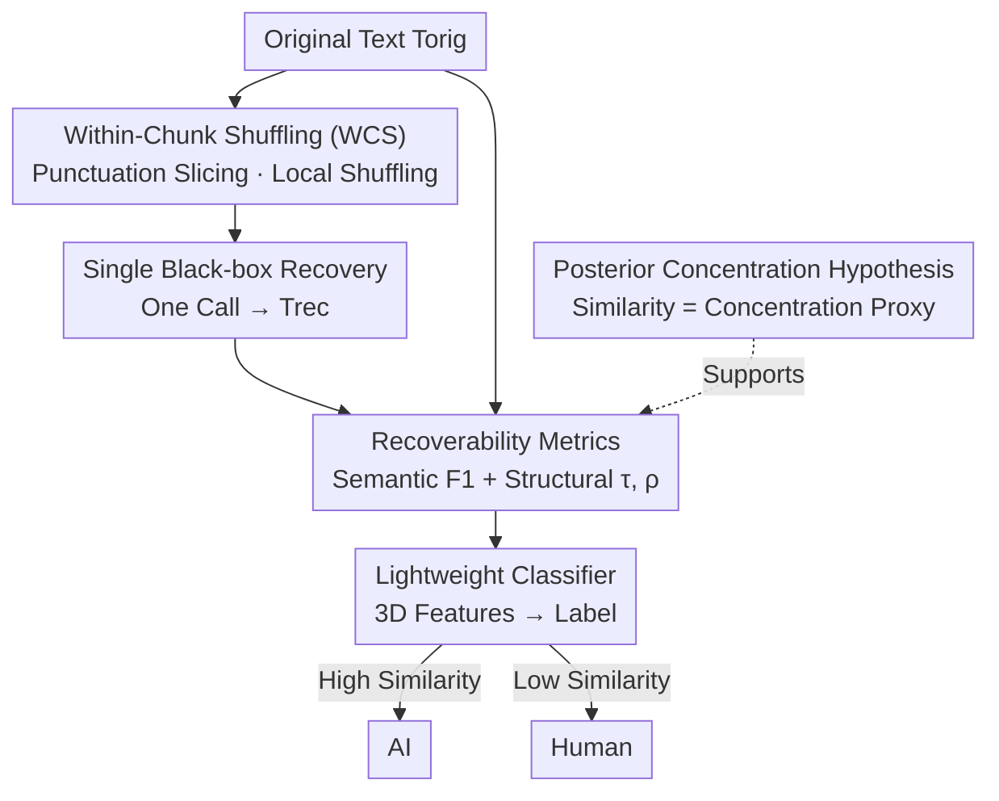

# D&R: Recovery-based AI-Generated Text Detection via a Single Black-box LLM Call

**Conference**: ICLR2026  
**OpenReview**: [https://openreview.net/forum?id=FiMZSxo4DO](https://openreview.net/forum?id=FiMZSxo4DO)  
**Code**: https://github.com/Yuxia-Sun/D-R  
**Area**: AIGC Detection / AI-Generated Text Detection / Black-box Detection  
**Keywords**: AI Text Detection, Black-box Detection, Posterior Concentration, Recovery Similarity, Single Call

## TL;DR
D&R randomly shuffles the text to be tested within local chunks separated by punctuation (Within-Chunk Shuffling) and calls a black-box LLM only **once** to recover it. It then measures the semantic and structural similarity between the recovered text and the original. AI-generated text is more likely to be "recovered" almost identically, while human-written text remains more dispersed. Feeding this similarity gap into a lightweight classifier enables detection, achieving an AUROC of 0.96 for long texts and 0.87 for short texts, without requiring probability access and using only a single call.

## Background & Motivation

**Background**: Currently, AI-generated text detection follows several main paradigms. Likelihood/entropy-based methods (Likelihood, Gehrmann's GLTR) directly observe the probability assigned to each token by the model. Perturbation-based methods (DetectGPT, Fast-DetectGPT) compare log-likelihood curvature after adding noise to the text. Continuation-based methods (DNA-GPT) truncate text and compare the model's completion. Rewriting-based methods (RAIDAR) have the model rewrite the text multiple times and measure consistency via editing distance. Other types include supervised classifiers (RoBERTa, OpenAI Text Classifier) and watermarking.

**Limitations of Prior Work**: None of these methods simultaneously satisfy the four requirements of real-world scenarios. Likelihood/entropy methods **require white-box probability access**, which is unavailable in black-box scenarios via APIs. While perturbation, continuation, and rewriting methods circumvent probabilities, they require **multiple model calls** (running $k>1$ times per text), leading to high costs and instability, especially with significant variance on **short texts**. Supervised classifiers **generalize poorly**, failing on unseen generative models and requiring constant re-labeling and re-training. Watermarking **depends on the cooperation of model providers**, making post-hoc detection impossible.

**Key Challenge**: To be "accurate," detectors often sacrifice one of the following: "black-box availability, efficiency, generalization, or robustness." The precision gained from multiple calls comes at the cost of efficiency and short-text stability; white-box precision comes at the cost of deployability. Structural trade-offs exist between these four goals.

**Goal**: Develop a detection framework that **simultaneously** satisfies high precision, single-call efficiency, pure black-box access, cross-source model generalization, and robustness to source-recovery model mismatch.

**Key Insight**: The authors leverage a critical observation—**posterior concentration**. If text is disrupted in a way that "preserves semantics and aligns with the pre-training inductive bias of LLMs," the "recovery" results of AI-generated text will be **highly concentrated** around the original. In contrast, human text recovery remains **more dispersed** due to the higher diversity of the human writing process. This difference in concentration serves as a discriminative signal.

**Core Idea**: Replace "probability/multiple rewritings" with "disruption-recovery" recoverability. Perform Within-Chunk Shuffling (a disruption operation requiring no model calls) and let the LLM recover it **once**. Measure the recovery similarity as an observable proxy for posterior concentration: high similarity indicates AI, low similarity indicates human.

## Method

### Overall Architecture

The D&R (Disrupt-and-Recover) pipeline is concise: it takes an original text $T_{orig}$ and a black-box LLM $M$ as input, and outputs a binary label (AI/Human). The four steps are: (1) Use Within-Chunk Shuffling to randomly shuffle tokens within each chunk separated by punctuation, yielding $T_{shuf}$; (2) Perform a **single call** to $M$ to recover $T_{shuf}$ into $T_{rec}$; (3) Calculate three "recoverability metrics" between $T_{rec}$ and $T_{orig}$: semantic similarity (BERTScore F1) and structural similarity (Kendall’s $\tau$, Spearman’s $\rho$); (4) Feed these three metrics into a lightweight binary classifier for the final label. The framework is theoretically supported by the "posterior concentration hypothesis" and two theorems proving that recovery similarity is a faithful proxy.

### Key Designs

**1. Within-Chunk Shuffling (WCS): Using a disruption that "aligns with pre-training bias" to lock recovery into a restricted candidate space**

The mode of disruption determines the nature of the recovery task, which is the core design of D&R. Instead of global shuffling or shuffling chunk order, the authors slice $T_{orig}$ into chunks by punctuation, **keep the chunk order fixed**, and only randomly permute tokens within each chunk. The intuition is: if the disruption is too severe (global shuffle), both AI and human texts are hard to recover, smoothing out the concentration difference; if too light, the discriminability is insufficient. WCS constrains the recovery problem to a **local permutation candidate space** rather than unconstrained generation, aligning perfectly with the LLM pre-training objective of "predicting local token order." Consequently, for an LLM, recovering WCS text is as easy as "recalling the original word order," resulting in output very close to the original. Crucially, this **requires no model call** and can be implemented with a simple random shuffle function at negligible cost ($T_{shuffle} \approx 0$).

**2. Single Black-box Recovery: Compressing "multiple calls" into "one call" while adhering to pre-training priors**

After generating $T_{shuf}$, D&R uses only **one** LLM call for recovery. The prompt explicitly instructs the model: "The following text has shuffled tokens within segments separated by punctuation; please restore the correct word order without adding or deleting words," producing $T_{rec}$. This step is the source of efficiency: where perturbation/continuation/rewriting baselines run $k > 1$ times (overhead $O(k \cdot T_{LLM})$), the total overhead of D&R ($T_{D\&R} = T_{shuffle} + T_{LLM} + T_{similarity}$) is dominated by this single call (shuffling and similarity calculations $\ll T_{LLM}$), reducing overall complexity to $O(T_{LLM})$. A single call suffices because "predicting local word order" is a task pre-trained models already excel at, eliminating the need for multiple samplings to stabilize the signal.

**3. Recoverability Metrics: Using dual semantic and structural similarity to turn "invisible posterior concentration" into observable signals**

Since posterior concentration is a distributional property not directly observable from a single sample, D&R estimates it indirectly using the similarity between $T_{rec}$ and $T_{orig}$ across **two complementary** dimensions. Semantic similarity is measured via BERTScore: taking context embeddings $\{x_i\}$, $\{y_j\}$ for both texts, calculating precision $P=\frac{1}{n}\sum_j \max_i \cos(x_i,y_j)$ and recall $R=\frac{1}{m}\sum_i \max_j \cos(x_i,y_j)$, and taking $F_1=\frac{2PR}{P+R}$ to measure meaning preservation. Structural similarity is measured using rank-based Kendall’s $\tau$ and Spearman’s $\rho$ to assess word order recovery. When lengths differ or tokens repeat, Longest Common Subsequence (LCS) alignment $A=\{(i_k,j_k)\}$ is used before calculating $\tau = \frac{C-D}{\frac{1}{2}\ell(\ell-1)}$ and $\rho = 1 - \frac{6\sum_k(r_k-s_k)^2}{\ell(\ell^2-1)}$. Semantics handle meaning, while structure handles order; only when both are high is the recovery considered close to the original.

**4. Posterior Concentration Hypothesis & Theoretical Proof: Providing a provable lower bound for the "similarity gap"**

D&R bases its discrimination on the hypothesis that after a "semantic-preserving, pre-training-aligned" disruption (like WCS), the recovery distribution for AI-generated text is more concentrated around the original compared to human text. The authors use two theorems to relate this to observables. The posterior is defined as $(r, \delta)$-concentrated if $\Pr(d(T_{orig}, T_{rec}) \le r) \ge 1-\delta$. Let similarity $S$ be continuous relative to distance $d$ with a modulus of continuity $\omega(\cdot)$. **Theorem 1** (Concentration ⇒ High Similarity): If the posterior is $(r, \delta)$-concentrated, then $S \ge 1-\omega(r)$ with probability at least $1-\delta$, implying $E[S] \ge (1-\delta)(1-\omega(r))$. **Theorem 2** (Non-trivial Gap): Under compatibility conditions, a strict positive gap exists between the expected similarity of AI and human text: $E[S^{AI}] \ge E[S^{Human}] + \epsilon$. The three metrics each correspond to an $\omega$ (e.g., $\omega(r)=2r$ for Kendall $\tau$), making the theory consistent with the metrics. The final 3D similarity vector $[F_1, \tau, \rho]$ is fed into a **lightweight binary classifier** trained on labeled data. This is the only supervised component, yet it learns only on three low-dimensional features, preserving zero-shot-style generalization.

## Key Experimental Results

### Main Results

Average for long texts (>800 words) across four datasets and six source models, using DeepSeek-v3 for recovery, metric: AUROC:

| Method | ML-ArXiv | CNN-DM | IMDB | ROCStories | Average |
|------|----------|--------|------|-----------|------|
| Fast-DetectGPT (Perturbation·SOTA) | 0.724 | 0.584 | 0.728 | 0.639 | 0.669 |
| DNA-GPT (Continuation) | 0.640 | 0.595 | 0.649 | 0.623 | 0.627 |
| Text Fluoroscopy | 0.827 | 0.891 | 0.892 | 0.740 | 0.837 |
| RAIDAR (Rewriting·Strong Baseline) | 0.861 | 0.847 | 0.868 | 0.932 | 0.877 |
| **D&R (Ours)** | **0.927** | **0.983** | **0.945** | **0.986** | **0.960** |

D&R achieves the highest mean with the lowest variance (0.9602±0.0351), outperforming RAIDAR by **+0.08**. Stability is key: on ML-ArXiv, when shifting from GPT-2 to the stronger Grok-3, RAIDAR drops from ~0.90 to 0.77, while D&R remains stable above 0.95.

Average for short texts (<350 words) across three datasets and six source models:

| Method | Average AUROC |
|------|-----------|
| Fast-DetectGPT | 0.656±0.113 |
| RAIDAR | 0.725±0.071 |
| **D&R (Ours)** | **0.869±0.089** |

D&R outperforms RAIDAR and Fast-DetectGPT by **+0.14** and **+0.21** respectively on short texts.

### Ablation Study

Removing a type of similarity on long text datasets with strong source models:

| Configuration | AUROC | Description |
|------|-------|------|
| Full model | 0.9614 | Semantic + Structural dual similarity |
| w/o Semantic Similarity | ↓28.1% | Removing BERTScore F1 causes the largest drop |
| w/o Structural Similarity | ↓19.8% | Removing Kendall $\tau$ / Spearman $\rho$ |

### Key Findings

- **Semantic similarity contributes most**: Its removal causes a 28.1% drop, indicating "meaning recovery" is the primary signal. Structural similarity is also vital (19.8% drop), showing the two are complementary.
- **WCS is the optimal disruption**: Compared to global or chunk-order shuffling, Within-Chunk Shuffling hits the "sweet spot" of recovery difficulty, maximizing the concentration gap between AI and human text.
- **Robust to source-recovery mismatch**: When the source model $\ne$ the transformation model, D&R degrades by only 0.1–3.3% (avg 1.9%), compared to RAIDAR’s 4.2–14.2% (avg 9.4%).
- **Recovery model is replaceable**: Switching from DeepSeek-v3 (API) to Mistral-7B (Local) only reduces the mean from 0.9614 to 0.9359 (~2.5%).

## Highlights & Insights

- **Disruption aligned with pre-training bias is the clever pivot**: WCS is not random noise; it specifically constructs a "local word order restoration" task that LLMs are pre-trained to solve. This "using a model's strength as a probe" can be transferred to other tasks.
- **Compressing calls improves performance**: Unlike methods that need multiple samplings to stabilize signals, D&R achieves SOTA with a single call because it chooses a task the model is highly certain about.
- **Theoretical consistency**: Posterior concentration is an invisible property, but the authors bind it to observable similarity via two theorems, ensuring the discriminability isn't just an empirical fluke.
- **Black-box + Generalization**: The only supervised component eats 3D features and doesn't touch model internals, avoiding the degradation issues typical of supervised classifiers when encountering new models.

## Limitations & Future Work

- **Dependence on the concentration hypothesis**: Theorem 2 relies on compatibility/continuity conditions. If a generative model makes human text highly recoverable (e.g., highly templated human writing), the concentration gap might shrink.
- **Relative weakness on short text from strong models**: For Qwen-Turbo / GPT-4.1, short-text AUROC drops to 0.73–0.85, indicating the human-AI distribution overlap remains a challenge.
- **Prompt and adversarial robustness**: The method relies on a fixed recovery prompt. The paper does not fully explore adversarial attacks where text is generated specifically to be hard to recover locally.

## Related Work & Insights

- **vs RAIDAR (Rewriting)**: Both use "transformation consistency." However, RAIDAR requires multiple calls, depends on specific rewriters, and is susceptible to prompt-level manipulation. D&R needs one call and is more robust to model mismatch (1.9% vs 9.4% degradation).
- **vs Fast-DetectGPT (Perturbation)**: Perturbation methods require probability access and multiple calls; D&R is purely black-box and single-call, leading by +0.08 on long text.
- **vs Supervised Classifiers**: Supervised models fail when the generation model changes. D&R’s classifier only learns on 3-dimensional similarity features, significantly improving cross-source generalization.

## Rating
- Novelty: ⭐⭐⭐⭐⭐ "Disruption-Single-Recovery-Similarity" is a clean and counter-intuitive framework.
- Experimental Thoroughness: ⭐⭐⭐⭐⭐ Extensive datasets, source models, and baselines with multi-angle analysis.
- Writing Quality: ⭐⭐⭐⭐ Clear logical chain from motivation to theory to experiments.
- Value: ⭐⭐⭐⭐⭐ Practical, efficient, and robust, providing significant reference for real-world detection deployment.

<!-- RELATED:START -->

## Related Papers

- [\[ICML 2026\] Black-Box Detection of LLM-Generated Text Using Generalized Jensen-Shannon Divergence](../../ICML2026/aigc_detection/black-box_detection_of_llm-generated_text_using_generalized_jensen-shannon_diver.md)
- [\[ACL 2026\] MASH: Evading Black-Box AI-Generated Text Detectors via Style Humanization](../../ACL2026/aigc_detection/mash_evading_black-box_ai-generated_text_detectors_via_style_humanization.md)
- [\[ICLR 2026\] Is Your Paper Being Reviewed by an LLM? Benchmarking AI Text Detection in Peer Review](is_your_paper_being_reviewed_by_an_llm_benchmarking_ai_text_detection_in_peer_re.md)
- [\[ICLR 2026\] EditLens: Quantifying the Extent of AI Editing in Text](editlens_quantifying_the_extent_of_ai_editing_in_text.md)
- [\[ICLR 2026\] Beyond Raw Detection Scores: Markov-Informed Calibration for Boosting Machine-Generated Text Detection](beyond_raw_detection_scores_markov-informed_calibration_for_boosting_machine-gen.md)

<!-- RELATED:END -->
