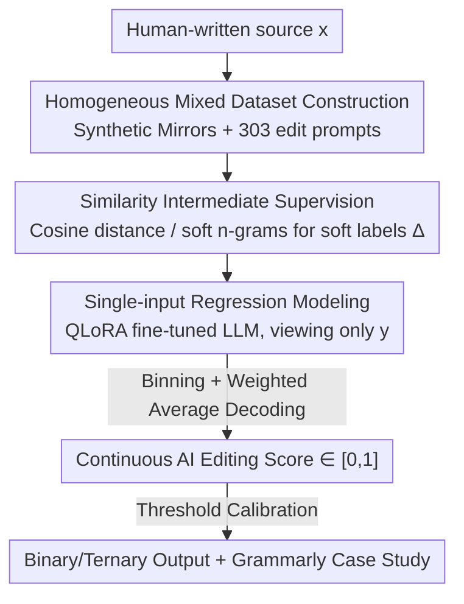

# EditLens: Quantifying the Extent of AI Editing in Text

**Conference**: ICLR2026  
**OpenReview**: [https://openreview.net/forum?id=gOkitaPCfZ](https://openreview.net/forum?id=gOkitaPCfZ)  
**Code**: https://github.com/pangramlabs/EditLens  
**Area**: AIGC Detection / AI Text Detection / Authorship Attribution  
**Keywords**: AI Editing Detection, Mixed Authorship Attribution, Similarity Supervision, Regression Detection, Content Moderation

## TL;DR
EditLens moves beyond binary "Human vs. AI" classification by using lightweight similarity metrics (cosine distance, soft n-grams) as intermediate supervision to fine-tune a regression model. It continuously predicts "how much the text was edited by AI," achieving SOTA performance in both binary (F1=95.6%) and ternary (macro-F1=90.4%) classification tasks.

## Background & Motivation
**Background**: Existing AI text detectors almost exclusively frame the task as binary classification—a text is either "entirely human-written" or "entirely AI-generated," represented by methods like FastDetectGPT, Binoculars, Pangram, and GPTZero.

**Limitations of Prior Work**: Real-world LLM usage is rarely "generation from scratch." Statistics from 1 million ChatGPT conversations by OpenAI show that approximately two-thirds of writing-related requests involve **modifying existing user text** (editing, polishing, translating, critiquing) rather than creative generation. Binary detectors perform poorly on such "human-AI collaborative" text: Saha & Feizi (2025) found that binary classifiers often misclassify lightly polished human text as "AI-generated," leading to high false-positive rates—a fatal flaw in high-stakes scenarios like academic integrity.

**Key Challenge**: The authors distinguish between two types of mixed-authorship text. In **heterogeneous mixed** text, the author of each token is clearly attributable (e.g., human writes the first paragraph, AI the second). In **homogeneous mixed** text, authorship is entangled via the editing process—a human writes a segment and an AI rewrites it. Even if the AI replaces every word with a synonym, human ideas remain diffused throughout the sentences, making it impossible to assign discrete "Human/AI" labels to specific words. Existing work (boundary detection, sentence-level classification, or ternary classification) either fails on homogeneous text or identifies "mixed" status without quantifying the **extent of change**: whether only spelling/grammar was fixed or the entire piece was restructured. Both are treated identically.

**Goal**: Directly predict the "extent of AI editing" in homogeneous mixed text, outputting a continuous score rather than discrete categories.

**Core Idea**: Use the similarity difference calculated from pairs of (original human text $x$, AI-edited text $y$) as "soft labels." Treat this as an intermediate supervision signal to train a detector that regressions the editing magnitude **looking only at $y$**.

## Method

### Overall Architecture
The core of EditLens is modeling "how much AI edited" as a continuous scalar in the $[0,1]$ range. It learns this through a two-step process: generating soft labels via similarity and distilling them into a single-input regression model.

Formally, the edited text is the result of applying an edit operator $E_\lambda$ to the original text $x$: $y = E_\lambda(x; z)$, where $z$ is an implicit sequence of micro-edits (additions, deletions, modifications, reorderings) and $\lambda$ summarizes the edit intensity. In the homogeneous setting, the identity of the actor for each step in $z$ is unobservable and unnecessary during training/inference. The authors define a **magnitude of change function** $\Delta(x,y) = g(\text{sim}(x,y))$, derived from a monotonic transformation of similarity (e.g., $g(s)=1-s$): $\Delta=0$ when identical, and $\Delta$ increases as editing intensity grows.

Crucially, during deployment, only $y$ is available. Therefore, while training uses paired data $\{(x^{(i)}, y^{(i)})\}$ to calculate the target $\Delta^{(i)}$, it learns a single-input predictor $f_\theta^{\text{ssi}}: y \mapsto [0,1]$, optimizing $\min_\theta \frac1N\sum_i \mathcal{L}(f_\theta^{\text{ssi}}(y^{(i)}), \Delta(x^{(i)}, y^{(i)}))$. The Bayes optimal solution is the conditional expectation $f^\star(y)=\mathbb{E}[\Delta(X,y)\mid Y=y]$. The model approximates this discriminatively by absorbing cues like vocabulary fluctuations, style shifts, and fluency/consistency from $y$ alone.

### Key Designs

**1. Homogeneous Mixed Dataset Construction**

Due to the lack of massive homogeneous mixed AI datasets, the authors constructed their own. They collected human-written text (collected pre-2022 to avoid contamination) across 4 domains: Amazon/Google reviews, Reddit Writing Prompts, FineWeb-EDU, and XSum/CNN/DailyMail news, with Enron emails as an Out-of-Distribution (OOD) domain. For each sample, they generated AI-edited versions using GPT-4o, Claude 3.5 Sonnet, and Gemini 1.5 Flash (Llama-3.1-70B served as an OOD model). They curated **303 edit prompts** (e.g., "fix mistakes," "rewrite," "be more descriptive") split by train/test/val to prevent overfitting. The final dataset size is 60k/6k/2.4k, costing approximately \$530.

**2. Intermediate Supervision: Learning Soft Labels via Similarity**

This is the most clever aspect: since humans cannot easily label "what percentage was changed," the authors use two similarity metrics for $\Delta(x,y)$. The first is **cosine distance** ($1-\cos$) in the Linq-Embed-Mistral embedding space. The second is **soft n-grams**, a precision-like metric: it finds phrases in $y$ of length $[a,b]$ and checks if they have a cosine similarity above threshold $\tau$ with any phrase in $x$. $\text{soft n-grams} = \frac{\text{hit phrases}}{\text{total phrases in } y}$. At $\tau=1$, this collapses to standard n-gram overlap. Soft n-grams tolerate semantic paraphrasing. Human validation with 7 annotators showed high agreement with these metrics (Krippendorff's $\alpha \approx 0.72$).

**3. Single-input Regression + Weighted Average Decoding**

The authors use **QLoRA** to fine-tune Mistral/Llama models (3B to 24B). Two modeling approaches were tested: a direct regression head (MSE loss) and an $n$-way classification model. In the latter, the $[0,1]$ range is divided into $n$ bins. During inference, they use **weighted average decoding instead of argmax** to convert class probabilities back into a continuous score. This preserves the ordinality and granularity of the intensity bins. The optimal configuration is Mistral Small (24B) with 4-way classification.

### Loss & Training
The regression version uses MSE to fit the soft labels $\Delta$; the classification version uses $n$-way cross-entropy followed by weighted average decoding. All fine-tuning utilizes QLoRA for single-GPU efficiency.

## Key Experimental Results

### Main Results
With threshold calibration, EditLens outperforms all baselines in binary settings:

| Task | Model | Acc.(%) | F1 |
|------|------|---------|-----|
| Human vs. Any AI | Pangram | 80.7 | 83.7 |
| Human vs. Any AI | **EditLens (SNG)** | **94.0** | **95.6** |
| Pure AI vs. AI Edited+Human | Pangram | 92.3 | 89.0 |
| Pure AI vs. AI Edited+Human | **EditLens (Cosine)** | **96.4** | **94.1** |

In ternary classification (Human / AI Generated / AI Edited), the advantage is stark, exceeding the best binary baseline by ~8% and the ternary baseline by ~16% (macro-F1):

| Model | Type | Acc. | Macro-F1 | AI-Edited F1 |
|------|------|------|----------|--------------|
| Pangram | Binary | 73.0 | 69.5 | 43.2 |
| GPTZero | Ternary | 74.7 | 72.7 | 50.9 |
| **EditLens Cosine** | Regression | **90.2** | **90.4** | **86.8** |

On the **AI Polish (APT-Eval)** dataset, EditLens scores correlate strongly with semantic similarity (Pearson $r=-0.606$), Levenshtein distance ($r=0.799$), and Jaccard distance ($r=0.781$), whereas Pangram's correlation with edit magnitude is only 0.491.

### Ablation Study

| Config / Control | EditLens Score | Note |
|------|---------|------|
| Pure Human-written | 0.009 | Baseline, near 0 |
| Human edited human-written (Neg. Control) | 0.012 | Nearly identical to pure human, captures "AI fingerprints" specifically |
| AI edited human-written | 0.86 | Significant increase |
| AI-edited human-written (Pos. Control, score diff) | +0.38 | Score increases after AI edit |
| Human edited AI text (BEEMO Generalization) | −0.33±0.30 | 88.9% of document scores decreased |

### Key Findings
- **Negative Control is Critical**: Human-edited human text scores only 0.012, proving EditLens learns AI-specific stylistic fingerprints rather than just "is it edited."
- **Grammarly Case Study**: On 1,768 real Grammarly samples, "Fix any mistakes" was judged the mildest edit, while "Summarize" or "Be more detailed" were most intrusive, matching stylistic intuitions.
- **Robust Generalization**: The model generalizes across unseen prompts, LLMs, domains, and even "human editing AI text" scenarios.

## Highlights & Insights
- **Converting Labeling to Similarity**: Effectively sidesteps the difficulty of manual labeling by using distance in embedding space as a proxy for "edit extent."
- **Single-input Inference**: By distilling $(x,y)$ knowledge into a $y$-only model, it overcomes the practical barrier of not having the original text at inference time.
- **Weighted Average Decoding**: preservess order and granularity better than hard argmax or naive regression.
- **Policy Significance**: Continuous scores allow for nuanced policies (e.g., allowing light polishing while banning full generation) and significantly reduce false positives.

## Limitations & Future Work
- **Reductive Dimension**: Compressing editing into a 1D scalar ignores the *nature* of the edit (e.g., tone vs. content).
- **Suboptimal Embeddings**: Uses off-the-shelf embeddings not specifically optimized for detecting AI editing styles.
- **Soft n-grams Invariant to Deletion**: Purely deleting text maintains a score of 1, meaning heavy summaries could be underestimated by this specific metric.
- **Ethical Risks**: AI detection errors carry severe consequences; the authors maintain caution regarding deployment and high-stakes decision-making.

## Related Work & Insights
- **vs. Binary Detectors**: Binary detectors suffer high false positives on polished text; EditLens quantifies extent to allow for thresholding.
- **vs. Heterogeneous Detection**: Methods for boundary detection assume clear authorship shifts; EditLens targets homogeneous mixing where authors are entangled.
- **vs. Humanizer Research**: While others study how AI paraphrasing evades detection, EditLens treats the paraphrase magnitude itself as the signal to be measured.

## Rating
- Novelty: ⭐⭐⭐⭐⭐ First to quantify AI editing as a continuous score; distinguishes homogeneous vs. heterogeneous mixing.
- Experimental Thoroughness: ⭐⭐⭐⭐⭐ Strong SOTA results, extensive control experiments, and real-world case studies.
- Writing Quality: ⭐⭐⭐⭐ Clear problem formulation and motivation.
- Value: ⭐⭐⭐⭐⭐ Directly addresses the false-positive pain point of current detectors with high practical utility.

<!-- RELATED:START -->

## Related Papers

- [\[ICLR 2026\] TSM-Bench: Detecting LLM-Generated Text in Real-World Wikipedia Editing Practices](tsm-bench_detecting_llm-generated_text_in_real-world_wikipedia_editing_practices.md)
- [\[ACL 2025\] Are We in the AI-Generated Text World Already? Quantifying and Monitoring AIGT on Social Media](../../ACL2025/aigc_detection/aigt_social_media_monitoring.md)
- [\[ICLR 2026\] D&R: Recovery-based AI-Generated Text Detection via a Single Black-box LLM Call](dr_recovery-based_ai-generated_text_detection_via_a_single_black-box_llm_call.md)
- [\[ICLR 2026\] Is Your Paper Being Reviewed by an LLM? Benchmarking AI Text Detection in Peer Review](is_your_paper_being_reviewed_by_an_llm_benchmarking_ai_text_detection_in_peer_re.md)
- [\[ICLR 2026\] All Patches Matter, More Patches Better: Enhance AI-Generated Image Detection via Panoptic Patch Learning](all_patches_matter_more_patches_better_enhance_ai-generated_image_detection_via_.md)

<!-- RELATED:END -->
