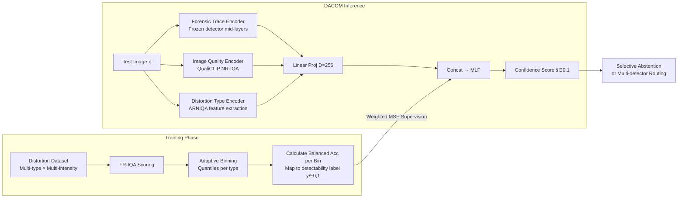

# Enabling Your Forensic Detector Know How Well It Performs on Distorted Samples

**Conference**: ICLR 2026  
**OpenReview**: [https://openreview.net/forum?id=Jz5SA2KoFt](https://openreview.net/forum?id=Jz5SA2KoFt)  
**Code**: To be confirmed  
**Area**: AIGI Detection / Image Forensics  
**Keywords**: Image Forensics, Confidence Estimation, Image Distortion, AIGI Detection, Multi-detector Routing

## TL;DR

DACOM (Distortion-Aware Confidence Model) is proposed to enable AI-generated image detectors to output sample-level reliability scores. This allows detectors to actively refuse decisions or route inputs to more reliable detectors when distortions are severe, addressing the "silent failure" problem in wild deployments.

## Background & Motivation

**Background**: AI-generated image (AIGI) detection is a core task in content security. Various detectors based on CNN frequency domain features have achieved considerable accuracy.  
**Limitations of Prior Work**: In real-world deployment scenarios, forensic traces are significantly weakened by distortions such as JPEG compression, scaling, blurring, and platform transmission. However, existing detectors still output high-confidence binary predictions and cannot perceive the reliability of their own decisions—a phenomenon known as "silent failure."  
**Key Challenge**: Full-Reference Image Quality Assessment (FR-IQA) can accurately quantify distortion severity and is highly correlated with detection accuracy, but original reference images are unavailable during testing. No-Reference IQA (NR-IQA) is deployable but designed for human perception, showing weak and unstable correlations with forensic performance. Furthermore, different distortion types exert varying impacts on accuracy even at the same FR-IQA score.  
**Goal**: Estimate the "probability that the detector can correctly predict the current distorted sample" without accessing the original image.  
**Core Idea**: Use FR-IQA as an oracle label during training to distill the statistical relationship between distortion levels and detection accuracy. During inference, integrate detector intermediate features, NR-IQA descriptors, and distortion type embeddings to achieve no-reference confidence estimation.

## Method

### Overall Architecture

DACOM is a two-stage pipeline: the training phase uses an FR-IQA oracle to generate per-sample detectability labels, and the inference phase predicts confidence scores via a three-way encoder fusion, independent of the original reference image.

### Key Designs

**1. FR-IQA Guided Adaptive Binning Annotation: Distilling oracle information during training**  
Directly using NR-IQA scores as labels introduces too much noise, whereas FR-IQA metrics (SSIM/MS-SSIM/FSIM/DISTS) show a near-monotonic relationship with detection accuracy. The authors perform type-wise adaptive binning for each distortion: FR-IQA scores of the same distortion type are partitioned into $B$ frequency-equal bins based on quantiles. The Balanced Accuracy of the detector within each bin is calculated and mapped to a detectability label $y_{t,b} = 2\cdot\max(\text{BAcc}_{t,b}-0.5,\,0)$, ensuring random guessing corresponds to 0 and perfect detection to 1. This stabilizes statistics and balances sample counts across different distortion types.

**2. Three-way Feature Fusion: Replacing the missing reference image at test time**  
Since original images are inaccessible during inference, DACOM fuses three complementary signals: (i) **Forensic Trace Encoder** $\phi_M$ extracts features from frozen intermediate layers of the target detector to perceive trace destruction; (ii) **Image Quality Encoder** $\phi_{IQ}$ (QualiCLIP) provides self-supervised no-reference quality descriptors to capture perceptual degradation; (iii) **Distortion Type Encoder** $\phi_{DT}$ (ARNIQA backbone) identifies the distortion category, as different distortions impact accuracy differently at identical FR-IQA scores. Features are projected to 256D, concatenated, and regressed via an MLP using weighted MSE loss.

**3. Confidence-Driven Selective Abstention and Multi-detector Routing: Application of confidence scores**  
Confidence scores support two downstream applications: selective abstention (rejecting samples where $\hat{s}$ is below a threshold to prioritize accuracy) and multi-detector routing (selecting the detector with the highest DACOM score as the Top-1 expert for a given image). The latter is crucial as detectors have complementary strengths across distortion types; DACOM scores act as a dynamic routing function, significantly outperforming static logit-based calibration.

## Key Experimental Results

### Main Results (Multi-detector Routing, Seen Distortion)

| Method | Average Acc (%) | Worst Acc (%) |
|------|----------------|---------------|
| Best Single Detector (C2P*) | 92.63 | 81.10 |
| Logit Calibration | 89.58 | 64.40 |
| DACOM-SSIM (Ours) | 95.13 | 90.90 |
| DACOM-DISTS (Ours) | **95.37** | **90.90** |

### Multi-detector Routing (Unseen Distortion)

| Method | Average Acc (%) | Worst Acc (%) |
|------|----------------|---------------|
| Best Single Detector (C2P*) | 91.52 | 74.90 |
| Logit Calibration | 90.31 | 77.20 |
| DACOM-SSIM (Ours) | 92.70 | 84.00 |
| DACOM-DISTS (Ours) | **92.97** | **84.00** |

### Confidence Correlation Verification

| Index | DACOM |
|------|-------|
| PLCC (Pearson) | **97.73%** |
| SRCC (Spearman) | **94.01%** |

### Key Findings

- Selective abstention yields a **7.66%** relative accuracy **Gain** (with ~20% coverage reduction).
- Multi-detector routing improves absolute accuracy by **5.84%** compared to the Logit Calibration baseline (Average Acc on Seen Distortions).
- DACOM generalizes well to 10 unseen distortion types (histogram equalization, saturation adjustment, WeChat/QQ platform compression, etc.), proving effective transfer of the distortion type encoder.
- Removing the distortion type encoder leads to the most significant drop in confidence correlation, validating distortion type as an indispensable signal.

## Highlights & Insights

- **Clear Problem Definition**: Formalizes "detector trustworthiness" as DAC (Detector's Distortion-Aware Confidence), shifting the paradigm from "detecting real/fake" to "quantifying reliability."
- **FR-IQA as Distillation Oracle**: Cleverly uses full-reference quality assessment to provide strong supervision during training, while remaining entirely reference-free during inference, bridging the gap between FR-IQA usability and NR-IQA accuracy.
- **Plug-and-play**: DACOM only requires freezing the target detector without retraining it, making it easily attachable to any existing forensic system.
- **Distortion Type Awareness**: Addresses the issue where identical quality scores but different distortion types lead to accuracy variance via a specialized distortion type encoder.

## Limitations & Future Work

- The annotation stage still requires a training set with reference images to construct oracle labels; new distortions may require re-annotation.
- Selecting confidence thresholds for abstention strategies still requires manual setting, lacking an adaptive solution.
- Currently demonstrated on AIGI detection; extension to other forensic tasks (face manipulation, deepfake video) requires additional validation.
- Multi-detector routing assumes the set of detectors is known and fixed; DACOM may need retraining if the detector pool is updated frequently.

## Related Work & Insights

- **vs Robustness Training (Wang et al., 2020; Tao et al., 2025)**: Robustness training attempts to maintain accuracy under distortion, but combinatorial explosions of distortions make it hard to cover all cases. This work is complementary as it does not modify the detector itself.
- **vs Confidence Calibration (Guo et al., 2017)**: Standard methods like Temperature Scaling assume stable input distributions. Distortions change distributions heterogeneously, violating calibration assumptions. DACOM explicitly models distortion type and intensity.
- **vs Forensicability (Chu et al., 2015)**: Previous theories analyzed intrinsic data detectability but did not link it to specific detector performance. DACOM is detector-conditioned, providing different scores for different detectors on the same image.
- **vs NR-IQA Direct Proxy (Kim et al., 2024)**: Experiments prove that NR-IQA has weak correlation with detection accuracy and cannot directly serve as a proxy for forensic confidence.

## Rating

- Novelty: ⭐⭐⭐⭐ Combines confidence estimation with distortion awareness in forensics; the FR-IQA oracle distillation is innovative.
- Experimental Thoroughness: ⭐⭐⭐⭐ Comprehensive coverage with 6 detectors × 18 distortions (including 4 social platforms) × multiple FR-IQA variants.
- Writing Quality: ⭐⭐⭐⭐ Thorough problem analysis and rigorous logic across identified findings.
- Value: ⭐⭐⭐⭐ The plug-and-play design is highly practical, with significant deployment value in multi-detector routing scenarios.

<!-- RELATED:START -->

## Related Papers

- [\[ICLR 2026\] Tell me Habibi, is it Real or Fake?](tell_me_habibi_is_it_real_or_fake.md)
- [\[ICLR 2026\] Is Your Paper Being Reviewed by an LLM? Benchmarking AI Text Detection in Peer Review](is_your_paper_being_reviewed_by_an_llm_benchmarking_ai_text_detection_in_peer_re.md)
- [\[ICML 2026\] ForensicConcept: Transferable Forensic Concepts for AIGI Detection](../../ICML2026/aigc_detection/forensicconcept_transferable_forensic_concepts_for_aigi_detection.md)
- [\[CVPR 2026\] Enabling Supervised Learning of Generative Signatures for Generalized AI-Generated Images Detection](../../CVPR2026/aigc_detection/enabling_supervised_learning_of_generative_signatures_for_generalized_ai-generat.md)
- [\[CVPR 2026\] Learning Where to Look and How to Judge: Resolution-agnostic Image Quality Assessment with Quality-aware Saliency](../../CVPR2026/aigc_detection/learning_where_to_look_and_how_to_judge_resolution-agnostic_image_quality_assess.md)

<!-- RELATED:END -->
