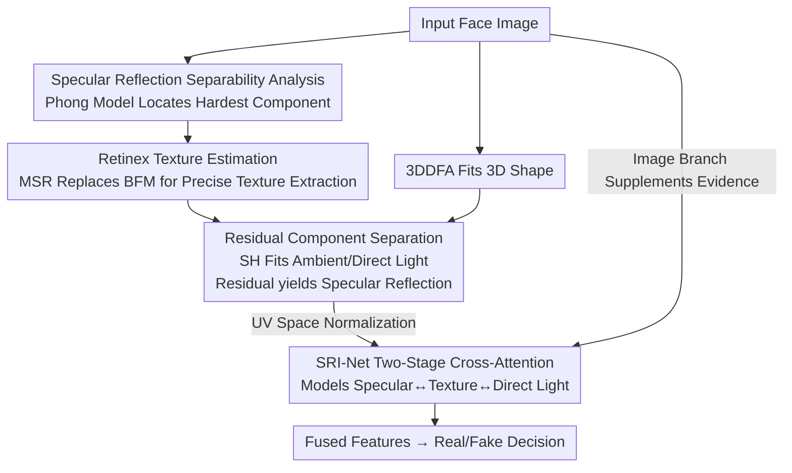

# Exploring Specular Reflection Inconsistency for Generalizable Face Forgery Detection

**Conference**: ICLR 2026  
**OpenReview**: [https://openreview.net/forum?id=KwXkLYmZvR](https://openreview.net/forum?id=KwXkLYmZvR)  
**Code**: None  
**Area**: AIGC Detection / Face Forgery Detection  
**Keywords**: deepfake detection, specular reflection, Phong illumination model, Retinex texture, cross-attention

## TL;DR
Starting from the physical principles of facial imaging, this paper notes that the "specular reflection" component in the Phong illumination model possesses the most parameters, the strongest nonlinearity, and is the hardest to replicate by forgery methods. Consequently, it employs Retinex texture estimation to accurately isolate specular reflection and uses a two-stage cross-attention network, SRI-Net, to model the inconsistencies among "specular reflection $\leftrightarrow$ texture $\leftrightarrow$ direct light." This approach achieves SOTA results on both traditional deepfakes and diffusion-generated faces.

## Background & Motivation

**Background**: Current mainstream face forgery detection follows two paths: spatial domain methods (detecting pixel-level boundary artifacts, reconstruction errors, LBP, or other local texture traces) and frequency domain methods (using DCT/Wavelets to decompose images into high and low frequencies to find forgery traces). Recently, some works have also used pre-trained features from large models like CLIP as a basis for discrimination.

**Limitations of Prior Work**: Diffusion models (SDXL, LoRA, etc.) can synthesize "entirely synthetic" faces with higher resolution and more realistic textures, making texture inconsistencies increasingly subtle and rendering spatial domain methods nearly obsolete. Forgery traces of different generation methods are distributed in different frequency bands, resulting in poor generalization for frequency domain methods. Furthermore, pre-trained features lack domain-specific knowledge for forgery tasks and are non-interpretable. As a result, existing methods collectively suffer performance degradation when facing high-quality synthetic faces.

**Key Challenge**: The reason forgery methods are increasingly difficult to catch is that they can effectively fit "easy-to-learn" attributes (3D structure, low-frequency lighting). However, a fundamental constraint of machine learning remains: **the more parameters, the stronger the nonlinearity, and the more complex the physical constraints an attribute has, the harder it is for a model to learn it accurately from limited data** (an embodiment of the bias-variance tradeoff). Existing methods focus on texture or frequency, which are precisely the parts that forgery methods have already learned well.

**Goal**: To identify a "physically most difficult to replicate, and thus most generalizable" piece of forgery evidence, accurately isolate it from facial images, and utilize it effectively.

**Key Insight**: The authors decompose facial lighting into ambient light, direct light, and specular reflection according to the Phong model. Ambient light is uniform, and direct light depends only on the angle with the normal, making both relatively simple. In contrast, specular reflection $\langle r_i, v\rangle^n \cdot \mathrm{Dir} * T_i$ involves six parameters: light direction, vertex normal, viewing direction, material shininess index, direct light intensity, and texture, while also exhibiting strong exponential nonlinearity—making it the hardest of the three to replicate accurately.

**Core Idea**: Treat "specular reflection" as the most generalizable forgery fingerprint. Beyond looking at the specular reflection itself, its physical consistency with the corresponding texture and direct light is analyzed—real faces satisfy the physical lighting equations, while forged faces often show discrepancies.

## Method

### Overall Architecture
The method addresses "how to accurately extract the hard-to-forge specular reflection and utilize its relationship with texture and direct light to determine authenticity." The pipeline is as follows: given an input face image, 3DDFA is first used for real-time 3D shape fitting, and Multi-Scale Retinex is used to estimate fine texture. Under the constraint of Retinex texture, a spherical harmonic model is used to fit ambient and direct light, and the specular reflection is isolated using a residual method. Specular reflection, texture, and direct light are then expanded into UV space to normalize directions and fed into SRI-Net with two-stage cross-attention, which hierarchically models the correlations of "texture $\leftrightarrow$ direct light" and "specular reflection $\leftrightarrow$ (texture-direct light)." Finally, an original image branch is concatenated to supplement undistorted forgery evidence, and the fused features are used for true/false binary classification.

### Key Designs

**1. Specular Reflection as a Generalizable Forgery Fingerprint: Selecting the Hardest-to-Replicate Physical Variable in the Phong Model**

This step addresses the pain point that "existing spatial/frequency traces have been smoothed out by high-quality forgeries." Instead of capturing increasingly subtle textures, the method targets a physical variable that forgery methods essentially cannot learn accurately. The authors describe face imaging as $I_{syn} = R(S, C)$ (renderer, 3D shape, color information), where 3D shape is easily replicated, and color information $C$ blends texture and lighting. Following the Phong model, the RGB for each vertex is expanded as:

$$C_i = \mathrm{Amb} * T_i + \langle n_i, l\rangle \cdot \mathrm{Dir} * T_i + \langle r_i, v\rangle^{n} \cdot \mathrm{Dir} * T_i,$$

representing ambient light, direct light, and specular reflection. The first two terms have fewer parameters and linear forms, while specular reflection involves six parameters including reflection direction $r_i = 2\langle n_i, l\rangle n_i - l$, viewpoint $v$, and shininess index $n$, presenting strong nonlinearity. Because Phong is a universal model with clear physical meaning, the conclusion that "specular reflection is hardest to replicate" does not depend on a specific forgery method and holds true for new methods like diffusion generation—thus carrying **cross-method generalizable** forgery evidence.

**2. Retinex Texture Estimation: Replacing BFM’s PCA Texture for Faster and More Accurate Extraction**

To isolate specular reflection, light and texture must first be separated. Traditional methods use 3DMM analysis-by-synthesis, where texture is represented by the BFM PCA model $T = \bar{T}_{bfm} + B\beta$, and spherical harmonic coefficients $\gamma$ and texture coefficients $\beta$ are iteratively optimized. However, the BFM PCA basis is derived from only 200 3D scanned faces, limiting its ability to reconstruct identity-level fine textures; the actual texture is $T = \bar{T}_{bfm} + B\beta + T_{id}$, where the residual $T_{id}$ is lost. Inaccurate texture estimation further pollutes lighting estimation, particularly damaging the fine-grained specular reflection.

The authors instead use Retinex theory: an image is the product of illumination and albedo $I = L \cdot R$. Taking the log transforms this into an additive relationship $\log I = \log L + \log R$. A Gaussian low-pass filter $G_\sigma$ estimates smoothly varying light, and albedo is $\log R = \log I - \log[G_\sigma(I)]$, with texture $T_{re} = \log R$. To account for both global and local lighting, Multi-Scale Retinex (MSR) is employed:

$$T_{msr} = \frac{1}{N}\sum_{i=1}^{N}\big(\log I - \log[G_{\sigma_i}(I)]\big),$$

where large scales capture light gradients and small scales recover local details. By replacing $T = \bar{T}_{bfm}+B\beta$ with $T_{msr}$, the optimization objective simplifies to optimizing only $\gamma$, improving accuracy and eliminating $\beta$ iterations—reducing separation time per image from 0.78s to 0.29s. Note: while Retinex has been used in face forensics before to enhance spatial artifacts, the novelty here is **using it as a precision tool for 3D lighting decomposition** to constrain specular reflection extraction.

**3. Residual Specular Reflection Separation: Fitting Coarse Lighting with Low-Order SH**

Once the SH coefficients are obtained under $T_{msr}$ constraint, how is specular reflection extracted? While high-order SH could fit it, it suffers from residuals like PCA and high computational cost. The authors adopt a residual approach: using only the first 9 SH basis functions $(H\gamma)_{(1-9)}$ to fit **coarse lighting** (ambient $h_1\gamma_1$ + direct $[h_2\gamma_2,\dots,h_9\gamma_9]$). These low-order bases are insensitive to fine specular reflection, effectively "leasing" it out:

$$\mathrm{SPR} = \big(I - (H\gamma)_{(1-9)} \cdot T_{msr}\big) / T_{msr}.$$

Subtracting the low-frequency "coarse light × texture" from the original image and normalizing by texture leaves the specular reflection. Visualizations show that $T_{msr}$ constraints remove identity textures more cleanly around the eyes and lips compared to $\bar{T}_{bfm}$ or $\bar{T}_{bfm}+B\beta$, resulting in more physically authentic specular reflections.

**4. SRI-Net Two-Stage Cross-Attention: Modeling Inconsistencies Between Specular Reflection, Texture, and Direct Light**

Since specular reflection intensity is determined by light direction, normals, viewpoint, shininess, direct light intensity, and texture, forgery evidence lies not just in the reflection itself but in its correlation with these attributes. In SRI-Net, specular reflection, texture, and direct light are flattened into UV space. The first stage captures "texture $\leftrightarrow$ direct light":

$$f_{td} = \mathrm{Softmax}\!\Big(\frac{f_{tex}f_{dl}^{\top}}{\sqrt{d}}\Big) f_{dl} + f_{tex} + f_{dl},$$

and the second stage allows specular reflection features $f_{spr}$ to query the processed $f'_{td}$:

$$f_{std} = \mathrm{Softmax}\!\Big(\frac{f'_{td}f_{spr}^{\top}}{\sqrt{d}}\Big) f_{spr} + f_{spr}.$$

Xception is used as the backbone. Since specular extraction might lose raw details, an original image branch is included. Cross-attention, compared to simple concatenation or SE-blocks, dynamically computes weighted interactions across the entire spatial range, making it superior for capturing subtle, non-local inconsistencies between modalities.

### Loss & Training
The training set uses the FF++ c23 (light compression) version for real-world relevance. During evaluation, traditional datasets use frame-level and video-level AUC, while generative datasets use frame-level AUC. Video-level scores are averaged from frame-level scores.

## Key Experimental Results

### Main Results

Frame-level AUC (%) on traditional deepfake datasets (trained on FF++ c23, cross-database testing):

| Method | CDF-v1 | CDF-v2 | DFD | Avg |
|------|--------|--------|-----|-----|
| ProDet (NIPS'24) | 90.9 | 84.2 | 84.8 | 86.6 |
| LSDA (CVPR'24) | 86.7 | 83.0 | 88.0 | 85.9 |
| FIA-USA (ARXIV'25) | 90.1 | 86.7 | 82.1 | 86.3 |
| **SRI-Net (Ours)** | **91.3** | **87.5** | **89.3** | **89.4** |

Frame-level AUC (%) on generative deepfake datasets:

| Dataset | Subset Mean | Prev. Best | Ours |
|--------|---------|---------|------|
| DF40 (6 swap subsets) | Avg | 87.8 (FIA-USA) | **90.9** |
| DiFF (T2I/I2I/FS/FE) | Avg | 83.3 (FIA-USA) | **86.8** |

Video-level AUC on CDF-v2 / DFD reached 95.5 / 93.1, maintaining a lead even without utilizing temporal dependencies beyond simple averaging.

### Ablation Study

| Config | CelebDF-v2 | DF40 | DiFF | Description |
|------|-----------|------|------|------|
| (1) Img Only | 72.1 | 74.2 | 66.0 | Image only |
| (2) SPR Only | 75.7 | 78.8 | 73.9 | Specular reflection only (already impressive) |
| (3) MSR Only | 68.5 | 71.0 | 60.8 | Texture only (worst) |
| (4) Img + SPR | 84.5 | 87.2 | 83.9 | Image + SPR |
| (5) Full SRI-Net | **87.5** | **90.9** | **86.8** | +MSR/Dir Cross-Attention |
| (8) $T=T_{bfm}$ | 83.3 | 85.4 | 79.9 | Mean texture constraint |
| (8) $T=T_{msr}$ | 87.5 | 90.9 | 86.8 | Retinex texture constraint |
| w/o shape norm | 82.1 | 83.7 | 81.0 | No shape normalization |
| SE-block fusion | 86.9 | 88.6 | 84.5 | Replacement for cross-attention |

### Key Findings
- **The specular reflection branch (SPR) alone outperforms the image branch** (e.g., 73.9 vs 66.0 on DiFF), proving it captures intrinsic, generalizable forgery traces. Texture (MSR) alone is the weakest, indicating its value lies not as a feature but as a **constraint tool** for specular extraction.
- **Retinex texture constraints are superior to BFM**: $T_{msr}$ improves results by approximately 4.2 / 5.5 / 6.9 percentage points across the three datasets, with the largest gains observed on generative data (DiFF).
- **Physics-driven detection offers robustness against perturbations**: AUC drops only slightly under Gaussian blur, JPEG compression, and noise (e.g., from 90.9 to 88.7 on DF40), because these perturbations primarily damage high-frequency traces, whereas SRI-Net targets deeper physical inconsistencies.
- **Cross-attention > SE-block > Concatenation**: Dynamic spatial-weighted interaction is more effective at discovering subtle, non-local inconsistencies between modalities.

## Highlights & Insights
- **Inverting machine learning constraints into detection signals**: The intuition that "complex, nonlinear physical variables are hardest to learn" is used to pin-point "specular reflection" in the Phong model. This approach is clean, method-agnostic, and naturally generalizes to future generative models.
- **Refining Retinex from an "augmentation modality" to a "3D decomposition tool"**: While previous works used Retinex for enhancement, this work uses it for texture constraints, simultaneously speeding up light/texture separation by 2.7x.
- **Upgrading from "viewing components" to "viewing relationships"**: The two-stage cross-attention explicitly models the physical consistency between specular reflection, texture, and light direction. This "relationship-level forgery evidence" can be transferred to any task involving physical generation mechanisms.

## Limitations & Future Work
- The pipeline depends on 3DDFA shape fitting and SH/Retinex decomposition; performance may be unstable under large poses, heavy occlusion, or extreme lighting conditions.
- The method specifically targets "face + lighting physics," and its validity on non-face synthetic images or high-end forgeries with physically consistent rendering is untested.
- Video-level detection relies on frame averaging and does not exploit temporal physical consistency (e.g., specular highlights moving continuously with head motion).
- Using the first 9 SH bases as "coarse light" is an engineering approximation; the trade-offs between the number of bases and specular purity require more systematic analysis.

## Related Work & Insights
- **vs. Spatial/Frequency Domain Methods (Face X-ray, F3Net, SRM, etc.)**: These capture pixel boundaries or frequency traces that vanish as quality improves or generation methods shift. This paper captures physical lighting inconsistencies, remaining stable across datasets and generation methods.
- **vs. Existing Light Detection (Lambertian assumption, corneal/nasal highlights)**: Earlier works assume Lambertian surfaces, but diffusion models generate realistic shading that weakens this assumption. This paper upgrades to the physically grounded Phong model and extracts the full specular component under 3D constraints.
- **vs. Pre-trained Feature Methods (Fada)**: Pre-trained features lack domain knowledge and interpretability; this work provides both physical interpretability and generalization.

## Rating
- Novelty: ⭐⭐⭐⭐⭐ Unique and self-consistent logic in identifying specular reflection as the weakest link in forgeries.
- Experimental Thoroughness: ⭐⭐⭐⭐ Extensive testing on traditional and generative datasets with robust ablation; lacks deep analysis on extreme poses/occlusion.
- Writing Quality: ⭐⭐⭐⭐⭐ Clear progression from physical derivation to network design, well-supported by formulas and visualizations.
- Value: ⭐⭐⭐⭐⭐ Provides a physics-driven, generalizable, and interpretable detection paradigm tailored for diffusion-generated deepfakes.

<!-- RELATED:START -->

## Related Papers

- [\[ICLR 2026\] Preserving Forgery Artifacts: AI-Generated Video Detection at Native Scale](preserving_forgery_artifacts_ai-generated_video_detection_at_native_scale.md)
- [\[CVPR 2026\] Learning Forgery-Aware Lip Representations Without Forgery Priors](../../CVPR2026/aigc_detection/learning_forgery-aware_lip_representations_without_forgery_priors.md)
- [\[CVPR 2026\] PPM-CLIP: Probabilistic Prompt Modeling for Generalizable AI-Generated Image Detection](../../CVPR2026/aigc_detection/ppm-clip_probabilistic_prompt_modeling_for_generalizable_ai-generated_image_dete.md)
- [\[CVPR 2026\] Inconsistency-aware Multimodal Schrodinger Bridge for Deepfake Localization](../../CVPR2026/aigc_detection/inconsistency-aware_multimodal_schrodinger_bridge_for_deepfake_localization.md)
- [\[ICLR 2026\] Semantic Visual Anomaly Detection and Reasoning in AI-Generated Images](semantic_visual_anomaly_detection_and_reasoning_in_ai-generated_images.md)

<!-- RELATED:END -->
