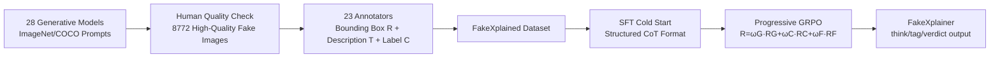

# FakeXplain: AI-Generated Image Detection via Human-Aligned Grounded Reasoning

**Conference**: ICLR 2026  
**OpenReview**: [https://openreview.net/forum?id=UcpTOa8OnG](https://openreview.net/forum?id=UcpTOa8OnG)  
**Code**: [https://github.com/Gennadiyev/FakeXplain](https://github.com/Gennadiyev/FakeXplain)  
**Area**: AIGC Detection / Multimodal Explainable Reasoning  
**Keywords**: AI-Generated Image Detection, Visual Grounded Reasoning, MLLM, GRPO, Human-Aligned Annotation, Artifact Localization  

## TL;DR
By constructing the FakeXplained dataset with human-annotated bounding boxes and descriptions and fine-tuning an MLLM using SFT + progressive GRPO, the model detects AI-generated images while providing spatially grounded, human-aligned explanations of "where and why" it is fake, achieving 98.2% detection accuracy and 36.0% IoU.

## Background & Motivation
- **Background**: AI-generated images (GAN → Diffusion → DiT) have approached photorealism, creating a surge in detection needs. Mainstream methods treat detection as binary classification using CNN/ViT to extract discriminative features.
- **Limitations of Prior Work**: Traditional classifiers are black boxes that only provide "real/fake" labels without justification and generalize poorly to out-of-distribution (OoD) generators. While MLLMs possess reasoning capabilities, they are prone to **hallucinations**—providing vague reasons without spatial grounding or inventing non-existent artifacts.
- **Key Challenge**: Explainability requires answering "where & why," but there is a lack of high-quality **region-level human-annotated** datasets. Existing datasets (FakeBench, LOKI, So-Fake-Set, etc.) are either automatically labeled by GPT-4V/4o (weak grounding, prone to hallucination), purely textual without localization, or rely on external segmentation modules (SAM) instead of leveraging the MLLMs' intrinsic grounding capabilities.
- **Goal**: Construct a trustworthy, explainable, and generalizable detection system that predicts authenticity, **spatially localizes artifact regions**, and provides **human-aligned** natural language explanations.
- **Key Insight**: **Data-driven human-aligned grounded reasoning** — utilizing 23 trained annotators to provide fine-grained "bounding box + description + label" annotations for 8772 AI-generated images (FakeXplained dataset). This is followed by **progressive reinforcement learning** (SFT cold start + pGRPO) to align the intrinsic grounding capabilities of MLLMs with human annotations, ensuring explanations are verified by human supervision rather than model improvisation.

## Method

### Overall Architecture
The method consists of two main components: the **FakeXplained dataset** (Fig. 2a), which provides human-aligned (bounding box, description, label) supervision signals; and the **FakeXplainer training pipeline** (Fig. 2b). Using Qwen2.5-VL-Instruct as the backbone, the pipeline first employs SFT cold starting to stabilize structured outputs, then applies progressive GRPO with three rewards (classification correctness, IoU grounding, and format validity) to align with human annotations. During inference, the model writes reasoning into `<think>`, image-level tags into `<tag>`, and final judgments into the `<verdict>` marker, outputting structured, parsable explanations with coordinates.

### Key Designs

**1. FakeXplained Dataset: Transforming "where is it fake" into a supervisable signal.** The authors used 28 cross-architecture (Diffusion / GAN / DiT / Autoregressive) text-to-image models to generate images based on 1000 ImageNet categories and MS COCO descriptions. After human filtering of unrecognizable low-quality images, 8772 images were retained. 23 standardized trained annotators marked all "fake-looking" regions for each image—each region being a tuple $(R_i, T_i)$, where $R_i$ is a rectangular bounding box and $T_i$ is an anomaly description (e.g., "flamingo has three legs," "fur has a metallic texture"), averaging 5.42 $(R_i, T_i)$ pairs per image. Simultaneously, independent image-level labels $C_i$ (texture quality, attribute correctness, recognizability, etc.) were assigned. Quality control used a loose threshold of IoU $\ge$ 20% and label accuracy $\ge$ 1/3 (verified against reference annotations on a 5% validation subset) to ensure fidelity while accommodating subjective human variance in boundaries. Real images were not annotated as they lack synthetic defects.

**2. SFT Cold Start: Learning "how to speak" before "what is accurate."** Directly applying pure RL can lead to unstable training. The authors followed the DeepSeek-Math approach by performing Stage 1 SFT. This phase fine-tuned all linear layers of the MLLM visual encoder, projection layer, and language model. The focus was teaching the model to produce stable structured Chain-of-Thought with `<think>` / `<tag>` / `<verdict>` markers, ensuring regions, labels, and judgments were correctly placed and regex-parsable. While this step had limited impact on detection metrics (73.4% → 89.3% on 32B), it provided a stable, crash-resistant foundation for subsequent RL.

**3. Ternary Rewards + Progressive IoU-weighted pGRPO: Avoiding "fragmented boxes" via curriculum learning.** During the RLHF phase using GRPO, the total reward is a weighted sum of three terms:
$$R = \omega_G(t)\,R_G + \omega_C R_C + \omega_F R_F$$
where the classification reward $R_C$ compares the judgment in `<verdict>` with the ground truth (1 if correct); the grounding reward uses relaxed IoU $R_G = \min(1,\ \eta\cdot \mathrm{IoU}(R(o), R_y))$ (with $\eta=1.1$ to tolerate minor human disagreement); and the format reward $R_F$ requires that think/tag/verdict, boxes, and descriptions be regex-parsable. The key innovation is the **linearly increasing grounding weight**:
$$\omega_G(t) = 0.5 + 0.5\cdot (t/T)$$
while $\omega_C=\omega_F=1.0$ remains constant. Lowering the localization weight early on prevents the model from outputting numerous "fragmented small boxes" to exploit IoU scores. This naturally forms a curriculum—learning format and classification first, then gradually increasing the emphasis on localization once skills stabilize. Continuous interpolation also avoids reward spikes and stabilizes training. Ablations confirm this is superior to fixed-weight schemes (including localization-first $\omega_G=1$).

## Key Experimental Results

Backbone: Qwen2.5-VL-Instruct, 3 epochs each for SFT/GRPO, $\eta=1.1$, GRPO sample size $G=4$, four-fold cross-validation.

### Main Results (Detection Accuracy + Localization IoU)

| Category | FakeXplainer Acc | FakeXplainer IoU | ObjectFormer Acc/IoU | SegFormer Acc/IoU | FakeVLM Acc |
|------|------|------|------|------|------|
| Diffusion | 0.983 | 0.356 | 0.954 / 0.287 | 0.945 / 0.290 | 0.919 |
| GAN | 0.955 | 0.337 | 0.950 / 0.280 | 0.941 / 0.279 | 0.827 |
| DiT | 0.983 | 0.354 | 0.954 / 0.293 | 0.945 / 0.289 | 0.889 |
| Others | 0.978 | 0.348 | 0.953 / 0.369 | 0.944 / 0.287 | 0.870 |
| **Overall** | **0.982** | **0.360** | 0.954 / 0.299 | 0.945 / 0.289 | 0.828 |

Detection accuracy of 98.2% and localization IoU of 36.0% outperform all segmentation and classification baselines.

### Different Base MLLMs + Reasoning Quality (Table 2, underlined results are post-finetuning)

| Metric | InternVL3-8B | MiMo-VL-7B-RL | Qwen2.5-VL-32B | FakeShield | LEGION |
|------|------|------|------|------|------|
| Acc. | 0.584→0.928 | 0.515→0.920 | 0.734→0.982 | 0.801 | 0.583 |
| IoU. | 0.039→0.134 | — | 0.044→0.360 | 0.028 | 0.098 |
| BLEU-2 | 0.061→0.232 | 0.083→0.249 | 0.080→0.267 | 0.004 | 0.072 |
| ROUGE-L | 0.059→0.225 | 0.076→0.239 | 0.076→0.251 | 0.003 | 0.055 |

The pipeline shows consistent gains across various architectures with/without native grounding capabilities, demonstrating **model-agnosticism**.

### OoD Generalization (Table 3, Acc)

| Dataset | FakeXplainer | NPR | DIRE | FakeShield | LEGION |
|------|------|------|------|------|------|
| FakeClue | 0.852 | 0.833 | 0.727 | 0.550 | 0.172 |
| Chameleon | 0.843 | 0.794 | 0.752 | 0.587 | 0.197 |
| GPT-Image-1 | 0.801 | 0.790 | 0.793 | 0.752 | 0.238 |
| FaceForensics++ | 0.864 | 0.861 | 0.850 | 0.773 | 0.395 |
| MMFR-Dataset | 0.874 | 0.569 | 0.624 | 0.710 | 0.193 |

The method leads across five OoD datasets, validating the strong generalization brought by grounded reasoning.

### Ablation Study (Table 4)

| Configuration | Acc | IoU | BLEU-2 |
|------|------|------|------|
| 3B / 7B / 32B | 0.842 / 0.958 / 0.982 | 0.185 / 0.255 / 0.360 | 0.195 / 0.246 / 0.267 |
| No-FT (32B) | 0.734 | 0.044 | 0.080 |
| SFT only | 0.893 | 0.043 | 0.183 |
| GRPO ωG=1 (Fixed) | 0.937 | 0.265 | 0.257 |
| GRPO ωG=0.5 (Fixed) | 0.974 | 0.223 | 0.261 |
| no-bbox / no-caption / no-tags | 0.952 / 0.942 / 0.962 | — / 0.265 / 0.358 | 0.164 / — / 0.243 |
| label-only | 0.937 | — | — |

### Key Findings
- **Model Size**: 3B underperforms traditional methods and fails at localization; 7B reaches 95.8% Acc (balancing performance/speed); 32B is optimal.
- **Two-Stage Necessity**: No-FT 73.4% → SFT 89.3% → +GRPO 98.2%. Both are indispensable.
- **Caption Importance**: Removing descriptions drops IoU by 9.5%; removing boxes/captions each drops Acc by ~3.5%; labels have the least impact.
- **Progressive > Fixed Weights**: Fixed $\omega_G=1$ yields lower IoU despite prioritization, proving the necessity of progressive reward shaping.
- **Near-Human Performance**: In 1525 non-neutral human preference votes, human annotations were preferred only 52.9% of the time (near tie); FakeXplainer was preferred over LEGION/FakeShield 99.75% of the time.

## Highlights & Insights
- **Anchoring explainability in supervision**: Using real-human region-level annotations suppresses MLLM hallucinations at the source, ensuring explanations are human-verified rather than self-justified by the model—a fundamental difference from datasets relying on GPT auto-labeling.
- **Progressive IoU weighting is the "secret sauce"**: Identifying the specific failure mode where "equal weight from start leads to fragmented boxes" and solving it with a linear curriculum is a practical and grounded engineering insight.
- **No external segmentation modules**: Activating the MLLM's intrinsic grounding to output coordinates is more concise and end-to-end than the SAM-dependent approaches of FakeShield/LEGION.
- **Structured marker output** (think/tag/verdict) renders explanations naturally parsable and evaluable, balancing readability with verifiability.

## Limitations & Future Work
- **Dependency on perceptible artifacts**: The authors admit that for **perfectly photorealistic synthetic images without semantically describable defects**, this method theoretically fails—a common limitation of all explainable AIGI detectors.
- **High annotation cost**: 23 annotators, training, and 5.42 boxes per image make scaling to larger datasets expensive.
- **Compute/Backbone threshold**: Best results require 32B + 16×A100 GRPO, requiring a trade-off for real-world inference costs (7B version provided as compromise).
- **Generator evolution arms race**: While OoD generalization is strong, grounded artifact cues may gradually vanish as future generative models produce fewer flaws.

## Related Work & Insights
- **AIGI Detection**: Moving from CNN/ViT binary classification (Wang 2020, Ojha 2023) to fine-grained/localized detection (multi-branch, local intrinsic dimension, Grad-CAM). This work fills the "region-level human grounding + natural language explanation" gap.
- **Explainable Detection Datasets**: Unlike FakeBench (GPT-4V initial + human refinement, text-only), LOKI, or So-Fake-Set, FakeXplained distinguishes itself with full-human regional annotations and public release.
- **Explainable Detection Methods**: AIGI-Holmes (NPR+MLLM), FakeShield, and LEGION (relying on SAM for segmentation) are superseded by this work's use of intrinsic MLLM grounding.
- **RL Fine-tuning for Reasoning MLLMs**: Adopting the SFT → GRPO paradigm from DeepSeek-Math and introducing IoU as a structured reward for visual grounding aligns with the trend that "structured rewards significantly improve multimodal alignment."
- **Insight**: In any visual discrimination task requiring trustworthy explanations (medical imaging, defect detection, content moderation), one can adopt the "human region annotation + progressive grounding reward" paradigm to anchor model explanations to human-verifiable evidence.

## Rating
- **Novelty**: ⭐⭐⭐⭐ — First to combine full-human region-level annotation, intrinsic MLLM grounding, and progressive IoU rewards into an end-to-end explainable detection pipeline. Individual technologies (GRPO, IoU rewards) are not new, but the combination and the progressive solution for "box fragmentation" provide clear insights.
- **Experimental Thoroughness**: ⭐⭐⭐⭐⭐ — Main experiment on 28 generators + 5 OoD datasets + multi-backbone generalization + complete ablation (size/stage/data/weights) + 1525-vote human study. Comprehensive and well-controlled.
- **Writing Quality**: ⭐⭐⭐⭐ — Logic from motivation to method is clear, and Figures 2/3/4/5 are informative. Marker formats and reward definitions are well-explained, though table density is high.
- **Value**: ⭐⭐⭐⭐ — Dataset + code are open-sourced, providing direct value for trusted media certification and content moderation. The conclusion "grounded reasoning is superior to black-box classification" provides valuable directional guidance.

<!-- RELATED:START -->

## Related Papers

- [\[CVPR 2026\] Locate-Then-Examine: Grounded Region Reasoning Improves Detection of AI-Generated Images](../../CVPR2026/aigc_detection/locate-then-examine_grounded_region_reasoning_improves_detection_of_ai-generated.md)
- [\[ICLR 2026\] Semantic Visual Anomaly Detection and Reasoning in AI-Generated Images](semantic_visual_anomaly_detection_and_reasoning_in_ai-generated_images.md)
- [\[ICLR 2026\] Unveiling Perceptual Artifacts: A Fine-Grained Benchmark for Interpretable AI-Generated Image Detection](unveiling_perceptual_artifacts_a_fine-grained_benchmark_for_interpretable_ai-gen.md)
- [\[ICLR 2026\] No Pixel Left Behind: A Detail-Preserving Architecture for Robust High-Resolution AI-Generated Image Detection](no_pixel_left_behind_a_detail-preserving_architecture_for_robust_high-resolution.md)
- [\[ICML 2026\] Dissect and Prune: Enhancing Robustness in AI-Generated Image Detection](../../ICML2026/aigc_detection/dissect_and_prune_enhancing_robustness_in_ai-generated_image_detection.md)

<!-- RELATED:END -->
