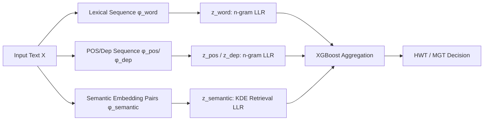

# HLD: Approximate Hierarchical Linguistic Distribution Modeling for LLM-Generated Text Detection

**Conference**: ICLR 2026  
**OpenReview**: [https://openreview.net/forum?id=l9mqzHROGu](https://openreview.net/forum?id=l9mqzHROGu)  
**Code**: [https://github.com/nefugr/HLD-Detector](https://github.com/nefugr/HLD-Detector)  
**Area**: AIGC Detection / LLM Generated Text Detection  
**Keywords**: LLM generated text detection, hierarchical linguistic distribution, n-gram, Bayesian likelihood ratio, zero-shot detection, XGBoost  

## TL;DR
HLD uses n-grams to estimate the distributions of Human-Written Text (HWT) and Machine-Generated Text (MGT) across three linguistic levels: lexical, syntactic, and semantic. By feeding Bayesian log-likelihood ratios of these hierarchical differences into XGBoost for classification, the method avoids reliance on proxy LLMs to approximate the token distributions of black-box source models. It proves more robust than single-level methods and achieves SOTA results on the DetectRL benchmark.

## Background & Motivation
**Background**: LLM-generated text detection is currently divided into two categories: supervised classifiers (e.g., RoBERTa, RADAR), which perform binary classification after encoding text into high-dimensional representations (strong in-distribution performance), and zero-shot detectors (DetectGPT, Fast-DetectGPT, Binoculars, etc.), which exploit the statistical preference of LLMs for selecting high-probability tokens by analyzing token probability curvature.

**Limitations of Prior Work**: Supervised methods essentially fit the training distribution, leading to performance collapse when the testing distribution shifts; furthermore, their decisions rely entirely on hidden states, making them uninterpretable black boxes. While zero-shot methods are interpretable, they rely on shallow token distributions and are unstable against synonym substitution or paraphrasing attacks. Crucially, they require a proxy model to approximate the token distribution of the source model—but commercial models like GPT and Gemini are black boxes, and proxy models fail to align with the true distribution while being slow and expensive to invoke.

**Key Challenge**: LLMs write so much like humans that using a **single feature level** (whether token probabilities or neural embeddings) makes it difficult to stably distinguish MGT from HWT. Additionally, the approach of using proxy models to approximate black-box distributions is both inaccurate and costly.

**Goal**: To eliminate reliance on proxy LLMs by using lightweight statistical methods to characterize the distribution differences between MGT and HWT from the text itself, stacking these differences from shallow to deep layers to balance performance, generalization, and robustness.

**Core Idea**: **Hierarchical linguistic distribution modeling + n-gram direct estimation**. Linguistic features are decomposed into three layers: lexical, syntactic (POS/dependency), and semantic. Each layer uses n-grams (with Markov truncation) to directly estimate the conditional distributions of HWT and MGT from a small offline corpus. Bayesian log-likelihood ratios for each layer are then calculated and aggregated by XGBoost for final determination, without any interaction with proxy models.

## Method

### Overall Architecture
Input text is sliced into "context-target" pairs using a sliding window. Log-likelihood ratios (LLR) are calculated across lexical, syntactic (POS/dependency), and semantic feature sequences against AI and human reference libraries. This yields a four-dimensional feature vector $Z=[z_{\text{word}}, z_{\text{pos}}, z_{\text{dep}}, z_{\text{semantic}}]$, which is passed to XGBoost for the final decision. All distributions are statistically derived from offline corpora using n-grams, requiring no LLM calls during inference.

### Key Designs

**1. Bayesian Likelihood Ratio + Markov Approximation: Bypassing the proxy model requirement.** Detection is modeled as binary classification. According to Bayes' theorem and the chain rule, the posterior ratio can be decomposed into a product of conditional probability ratios for each feature token: $\frac{P(Y=1\mid F_j)}{P(Y=0\mid F_j)} \propto \prod_{i=1}^{n}\frac{P(f_i\mid Y=1, f_{<i})}{P(f_i\mid Y=0, f_{<i})}$. Since estimating the full-context conditional probability is exponentially difficult, a Markov assumption is introduced to truncate the context to length $k$: $P(f_i\mid Y, f_{<i}) \approx P(f_i\mid Y, f_{i-k:i-1})$. This step is the pivot of the paper—it allows distributions to be estimated directly from small samples via n-grams, completely abandoning the paradigm of online proxy model approximation. The final criterion is the comparison of the normalized log-likelihood ratio $z=\frac{1}{n}\sum_{i=1}^{n}\log\frac{\hat P_{\text{HWT}}(f_i\mid f_{i-k:i-1})}{\hat P_{\text{MGT}}(f_i\mid f_{i-k:i-1})}$ against a threshold $\epsilon$.

**2. Lexical and Syntactic n-gram Modeling: Layering generalization from shallow usage to deep structure.** At the lexical level, inspired by the insight from Fast-DetectGPT that humans and LLMs have different word preferences given a context, HLD builds n-gram language models for MGT/HWT and applies additive smoothing and back-off strategies for sparsity: $\hat P_Y(f_i\mid f_{i-k:i-1}) = \frac{C_Y(f_{i-k:i-1}, f_i)+\delta}{C_Y(f_{i-k:i-1})+\delta\cdot|V|}$. If the context count is zero, it backs off to the $(k-1)$ order. At the syntactic level, text is mapped to Part-of-Speech (POS) and Dependency (Dep) sequences and modeled with the same n-gram approach. The lexical layer captures basic word usage differences to ensure primary classification accuracy, while the syntactic layer captures universal structural patterns to enhance cross-domain generalization. This explains why removing the "word" feature causes the sharpest drop in cross-domain performance in ablation studies.

**3. Semantic Kernel Density Estimation (KDE): Defending against paraphrasing in continuous embedding space.** Both lexical and syntactic levels are vulnerable to paraphrasing. Thus, HLD adapts the semantic retrieval idea from Dipper to the continuous semantic space. Since direct parametric estimation of high-dimensional distributions is infeasible, the authors use non-parametric KDE. A pre-trained encoder converts text into "context embedding-target embedding" pairs, and databases $D_Y^{\text{semantic}}$ are constructed offline for each class. During detection, $M$ nearest context neighbors are retrieved for a query pair, and interpolation is performed via the law of total probability: $\hat P_Y^{\text{semantic}}(f_i\mid f_{i-k:i-1}) = \sum_{m=1}^{M}\hat P(f_i\mid f_{i-k:i-1,m,Y})\cdot\hat P(m\mid f_{i-k:i-1})$, where neighbor weights and target probabilities are derived from cosine similarity via a softmax kernel with temperature $\tau_{ctx}=0.1$. Even when surface words are changed, deep semantic distributions remain stable, which is why HLD does not collapse under paraphrasing attacks.

**4. XGBoost Aggregation of Hierarchical Evidence: Complementing rather than averaging the four layers.** The four LLRs are concatenated into $Z\in\mathbb{R}^4$. Instead of simple summation, an XGBoost model $f_\theta(Z)=\sum_{s=1}^{S}T_s(Z)$ is trained. It outputs the probability $\hat P(Y=1\mid Z)=\sigma(f_\theta(Z))$ and learns the tree structure using regularized binary cross-entropy. This allows different layers to be adaptively weighted in different scenarios (e.g., higher weight for syntactic/semantic layers in cross-domain tasks), combining the four complementary dimensions into a discriminator stronger than any single layer.

## Key Experimental Results

### Main Results (AUROC %, DetectRL benchmark)

| Detector | Multi-LLM Avg. | Multi-Domain Avg. |
|---|---|---|
| Binoculars* | 83.31 | 86.45 |
| RADAR | 91.91 | 90.95 |
| RAIDAR | 88.48 | 92.61 |
| DPIC | 96.75 | 97.54 |
| RoBERTa-base | 98.24 | 98.94 |
| **HLD (Ours)** | **99.12** | **99.60** |

(* indicates a zero-shot method; Multi-LLM covers GPT-3.5/Claude/PaLM-2/Llama-2; Multi-Domain covers Arxiv/XSum/Writing/Review. Zero-shot baselines average only ~60% with heavy fluctuations, e.g., DetectGPT on PaLM-2 is only 26.72%.)

### Generalization & Robustness Table (AUROC %)

| Scenario | Second-best Baseline | HLD |
|---|---|---|
| Cross-Domain (Train Arxiv → Avg.) | 81.38 (RoBERTa) | **86.61** |
| Cross-Model (Train GPT-3.5 → Avg.) | 91.93 (RoBERTa) | **92.46** |
| Adversarial Attack Avg. | 93.03 (DPIC) | **97.85** |
| Paraphrase Attack | Significant decrease | **97.04** |

### Ablation Study (Train Arxiv, Review Domain AUROC %)

| Configuration | Review AUROC |
|---|---|
| Full HLD | 91.45 |
| − Word | 84.43 |
| − POS / − Dependency / − Semantic | All decreased |

### Key Findings
- Removing **lexical features** hurts cross-domain generalization the most (Review domain drops from 91.45% to 84.43%), indicating that basic word distribution is the bedrock of generalization. Removing syntactic or semantic layers also leads to drops, suggesting all four layers are indispensable.
- Adversarial robustness leads the second-best (DPIC) by an absolute 4.82%. Specifically, under paraphrase attacks, while all baselines drop significantly, HLD maintains 97.04%, validating the motivation of "modeling deep structures to counter shallow modifications."
- By using small offline corpora for distribution estimation and avoiding LLM calls during inference, computational overhead is significantly lower than zero-shot paths relying on proxy models. SOTA performance is maintained across new models like GPT-5, DeepSeek-R1/V3, and Claude-3.5.

## Highlights & Insights
- **Bypassing the proxy model bottleneck**: Using n-grams for statistical distribution from text combined with Markov truncation avoids the difficulty of aligning with black-box LLM distributions and shifts inference from expensive online calls to offline lookups.
- **Hierarchical linguistic distribution as an interpretable framework**: Lexical, syntactic, and semantic levels correspond to different attack surfaces (usage/structure/paraphrasing). Stacking these layers improves performance, generalization, and robustness simultaneously, and LLR per token can be visualized for qualitative interpretation.
- **Semantic KDE retrieval over parametric estimation**: Using non-parametric interpolation in high-dimensional embedding space bypasses the curse of dimensionality, serving as a key defense against paraphrasing.

## Limitations & Future Work
- **Evaluation limited to DetectRL**: While covering multiple LLMs/domains/attacks, reliance on a single benchmark may limit the findings' universality; cross-benchmark verification is scarce.
- **Dependence on offline corpus representativeness**: Distributions are estimated from specific corpora. If the human/machine distribution in the target domain differs wildly from the library (e.g., new writing styles or generator paradigms), statistical estimation might fail.
- **Dependency on external toolchains**: POS/dependency features rely on spaCy, and semantics rely on pre-trained encoders. Quality issues in these tools or encoders propagate to detection performance.
- **Markov truncation loses long-range dependencies**: Truncation to length $k$ sacrifices global context, potentially creating space for evasion by texts specifically constructed for long-range consistency.

## Related Work & Insights
- **Zero-shot detection** (DetectGPT/Fast-DetectGPT/Binoculars/Lastde++): HLD inherits the insight that humans and LLMs have different word preferences but replaces proxy models with n-gram statistics, retaining interpretability while removing source model dependency.
- **Supervised detection** (RADAR/Ghostbuster/RAIDAR/DPIC/RoBERTa): HLD also trains a classifier (XGBoost), but the inputs are interpretable hierarchical LLR features rather than black-box hidden states, achieving both high performance and transparency.
- **Paraphrase Defense** (Dipper's semantic retrieval): The semantic KDE library design is directly inspired by this, porting the "nearest neighbor retrieval for defense" to distribution estimation.
- **Insight**: When source models are black boxes and proxy models are expensive/inaccurate, the paradigm of "characterizing distribution differences via lightweight statistics + hierarchical stacking + forest model aggregation" is a promising framework to extend to other modalities like image or code detection.

## Rating
- **Novelty**: ⭐⭐⭐⭐ The combination of n-grams + Bayesian LLR to bypass proxy models and stacking three layers of linguistic features is novel.
- **Experimental Thoroughness**: ⭐⭐⭐⭐ Tested across multiple LLMs, domains, attacks, and new models; slightly deducted for relying primarily on the DetectRL benchmark.
- **Writing Quality**: ⭐⭐⭐⭐ The motivation-method-experiment logic is clear; formulas and architecture diagrams are well-presented.
- **Value**: ⭐⭐⭐⭐ AIGC detection is a high-demand area. The combination of low overhead, high robustness, and interpretability is highly practical, especially for black-box scenarios.

<!-- RELATED:START -->

## Related Papers

- [\[ICLR 2026\] DMAP: A Distribution Map for Text](dmap_a_distribution_map_for_text.md)
- [\[ACL 2026\] Beyond the Final Actor: Modeling the Dual Roles of Creator and Editor for Fine-Grained LLM-Generated Text Detection](../../ACL2026/aigc_detection/beyond_the_final_actor_modeling_the_dual_roles_of_creator_and_editor_for_fine-gr.md)
- [\[ICLR 2026\] Learn-to-Distance: Distance Learning for Detecting LLM-Generated Text](learn-to-distance_distance_learning_for_detecting_llm-generated_text.md)
- [\[ACL 2025\] KatFishNet: Detecting LLM-Generated Korean Text through Linguistic Feature Analysis](../../ACL2025/aigc_detection/katfishnet_detecting_llm-generated_korean_text_through_linguistic_feature_analys.md)
- [\[CVPR 2026\] PPM-CLIP: Probabilistic Prompt Modeling for Generalizable AI-Generated Image Detection](../../CVPR2026/aigc_detection/ppm-clip_probabilistic_prompt_modeling_for_generalizable_ai-generated_image_dete.md)

<!-- RELATED:END -->
